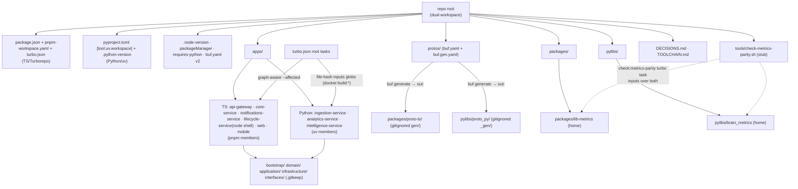

# Architecture Plan — chore-scaffold-monorepo

> Filled by Aryan (Architect) in Stage 2.
> Validates against [schemas/architecture.schema.json](../schemas/architecture.schema.json).
> Every section must be filled. `TBD` is not allowed when this goes to Stage 3.

| Field | Value |
|-------|-------|
| **req_id** | `chore-scaffold-monorepo` |
| **Actor** | architect (Aryan) |
| **Timestamp** | 2026-05-23T23:21:44Z |
| **Lane** | high-stakes |
| **Scope (locked by Rohan, option-b)** | §9.1 directory tree + WORKING root toolchain (`pnpm install` / `turbo` graph / `uv sync` / `buf lint` all resolve) + DDD layer folders as `.gitkeep` inside each backend service. **NO per-service implementation / business logic.** |

---

## 1. Context

Brain has a complete canon (`requirements/IMPLEMENTATION-BLUEPRINT.md`, `business-context.md`, `technical-context.md`) and an initialized Engineering OS, but **no product code repository yet** — `git ls-files` shows only `.engineering-os/` + `requirements/`; there is no `apps/`, `packages/`, `pylibs/`, or `protos/`. Every subsequent feature needs the canonical Turborepo+pnpm / uv / Buf layout (Blueprint §9.1) to exist first, with a toolchain that actually coheres across the TS↔Python boundary. Until that exists, no day-one non-negotiable (workspace_id discipline, metric-registry TS↔Python parity, proto-first contracts, `@paradigm`, DDD layering) has a home.

This plan binds the **smallest verifiable scaffold** (Rohan's option-b): the directory tree + a working four-tool root toolchain (pinned to the locked stack) + DDD layer folders as `.gitkeep` + day-one-non-negotiable *homes* (not implementations). The lane is `high-stakes` because the `protos/`+`buf` contract source-of-truth and the irreversible top-level shape are load-bearing for everything that stacks on top — a stray `controllers/` folder, a wrong codegen `out:` path, or a Turborepo graph blind to Python services is brutal to retrofit once 7 services depend on it.

The dominant risk (per the `monorepo-toolchain-realist` persona, 5 concerns, 0 blocking) is **toolchain coherence** at the unusual TS+Python+proto junction. This plan resolves all 8 binding inputs Rohan carried from synthesis. It does **not** provision live infra, write CI/CD pipeline files (Jatin's later job), or implement any service — but the structure it lays down must not *preclude* per-service pipelines (Appendix C item 11).

**Why this length is justified (anti-over-engineering note):** high-stakes + scope-creep-prone foundational work → prescriptive handoff band. The plan is long because every root config file's exact key contents are load-bearing and must be specified so Vikram executes without freelancing — not because the work is large. There is exactly one build track; the depth is in precision, not volume.

---

## 2. Proposed solution

Scaffold a **dual-workspace polyglot monorepo root**: one directory that is simultaneously a Turborepo+pnpm workspace (TypeScript) and a uv workspace (Python), with Buf as the proto→TS+Python codegen layer feeding both sides. The repo root carries both ecosystems' manifests and lockfiles side by side, with explicit excludes so neither tool trips over the other's artifacts.

Top-level shape is exactly Blueprint §9.1: `apps/` holds the 9 product directories (web · mobile · the 7 backend services); `packages/` holds TS shared libs (incl. `lib-metrics` and the generated-stub package `proto-ts`); `pylibs/` holds Python shared libs (incl. `brain_metrics`, `brain_clickhouse`, `brain_regional`, `brain_cost_router`, and the generated-stub package `proto_py`); `protos/` is the buf-managed gRPC + Avro contract source of truth. Each of the 7 backend services carries the §9.2 DDD layer folders (`bootstrap/ domain/ application/ infrastructure/ interfaces/`) as `.gitkeep` — structure without code, so a future `controllers/`-style folder is an obvious diff anomaly. **No service implementation.**

The four tools are wired so the success contract genuinely holds across both stacks. The TS side (api-gateway, core-service, notifications-service, lifecycle-service-node-shell, web, mobile, all `packages/*`) is enumerated explicitly in `pnpm-workspace.yaml` so pnpm never tries to glob a Python service dir. The Python side (ingestion-service, analytics-service, intelligence-service, all `pylibs/*`) is a `[tool.uv.workspace]` in the root `pyproject.toml`. Turborepo is taught about the Python services via **explicit root tasks with file-hash `inputs` globs** (Concern 1) — because `turbo --affected` is structurally blind to uv members. Buf generates TS stubs into `packages/proto-ts/` and Python stubs into `pylibs/proto_py/` (dedicated workspace-member stub packages, Concern 2), so both sides import a *named package*, never a relative path across the `protos/` boundary. Generated stubs are **gitignored + regenerated in CI** (Concern 2/3). All five toolchain versions are pinned (Concern 4). A `tools/check-metrics-parity.sh` stub + `check:metrics-parity` turbo root task gives the metric-parity invariant a CI wiring point (Concern 5). All irreversible structural decisions are recorded in a root `DECISIONS.md` (input 7).

`lifecycle-service` is **Node + Python** (canon §2.2): its scaffold carries a Node DDD shell (in `pnpm-workspace.yaml`) for the orchestration side; its Python side is deferred to Phase 2 and is created only as `.gitkeep` homes inside the same service dir — no uv member created for it now (it is not a Phase 0–1 deployable). This keeps the Phase-0–1 `data` deployable to exactly the three Python services (ingestion/analytics/intelligence) the canon names.

### Diagram

---

## 3. Paradigm

**Declared paradigm:** `n/a` *(no compute path — structure + toolchain only)*

**Justification (≥20 words):**

A scaffold executes no metric, no model, no LLM call — there is no inference or query path to route, so no SQL/ML/small_llm/frontier_llm decision applies. The `@paradigm` discipline (Appendix C item 6) gets only a *home* established here: the convention is documented in `DECISIONS.md` and `docs/conventions/paradigm.md` so the first real compute path (the metric engine, a later requirement) declares `@paradigm(...)` from its first line. Rohan's Stage-1 review already recorded paradigm = `n/a` and asked only that the decorator's home exist; this plan confirms it. The first real `@paradigm` declaration lands with the first compute path, under its own Architect plan.

> Reminder: SQL > ML > small_llm >> frontier_llm. Paradigms 3 & 4 are model-agnostic, gateway-routed policy tiers. See [skill: cost-routing-paradigms](../skills/cost-routing-paradigms/SKILL.md).

---

## 4. API design

> Scaffold creates the **contract source-of-truth home and the codegen plumbing**, not any concrete contract. No `.proto` service/message is defined in this requirement (that lands with each service's own requirement). The persona-flagged `schema-proto` trigger surface is touched *structurally* (we stand up `buf.yaml`+`buf.gen.yaml`), not behaviorally.

### gRPC protos added or changed
- **None defined.** `protos/buf.yaml` (workspace/lint/breaking config, `version: v2`) + `protos/buf.gen.yaml` (codegen with real `out:` paths) are created. A single placeholder `protos/brain/health/v1/health.proto` (a trivial `Health` message with one `string status = 1;` field, BUF-DEFAULT-lint-clean) is added **only** so `buf lint` and `buf generate` have a real file to operate on and the generated-stub import smoke can prove the round-trip works end-to-end. It defines no service; it is the minimum that makes the codegen path verifiable. Documented in `DECISIONS.md` as a scaffold-only placeholder to be deleted/replaced by the first real service contract.

### tRPC procedures added or changed
- **None.** `apps/api-gateway` carries DDD `.gitkeep` homes only; no tRPC router is implemented.

### MCP tools added or changed
- **None.** MCP server home is `apps/api-gateway/src/interfaces/` (a `.gitkeep`); no tool implemented.

### REST endpoints added or changed
- **None.** Public REST is Phase 4 (Appendix B); no endpoint created.

### Breaking changes
- **None.** This is the first commit of product code; there is no public surface to break. (`buf breaking` becomes meaningful on the *next* proto change against this committed baseline.)

### Versioning strategy
*(See [`api-versioning-strategy`](../skills/api-versioning-strategy/SKILL.md).)*

The scaffold establishes the **versioning conventions' homes**, not any version: proto packages will be `brain/<context>/v1/...` (the placeholder `brain/health/v1/health.proto` models this); `buf.yaml` enables `breaking` rules (`FILE` level) so the first real contract is checked against this committed baseline; gRPC = field-number discipline; tRPC = lockstep web/app; Kafka topics = `.vN`; REST = `/api/vN`. These are documented in `docs/conventions/` and `DECISIONS.md`; nothing is versioned yet because nothing is implemented.

---

## 5. Data model changes

> A scaffold provisions **no database** and runs **no migration** (live infra is deferred — non-goal). It establishes the *homes* for the data-model day-one non-negotiables.

### Postgres
- **Tables added:** none. **Home for the OLTP schema-per-bounded-context split** is established: `apps/core-service/src/infrastructure/` (`.gitkeep`) is where Prisma 7 schema + RLS will live; `core/billing/audit/consent` schemas are documented in `docs/conventions/data-model.md` as the future homes, not created.
- **Tables changed:** none.
- **Indexes:** none.
- **RLS policies:** none implemented. The **4-layer workspace_id enforcement seam** is documented (see §8) with its home: layer-3 Postgres RLS lives in each service's `infrastructure/`; the convention note (`workspace_id = current_setting('app.workspace_id')` on every workspace-scoped table) is written into `docs/conventions/multi-tenancy.md`.

### ClickHouse
- **Tables added:** none. The **OLTP/OLAP split** (Appendix C item 7) gets its home: the ClickHouse query-gateway primitive lives in `pylibs/brain_clickhouse/` (a `.gitkeep` package home, layer-4 of tenancy). Documented, not implemented.
- **Materialized views added:** none.

### Migration plan
*(Step-by-step; reversible; reviewed by 2 people.)*

There is **no DB migration**. The "migration" here is purely filesystem creation, and it is **fully reversible**: every artifact is new and uncommitted (agents stage, Founder commits — Blueprint §9.8), so reverting is `git restore --staged . && rm -rf <new dirs>` before any commit, or `git revert` after. No data exists; no schema is altered. The structural-decision irreversibility (codegen out-paths, gitignore-vs-commit, layout) is mitigated by recording each in `DECISIONS.md` so a future reversal is a documented ADR supersession, not archaeology. Reviewed by: Tanvi (Stage 5 acceptance contract) + Rohan (Stage 6) + Founder (Stage 7 commit gate).

---

## 6. Event model

- **Topics added:** none. The **event-spine home** is `protos/events/` (created with a `.gitkeep`): Avro event schemas + Glue Schema Registry config will live here. The standard 10-field envelope and `<domain>.<entity>.<event>.vN` naming + `workspace_id` partition key are documented in `docs/conventions/events.md`. No topic, no broker, no producer/consumer created (MSK is deferred infra — non-goal).
- **Topics changed:** none.
- **Partition key:** `workspace_id` (always) — documented as the binding convention; not exercised (no events flow).
- **Exactly-once strategy:** documented home only — idempotency (Appendix C item 9: envelope `idempotency_key` + ClickHouse version dedup) is a convention written into `docs/conventions/events.md`; the transactional-outbox seam is noted as belonging in each producer service's `infrastructure/`. Nothing implemented.

---

## 7. Single-Primitive sweep

> Did this introduce any per-channel forks? Check each cross-cutting concern.

| Primitive | Status |
|-----------|--------|
| Audience Builder | reused — no fork; home noted as `apps/lifecycle-service` (Phase-2 build), `.gitkeep` only. No channel-specific dir created. |
| Consent | reused — single consent primitive home is `apps/core-service` (`consent` schema), documented; no per-channel consent fork. |
| Decision Log | reused — single `ai.decision_log` home: writer is `apps/analytics-service`, schema lives `apps/intelligence-service` (Postgres `ai.*`). Documented in `docs/conventions/decision-log.md`; one home, no fork. |
| Notifications | reused — `apps/notifications-service` is the single operator-facing primitive, distinct from lifecycle (customer-facing). No fork. |
| Attribution | reused — recovered-revenue attribution home is `apps/lifecycle-service`; analytics attribution home is `apps/analytics-service`. Single primitives, documented. |
| Identity | reused — `apps/core-service` (orgs/workspaces/users/roles). Single identity primitive; workspace_id seam documented. No fork. |

**Sweep verdict:** all clean. The scaffold creates exactly one home per primitive and introduces **zero** per-channel / per-region / per-vendor forks. Brain-only naming throughout (no vendor name as a directory or positioning). The DDD `.gitkeep` layering makes any future fork (e.g. a `klaviyo/` or `whatsapp/` dir) an obvious code-review anomaly. **Single-Primitive Rule honored — no new primitive introduced beyond the two generated-stub stub-packages (`proto-ts` / `proto_py`), which are the *implementation of* the locked proto-first non-negotiable (Appendix C item 8), not a new abstraction.**

---

## 8. Multi-tenancy enforcement (4 layers)

> Scaffold establishes **homes + the convention doc** for all 4 layers; it implements none (no auth, no DB, no events flow). This is the correct floor: the seam exists so the first service can't accidentally route around it.

- [x] **JWT** — claim validation home: `apps/api-gateway/src/interfaces/` + `application/` (`.gitkeep`). Convention (`user_id`, `active_workspace_id`, `role`, accessible-workspace list) documented in `docs/conventions/multi-tenancy.md`. Not implemented.
- [x] **Service-side** — `request.workspace_id == metadata.workspace_id` assertion + `requireRole` home: each service's `application/` use-cases (`.gitkeep`). `TenancyInterceptor` home: `apps/api-gateway` + each service `interfaces/`. Documented. Not implemented.
- [x] **DB RLS** — Postgres RLS home: each TS service's `infrastructure/`; ClickHouse query-gateway home: `pylibs/brain_clickhouse/`. Documented (`workspace_id = current_setting('app.workspace_id')`; CH rejects queries lacking a `workspace_id` predicate). Not implemented.
- [x] **Kafka envelope** — consumer `workspace_id` assertion home: each service's `infrastructure/` Kafka consumers; envelope convention in `docs/conventions/events.md`. Not implemented.

*(Checkboxes mark "home + convention established," the correct deliverable for a scaffold; no runtime enforcement exists because no runtime exists.)*

---

## 9. Observability plan

> No running service → no live telemetry. The scaffold establishes only what the requirement needs to be verifiable; per anti-over-engineering, it adds **no** dashboards/alarms beyond the verification signal.

| Pillar | Items |
|--------|-------|
| **Metrics** | None emitted (no runtime). The **metric-registry CI wiring point** is the in-scope deliverable: `check:metrics-parity` turbo root task + `tools/check-metrics-parity.sh` stub (exit 0) so the first real metric has a parity signal. |
| **Logs** | None. Convention (TS=pino+ALS, Python=structlog+contextvars, the one correlation ID) documented in `docs/conventions/observability.md`; no logger wired. |
| **Traces** | None. OTel→X-Ray (ADOT) convention documented; not wired. |
| **Alarms** | None (correct — no SLO to alarm on at scaffold time; adding any would be over-engineering). |
| **Dashboards** | None (same rationale). |

**Verification signal (the scaffold's own "observability"):** the acceptance contract (§10) IS the health check — `pnpm install` / `turbo` graph / `uv sync` / `buf lint`+`buf build` / generated-stub import smoke (both sides) / `turbo run check:metrics-parity` exit 0. These fail-loud on misconfiguration rather than the scaffold silently appearing healthy.

---

## 10. Test strategy

> Proportionate to risk: this is a scaffold, so "tests" = the **acceptance contract** (deterministic toolchain-resolution + import-smoke commands), not unit tests of trivial code (there is no code). This is the verification-before-completion discipline applied at scaffold time.

| Layer | Plan |
|-------|------|
| **Unit** | None — no logic to unit-test (only `.gitkeep`, config, and a placeholder proto). Writing unit tests here would be over-engineering. |
| **Integration** | The **toolchain-coherence integration check** IS the test: the four tools must cohere in one root (commands below). |
| **Contract** | `buf lint` passes + `buf build` produces a valid image; `buf generate` produces stubs importable from BOTH TS and Python (the import smoke). `buf breaking` baseline is established (meaningful from the next proto change). |
| **E2E (web)** | None (no web app code; Playwright config home noted for later, not created beyond `.gitkeep`). |
| **E2E (mobile)** | None (no mobile code; Detox later). |
| **Load** | None (Phase 3+; no runtime). |
| **Real-network smoke** | N/A for a scaffold — there is no network call / external provider. The mandatory-smoke rule applies to runtime features; the equivalent "does it really resolve" smoke here is the full acceptance contract run on a clean checkout (documented in `TOOLCHAIN.md` bootstrap). Tanvi runs it at Stage 5. |
| **Mutation testing targets** | None (no high-stakes logic exists yet; metric-registry/compliance/Decision-Log mutation tests land with their implementations). |

### Acceptance contract (the exact commands QA/Tanvi runs at Stage 5 — ALL must pass)

Run from repo root on a clean checkout after the bootstrap in `TOOLCHAIN.md`:

1. `corepack enable && corepack install` — pins pnpm from `packageManager`.
2. `pnpm install` — resolves cleanly; does NOT error on Python dirs (proves `pnpm-workspace.yaml` excludes them).
3. `pnpm turbo run build --dry-run=json` (or `pnpm turbo run build --graph`) — the task graph resolves with **no errors**, and the output **includes the Python `docker:build:*` root tasks** (proves Concern-1 wiring exists).
4. `uv sync` — resolves the Python workspace cleanly; creates `.venv/` at root; `uv.lock` present.
5. `buf lint protos` — passes (0 violations).
6. `buf build protos -o /dev/null` — produces a valid image (0 errors).
7. `buf generate protos` — produces TS stubs under `packages/proto-ts/<gen>/` and Python stubs under `pylibs/proto_py/<_gen>/` (both gitignored).
8. **TS import smoke:** `pnpm --filter @brain/proto-ts exec node -e "require('./<gen-entry>')"` (or a `tsc --noEmit` over a one-line import file) resolves the generated TS stub as a named-package import — **no relative path across `protos/`**.
9. **Python import smoke:** `uv run python -c "import proto_py"` resolves, AND `uv run python -c "import brain_metrics"` resolves (proves `pylibs/brain_metrics` is a valid uv member — Concern-5 tightening).
10. `pnpm turbo run check:metrics-parity` — exits 0 (the stub).
11. **Structural assertions:** `apps/` contains exactly the 9 product dirs; each of the 7 backend services contains `bootstrap/ domain/ application/ infrastructure/ interfaces/`; **no `controllers/`-style folder anywhere** (`! find apps -type d -name controllers | grep .` and the same for `services`/`models` as technical-layer dirs); the 5 pinning files all exist with the exact pinned versions; `DECISIONS.md` exists and records the 3 irreversible decisions.

If any of 1–11 fails, the scaffold is NOT done (fail-loud, per Rohan's tightened acceptance contract).

---

## 11. Security considerations (forwarded to Shreya)

- **No secrets, no PII, no auth, no network, no data** in a scaffold — the attack surface is the toolchain supply chain, not runtime. Shreya's Stage-4 focus: (a) the 5 pinned versions are real, current, non-yanked, and from trusted registries (Node 24 LTS, Python 3.13, the exact pnpm patch via `packageManager`, pinned uv, buf v2); (b) `.gitignore` correctly excludes `.venv/`, `node_modules/`, generated stubs, and any local env file so no secret can be accidentally staged; (c) no vendor token / credential / `.env` is created or referenced anywhere in the scaffold; (d) the generated-stubs-gitignored decision means CI must regenerate them — flag that CI (Jatin, later) must pin the buf plugin versions so codegen is reproducible and not a supply-chain hole.
- **Brain-only naming** enforced — no vendor name as positioning in any directory/config (a security-adjacent canon rule, also a code-review blocker).
- **No `dangerouslySetInnerHTML`, no eval, no SQL** exist to review — confirm the placeholder proto introduces no executable surface (it does not; it is a data-shape `.proto`).
- The **4-layer tenancy seam + Decision-Log home + idempotency convention** are documented so the first real service cannot claim "no home existed" — Shreya can confirm the homes match canon §5 / Appendix C.

---

## 12. India context

| Lens | Impact at scaffold layer |
|------|--------------------------|
| **RTO / COD / GST** | None now — no data path. Seam note: RTO/COD/GST-slab math will live in `apps/analytics-service` over **integer minor-units** inputs; its DDD home + the minor-units money convention (`docs/conventions/money.md`: BIGINT in PG, Int64 in CH, `currency_code`, never float/NUMERIC) are established here. |
| **Festival seasonality / pincode reliability** | None — no data path. Ingestion/analytics homes created. |
| **Telecom compliance (DLT/NCPR/DND/9am–9pm)** | None — no outbound channel exists. `lifecycle-service` compliance-engine home (`.gitkeep`, Phase-2 build) is created, not implemented. |
| **Data residency (DPDP, ap-south-1)** | None now — no data stored. Region-adapter seam (§13) is the future home for residency routing. |

No compliance ambiguity → no `/escalate`. The scaffold creates homes for these surfaces and implements none; the high-stakes lane ensures full-rigor review when they are filled.

---

## 13. Region adapter impact

The **RegionAdapter interface (Appendix C item 4) gets its home now, even with only India**: `pylibs/brain_regional/` (Python regional math home — RTO/COD/GST/residency) + a TS counterpart note in `packages/config/` for region-aware routing. Created as `.gitkeep` package homes with the convention documented in `docs/conventions/region-adapter.md`: every region-varying concern goes behind the interface; the India adapter is the only implementation now; UAE/GCC/EU adapters are Phase 4 (Appendix B). The metric engine, frontend, intelligence, and notifications need **zero** changes to add a region — that promise is preserved by establishing the seam at scaffold time, not by implementing any adapter. No region logic is written; no `workspace.home_region` field exists yet. **No region-specific fork of any code** (Appendix D blocker) — there is no code to fork.

---

## 14. Cost estimate

| Item | Value |
|------|-------|
| **Expected daily volume** | 0 requests — scaffold has no runtime, no traffic, no jobs. |
| **LLM tokens / day** | 0 — no compute path, no LLM call (paradigm `n/a`). |
| **₹ / month at expected load** | **₹0 runtime cost.** No infra provisioned (no Fargate, MSK, ClickHouse, Redis, S3). The only cost is developer/CI time: ~0 incremental cloud spend until the first service is deployed (Jatin, later). One-time human cost: Vikram's scaffold build (single track, est. half-day) + the review chain. |

---

## 15. Risks

| Risk | Severity | Mitigation |
|------|----------|------------|
| Turborepo `--affected` blind to the 3 Python services → §9.7 selective deploy silently TS-only; passes scaffold contract yet breaks CI for the highest-churn services | **HIGH** | **Resolved in plan (input 1):** explicit `turbo.json` root tasks `docker:build:ingestion|analytics|intelligence` with file-hash `inputs` globs over each service dir + its `pylibs/` deps; tasks shell out to `uv`/docker, not `package.json` scripts. Graph-aware(TS) vs file-hash-aware(Python) asymmetry documented in `DECISIONS.md` + `TOOLCHAIN.md` for Jatin. Acceptance check #3 asserts the tasks appear in the graph. |
| Buf codegen `out:` undecided → `buf lint` passes but stubs unimportable / circular-import trap; commit-vs-gitignore unresolved | **HIGH** | **Resolved (inputs 2,3):** stubs → dedicated workspace-member packages `packages/proto-ts/` + `pylibs/proto_py/`; consumers import a named package, never a relative path across `protos/`. `buf.gen.yaml` ships real `out:` paths. Stubs **gitignored + regenerated in CI** (decision + rationale in `DECISIONS.md`). Acceptance checks #7–9 prove round-trip import from both sides. |
| Dual-workspace artifact collision: uv `.venv/` causes turbo cache false-positives; pnpm glob matches a Python dir → `pnpm install` fails with a cryptic missing-`package.json` error | **MED** | **Resolved (input 4):** enumerated `pnpm-workspace.yaml` members (never `apps/**`); `turbo.json` global+task `inputs` exclude `.venv/**`, `uv.lock`, `*.dist-info`; root `tsconfig.json` excludes `.venv`/`pylibs`/Python service dirs; `.gitignore` covers `.venv/`/`__pycache__/`/`*.egg-info/`/generated stubs; commit `uv.lock`+`pnpm-lock.yaml`. |
| "Resolves cleanly" is a one-machine lie (unpinned tools) | **MED** | **Resolved (input 5):** all 5 pins shipped (`.node-version`=24, `engines.node`; `packageManager`=exact pnpm patch; `.python-version`=3.13, `requires-python=">=3.13,<3.14"`; pinned uv; `buf.yaml version: v2`) + `TOOLCHAIN.md` bootstrap. Acceptance check #11 asserts all 5 exist. |
| Metric-parity invariant silently violated on first real metric (no CI signal) | **LOW** | **Resolved (input 6):** `tools/check-metrics-parity.sh` (exit-0 stub, `TODO` body) + `check:metrics-parity` turbo root task with `inputs:["packages/lib-metrics/**","pylibs/brain_metrics/**","tools/check-metrics-parity.sh"]`. Acceptance check #10. |
| Builder freelances into service implementation (scope creep) | **MED** | Scope is locked option-b; §17 Track lists exact files; over-engineering self-check forbids any non-`.gitkeep` file inside a service's DDD folders. Reviewer (Tanvi/Rohan) rejects any business logic as out-of-scope. |
| Placeholder `health.proto` mistaken for a real contract | **LOW** | `DECISIONS.md` + a header comment in the file mark it scaffold-only, to be replaced by the first real service contract. It defines no service, only a trivial message — minimum to make codegen verifiable. |

---

## 16. Alternatives considered (≥1)

| Alternative | Why rejected |
|-------------|--------------|
| **(a) Bare directory tree + `.gitkeep` only, no working toolchain** | Rohan rejected at intake: unverifiable, fails the requirement's own success metric, gives false confidence — the next requirement would discover the four tools don't cohere. Not the right floor. |
| **(c) Full per-service boilerplate (Fastify/FastAPI bootstrap, health probes, proto service stubs)** | Rohan deleted from scope at intake: that is real service implementation belonging to each service's own requirement+plan+tests; pulling it forward = build-ahead / over-engineering. |
| **Generated stubs committed to git (vs gitignored)** | Rejected: with 7 consumer packages, committed stubs create merge-conflict noise on every proto change and risk stale/divergent checked-in code. Gitignore + regenerate-in-CI is the polyglot-monorepo standard; the only cost (CI must run `buf generate` before build) is acceptable and explicit. Recorded in `DECISIONS.md`; reversible (un-ignore + commit) if CI codegen ever proves too slow. |
| **Generated stubs into `protos/gen/ts` + `protos/gen/python`** (consumers path-alias back into `protos/`) | Rejected: makes pnpm/uv members import across the `protos/` boundary via path mapping — non-standard, breaks `tsc --paths` resolution for consumers, and couples every service to a relative path. Dedicated workspace-member stub packages (`packages/proto-ts`, `pylibs/proto_py`) let both sides import a *named package* — clean, and the way the split-to-7-services stays mechanical. |
| **A Makefile wrapper for Python builds (instead of turbo root tasks)** | Rejected: it would live *outside* the turbo graph, so `turbo --affected` still wouldn't know when to run it → defeats §9.7. Turbo root tasks with file-hash `inputs` keep Python builds inside the one affected-detection mechanism Jatin's CI will drive. |
| **Single uv member for `lifecycle-service` Python side now** | Rejected: lifecycle is a Phase-2 build and not a Phase-0–1 `data` deployable; creating a uv member now would imply it ships in the first `uv sync` deployable set. Node DDD shell (pnpm member) + Python `.gitkeep` homes inside the same dir matches canon (§2.2 "Node + Python") without over-creating. |

---

## 17. Tracks (work decomposition for Stage 3)

> **Single track, single builder.** This is one coherent polyglot-toolchain build (TS + Python + buf plumbing). The web/mobile/intelligence dirs are created as skeleton `.gitkeep` homes with no code, so there is **no parallel fan-out** — splitting would create coordination overhead for zero parallelism. Owner: **@vikram (backend)** — the only lane that spans the TS+Python+proto toolchain seam. Ananya/Karan/Maya are NOT tagged: their surfaces (web/mobile/Python-service internals) contain no code in this requirement.

### Track 1 — scaffold-monorepo-root-and-toolchain  *(owner: @vikram)*

Dependencies: none (first product-code requirement; clean root with only `.engineering-os/` + `requirements/`).

**Constraints for the builder (binding):** create ONLY the files/dirs listed below. Inside any backend service's DDD folders, create ONLY `.gitkeep`. No business logic, no Fastify/FastAPI bootstrap, no real `.proto` service. Stage files for Founder commit (never `git add -A`, never commit). Use Brain-only naming. Tasks are grouped; each is 2–5 min.

**Group A — root TS/Turborepo workspace**
1. Create root `package.json`: `"name":"brain"`, `"private":true`, `"packageManager":"pnpm@<exact-patch>"` (use the current pinned pnpm patch, e.g. `pnpm@9.x.y` — pin the exact patch you install), `"engines":{"node":">=24 <25"}`, workspace scripts delegating to turbo.
2. Create `.node-version` containing `24`.
3. Create `pnpm-workspace.yaml` with **explicit enumerated members** (NOT `apps/**`): `apps/web`, `apps/mobile`, `apps/api-gateway`, `apps/core-service`, `apps/notifications-service`, `apps/lifecycle-service`, `packages/*`. (Python dirs deliberately absent.)
4. Create root `turbo.json` (`"$schema"`, `"tasks"`): define `build`, `lint`, `test` (graph-aware TS tasks); add **root tasks** `docker:build:ingestion`, `docker:build:analytics`, `docker:build:intelligence` each with `"inputs"` globs over `apps/<svc>/**` + `pylibs/**` (their transitive deps) and `"cache":true`; add `check:metrics-parity` with `"inputs":["packages/lib-metrics/**","pylibs/brain_metrics/**","tools/check-metrics-parity.sh"]`. Global `"inputs"`/`globalDependencies` must EXCLUDE `.venv/**`, `uv.lock`, `**/*.dist-info`.
5. Create root `tsconfig.json` (base, `strict:true`) with `"exclude":[".venv","pylibs","apps/ingestion-service","apps/analytics-service","apps/intelligence-service","**/node_modules","**/_gen","**/gen"]`.

**Group B — root Python/uv workspace**
6. Create root `pyproject.toml`: `[project]` (name `brain`, `requires-python = ">=3.13,<3.14"`), `[tool.uv.workspace]` with `members = ["apps/ingestion-service","apps/analytics-service","apps/intelligence-service","pylibs/*"]`, and pin uv via `[tool.uv] required-version = ">=<pinned-uv>"`.
7. Create `.python-version` containing `3.13`.

**Group C — apps/ (9 product dirs)**
8. Create the 6 TS app dirs as pnpm members, each with a minimal `package.json` (`"name":"@brain/<svc>"`, `"private":true`, `"version":"0.0.0"`) and the 5 DDD folders (`bootstrap/ domain/ application/ infrastructure/ interfaces/`) each holding a `.gitkeep`: `apps/api-gateway`, `apps/core-service`, `apps/notifications-service`, `apps/lifecycle-service` (Node shell), `apps/web`, `apps/mobile`. (web/mobile carry DDD `.gitkeep` homes only — presentation scaffolding lands in their own requirements.)
9. Create the 3 Python service dirs as uv members, each with a minimal `pyproject.toml` (`[project] name="<svc>"`, `requires-python` inherited) and the 5 DDD folders as `.gitkeep`: `apps/ingestion-service`, `apps/analytics-service`, `apps/intelligence-service`.
10. Inside `apps/lifecycle-service`, add the Python-side DDD `.gitkeep` homes (Phase-2 build) WITHOUT creating a uv member — document in `DECISIONS.md` that lifecycle's Python side graduates at Phase 2.
11. Structural guard: confirm NO `controllers/`/`services/`/`models/` technical-layer dir exists anywhere under `apps/`.

**Group D — packages/ (TS shared libs)**
12. Create `packages/proto-ts/` as a pnpm member (`package.json` `"name":"@brain/proto-ts"`) — the generated-TS-stub home; add a `.gitignore` for the gen output dir.
13. Create `packages/lib-metrics/`, `packages/config/`, `packages/ui/`, `packages/eslint-config/` as pnpm members with `package.json` + `.gitkeep` (homes only — the metric-registry TS half + region-aware config home live here).

**Group E — pylibs/ (Python shared libs)**
14. Create `pylibs/proto_py/` as a uv member (`pyproject.toml` `name="proto_py"`, importable package dir `proto_py/__init__.py`) — the generated-Python-stub home; add `.gitignore` for the gen output.
15. Create `pylibs/brain_metrics/` (with `brain_metrics/__init__.py` so `import brain_metrics` resolves), `pylibs/brain_clickhouse/`, `pylibs/brain_regional/`, `pylibs/brain_cost_router/` as uv members (`pyproject.toml` + `__init__.py`) — metric-registry Python half, CH query-gateway, RegionAdapter, cost-router homes.

**Group F — protos/ + buf**
16. Create `protos/buf.yaml`: `version: v2`, module config, `lint` (DEFAULT) + `breaking` (`FILE`) rules.
17. Create `protos/buf.gen.yaml`: `version: v2`; TS plugin (connect/es) `out: ../packages/proto-ts/<gen>`; Python plugin (grpc/betterproto) `out: ../pylibs/proto_py/<_gen>`. Real paths, not placeholders.
18. Create `protos/brain/health/v1/health.proto` — `syntax = "proto3"; package brain.health.v1;` a single `message Health { string status = 1; }`, with a header comment marking it scaffold-only (no service). Create `protos/events/.gitkeep` (Avro home).

**Group G — tools, pins-verification, docs, ignore**
19. Create `tools/check-metrics-parity.sh` — `#!/usr/bin/env bash`, `set -euo pipefail`, a `# TODO: implement TS↔Python metric parity check` comment, `exit 0`. `chmod +x`.
20. Create root `.gitignore` additions: `.venv/`, `node_modules/`, `__pycache__/`, `*.egg-info/`, `*.dist-info/`, `packages/proto-ts/<gen>/`, `pylibs/proto_py/<_gen>/`, `.turbo/`, `dist/`, `*.tsbuildinfo`. (Keep existing `.engineering-os/` entries.) Confirm `uv.lock` + `pnpm-lock.yaml` are NOT ignored (commit them).
21. Create `DECISIONS.md` (repo root, ADR-style): record (1) Python-services-as-turbo-root-tasks + graph-vs-file-hash asymmetry; (2) codegen `out:` homes = `packages/proto-ts`+`pylibs/proto_py`; (3) generated stubs gitignored+regenerated-in-CI; (4) lifecycle Python side Phase-2; (5) `health.proto` is a scaffold-only placeholder. Each with rationale + reversibility.
22. Create `TOOLCHAIN.md` (repo root): the 5 pins listed with exact versions + the single bootstrap sequence (`corepack enable && corepack install`, `pnpm install`, `uv sync`, `buf generate`) + the graph-aware/file-hash-aware note for Jatin.
23. Create `docs/conventions/` with short convention notes (homes-only, ≤1 screen each): `money.md`, `multi-tenancy.md`, `decision-log.md`, `events.md`, `region-adapter.md`, `paradigm.md`, `observability.md`, `data-model.md`. Each documents the day-one-non-negotiable convention + names its future code home. (These are the "homes" deliverable — text, not implementation.)
24. Run the full acceptance contract (§10 #1–11) locally; fix until all pass; STAGE all new files for Founder commit (explicit paths, never `git add -A`); do NOT commit. Report the staged file list + acceptance-contract output in the developer report.

**Deploy-pipeline note (Appendix C item 11 — structure-only):** this requirement creates NO pipeline files (Jatin's job, deferred). Vikram's obligation is only that the layout does not *preclude* per-service pipelines: each service is its own workspace member with its own build entry (TS package or `docker:build:*` turbo task), so a future per-service GitHub Actions → ECR → ArgoCD wiring is mechanical. Document this readiness in `TOOLCHAIN.md`; create no workflow YAML.

### Over-engineering self-check

| Item | Verdict |
|------|---------|
| Plan length matches handoff-depth band (high-stakes + scope-creep-prone → prescriptive) | **PASS** — depth is file-level precision so Vikram can't freelance; not volume. |
| Every file in §17 is required by the requirement | **PASS** — every file is the §9.1 tree, a locked-toolchain config, a day-one-non-negotiable home, or a resolution to one of the 8 binding inputs. No "while we're in there" files. |
| No new npm/pip/uv deps unless justified | **PASS** — only the locked stack's own tooling (turbo, pnpm, uv, buf + their plugins). No app dependencies installed (no Fastify/FastAPI/Prisma yet — those land with service requirements). |
| No new abstractions for hypothetical future use | **PASS** — `proto-ts`/`proto_py` are the implementation of the locked proto-first non-negotiable, not new abstractions. All other dirs are `.gitkeep` homes mandated by §9.1/Appendix C. |
| No observability beyond what the requirement names | **PASS** — only the metric-parity CI stub (explicitly required by input 6). Zero dashboards/alarms. |
| No tests for trivial code | **PASS** — no unit tests; the acceptance contract is the proportionate verification. |
| Test strategy proportionate to risk | **PASS** — 11 deterministic toolchain-resolution checks, no more. |

**Self-check result: ALL PASS.** No trims needed.

---

## 18. CTO Advisor paradigm sign-off

> One-line confirmation from CTO Advisor that the paradigm choice is acceptable. Recorded in `cto-advisor.journal.md`.

**Confirmed by CTO Advisor:** paradigm = `n/a` (no compute path) was recorded by Rohan in `02-cto-advisor-review.md` §"Paradigm recommendation" (2026-05-23T23:12:37Z) and reaffirmed at synthesis (`02b-cto-synthesis.md`). This plan confirms only that the `@paradigm` decorator's *home* (`docs/conventions/paradigm.md`) exists; nothing to route. No new paradigm sign-off needed beyond Rohan's standing Stage-1 record.
