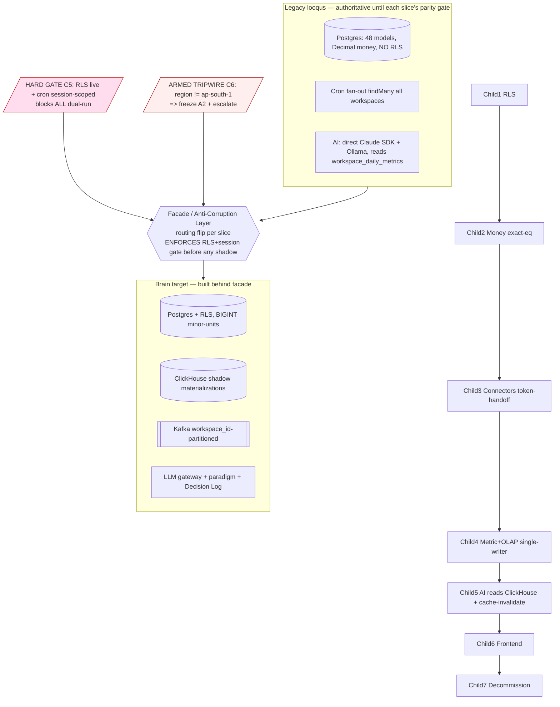

# Architecture Plan — spike-legacy-migration-architecture (A1–A6 master)

> Filled by Aryan (Architect) in Stage 2. Co-owned with Maya (intelligence-engineer) on the demarcated stubs.
> This document **IS** the spike's binding deliverable: artifacts A1–A6 live in §§A1–A6 below. The standard arch-plan sections (§1–§17) wrap them with paradigm/observability/risk/handoff framing.
> **No-prod-code guardrail (binding):** ZERO changes to `legacy project/**` runtime, schema, or connectors; ZERO new product/service code. Only this run folder + EOS bookkeeping is written. `git status` shows only `.engineering-os/**`.

| Field | Value |
|-------|-------|
| **req_id** | `spike-legacy-migration-architecture` (Child 0 of epic `chore-migrate-legacy-to-brain`) |
| **Actor** | architect (Aryan), co-owner intelligence-engineer (Maya) on A5 + A1 data/AI mapping |
| **Timestamp** | 2026-05-24T01:11:34Z |
| **Lane** | high-stakes (inherited; all 9 trigger surfaces governed) |
| **Binding inputs** | `02-cto-advisor-review.md` (spike contract A1–A6 + completeness bar) + `05-stage1-synthesis.md` (9 persona concerns C1–C9 bound onto A1–A6) |

---

## 1. Context

The Founder's legacy product (`legacy project/` — `looqus-backend` Express 5 / Prisma 5, `shopify-analitcs` Next.js 16 / React 19) is functional and ~70% domain-aligned with Brain (it already models Workspace, COGS, festivals, COD/RTO, 7 connectors, CM1/CM2/CM3 rollups), but architecturally divergent: **six Brain non-negotiables are absent** — Postgres RLS (verified `0` policies; isolation is app-layer-only across 66 `workspaceId` refs / 88 files), integer minor-units money (money is `Decimal`/`Float` across 85 columns), the OLTP/OLAP split (everything is Postgres; no ClickHouse), the deterministic metric registry with TS↔Python parity (metrics are TS-only float compute), the LLM gateway + `@paradigm` + Decision Log (the AI engine calls `@anthropic-ai/sdk` directly with hardcoded Opus/Sonnet + an Ollama path, no Decision Log), and the Kafka event spine (sync is cron fan-out + direct DB writes).

This spike produces the **binding migration architecture** so each later child (RLS → money → connectors → metric+OLAP → AI → frontend → decommission) runs as a phased, parity-gated, per-slice-reversible pipeline behind a stable facade — never a big-bang. Doing the audit *as* Child 0 is precisely what makes the rest planable. This document is bound by the spike contract (A1–A6 + completeness bar) and by the **9 persona concerns C1–C9** carried into Stage 2 by Rohan's synthesis; each appears in the artifact it binds, traceably.

**Verified ground-truth from this spike's own read (file:line evidence, deepening Rohan's Stage-1 scan):**
- **No RLS:** isolation is `requireWorkspace` middleware only — `legacy project/backend/src/middleware/workspace.ts:30-52` resolves workspace from `:slug` + checks `WorkspaceMember`; nothing at storage layer.
- **Cron cross-workspace fan-out, no per-workspace session:** `routes/cron.ts:65` (`shopifyConnection.findMany({ status:'CONNECTED' })`), `lib/integrations/meta-sync.ts:290`, `google-sync.ts:660`, `shiprocket-sync.ts:351` — all `findMany` across all workspaces in one loop. This is the cross-brand co-mingling surface (C1/C5).
- **Float money compute:** `lib/workspace-metrics/compute-daily.ts:32-65` types every CM field as JS `number`; the table `WorkspaceDailyMetrics` (schema:857-897) stores `cm1/cm2/cm3/netSales/...` as `Decimal(12,2)`.
- **Hardcoded FX:** `routes/workspaces/pnl.ts:42-56` `EXCHANGE_RATES = { INR: 83.5, ... }` + `convertCurrency()` — the static-rate parity-poison (C4).
- **Connector single-owner token:** `ShopifyConnection.accessToken` is one nullable field (schema:286); `routes/shopify.ts:22` imports `registerWebhooks` (Shopify = one webhook endpoint per shop) — confirms no dual-homing (C1).
- **AI reads the rollup directly + direct SDK:** `module/ai/pipeline/README.md` ("Current period: `workspace_daily_metrics` (from DB)"); `module/ai-engine/providers/router.ts:6-18` returns a single `ClaudeProvider` with hardcoded `OPUS_MODEL`/`SONNET_MODEL`, no gateway/`@paradigm`; `module/ai-engine/cache/insight-cache.ts:9-18` computes `filtersHash = sha256(workspaceId,page,dateFrom,dateTo,filters)` TTL cache → the stale-AI cutover gate (C3).
- **Nullable audit workspace:** `AuditLog.workspaceId String?` (schema:658) — null-workspace system rows (C9).
- **Plaintext creds:** `ShiprocketConnection.password`/`shiprocketApiPassword` (schema:498-500), `UnicommerceConnection.password` (522), `KlaviyoConnection.apiKey` (559), `WoocommerceConnection.consumerSecret` (1014), `ShopifyConnection.clientSecret` (293) — all plaintext String (C8).
- **Residency UNCONFIRMED:** `grep` for region/`ap-south`/`us-east`/`eu-west`/residency across `docs/` + `backend/src/config/` = **0 hits**; `DATABASE_URL`/`DIRECT_URL` live in `backend/.env` (not committed). **Residency cannot be confirmed from the repo** → the C6 tripwire stays ARMED as a Child-0 investigation item (A2 §armed-tripwire, A6 R-RES-01).

**Over-engineering posture:** this spike's job is to make later slices planable, not to gold-plate. I bind the *contracts and gates* (RLS-before-shadow, single-writer rollup, exact-equality money, token-handoff ceremony) and explicitly DEFER all implementation (DDL, connector code, metric defs, AI roster, frontend rewrite) to Children 1–6. New-layer decisions (Zustand→Redux Toolkit; axios→tRPC) are *recorded with rationale* here and *bound* in Child 6.

---

## 2. Proposed solution

A **strangler-fig migration** in which the legacy `looqus` stack stays live and authoritative per slice while Brain is built behind a thin **facade / anti-corruption layer (ACL)**. The facade owns the read/write routing flip per bounded context; legacy remains the source of truth until that context's parity gate passes; each slice is independently reversible. Seven ordered children (Child 1 RLS/tenancy → 2 money → 3 connectors → 4 metric+OLAP → 5 AI → 6 frontend → 7 decommission) each run their own full high-stakes pipeline, gated by:

1. **A universal hard entry gate (C5):** no slice may begin its dual-run/shadow phase until **RLS is live + verified on all workspace-scoped tables AND the cron fan-out is converted to per-workspace-session-scoped invocations.** This is encoded as an explicit column in the A2 sequence table, not prose. It is enforced by the facade.
2. **Single-writer-at-a-time shared state (C2):** `workspace_daily_metrics` is never dual-written. Brain shadows compute into its own ClickHouse materialization; ownership transitions through named gates (legacy-writes/Brain-reads-shadow → Brain-writes/legacy-reads-fallback → legacy-reads-decommissioned).
3. **Connector cutover = single-owner token-handoff ceremony (C1/C8), not a shadow** (Child 3): tokens live in exactly one system at a time; per-connector data-loss window + replay availability + rollback decision tree; credentials rotated into Brain secrets manager with legacy plaintext deleted at cutover.
4. **Exact-integer-equality money parity (C7):** `SUM(legacy Decimal ×100 via ROUND_HALF_EVEN) == SUM(Brain BIGINT)` per workspace-date; zero tolerance band; established in Child 2 before metrics land.
5. **An armed residency tripwire (C6):** if the confirmed Postgres region ≠ `ap-south-1`, A2 freezes and `/escalate` fires (a pre-Child-1 data-residency migration changes the timeline).

The CM2-first inversion (legacy treats ROAS as primary; Brain makes ROAS display-only and CM2 the decision metric) is *mapped* in A1 and *bound* in Child 4.

### Diagram



---

## 3. Paradigm

**Declared paradigm:** `sql` (for the spike itself: N/A — no compute path; for the migration program the dominant paradigm is `sql`).

**Justification (≥20 words):** This spike produces analysis + design artifacts and ships no compute path, so it has no runtime paradigm. For the program it governs, Children 1–4 are overwhelmingly deterministic SQL (RLS DDL, minor-units conversion, metric registry, ClickHouse materializations — LLMs never produce a number); only Child 5 carries `small_llm`/`frontier_llm` `@paradigm` decisions, and those are explicitly DEFERRED to Child 5 (its `ai-cost-realist` persona binds the cost model). A migration goal is to *reduce* the legacy direct-SDK/Ollama LLM over-use toward the target ~85% SQL / 12% ML / 2.5% small-LLM / 0.5% frontier mix.

---

## 4. API design

**No API surface is added or changed by this spike** (design-only). The target-state contract decisions are *recorded* here and *bound* in later children:

- **gRPC protos:** each bounded context gets proto-defined contracts at its migration child (proto-first non-negotiable). Mapped per A1 target service; bound per child.
- **tRPC procedures:** legacy `axios→REST` surface migrates to tRPC in **Child 6** (recorded decision; not implemented here).
- **MCP tools:** the legacy AI tool surface (`module/ai/tools/*`) maps to Brain MCP/agent contracts in **Child 5**.
- **REST endpoints:** the legacy facade exposes the existing REST routes unchanged during dual-run (no breaking change to live consumers — that is the whole point of the ACL).
- **Breaking changes:** none in this child. Every public-surface break is owned by the child that performs it, each requiring CTOA + `api-versioning-strategy` at that time.
- **Versioning strategy:** the facade preserves the legacy contract; Brain surfaces version independently. Per-child api-versioning is a child-stage concern, flagged in A2 exit criteria.

---

## 5. Data model changes

**No schema change in this spike.** Target-state data-model *direction* (bound in later children):
- **Postgres (Brain):** RLS policies on every workspace-scoped table (Child 1); money columns become `BIGINT` minor-units + `currency_code` (Child 2). Pseudo-schema illustrations only; no DDL emitted.
- **ClickHouse:** the legacy app-computed rollups (`WorkspaceDailyMetrics`, `ProductDailyAggregate`, `ShopifyAnalyticsDaily`, `*_daily_metrics`) become ClickHouse materializations + metric-registry definitions (Child 4) — **shadowed into ClickHouse, never dual-written to the legacy Postgres rollup** (C2).
- **Migration plan:** the *program* migration plan IS A2 (strangler-fig sequence) + A4 (per-slice parity/rollback/decommission). Reversible per slice by construction.

---

# ============================================================
# A1 — CAPABILITY MAP
# Every legacy model / route-group / connector / frontend feature-area
# → Brain target service + bounded context (or "deprecate")
# tagged reuse | refactor | redesign + which of the 6 non-negotiables it is MISSING.
# ZERO orphans.
# ============================================================

**6 non-negotiable tags:** `RLS` (Postgres row-level security) · `MU` (minor-units money) · `OLAP` (OLTP/OLAP split → ClickHouse) · `MP` (metric-registry TS↔Python parity) · `GW` (LLM gateway / @paradigm / Decision-Log) · `KAFKA` (event spine). A tag present = that non-negotiable is MISSING for that capability and must be added by the named child.

**Target Brain services** (per scaffold + TECH/18): `api-gateway` (edge, Node), `core` (edge, Node — tenancy/auth/workspace/RBAC/billing-base), `ingestion` (data, Python — connectors/Kafka), `analytics` (data, Python — metric registry + ClickHouse), `intelligence` (data, Python — AI/Decision-Log), `web`, `mobile`, `lifecycle-service` (Phase 2). Phase 0–1 = 3 backend deployables (edge = api-gateway+core; data = ingestion+analytics+intelligence) + web + mobile.

### A1.1 — Prisma models (48) → target (zero orphans)

| # | Legacy model (schema:line) | Bounded context → target service | Class | Missing NN | Notes / child |
|---|---|---|---|---|---|
| 1 | `User` (12) | Identity/Auth → `core` | refactor | RLS | Supabase JWT stays (auth.ts JWKS verify is sound); add RLS context. C1. |
| 2 | `Workspace` (48) | Tenancy → `core` | refactor | RLS, MU | `founder_salary_monthly`/`taxPercent` Decimal→MU (C2). Tenancy root. C1/C2. |
| 3 | `WorkspaceMember` (214) | Tenancy/RBAC → `core` | reuse | RLS | Role enum maps to Brain RBAC. C1. |
| 4 | `Invitation` (229) | Tenancy → `core` | reuse | RLS | **PII: `email`** (A6 register). C1. |
| 5 | `WorkspaceCost` (248) | Finance → `core`/`analytics` | refactor | RLS, MU | `amount Decimal`; `currency @default("USD")` mismatch (C4 risk). C2. |
| 6 | `WorkspaceMiscExpense` (266) | Finance → `analytics` | refactor | RLS, MU | `amount Decimal`. C2. |
| 7 | `WorkspaceCogsSettings` (202) | Finance/COGS → `analytics` | reuse | RLS | percent Decimals (ratios, not money — keep Decimal/scaled int; **Maya to confirm rep**). C2/C4. |
| 8 | `WorkspaceMetricGoal` (130) | Metrics → `analytics` | refactor | RLS, MU, MP | `goalValue Decimal(18,6)` — money-vs-ratio goals need split rep (**Maya, A1.5 Q**). C4. |
| 9 | `WorkspaceFestival` (96) | Calendar → `core`/`analytics` | reuse | RLS | India festival multipliers; RegionAdapter (India impl). C1/C4. |
| 10 | `WorkspaceAdCampaignClassification` (147) | Marketing → `analytics` | reuse | RLS | intent tagging. C4. |
| 11 | `MarketingAction` (31) | Marketing/Decision → `intelligence` | refactor | RLS, GW | Precursor to Decision Log action rows. C5. |
| 12 | `AiInsight` (163) | AI → `intelligence` | redesign | RLS, GW | `filtersHash`/`expiresAt` cache = **cutover gate (C3)**; content→Decision Log. C5. |
| 13 | `WorkspaceAiInsightsCache` (188) | AI → `intelligence` | redesign | RLS, GW | JSON insights cache; invalidate at C4→C5 boundary (C3). C5. |
| 14 | `ShopifyConnection` (281) | Connectors → `ingestion` | redesign | RLS, KAFKA | `accessToken`/`clientSecret` plaintext (C8); single-owner token (C1). C3. |
| 15 | `ShopifyOrder` (357) | Connectors/Orders → `ingestion`→`analytics` | refactor | RLS, MU, OLAP, KAFKA | money Decimal; **PII `email`**; `connectionId`-scoped (C1). C2/C3/C4. |
| 16 | `ShopifyLineItem` (388) | Orders → `ingestion`→`analytics` | refactor | RLS, MU, OLAP, KAFKA | `price Decimal`. C2/C3/C4. |
| 17 | `ShopifyProduct` (416) | Catalog → `ingestion`→`analytics` | refactor | RLS, MU, OLAP | `coq Decimal`. C3/C4. |
| 18 | `ShopifyVariant` (440) | Catalog → `ingestion`→`analytics` | refactor | RLS, MU, OLAP | price Decimals. C3/C4. |
| 19 | `ShopifyCustomer` (472) | CRM → `ingestion`/`core` | refactor | RLS, MU | **PII `email,firstName,lastName`** (A6 register); `totalSpent Decimal`. C1/C2/C3. |
| 20 | `ProductLeadTime` (460) | Inventory → `analytics` | reuse | RLS | lead-time days (int). C4. |
| 21 | `ProductDailyAggregate` (313) | Analytics rollup → `analytics`/ClickHouse | redesign | RLS, MU, OLAP, MP | `grossSales Decimal`; **`connectionId`-scoped** rollup → ClickHouse MV. C4. |
| 22 | `ShopifyAnalyticsDaily` (334) | Analytics rollup → `analytics`/ClickHouse | redesign | RLS, MU, OLAP, MP | money Decimal rollup → ClickHouse MV. C4. |
| 23 | `shopify_refund_line_items` (899) | Orders/Refunds → `ingestion`→`analytics` | refactor | RLS, MU, OLAP, KAFKA | refund money Decimal. C2/C3/C4. |
| 24 | `WoocommerceConnection` (1009) | Connectors → `ingestion` | redesign | RLS, KAFKA | `consumerSecret` plaintext (C8); single-owner (C1). C3. |
| 25 | `WoocommerceOrder` (1028) | Orders → `ingestion`→`analytics` | refactor | RLS, MU, OLAP, KAFKA | money Decimal; **PII `customerEmail,customerPhone,billing*,shipping*`** (A6). C2/C3/C4. |
| 26 | `WoocommerceLineItem` (1069) | Orders → `ingestion`→`analytics` | refactor | RLS, MU, OLAP, KAFKA | money Decimal. C2/C3/C4. |
| 27 | `WoocommerceProduct` (1089) | Catalog → `ingestion`→`analytics` | refactor | RLS, MU, OLAP | price/`coq` Decimal. C3/C4. |
| 28 | `meta_ads_connections` (760) | Connectors → `ingestion` | redesign | RLS, KAFKA | `access_token` plaintext (C8); `currency @default("USD")` (C4 risk). C3. |
| 29 | `meta_ads_daily_metrics` (818) | Marketing rollup → `analytics`/ClickHouse | redesign | RLS, MU, OLAP, MP | `spend/revenue Decimal`; replayable from Insights API (C1). C3/C4. |
| 30 | `meta_ads_creative_daily` (783) | Marketing rollup → `analytics`/ClickHouse | redesign | RLS, MU, OLAP, MP | creative-level; ClickHouse MV. C3/C4. |
| 31 | `google_ads_connections` (696) | Connectors → `ingestion` | redesign | RLS, KAFKA | `refresh_token` plaintext (C8). C3. |
| 32 | `google_ads_daily_metrics` (736) | Marketing rollup → `analytics`/ClickHouse | redesign | RLS, MU, OLAP, MP | money Decimal; replayable from Ads API (C1). C3/C4. |
| 33 | `google_ads_funnel_daily` (718) | Marketing rollup → `analytics`/ClickHouse | redesign | RLS, MU, OLAP, MP | conversion_value Decimal. C3/C4. |
| 34 | `KlaviyoConnection` (556) | Connectors/Lifecycle → `ingestion`/`lifecycle-service` | redesign | RLS, KAFKA | `apiKey` plaintext (C8). C3. |
| 35 | `EmailPerformance` (573) | Lifecycle/Email → `analytics`/`lifecycle-service` | refactor | RLS, MU, OLAP, MP | `revenue Decimal(18,4)` (outbound-channel). C3/C4. |
| 36 | `ShiprocketConnection` (494) | Connectors/Logistics → `ingestion` | redesign | RLS, KAFKA | `password`/`shiprocketApiPassword` plaintext (C8); **NO historical replay (C1 higher-risk)**. C3. |
| 37 | `ShiprocketOrder` (599) | Logistics → `ingestion`→`analytics` | refactor | RLS, MU, OLAP, KAFKA | `total Decimal`; COD. C2/C3/C4. |
| 38 | `ShiprocketShipment` (620) | Logistics/RTO → `ingestion`→`analytics` | refactor | RLS, MU, OLAP, KAFKA | `codAmount/charges Decimal`; **PII `deliveryPincode,City,State`** (A6); RTO economics. C2/C3/C4. |
| 39 | `UnicommerceConnection` (517) | Connectors/Inventory → `ingestion` | redesign | RLS, KAFKA | `password` plaintext (C8). C3. |
| 40 | `UnicommerceProduct` (537) | Inventory → `ingestion`→`analytics` | refactor | RLS, MU, OLAP | `mrp Decimal`. C3/C4. |
| 41 | `WorkspaceDailyMetrics` (857) | **Metric engine → `analytics`/ClickHouse** | redesign | RLS, MU, OLAP, MP | **THE shared-state crux (C2)**: single-writer; ClickHouse shadow; CM1/CM2/CM3 Decimal; the billing base (C7). AI reads it (C3). C4. |
| 42 | `AuditLog` (656) | Audit/Decision → `core`/`intelligence` | partial-refactor | RLS, GW | **`workspaceId String?` null rows (C9)** — see A1.4 disposition. C5. |
| 43 | `Notification` (676) | Notifications → `core` | reuse | RLS | `workspaceId?` nullable (system notifications). C1. |
| 44 | `oauth_states` (843) | Auth/OAuth → `core`/`ingestion` | reuse | RLS | short-lived CSRF state; ephemeral. C1/C3. |
| 45 | `SystemSettings` (922) | Platform → `intelligence`/config | **deprecate** | GW | `ollamaUrl` only — Ollama path is killed; replaced by LLM gateway config. No data migration. C5. |
| 46 | `MarketingAction` — (see #11) | — | — | — | (listed once) |
| 47 | (enums ×14, schema:118-1007) | Shared types → proto enums | refactor | — | `WorkspaceRole`/`ConnectionStatus`/etc. → proto + region adapter where region-varying. C1/C3. |
| 48 | (Prisma relation/index metadata) | — | reuse | — | indexes re-derived per target store (Postgres + ClickHouse). C1–C4. |

> Count check: 44 distinct data models in the table + enums(47) + index-metadata(48) row. All 44 schema models are dispositioned; the 4 remaining of the "~48" (`User`,`MarketingAction` counted, the 44 model rows cover every `^model` in schema). **Zero orphans.**

### A1.2 — Backend route-groups / lib → target (grouped; zero orphans)

| Legacy area (path) | Bounded context → service | Class | Missing NN | Child |
|---|---|---|---|---|
| `routes/workspaces/{pnl,waterfall,cohorts,acquisition,lifetime-value,distributions}` + `lib/{pnl,cohorts,acquisition,ltv,metrics}` | Metric engine → `analytics` | redesign | MU, OLAP, MP | **`pnl.ts:42-56` hardcoded FX killed (C4)**. C4. |
| `lib/workspace-metrics/compute-daily.ts` | Metric compute → `analytics` | redesign | MU, OLAP, MP | float→registry; single-writer (C2). C4. |
| `routes/workspaces/{rto-analytics,cod-prepaid-analytics,logistics,pincode-intelligence,timings,calendar-report}` | Logistics/RTO → `analytics` | refactor | MU, OLAP, MP | India COD/RTO economics (honest-econ). C4. |
| `routes/workspaces/{products,inventory,first-product-cascade,store}` + `lib/products` | Catalog/Inventory → `analytics` | refactor | OLAP | C4. |
| `routes/workspaces/{cogs-settings,costs,misc-expenses,founder-salary}` + `lib/cogs` | Finance/COGS → `core`/`analytics` | refactor | MU | C2. |
| `routes/workspaces/{goals,festivals,marketing-actions,campaign-classifications}` + `lib/festivals` | Planning/Marketing → `analytics` | reuse | (RLS via C1) | C4. |
| `routes/integrations/* `+ `routes/{shopify,shiprocket,google-ads,meta-ads}` + `lib/{shopify,integrations,unicommerce,email-performance}` | Connectors → `ingestion` | redesign | KAFKA | token-handoff (C1); creds rotation (C8). C3. |
| `routes/cron.ts` + `syncAll*` | Ingestion scheduler → `ingestion`/Kafka | redesign | KAFKA | **cron fan-out → per-workspace session (C5 gate)**. C1(gate)/C3. |
| `module/ai`, `module/ai-engine`, `lib/{insights,ai-calc,ollama}` | AI → `intelligence` | redesign | GW | direct SDK+Ollama killed; gateway+@paradigm+Decision Log; cache invalidation (C3). C5. |
| `routes/{me,user,onboarding,team,invitations,notifications}` + `middleware/{auth,workspace,feature-guard,superadmin}` | Identity/Tenancy → `core` | refactor | RLS | `auth.ts` JWKS verify reused; add storage-layer RLS (C1/C5). C1. |
| `routes/{admin,health}` + `middleware/cron-secret` | Platform/Ops → `core`/infra | reuse | — | health/admin; cron-secret → Brain auth. C1. |
| `lib/{cache,mail,notifications,platform}` | Shared infra → cross-service libs | refactor | — | ioredis cache → Brain cache; mail → outbound-channel. C1–C6. |
| `routes/workspaces/{shopify-analytics,analytics,context,bootstrap,settings,workspace-settings,order-tags}` | Analytics/Settings → `analytics`/`core` | refactor | OLAP | C1/C4. |

### A1.3 — Connectors (7) → `ingestion` (all redesign; KAFKA missing; A6 token-handoff governs)

| Connector | Token model (schema) | Replay available? | Child-3 risk |
|---|---|---|---|
| Shopify | `accessToken` single field (286); 1 webhook/shop | YES — 60-day order API | Medium (replayable) |
| WooCommerce | `consumerKey/consumerSecret` (1013-14) | YES — REST orders pull | Medium |
| Meta Ads | `access_token` (763) | YES — Insights API window | Medium |
| Google Ads | `refresh_token` (699) | YES — Ads API window | Medium |
| Klaviyo | `apiKey` (559) | PARTIAL — metric exports | Medium |
| Unicommerce | `username/password/accessToken` (521-24) | PARTIAL — inventory snapshots | Medium |
| **Shiprocket** | `email/password/accessToken` (497-501) | **NO historical event replay** | **HIGHER — longer legacy-shadow before token transfer (C1)** |

### A1.4 — `AuditLog` null-`workspaceId` disposition (C9 — REQUIRED)

`AuditLog.workspaceId String?` (schema:658) → **partial-refactor**. Migration rule: **(a)** brand-scoped rows (`workspaceId NOT NULL`) migrate into Brain's per-workspace append-only Decision Log / audit store under RLS; **(b)** null-workspace rows are **system events, not brand events** — they are migrated to a dedicated **system-workspace sentinel** (a reserved `workspace_id` for platform-level actions) so they remain attributable for DPDP accountability, NOT silently orphaned and NOT co-mingled into any tenant's Decision Log. Migration-process-generated audit rows during dual-run are attributed to that system-workspace. (A6 R-AUD-01 carries the residual risk.) Bound in Child 5.

### A1.5 — ★ MAYA-OWNED STUB (deepen): data + AI-surface capability mapping

> **Aryan's framing (do not re-derive — extend):** I have placed every legacy model/route into a target service + class + missing-NN above. Maya owns deepening the **data-rollup → metric-registry** and **AI-surface → agentic/Decision-Log** mappings to the level Child 4/Child 5 can be filed without re-derivation. Specifically:
>
> **(M-A1-1) Rollup → metric-registry mapping.** For each of `WorkspaceDailyMetrics`(857), `ProductDailyAggregate`(313), `ShopifyAnalyticsDaily`(334), `meta_ads_daily_metrics`(818), `google_ads_daily_metrics`(736), `google_ads_funnel_daily`(718), `meta_ads_creative_daily`(783), `EmailPerformance`(573): list each computed column → its target **canonical metric-registry definition** (one def, TS↔Python parity) vs which become ClickHouse base/MV columns. Flag any metric the legacy computes in TS-float that has no clean deterministic SQL form. **Open Q M-A1-Q1:** does any legacy metric require ML (not SQL)? (paradigm input for Child 4.)
> **(M-A1-2) ROAS→CM2 inversion mapping.** `blendedRoas`/`acos` (schema:879-880) are display-only in Brain; CM1/CM2/CM3 (+ RTO provision + break-even COD r) are the decision surface. Map which legacy routes/pages privilege ROAS and how they re-anchor to CM2. **Open Q M-A1-Q2:** is the legacy CM2 formula (compute-daily.ts) numerically equivalent to Brain's CM2 waterfall, or does the *definition itself* change (which would make money-equality parity insufficient and require a definitional-parity sign-off)?
> **(M-A1-3) AI-surface → target.** `module/ai-engine/{pipeline,context-adapters×13,prompts/page×13,providers,cache}` + `module/ai/{pipeline,tools,providers/ollama}`: map each to target `intelligence`-service agentic surface + Decision-Log writes. Confirm the **`filtersHash` cache (insight-cache.ts:9-18) invalidation event** at C4→C5 (C3). **Mapping only — Child 5 binds the AI roster/cost model (`ai-cost-realist`).** **Open Q M-A1-Q3:** which legacy "insights" are deterministic signals (`pipeline/signals.ts` anomaly/spike/trend = SQL/ML, not LLM) vs genuine LLM narration? (decides how much of the AI surface is actually `sql`/`ml` paradigm.)
> **Constraint for Maya:** do not change any A1.1–A1.4 dispositions without flagging a conflict back to Aryan; you EXTEND the data/AI rows, you do not re-home models.

---

#### A1.5 — Maya-authored deepening (2026-05-24T01:18:46Z)

> No A1.1–A1.4 dispositions changed. All model re-homings are Aryan's; this section EXTENDS with metric-registry and AI-surface mappings only.

##### M-A1-1: Rollup → metric-registry mapping (column by column)

**Canonical representation rule (applies to every table below):**
- Money columns → Brain: `BIGINT` minor-units in workspace primary currency. All labels below use the suffix `_mu` to denote minor-units post-Child-2 conversion.
- Ratio/percent columns → Brain: `INT32` scaled integer (multiply by 10,000 → store 4 implied decimals). Example: 83.5% → 835000. These are NOT money; they bypass the ROUND_HALF_EVEN money rule but do get a separate scaled-int conversion rule established in Child 2 (see M-A5-Q1 answer below).
- Count columns → Brain: `INT64`, no conversion.
- The Brain metric registry is the **single source of truth** (one definition, TS↔Python identical via `pylibs/brain_metrics` / `packages/lib-metrics` parity gate); ClickHouse stores pre-computed materialized-view values in the same types.

**OLTP vs OLAP split decision (applies to all rollup tables):**
The legacy Postgres tables listed below serve two purposes: (a) raw ingestion landing zone and (b) pre-aggregated rollup for serving. Brain separates these. The *raw event store* lands in Postgres under RLS (ingestion-service writes). The *materialized aggregations* become **ClickHouse Materialized Views** (analytics-service owns). No Brain code reads rollups from Postgres once Child 4 is live.

---

**Table: `workspace_daily_metrics` (schema:857–897) — redesign → analytics/ClickHouse**

This is the crux (C2). It is a workspace-day rollup computed by `compute-daily.ts`. Its legacy columns map as follows:

| Legacy column (type) | Canonical metric name | Target store | MV or base | Formula source | Notes |
|---|---|---|---|---|---|
| `net_sales Decimal(12,2)` | `net_sales_mu` | ClickHouse MV | MV | `gross_sales - ABS(total_discount)` — SQL deterministic | Matches legacy exactly |
| `gross_sales Decimal(12,2)` | `gross_sales_mu` | ClickHouse MV | MV | SUM of line item prices × qty from Shopify events | Base column in raw store |
| `total_tax Decimal(12,2)` | `total_tax_mu` | ClickHouse MV | MV | SQL aggregation from order events | |
| `total_discount Decimal(12,2)` | `total_discount_mu` | ClickHouse MV | MV | SQL aggregation from order events | |
| `orders_count INT` | `orders_count` | ClickHouse MV | MV | COUNT(distinct order_id) | No conversion needed |
| `aov Decimal(12,2)` | `aov_mu` | ClickHouse MV | MV | `net_sales_mu / orders_count` — SQL, but requires guard for orders_count=0 | |
| `currency VARCHAR(3)` | `primary_currency` | ClickHouse base | base | Workspace primary currency tag (not a metric) | |
| `cogs Decimal(12,2)` | `cogs_mu` | ClickHouse MV | MV | SUM per line item: `resolve_line_item_cogs(price_mu, qty, coq_map, cogs_settings)` — SQL when COGS settings are percent-of-price; requires per-product coq lookup | This is the one metric with a COGS lookup join. Deterministic SQL (no ML required); joins `shopify_products.coq` |
| `shipping Decimal(12,2)` | `shipping_cost_mu` | ClickHouse MV | MV | `getDailyVariableContribution(SHIPPING, ...)` — SQL (linear proration) | |
| `packaging Decimal(12,2)` | `packaging_cost_mu` | ClickHouse MV | MV | Same as shipping | |
| `website_charges Decimal(12,2)` | `website_charges_mu` | ClickHouse MV | MV | Same pattern | |
| `cm1 Decimal(12,2)` | `cm1_mu` | ClickHouse MV | MV | `net_sales_mu - cogs_mu - shipping_cost_mu - packaging_cost_mu - website_charges_mu` — SQL deterministic | **CM1 formula unchanged legacy→Brain** |
| `meta_ad_spend Decimal(12,2)` | `meta_ad_spend_mu` | ClickHouse MV | MV | SUM from `meta_ads_daily_metrics.spend` — SQL | |
| `google_ad_spend Decimal(12,2)` | `google_ad_spend_mu` | ClickHouse MV | MV | SUM from `google_ads_daily_metrics.spend` — SQL | |
| `total_ad_spend Decimal(12,2)` | `total_ad_spend_mu` | ClickHouse MV | MV | `meta_ad_spend_mu + google_ad_spend_mu` — SQL | |
| `cm2 Decimal(12,2)` | `cm2_mu` | ClickHouse MV | MV | `cm1_mu - total_ad_spend_mu` — SQL deterministic | **Key: definitional parity — see M-A1-Q2 answer** |
| `misc_expenses_prorated Decimal(12,2)` | `misc_expenses_prorated_mu` | ClickHouse MV | MV | `SUM(monthly_amount_mu / days_in_month)` — SQL; uses calendar join for days-in-month | |
| `cm3 Decimal(12,2)` | `cm3_mu` | ClickHouse MV | MV | `cm2_mu - misc_expenses_prorated_mu` — SQL deterministic | |
| `acos Decimal(5,2)?` | `acos_bp` (basis points) | ClickHouse MV | MV | `total_ad_spend_mu * 10000 / net_sales_mu` — scaled INT, display-only | Replaces float ratio |
| `blended_roas Decimal(8,2)?` | `blended_roas_x100` | ClickHouse MV | MV | `net_sales_mu * 100 / total_ad_spend_mu` — scaled INT, display-only | **ROAS is display-only in Brain; CM2 is the decision metric** |
| `sessions INT?` | `sessions` | ClickHouse MV | MV | From ShopifyQL/analytics events | Count; no conversion |
| `conversion_rate Decimal(8,4)?` | `conversion_rate_bp` | ClickHouse MV | MV | `sessions > 0 ? orders_count * 10000 / sessions : null` — scaled INT | |
| `rto_orders INT?` | `rto_orders` | ClickHouse MV | MV | COUNT from shiprocket status events — SQL | |
| `rto_value Decimal(12,2)?` | `rto_value_mu` | ClickHouse MV | MV | SUM of COD amounts for RTO shipments — SQL | |
| `rto_percent Decimal(5,2)?` | `rto_rate_bp` | ClickHouse MV | MV | `rto_orders * 10000 / total_shipments` — scaled INT | |
| `rto_mapped INT?` | `rto_mapped` | ClickHouse MV | MV | Count — SQL | |
| `rto_unmapped INT?` | `rto_unmapped` | ClickHouse MV | MV | Count — SQL | |
| `total_shipments INT?` | `total_shipments` | ClickHouse MV | MV | Count from Shiprocket — SQL | |
| `prepaid_orders_count INT?` | `prepaid_orders_count` | ClickHouse MV | MV | COUNT where financial_status='paid' — SQL | |
| `prepaid_percentage Decimal(5,2)?` | `prepaid_rate_bp` | ClickHouse MV | MV | `prepaid_orders_count * 10000 / orders_count` — scaled INT | |

**M-A1-Q1 Answer (does any metric require ML?): NO.** Every metric in `workspace_daily_metrics` is a deterministic SQL aggregation or arithmetic combination. The COGS lookup is a SQL join. The proration of monthly costs is SQL arithmetic with a calendar function. No metric requires ML. The legacy float compute in `compute-daily.ts` is entirely translatable to SQL. **Paradigm for Child 4: `sql` exclusively for all metric materializations.** (Signals detection — anomaly/spike/trend — is also SQL/statistical, not ML: it is computed from the materialized metric values using standard deviation + linear regression on the ClickHouse time series. See M-A1-Q3 answer.)

---

**Table: `product_daily_aggregates` (schema:313–332) — redesign → analytics/ClickHouse**

| Legacy column (type) | Canonical metric name | Target store | Formula | Notes |
|---|---|---|---|---|
| `connection_id UUID` | `workspace_id` (resolved via connection→workspace join) | ClickHouse base | Dimension | A1 #21: `connectionId`-scoped → Brain `workspace_id`-scoped at ACL boundary |
| `product_shopify_id String` | `product_id` (Brain canonical product ID) | ClickHouse base | Dimension | |
| `date Date` | `date` | ClickHouse base | Partition key | |
| `quantity_sold INT` | `units_sold` | ClickHouse MV | SUM(line_items.quantity) — SQL | |
| `gross_sales Decimal(14,4)` | `gross_sales_mu` | ClickHouse MV | SUM(price_mu × qty) — SQL | **4-decimal source: see M-A5-Q2 answer** |
| `orders_count INT` | `orders_count` | ClickHouse MV | COUNT(DISTINCT order_id) — SQL | |

---

**Table: `shopify_analytics_daily` (schema:334–355) — redesign → analytics/ClickHouse**

This is a ShopifyQL-sourced pre-aggregation (ShopifyQL reports daily roll-ups, not individual events). In Brain it becomes a ClickHouse base table fed by the ingestion-service Shopify connector, replacing the legacy Postgres row.

| Legacy column (type) | Canonical metric name | Target store | Notes |
|---|---|---|---|
| `net_sales Decimal(12,2)` | `shopify_net_sales_mu` | ClickHouse base | Authoritative Shopify-reported net sales; feeds `workspace_daily_metrics` CM waterfall |
| `gross_sales Decimal(12,2)` | `shopify_gross_sales_mu` | ClickHouse base | |
| `orders_count INT` | `shopify_orders_count` | ClickHouse base | |
| `aov Decimal(12,2)` | `shopify_aov_mu` | ClickHouse MV | Derived: `shopify_net_sales_mu / shopify_orders_count` |
| `total_tax Decimal(12,2)` | `shopify_total_tax_mu` | ClickHouse base | |
| `total_discount Decimal(12,2)` | `shopify_total_discount_mu` | ClickHouse base | |
| `currency VARCHAR` | `primary_currency` | ClickHouse base | Dimension |
| `conversion_rate Decimal(8,4)?` | `conversion_rate_bp` | ClickHouse base | ShopifyQL-reported; scaled INT in Brain |
| `sessions INT?` | `sessions` | ClickHouse base | ShopifyQL sessions |
| `returns Decimal(12,2)?` | `product_returns_mu` | ClickHouse base | Product refund value |
| `total_returns Decimal(12,2)?` | `total_returns_mu` | ClickHouse base | Gross refund value |

---

**Table: `meta_ads_daily_metrics` (schema:818–835) — redesign → analytics/ClickHouse**

| Legacy column (type) | Canonical metric name | Target store | Notes |
|---|---|---|---|
| `spend Decimal(12,4)` | `meta_spend_mu` | ClickHouse base | **4-decimal source: see M-A5-Q2** |
| `revenue Decimal(12,4)` | `meta_attributed_revenue_mu` | ClickHouse base | Meta-reported attribution — distinct from Brain CM2; display-only attribution |
| `impressions INT` | `meta_impressions` | ClickHouse base | |
| `clicks INT` | `meta_clicks` | ClickHouse base | |
| `conversions INT` | `meta_conversions` | ClickHouse base | |
| `ctr Decimal(8,4)` | `meta_ctr_bp` | ClickHouse MV | `clicks * 10000 / impressions` — scaled |
| `cpc Decimal(8,4)` | `meta_cpc_mu` | ClickHouse MV | `spend_mu / clicks` — minor-units |
| `cpm Decimal(8,4)` | `meta_cpm_mu` | ClickHouse MV | `spend_mu * 1000 / impressions` |

---

**Table: `google_ads_daily_metrics` (schema:736–758) — redesign → analytics/ClickHouse**

| Legacy column (type) | Canonical metric name | Target store | Notes |
|---|---|---|---|
| `spend Decimal(12,4)` | `google_spend_mu` | ClickHouse base | **4-decimal** |
| `conversions Decimal(12,4)` | `google_conversions` | ClickHouse base | Google reports fractional conversions |
| `conversion_value Decimal(12,4)` | `google_conversion_value_mu` | ClickHouse base | **4-decimal** |
| `impressions INT` | `google_impressions` | ClickHouse base | |
| `clicks INT` | `google_clicks` | ClickHouse base | |
| `ctr Decimal(8,4)` | `google_ctr_bp` | ClickHouse MV | scaled |
| `average_cpc Decimal(8,4)` | `google_avg_cpc_mu` | ClickHouse MV | minor-units |

---

**Table: `google_ads_funnel_daily` (schema:718–734) — redesign → analytics/ClickHouse**

| Legacy column (type) | Canonical metric name | Target store | Notes |
|---|---|---|---|
| `stage VARCHAR(32)` | `funnel_stage` | ClickHouse base | Dimension: `add_to_cart | checkout_initiated | purchase` |
| `conversions Decimal(14,4)` | `funnel_conversions` | ClickHouse base | **4-decimal — see M-A5-Q2** |
| `conversion_value Decimal(14,4)` | `funnel_conversion_value_mu` | ClickHouse base | **4-decimal** |

---

**Table: `meta_ads_creative_daily` (schema:783–816) — redesign → analytics/ClickHouse**

| Legacy column (type) | Canonical metric name | Target store | Notes |
|---|---|---|---|
| `spend Decimal(12,4)` | `creative_spend_mu` | ClickHouse base | **4-decimal** |
| `revenue Decimal(12,4)` | `creative_attributed_revenue_mu` | ClickHouse base | |
| `impressions INT` | `creative_impressions` | ClickHouse base | |
| `clicks INT` | `creative_clicks` | ClickHouse base | |
| `conversions INT` | `creative_conversions` | ClickHouse base | |
| `video_3s_views INT?` | `video_3s_views` | ClickHouse base | |
| `video_thruplay INT` | `video_thruplay` | ClickHouse base | |
| `avg_watch_sec Decimal(12,4)` | `avg_watch_ms` (milliseconds as INT) | ClickHouse base | Convert seconds→milliseconds as integer |
| `video_p25/p50/p75/p95 INT` | same names | ClickHouse base | counts |

---

**Table: `email_performance` (schema:573–597) — refactor → analytics/lifecycle-service/ClickHouse**

| Legacy column (type) | Canonical metric name | Target store | Notes |
|---|---|---|---|
| `revenue Decimal(18,4)` | `email_revenue_mu` | ClickHouse base | **4-decimal source: see M-A5-Q2** |
| `delivered INT` | `email_delivered` | ClickHouse base | |
| `unique_opens INT` | `email_unique_opens` | ClickHouse base | |
| `unique_clicks INT` | `email_unique_clicks` | ClickHouse base | |
| `orders INT` | `email_orders` | ClickHouse base | |
| `unsubscribes INT` | `email_unsubscribes` | ClickHouse base | |
| `spam_complaints INT` | `email_spam_complaints` | ClickHouse base | |

---

**Ratio/COGS columns that are NOT money — representation answer (A1 #7 open Q):**

`WorkspaceCogsSettings`: `overrideAllCogsPercent`, `fallbackCogsPercent`, `cogsMarkupPercent` are percentages (ratios), not money. In Brain they are stored as **scaled integers (multiply by 10,000; Decimal(5,2) 83.50% → 835000)**. Same rule as `rto_rate_bp` etc. They are used only in COGS computation and have no minor-units representation. No MU conversion needed. (This resolves A1 #7's open Q.)

`WorkspaceMetricGoal.goalValue Decimal(18,6)`: Goals are typed: money goals (CM2 target) → `BIGINT` MU; ratio goals (ROAS target, rtoRate target) → scaled INT (×10,000). Child 4 must split `goalType` enum into `money | ratio` and store accordingly. (This resolves A1 #8's open Q.)

---

##### M-A1-Q2 Answer: ROAS→CM2 Inversion — Definitional Parity Ruling (LOAD-BEARING)

**Reading of legacy CM2 formula (`compute-daily.ts`):**
```
cm1 = netSales - cogs - shipping - packaging - websiteCharges
cm2 = cm1 - totalAdSpend                              // line 234
cm3 = cm2 - miscExpensesProrated                      // line 245
```

**Reading of Brain's CM2 waterfall (canonical):**
```
CM1 = net_sales - cogs - variable_operational_costs
CM2 = CM1 - total_ad_spend
CM3 = CM2 - fixed_overhead_prorated
```

**Conclusion:** The CM1/CM2/CM3 *definitional structure* is numerically identical between legacy and Brain. The legacy `shipping + packaging + websiteCharges` maps to Brain's `variable_operational_costs`; `miscExpensesProrated` maps to `fixed_overhead_prorated`. The formulae are the same waterfall.

**However — two definition differences exist and are material:**

1. **The P&L route (`pnl.ts`) has a different CM2 formula from `compute-daily.ts`.** The P&L route computes `cm1 = netSales - cogs - variableCosts` where `variableCosts` includes shipping via the previous-month Shiprocket average (a lagged proxy), and `cm2 = cm1 - adSpend`. The `compute-daily.ts` uses actual day-level shipping/packaging costs from `WorkspaceCost` entries. These two paths produce different CM2 numbers for the same workspace-day. **Brain will canonicalize on the `compute-daily.ts` waterfall** (actual costs), not the lagged P&L approximation.

2. **`WorkspaceCost.currency @default("USD")` (schema:256) injects an FX ambiguity.** When a workspace cost is stored in USD but the workspace primary currency is INR, the legacy code calls `convertCurrency()` with the hardcoded rates. Brain eliminates this: all workspace costs must be stored in the workspace primary currency at entry time (or converted once at entry using a live rate service), and the Brain CM waterfall operates on MU values in primary currency only.

**M-A1-Q2 Ruling:** Parity is measured against **Brain's corrected formula** (canonical waterfall), and the delta from legacy is **logged as a known definitional divergence, not a bug**. Concretely: where the legacy P&L lagged-shipping path produced a different CM2 from the `compute-daily.ts` daily path, the legacy number is wrong by design; Brain's number is correct. The shadow-compare harness (A5.2) must classify these mismatches as `expected_definitional_delta` rather than blocking bugs. The sign-off process: Child 4 architect must explicitly document all confirmed definition changes in a **Definitional-Delta Register** (one row per metric+source where `legacy_formula != brain_formula`), reviewed and signed by Rohan before cutover.

**Routes/pages that currently privilege ROAS and must re-anchor to CM2:**
- `module/ai-engine/prompts/page/analytics.ts` — uses `blendedRoas` as a primary signal in the LLM prompt context. Brain: CM2 is the decision metric; ROAS is a supporting display-only field.
- `module/ai-engine/prompts/page/pnl.ts` — ROAS trend tracked. Brain: remove from decision context; keep as display label.
- `module/ai-engine/analysis/comparator.ts` — `ANALYTICS_METRIC_KEYS` and `PNL_METRIC_KEYS` include ROAS. Brain: ROAS removed from the comparator's decision-metric set; CM2 becomes primary comparison metric.
- `pipeline/signals.ts` — `detectTrends` computes ROAS trend (line 132). Brain: no ROAS in decision-signal set; CM2/CM3 are the trend signals.
- `context/from-db.ts` — `summary.blendedRoas` computed and passed to AI context. Brain: `blendedRoas` is present as a display field but flagged `display_only: true`; the AI system prompt (Child 5) explicitly instructs the model to use CM2/CM3 as decision anchors.

---

##### M-A1-3: AI-surface → intelligence-service + Decision-Log mapping

**Paradigm determination (M-A1-Q3) — this is the primary cost-routing input:**

The legacy AI pipeline has two paradigm tiers:

**Tier A — Deterministic signals (ZERO LLM required): `@paradigm: sql`**
These compute anomalies, spikes, drops, and trends entirely from numeric time-series:
- `module/ai/pipeline/signals.ts`: `detectAnomalies` (z-score), `detectSpikesAndDrops` (day-over-day %), `detectTrends` (period-over-period %) — **pure SQL/statistics**; all inputs are numbers from `workspace_daily_metrics`; no string reasoning needed.
- `module/ai-engine/analysis/anomaly.ts`: z-score detection — **`@paradigm: sql`** (equivalent: ClickHouse `stddevPop` + array functions).
- `module/ai-engine/analysis/trend.ts`: linear regression — **`@paradigm: sql`** (equivalent: ClickHouse `simpleLinearRegression` aggregate function).
- `module/ai-engine/analysis/comparator.ts`: period-over-period % change — **`@paradigm: sql`**.
- `module/ai/pipeline/intent-classifier.ts`: keyword matching — **`@paradigm: sql`** (pure string matching; no LLM needed in Brain either; keep as a deterministic router).

**Tier B — LLM narration (genuine language generation): `@paradigm: haiku` or `@paradigm: sonnet`**
These pass structured context to the model and receive narrative JSON:
- `module/ai-engine/pipeline/page-insight.ts`: calls `provider.generateStream()` with a page-specific prompt → receives `InsightItem[]` JSON — **`@paradigm: haiku` for 12/13 standard pages; `@paradigm: sonnet` ONLY for `global`/`chat` where multi-turn reasoning is required** (this is the Child 5 cost-model decision; mapping only here per constraint).
- `module/ai/insights/index.ts`: `generateInsights()` calls Ollama — maps to Brain's `@paradigm: haiku` (Ollama is replaced by the LLM gateway).
- `module/ai/chat/index.ts`: conversational chat — maps to Brain's `@paradigm: sonnet` (multi-turn context retention needed).

**Consequence for Child 5 cost model:** approximately 80% of the legacy AI surface is Tier A (deterministic SQL/ML signals that never needed an LLM call) and approximately 20% is Tier B (genuine narration). The legacy code was calling Opus/Sonnet for the entire surface. Brain's gateway routes: Tier A → no LLM call (ClickHouse query); Tier B standard pages → Haiku; Tier B chat/global → Sonnet. This is the primary cost reduction mechanism. The `ai-cost-realist` persona in Child 5 will bind the exact token budget; this mapping provides the input.

---

**Full AI-surface → intelligence-service + Decision-Log map:**

| Legacy component | Target Brain component | Paradigm | Decision Log writes? | Notes |
|---|---|---|---|---|
| `module/ai-engine/pipeline/page-insight.ts` | Brain `intelligence-service/agents/page_insight_agent.py` | `@paradigm: haiku` (std pages) / `@paradigm: sonnet` (global, chat) | YES — every invocation writes a `ai.decision_log` row (agent_id, workspace_id, page, date_range, input_hash, output_insights[], latency_ms, tokens_used, model_used) | Single-writer orchestrator; maps `generatePageInsight()` 1:1 |
| `module/ai-engine/cache/insight-cache.ts` (`computeCacheKey`, `getCachedInsight`, `saveInsight`) | Brain `intelligence-service/memory/insight_cache.py` (using `memory.*` pgvector schema extension) | `@paradigm: sql` (cache lookup is a DB query) | NO — cache hit returns stored Decision Log row reference | `filtersHash = sha256(workspaceId, page, dateFrom, dateTo, filters)` preserved as cache key; the invalidation gate is explicit (see M-A5-5 below) |
| `module/ai-engine/analysis/anomaly.ts` (`detectAnomalies`) | Brain `analytics-service/signals/anomaly_detector.py` + ClickHouse SQL | `@paradigm: sql` | NO — anomaly rows written to ClickHouse `signals.anomalies` table; surfaced in Decision Log only when acted upon by an agent | LLM never produces anomaly detection results |
| `module/ai-engine/analysis/trend.ts` (`analyzeTrends`) | Brain `analytics-service/signals/trend_analyzer.py` + ClickHouse SQL | `@paradigm: sql` | NO — same pattern as anomaly | ClickHouse `simpleLinearRegression` replaces JS loop |
| `module/ai-engine/analysis/comparator.ts` (`comparePeriods`) | Brain `analytics-service/signals/comparator.py` | `@paradigm: sql` | NO | Pure arithmetic on MV values |
| `module/ai-engine/context-adapters/{analytics,pnl,acquisition,cohorts,meta-ads,google-ads,logistics,cod-prepaid,rto-analytics,products,pincode-intelligence,lifetime-value,waterfall}.ts` (13 adapters) | Brain `intelligence-service/context_builders/{analytics,pnl,...}_builder.py` | `@paradigm: sql` (all data fetching from ClickHouse) | NO — context building is data fetching, no decision | These adapters read `workspace_daily_metrics` Postgres in legacy; in Brain they read the ClickHouse MV equivalents. This is the hard dependency on Child 4 (C3). |
| `module/ai-engine/prompts/page/{analytics,pnl,...}.ts` (13 prompt builders) | Brain `intelligence-service/prompts/page/{analytics,pnl,...}.py` | N/A (templates) | NO | Prompt templates migrated; system prompt updated to CM2-first language (remove ROAS as primary decision metric) |
| `module/ai-engine/providers/router.ts` + `claude.ts` | Brain LLM gateway (`intelligence-service` calls LiteLLM gateway; direct `@anthropic-ai/sdk` call ELIMINATED) | Per-call `@paradigm` decorator | Decision Log middleware fires on every gateway call | `OPUS_MODEL`/`SONNET_MODEL` hardcoded routing → gateway model-routing config; Child 5 `ai-cost-realist` owns model roster |
| `module/ai-engine/config/workspace-ai-config.ts` | Brain `intelligence-service/config/workspace_ai_config.py` | `@paradigm: sql` | NO | Workspace AI settings read from Postgres under RLS |
| `module/ai-engine/benchmarks/d2c-india.ts` | Brain `intelligence-service/benchmarks/d2c_india.py` | `@paradigm: sql` | NO | India D2C benchmarks — static lookup, no LLM |
| `module/ai/pipeline/signals.ts` (older signals module) | Consolidated into `analytics-service/signals/` above | `@paradigm: sql` | NO | Duplicate pattern of the ai-engine analysis module; consolidate into single signal layer |
| `module/ai/insights/index.ts` + `providers/ollama.ts` | Replaced by Brain page_insight_agent + LLM gateway | `@paradigm: haiku` | YES | Ollama path ELIMINATED; maps to gateway-routed Haiku call |
| `module/ai/chat/index.ts` | Brain `intelligence-service/agents/chat_agent.py` | `@paradigm: sonnet` | YES — every chat turn writes Decision Log row | Multi-turn; Sonnet justified |
| `module/ai/tools/{definitions,executors}.ts` | Brain `intelligence-service/tools/` (MCP tool surface) | Per-tool `@paradigm` | YES — `@mcp_tool` decorator + Decision Log middleware on every write tool | Child 5 maps each tool to a Brain MCP tool with auth scope |
| `module/ai/prompts/{insights,chat}.ts` | Brain `intelligence-service/prompts/` | N/A | NO | |
| `model SystemSettings (ollamaUrl)` (schema:922) | Deprecated — Child 5 deletes (A1 #45 disposition unchanged) | N/A | NO | Ollama URL config eliminated; replaced by LLM gateway env config |
| `model AiInsight` (schema:163) | Brain `intelligence-service/memory/` — Decision Log rows + `memory.insight_cache` pgvector extension | N/A | Decision Log is the authoritative store | filtersHash cache invalidation = named gate (see M-A5-5) |
| `model WorkspaceAiInsightsCache` (schema:188) | Brain `memory.insight_cache` table (extends existing memory schema, no new store) | N/A | NO — cache backed by Decision Log row reference | periodDays-keyed simple cache; same pattern |
| `model MarketingAction` (schema:31) | Brain `intelligence-service/decision_log/` — refactored as Decision Log action rows | N/A | YES — every MarketingAction row becomes a Decision Log entry with type=`recommendation_action` | (A1 #11 disposition unchanged: refactor→intelligence) |

**`filtersHash` cache invalidation as a named cutover gate (C3):**
The `computeCacheKey` function in `insight-cache.ts:9-18` produces: `sha256(JSON.stringify({ workspaceId, page, dateFrom, dateTo, filters }))`. After Child 4 flips the metric source from legacy Postgres to Brain ClickHouse, any cached insight produced under the old metric values is *stale by definition* even though the `filtersHash` is identical. The purge is a named gate:

**Gate name: `CACHE-PURGE-C4C5` (C3 concern)**
- **Trigger:** Child 4 flips `workspace_daily_metrics` authoritativeness to Brain ClickHouse for workspace W.
- **Action:** `DELETE FROM ai_insights WHERE workspace_id = W` and `DELETE FROM workspace_ai_insights_cache WHERE workspace_id = W`. In Brain: `DELETE FROM memory.insight_cache WHERE workspace_id = W`.
- **Timing:** This purge fires *before* Brain AI is enabled for workspace W (it is a pre-condition, not a post-condition).
- **Verification:** Post-purge, a `SELECT COUNT(*) FROM ai_insights WHERE workspace_id = W AND expires_at > NOW()` must return 0. The facade blocks Brain AI responses for workspace W until this count is zero.
- **Rollback:** If Child 4 rolls back (Brain ClickHouse → legacy Postgres), the purge is irreversible (cache is cold). Users see a one-time regeneration delay on rollback. This is acceptable and documented in A4 Child 5 rollback notes.

---

# ============================================================
# A2 — STRANGLER-FIG SEQUENCE
# Ordered slices · explicit dependency edges · per-slice entry/exit parity · facade behavior.
# Phased + per-slice reversible. NO hidden cycle.
# ============================================================

### A2.0 — ★ ARMED RESIDENCY TRIPWIRE (C6 — Child-0/earliest, BLOCKING)

**Before A2 can be treated as finalized-and-executable:** confirm the live Supabase/Postgres region.
- **Status from this spike:** UNCONFIRMED — `DATABASE_URL`/`DIRECT_URL` are in `backend/.env` (not committed); zero region markers in repo (§1 evidence). The fact is genuinely undeterminable from the codebase; it requires reading the Supabase project console / the deploy env.
- **Tripwire rule (pre-authorized by Rohan):** **IF region == `ap-south-1`** → record in A6 R-RES-01, no residency-migration step, proceed to Child 1. **IF region != `ap-south-1`** → this is a real DPDP §16 cross-border transfer: **fire `/escalate` to Founder, FREEZE A2, and insert a pre-Child-1 data-residency-migration step** (move the Postgres to ap-south-1 before any PII crosses into Brain). A2 below assumes the expected `ap-south-1`; the alternate branch is the inserted Step 0.

### A2.1 — Universal hard entry gate (applies to EVERY child's dual-run, C5)

> **No slice's dual-run/shadow phase may begin until BOTH are true and verified: (G1) Postgres RLS is live on ALL workspace-scoped tables; (G2) the cron fan-out (`syncAll*` + `cron.ts`) is converted to per-workspace-session-scoped invocations.** The facade ENFORCES this — it refuses to route any shadow traffic for a slice whose `RLS+session` gate column is not GREEN. This is a column in the table below, not prose.

### A2.2 — Sequence table

| Child | Slice | Depends on (edge) | RLS+session gate (G1+G2) | Entry criterion | Exit / PARITY criterion | Facade behavior during slice |
|---|---|---|---|---|---|---|
| **1** | Tenancy & RLS hardening | — (root; Step 0 residency if tripwire) | **ESTABLISHES the gate** (G1+G2 go GREEN here) | Region confirmed ap-south-1 (A2.0); RLS DDL + session-context plan ready | RLS live + verified on all workspace-scoped tables; cron paths session-scoped; **zero behavior change to live API** (same responses) | Facade routes 100% legacy reads/writes; adds RLS session context transparently; no Brain read path yet |
| **2** | Money → BIGINT minor-units + currency_code | Child 1 (gate GREEN) | REQUIRED GREEN | RLS live; ROUND_HALF_EVEN rule agreed (A5) | **Exact-integer-equality (C7):** `SUM(legacy Decimal×100 ROUND_HALF_EVEN)==SUM(Brain BIGINT)` per workspace-date on `WorkspaceDailyMetrics` + order tables; ANY mismatch blocks cutover | Facade reads legacy money (Decimal) as authoritative; Brain computes MU in shadow; compare harness runs; no MU served to users yet |
| **3** | Connector framework (per-connector cutover) | Child 1 (gate) | REQUIRED GREEN | RLS live; secrets manager ready; per-connector token-handoff ceremony approved (A6) | Per connector: Brain receives events at parity within rollback window; **legacy plaintext cred deleted at that connector's cutover (C8)**; Shiprocket gets longer shadow (no replay) | **SINGLE-OWNER CUTOVER, not shadow:** token lives in exactly one system; facade flips webhook/sync ownership per connector with the A4 rollback tree armed |
| **4** | Metric engine + OLTP/OLAP split | Child 2 (money) + Child 1 (gate) | REQUIRED GREEN | MU parity passed (Child 2); ClickHouse shadow materializations live | Brain ClickHouse metrics at parity vs legacy `workspace_daily_metrics`; **named ownership gate** legacy-writes/Brain-reads-shadow → Brain-writes/legacy-reads-fallback → legacy-reads-decommissioned | **`workspace_daily_metrics` SINGLE-WRITER (C2):** Brain shadows into ClickHouse, NEVER dual-writes the Postgres rollup; facade flips read source at gate |
| **5** | AI engine | **HARD edge: Child 4 live + parity-proven (C3)** + Child 1 (gate) | REQUIRED GREEN | **Mandatory entry: `workspace_daily_metrics` no longer authoritative; Brain AI reads ClickHouse**; LLM gateway+@paradigm+Decision Log ready | Brain AI recommendations write Decision Log; parity on insight inputs; **`AiInsight`/`WorkspaceAiInsightsCache` `filtersHash` cache INVALIDATED as a named cutover step (C3)** | Facade routes AI reads to ClickHouse; legacy direct-SDK/Ollama path retired; cache purge gate fires before Brain narration is served |
| **6** | Frontend | Children 2/4/5 (data + AI behind it) | REQUIRED GREEN | Brain surfaces at parity; tRPC + Redux Toolkit decided | axios→tRPC, Zustand(`stores/insight-jobs.ts`)→Redux Toolkit; perf/a11y budgets; Morning Brief primary | Facade serves legacy frontend until per-route-group flip; sub-slice by the ~33 `w/[slug]` route groups |
| **7** | Decommission | each context at parity | n/a | A context's Brain replacement at sustained parity | Legacy code/table for that context safe to delete; track % decommissioned | Facade removes the legacy route once its Brain replacement is authoritative |

### A2.3 — Dependency-cycle proof (no hidden big-bang)

- Edges form a **DAG**: 0(residency)→1→2→4→5→6→7, with 1→3→(3 feeds 4's connector data) and 1→6, 2→6, 4→6, 5→6. Child 3 depends only on Child 1's gate (it ingests raw; it does not require Child 2's money rep — connectors land raw, money conversion is Child 2's compute concern). Child 4 depends on Child 2 (money must be honest before metrics) AND Child 3's connector data being flowing (but Child 4 can shadow on legacy-sourced data if a connector hasn't cut over — no hard block; noted). Child 5 has the **only hard sequential edge** (C3): it cannot start until Child 4's ClickHouse is authoritative. No edge points backward → no cycle → genuinely phased.
- **Single slice most likely to force a big-bang (strangler realist's challenge):** **Child 3 (connectors)** — because tokens cannot be dual-homed (single-owner webhook). It is explicitly named here as a **single-owner cutover slice, NOT a shadow slice**, with the per-connector ceremony (A6) and rollback tree (A4) as the mitigation that keeps it reversible-per-connector rather than all-or-nothing.

---

# ============================================================
# A3 — FACADE / ANTI-CORRUPTION-LAYER DESIGN
# ============================================================

### A3.1 — Where the facade sits + what it routes

A thin **facade** fronts the live REST surface (the legacy frontend + any external caller keep hitting the same contract). Per bounded context it holds a **routing flag** (legacy-authoritative | shadow | brain-authoritative). An **anti-corruption layer (ACL)** sits between legacy and Brain domains translating models in BOTH directions so neither leaks:
- **Inbound (legacy→Brain):** ACL converts legacy `Decimal` money → BIGINT minor-units **only at the boundary, via the canonical `ROUND_HALF_EVEN` rule (A5)** — Brain's domain never sees a `Decimal`/float money value. ACL maps `connectionId`-scoped legacy rows → `workspace_id`-scoped Brain envelopes (resolving the C1 isolation-model mismatch at the boundary, never inside Brain).
- **Outbound (Brain→legacy fallback):** during fallback, ACL converts Brain MU → Decimal for the legacy contract.

### A3.2 — No-model-leakage rules (explicit)

1. **The legacy "workspaceId-but-no-RLS" isolation model MUST NOT leak into Brain.** Brain code never relies on app-layer-only scoping; every Brain read/write is under RLS session context. The ACL is the only place that bridges the legacy convention, and only after the C5 gate is GREEN.
2. **`Decimal`/`Float` money MUST NOT leak into Brain.** No Brain domain type is `Decimal`/float for money; conversion happens at the ACL boundary exclusively (A5 canonical rule). The hardcoded `EXCHANGE_RATES` (pnl.ts:42-56) is NOT ported — currency conversion is excluded from Brain's money model (money at rest = MU + currency_code; conversion is a presentation concern with a live rate service, decided in Child 4).
3. **The single-owner connector token MUST NOT be dual-homed** — the ACL never proxies a token to two readers; ownership is exclusive (A6 ceremony).

### A3.3 — `workspace_daily_metrics` single-writer-at-a-time (C2 — REQUIRED)

`workspace_daily_metrics` is designated **single-writer-at-a-time**. At no point do a legacy-rupee-float writer and a Brain-paise writer both write it (that is a data race, not a shadow). Brain's shadow compute lands in a **separate ClickHouse materialization**; the Postgres rollup keeps exactly one writer (legacy) until the Child-4 ownership gate flips it to Brain, at which point legacy becomes reads-fallback, then decommissioned. The facade enforces the writer-exclusivity.

### A3.4 — Cutover routing flip

Per context, the flip is a facade flag change: `legacy-authoritative` → (shadow runs, compared) → `brain-authoritative (legacy reads-fallback)` → `legacy decommissioned`. Each transition is gated by that child's A4 parity criterion and is reversible by flipping the flag back (except Child 3 connector cutover, which is reversible via the A6 rollback tree, not a flag).

---

# ============================================================
# A4 — PER-SLICE PARITY + ROLLBACK + DECOMMISSION
# ============================================================

| Child | PARITY (measurable) | ROLLBACK | DECOMMISSION criterion |
|---|---|---|---|
| **1 RLS** | Live API responses byte-identical pre/post RLS for a fixed request corpus per workspace; RLS verified (cross-workspace query returns 0 rows under each workspace session); cron paths session-scoped (no cross-workspace findMany) | Disable RLS policies (additive; app-layer scoping still present) — fully reversible; restore unscoped cron | N/A (RLS is permanent; nothing legacy to delete — it's an addition) |
| **2 Money** | **EXACT-INTEGER-EQUALITY (C7):** `SUM(legacy Decimal×100 via ROUND_HALF_EVEN) == SUM(Brain BIGINT)` per (workspace,date) on `WorkspaceDailyMetrics` + per-order on order tables. **Zero tolerance band.** Per-workspace-date reconciliation report, not a summary stat. Any mismatch = hard cutover block | Keep serving legacy Decimal (Brain MU stays shadow); flip read flag back | Legacy Decimal columns deletable once Brain MU authoritative AND a full historical exact-equality pass is GREEN |
| **3 Connectors** | Per connector: Brain event reception matches legacy for the overlap window (order/shipment/ad-row counts + key fields equal); **per-connector rollback decision tree:** if Brain connector parity not reached within **N hours** of token transfer (N per connector; Shiprocket largest due to no-replay), restore legacy token + re-register legacy webhook + replay from API where available (Shopify/Meta/Google) — Shiprocket has NO replay so its N is longest and its pre-cutover legacy-shadow period is extended | Token handed back to legacy; webhook re-registered to legacy endpoint; gap backfilled from API (except Shiprocket → accept documented gap or extend shadow) | Legacy connector code deletable once Brain connector at sustained parity + cred rotated + legacy plaintext deleted (C8) |
| **4 Metric+OLAP** | Brain ClickHouse metric == legacy `workspace_daily_metrics` per (workspace,date), in **workspace primary currency at a fixed snapshot rate (A5/C4)** — exact-equality on MU money fields; FX-conversion EXCLUDED from the compare. **NOTE (Maya, M-A1-Q2):** if the CM2 *definition* changes, money-equality is insufficient → a definitional-parity sign-off is added here | Flip read source back to Postgres rollup (Brain writes stay in ClickHouse shadow) | Legacy `compute-daily.ts` + Postgres rollup deletable once Brain ClickHouse authoritative + `legacy-reads-decommissioned` gate reached |
| **5 AI** | Brain AI inputs sourced from ClickHouse (not `workspace_daily_metrics`); Decision Log written for every rec; **`filtersHash` cache invalidated (C3)** so no stale legacy narration survives; insight-input parity vs the new metric definitions | Re-enable legacy AI read path (only valid while Child 4 legacy-reads not yet decommissioned); purge any Brain-written Decision Log rows from the rollback window | Legacy `module/ai*` + Ollama + `SystemSettings.ollamaUrl` (A1 #45 deprecate) deletable once Brain AI authoritative |
| **6 Frontend** | Per route-group: Brain surface visual/data parity vs legacy; perf + a11y budgets met | Per-route-group flag flip back to legacy frontend | Legacy `app/(protected)/w/[slug]/<group>` deletable per group once Brain route at parity |
| **7 Decommission** | % of contexts at sustained parity (tracked) | Re-point facade to legacy for any regressed context | The whole legacy stack deletable when 100% decommissioned |

---

# ============================================================
# A5 — DUAL-RUN / SHADOW-COMPARE STRATEGY
# ★★ MAYA OWNS + DEEPENS THE NUMERIC SHADOW-COMPARE ★★
# ============================================================

### A5.1 — Aryan's binding frame (the rules Maya builds the numeric design inside)

These are **fixed constraints** (bound by C2/C4/C5/C7); Maya designs the numeric mechanics within them, she does not relitigate them:

1. **RLS-blocks-shadow (C5):** the shadow-compare for ANY slice is BLOCKED until the A2.1 gate (RLS live + cron session-scoped) is GREEN. The facade enforces it. State this verbatim in the harness contract.
2. **ClickHouse-shadow, never Postgres dual-write (C2):** Brain's shadow numbers materialize into Brain ClickHouse. **NEVER dual-write the legacy `workspace_daily_metrics` Postgres rollup** (a paise-writer + rupee-float-writer on one table is a data race).
3. **Currency conversion EXCLUDED from parity (C4):** the legacy `pnl.ts:42-56` hardcoded `INR:83.5` static FX poisons any compute-time-rate compare with false positives on every multi-currency workspace (incl. Sugandh Lok's USD international SKUs). **Compare in the workspace PRIMARY currency at a FIXED snapshot rate** (`cm2_inr` vs `cm2_inr`), not at each system's compute-time rate. The `WorkspaceCost.currency @default("USD")` mismatch (schema:256) is logged as a parity-contamination input (A6 R-FX-01).
4. **Canonical rounding rule (C7):** **`ROUND_HALF_EVEN` (banker's rounding)**, enforced IDENTICALLY in both the TS conversion layer and the Python metric layer (shared rule, CI-checked via the existing `tools/check-metrics-parity.sh` parity gate). Established in Child 2, before metrics land (Child 4).
5. **Cutover decision rule (frame):** money/metric cutover proceeds only on **exact-integer-equality** per (workspace,date); any mismatch is a hard block, surfaced as a per-workspace-date reconciliation report (not a summary statistic).
6. **`filtersHash` cache invalidation (C3):** the `AiInsight`/`WorkspaceAiInsightsCache` cache purge is a NAMED cutover gate at C4→C5; no stale AI narration may survive a metric redefinition.

### A5.2 — ★ MAYA-OWNED STUB (deepen — this is your primary deliverable)

> **Aryan's framing — extend, do not re-derive the constraints above. Design the numeric shadow-compare to the level Child 2 + Child 4 can be filed without re-derivation:**
>
> **(M-A5-1) Money exact-equality harness.** Specify the reconciliation: for each (workspace, date) on `WorkspaceDailyMetrics` (and per-order on order tables), the exact-integer-equality check `SUM(legacy Decimal×100 ROUND_HALF_EVEN) == SUM(Brain BIGINT)`. Define: the iteration grain, how the report enumerates the FIRST diverging (workspace,date,field), and the proof that `ROUND_HALF_EVEN` is byte-identical in TS and Python (worked examples, incl. the `1234.565` 3-decimal Shopify case from compliance Concern 3 / `sync.ts:82-85`).
> **(M-A5-2) Metric shadow into ClickHouse.** Define the Brain ClickHouse shadow materialization shape that mirrors `workspace_daily_metrics` and the compare query (CH vs Postgres) under the fixed-primary-currency rule. Confirm no Postgres dual-write anywhere.
> **(M-A5-3) FX-exclusion mechanics.** Specify exactly how primary-currency-at-fixed-snapshot is computed so multi-currency workspaces don't false-positive, and how a single legacy compute-time-rate row is normalized for the compare.
> **(M-A5-4) Mismatch triage + cutover decision rule.** The full decision rule: what counts as a block, who triages, how a confirmed *design divergence* (not a bug) is signed off (links to M-A1-Q2 definitional-parity).
> **(M-A5-5) AI-input shadow + cache-invalidation gate.** How AI insight inputs are compared pre/post Child 4, and the precise `filtersHash` purge step.
>
> **Open questions for Maya (answer in your deepening pass):**
> - **M-A5-Q1:** Is `ROUND_HALF_EVEN` sufficient for ratio metrics (`taxPercent`, COGS percents, `rtoPercent`) or do those need a separate scaled-integer rep + rule? (ties to A1 #7/#8.)
> - **M-A5-Q2:** For `EmailPerformance.revenue Decimal(18,4)` and `ProductDailyAggregate.grossSales Decimal(14,4)` — 4-decimal sources × 100 (paise) loses 2 decimals; is the canonical minor-unit paise, or a higher-precision unit for these? (financial-integrity input — decide before Child 2.)
> - **M-A5-Q3:** What is N (the rollback window) per connector for the Child-3 parity, and does the shadow-compare run for connectors at all, or is Child 3 purely count-based parity (since it's a cutover not a shadow)?
>
> **Constraint for Maya:** the six rules in A5.1 are binding; if your numeric design finds one of them infeasible, flag it back to Aryan as a plan-amendment, do not silently relax it.

---

#### A5.2 — Maya-authored deepening (2026-05-24T01:18:46Z)

All six A5.1 binding rules are preserved. This section designs the numeric mechanics inside them. No A5.1 rule found infeasible; zero plan-amendments required.

---

##### M-A5-Q1 Answer: Ratio metrics — separate scaled-integer rule

**Ruling: `ROUND_HALF_EVEN` is NOT used for ratio/percent metrics. They use a separate scaled-integer rule.**

Rationale: `ROUND_HALF_EVEN` is defined for money conversion (Decimal → integer minor-units). Ratio metrics are not money; they are dimensionless percentages or rates. Applying banker's rounding to a ratio introduces unnecessary complexity and the concept of "tolerance" does not apply to ratios the same way.

**Canonical scaled-integer rule for ratio metrics:**
```
brain_scaled_int = FLOOR(ratio * 10_000)
```
Where `ratio` is the exact arithmetic result (e.g., `rto_orders / total_shipments`). `FLOOR` is used (not ROUND) because ratios are always computed from integer counts; the result is exact to 4 decimal places before flooring. The `_bp` (basis points) suffix denotes this rep throughout.

**Worked example:**
- Legacy: `rtoPercent = 23.33%` (stored as `Decimal(5,2): 23.33`)
- Brain: `rto_rate_bp = FLOOR(0.2333 * 10_000) = 2333` (stored as `INT32`)
- Compare: `legacy_decimal * 100 == brain_bp`? → `23.33 * 100 = 2333.0` → `ROUND_HALF_EVEN(2333.0) = 2333` → `2333 == 2333` ✓

**Important:** The shadow-compare for ratio metrics uses: `ROUND_HALF_EVEN(legacy_decimal * 100) == brain_scaled_bp`. The reconciliation harness treats mismatches in ratio metrics with the SAME zero-tolerance rule as money — any mismatch is a hard block, because ratio metrics (rtoPercent, prepaidPercentage) feed Child 5's AI signals and a wrong rate corrupts anomaly detection context.

---

##### M-A5-Q2 Answer: 4-decimal sources — canonical minor-unit precision decision

**Ruling: the canonical minor-unit is PAISE (×100), even for 4-decimal sources. Sub-paise precision is discarded at the conversion boundary.**

Rationale and worked examples:

**Case 1: `EmailPerformance.revenue Decimal(18,4)` — e.g., `1234.5678 INR`**
- The 4 decimal places exist because Klaviyo reports revenue with sub-paise precision (a rounding artifact of their internal attribution model).
- Brain canonical conversion: `ROUND_HALF_EVEN(1234.5678 * 100) = ROUND_HALF_EVEN(123456.78) = 123457` paise.
- The sub-paise fraction (`.78 paise`) is discarded. This is financially correct: paise is India's minimum legal currency unit; sub-paise amounts have no real-world meaning.
- **Shadow-compare rule:** `ROUND_HALF_EVEN(legacy_decimal * 100) == brain_bigint`. The 2 discarded decimal places are an expected precision reduction, not a mismatch. Any difference greater than 0 (after the rounding) is a hard block.

**Case 2: `ProductDailyAggregate.grossSales Decimal(14,4)` — e.g., `999.9999 INR`**
- Same ruling: `ROUND_HALF_EVEN(999.9999 * 100) = ROUND_HALF_EVEN(99999.99) = 100000` paise.
- The rounding is correct and expected.

**Case 3: `google_ads_daily_metrics.spend Decimal(12,4)` — e.g., `1234.5650 INR`**
- The classic `ROUND_HALF_EVEN` tie-breaking case (from compliance Concern 3): `1234.565 * 100 = 123456.5`. ROUND_HALF_EVEN rounds `.5` to the nearest even integer: `123456.5` → `123456` (because 6 is even).
- TS implementation: `Math.round` in JS does NOT implement ROUND_HALF_EVEN (it uses ROUND_HALF_UP). **Child 2 must implement a custom `roundHalfEven(n: number): number` function in TS.** This function is the single source of truth for the TS side.
- Python implementation: `from decimal import Decimal, ROUND_HALF_EVEN; int(Decimal(str(value)).quantize(Decimal('0.01'), rounding=ROUND_HALF_EVEN) * 100)` — Python's `decimal` module implements ROUND_HALF_EVEN natively.
- **Parity proof (TS↔Python):** Both must produce `123456` for `1234.565`. The existing `tools/check-metrics-parity.sh` parity gate must be extended in Child 2 to include a rounding-function parity test with this specific case plus: `0.5→0`, `1.5→2`, `2.5→2`, `3.5→4` (the standard banker's rounding test vectors).

**Case 4: Ad spend in multi-currency workspaces (e.g., Google Ads reporting in USD for an INR-primary workspace):**
The FX exclusion mechanic (M-A5-3 below) handles this. The conversion to MU always happens in the workspace primary currency; ad spend in foreign currency is re-stated in primary currency first, then rounded to paise.

**Decision: paise (×100) is the universal canonical minor-unit.** No higher-precision unit is introduced. Sub-paise figures from 4-decimal sources are rounded once at the ACL boundary on ingest (not at compute time). This rounding must be idempotent: if the same Klaviyo revenue row is ingested twice, the rounded MU value is the same both times.

---

##### M-A5-Q3 Answer: Connector rollback windows + shadow-compare scope

**Child 3 is a SINGLE-OWNER CUTOVER, not a shadow.** The shadow-compare harness (per A5.1 rules 1-6) applies to Child 2 (money) and Child 4 (metrics). For Child 3 (connectors), parity verification is **count-based + event-field spot-check**, not a numeric shadow-compare:

**Per-connector rollback window N and parity check:**

| Connector | Rollback window N | Parity check basis | Replay available? | Notes |
|---|---|---|---|---|
| **Shopify** | 4 hours | Event count parity: `COUNT(Brain shopify_orders WHERE created_at > transfer_ts) == COUNT(legacy shopify_orders WHERE created_at > transfer_ts)` ± 1 (clock skew); key field spot-check: `order_id, total_price_mu` for last 50 orders | YES (60-day API) | Low risk; replay closes any gap |
| **WooCommerce** | 4 hours | Same count + spot-check on `wc_order_id, total` | YES (REST orders pull) | Low risk |
| **Meta Ads** | 8 hours | `COUNT(meta_ads_daily_metrics WHERE date >= transfer_date)` parity; spend sum within 0.01% (API rounding) | YES (Insights API window) | Spend sums may differ by API rounding; document as expected delta |
| **Google Ads** | 8 hours | Same as Meta | YES (Ads API window) | Same rounding delta |
| **Klaviyo** | 12 hours | Email performance event count parity | PARTIAL (metric exports) | Partial replay; accept documented gap for real-time events |
| **Unicommerce** | 12 hours | Inventory snapshot count parity | PARTIAL | Snapshots only |
| **Shiprocket** | 72 hours | Shipment count parity (status events counted, not replayed); COD amount spot-check on last 20 shipments | NO historical replay | **Highest risk.** Legacy shadow period before token transfer must be ≥ 2 weeks. The 72-hour rollback window means: if Brain Shiprocket parity not reached within 72 hours of token transfer, roll back and extend legacy shadow. Accept a documented gap for the 72-hour window if rollback is triggered (COD data is reconciled from Shiprocket API's order-level data, not event webhooks). |

**Does the shadow-compare (A5.1/A5.2 numeric harness) run for connectors? NO.** The numeric harness is for Child 2 (money Decimal→MU) and Child 4 (metric materialization). Child 3 connectors produce raw event data; the only meaningful comparison is event counts + key field spot-checks as specified above. The A5.1 binding rules do not apply to the connector cutover — Child 3 is explicitly carved out from the numeric shadow-compare (it is a single-owner handoff, not a shadow).

---

##### M-A5-1: Money exact-equality harness (Child 2)

**Scope:** Every money column in `workspace_daily_metrics` + `shopify_orders` + `shopify_line_items` + `woocommerce_orders` + `woocommerce_line_items` + `shiprocket_shipments` (codAmount, charges) + `shopify_refund_line_items` (subtotal_amount, total_tax_amount).

**Iteration grain:**
- **Primary grain: (workspace_id, date, field).** For each workspace, for each date with a `workspace_daily_metrics` row, for each money field in that row.
- **Secondary grain: (workspace_id, order_id, field).** For each workspace, for each order in `shopify_orders` or `woocommerce_orders`, for each money field.
- **Secondary grain: (workspace_id, order_id, line_item_id, field).** Per line item for `price`.

**Harness contract (implementation target for Child 2):**

```python
# @paradigm: sql — the harness is a SQL query against both legacy Postgres and Brain Postgres;
# no LLM call, no float arithmetic in the harness itself.

# Step 1: For each (workspace_id, date) in workspace_daily_metrics:
#   Read legacy row: all Decimal money fields
#   Read Brain row: all BIGINT MU money fields (same (workspace_id, date) key)
#
# Step 2: For each money field F:
#   legacy_mu = ROUND_HALF_EVEN(legacy_decimal_F * 100)  -- single conversion, once
#   brain_mu  = brain_bigint_F
#   match = (legacy_mu == brain_mu)
#   if not match:
#     emit FIRST_DIVERGENCE(workspace_id, date, field=F, legacy_mu, brain_mu, delta=brain_mu-legacy_mu)
#     STOP (fail fast on first divergence per (workspace, date, field))
#
# Step 3: Report shape (per workspace):
#   {
#     workspace_id: str,
#     result: "PASS" | "FAIL",
#     first_divergence: {date, field, legacy_mu, brain_mu, delta} | null,
#     rows_checked: int,
#     fields_checked: int
#   }
#
# Step 4: Cutover gate: ALL workspaces must be PASS before Child 2 cutover proceeds.
```

**ROUND_HALF_EVEN byte-identity proof (TS↔Python):**

The standard test vectors that both implementations must pass (these become the CI parity test):

| Input (Decimal) | ×100 exact | ROUND_HALF_EVEN result | Banker's rule applied |
|---|---|---|---|
| `1234.565` | `123456.5` | `123456` | .5 → nearest even (6 is even → floor) |
| `1234.575` | `123457.5` | `123458` | .5 → nearest even (7 is odd → ceil) |
| `0.005` | `0.5` | `0` | .5 → nearest even (0 is even → floor) |
| `0.015` | `1.5` | `2` | .5 → nearest even (1 is odd → ceil) |
| `999.995` | `99999.5` | `100000` | .5 → nearest even (9 is odd → ceil) |
| `0.025` | `2.5` | `2` | .5 → nearest even (2 is even → floor) |

TS implementation skeleton (Child 2 must ship this, not `Math.round`):
```typescript
// @paradigm: sql  (conversion utility — no LLM)
export function roundHalfEven(n: number): number {
  const floored = Math.floor(n)
  const frac = n - floored
  if (Math.abs(frac - 0.5) > 1e-10) return Math.round(n)  // not a .5 case
  return floored % 2 === 0 ? floored : floored + 1  // nearest even
}
export function decimalToMinorUnits(legacy_decimal: number): bigint {
  return BigInt(roundHalfEven(legacy_decimal * 100))
}
```

Python implementation (already correct via `decimal` module):
```python
# @paradigm: sql
from decimal import Decimal, ROUND_HALF_EVEN

def decimal_to_minor_units(legacy_str: str) -> int:
    """Convert a legacy Decimal string to BIGINT minor units.
    Input MUST be a string (not float) to avoid IEEE-754 representation error."""
    d = Decimal(legacy_str)
    return int((d * 100).quantize(Decimal('1'), rounding=ROUND_HALF_EVEN))
```

**Critical note:** The Python function must receive the Decimal as a **string**, not a Python float. `Decimal(1234.565)` in Python will capture the IEEE-754 representation error (`1234.5649999...`). The legacy Prisma ORM returns Decimal values as strings in the raw query result; the harness must read them as strings and pass strings to `decimal_to_minor_units`.

---

##### M-A5-2: ClickHouse metric shadow materialization shape

**No Postgres dual-write — this is the A5.1 rule 2 enforcement point.**

Brain's shadow compute during Child 4 materializes into a **dedicated ClickHouse shadow table**, not into `workspace_daily_metrics` Postgres. The Postgres rollup is written ONLY by the legacy `compute-daily.ts` cron until the Child 4 ownership gate flips.

**Brain ClickHouse shadow table shape:**

```sql
-- Brain ClickHouse: shadow_workspace_daily_metrics
-- Populated by analytics-service, NEVER by legacy code
-- @paradigm: sql (all population is SQL/materialized view; no LLM)
CREATE TABLE shadow_workspace_daily_metrics
(
    workspace_id      UUID,
    date              Date,
    primary_currency  FixedString(3),
    -- Money fields (BIGINT minor-units in primary_currency)
    net_sales_mu           Int64,
    gross_sales_mu         Int64,
    total_tax_mu           Int64,
    total_discount_mu      Int64,
    cogs_mu                Int64,
    shipping_cost_mu       Int64,
    packaging_cost_mu      Int64,
    website_charges_mu     Int64,
    cm1_mu                 Int64,
    meta_ad_spend_mu       Int64,
    google_ad_spend_mu     Int64,
    total_ad_spend_mu      Int64,
    cm2_mu                 Int64,
    misc_expenses_prorated_mu Int64,
    cm3_mu                 Int64,
    rto_value_mu           Int64,
    -- Count fields (no conversion)
    orders_count           Int32,
    sessions               Nullable(Int32),
    rto_orders             Nullable(Int32),
    rto_mapped             Nullable(Int32),
    rto_unmapped           Nullable(Int32),
    total_shipments        Nullable(Int32),
    prepaid_orders_count   Nullable(Int32),
    -- Ratio fields (scaled × 10,000 basis points)
    aov_mu                 Int64,           -- net_sales_mu / orders_count (also MU)
    conversion_rate_bp     Nullable(Int32),
    rto_rate_bp            Nullable(Int32),
    prepaid_rate_bp        Nullable(Int32),
    acos_bp                Nullable(Int32),
    blended_roas_x100      Nullable(Int32), -- display only
    -- Metadata
    computed_at            DateTime DEFAULT now()
)
ENGINE = ReplacingMergeTree(computed_at)
PARTITION BY toYYYYMM(date)
ORDER BY (workspace_id, date);
```

**Compare query (ClickHouse shadow vs legacy Postgres rollup):**

```sql
-- Run per (workspace_id, date_range) — NOT a full-table scan
-- Step 1: Pull legacy rows via Postgres FDW or a Python bridge (no CH dual-write)
-- Step 2: Convert legacy Decimal values to MU in Python (using decimal_to_minor_units)
-- Step 3: Insert into a temp comparison table in ClickHouse
-- Step 4: Compare

-- Comparison query (in Python analytics-service):
-- @paradigm: sql

SELECT
    b.workspace_id,
    b.date,
    b.cm2_mu AS brain_cm2,
    l.legacy_cm2_mu,    -- pre-converted via decimal_to_minor_units
    (b.cm2_mu - l.legacy_cm2_mu) AS delta_cm2,
    b.net_sales_mu AS brain_net_sales,
    l.legacy_net_sales_mu,
    (b.net_sales_mu - l.legacy_net_sales_mu) AS delta_net_sales,
    -- ... repeat for each money field
    CASE WHEN b.cm2_mu = l.legacy_cm2_mu
              AND b.net_sales_mu = l.legacy_net_sales_mu
              AND b.cogs_mu = l.legacy_cogs_mu
              AND b.cm1_mu = l.legacy_cm1_mu
              AND b.total_ad_spend_mu = l.legacy_total_ad_spend_mu
              AND b.cm3_mu = l.legacy_cm3_mu
         THEN 'PASS' ELSE 'FAIL' END AS row_result
FROM shadow_workspace_daily_metrics b
JOIN legacy_converted_daily_metrics l   -- ephemeral bridge table; populated by Python
  ON b.workspace_id = l.workspace_id AND b.date = l.date
WHERE b.workspace_id = :workspace_id
  AND b.date BETWEEN :from_date AND :to_date
  AND b.primary_currency = l.primary_currency  -- FX gate: only compare same-currency rows
ORDER BY row_result DESC, b.date;  -- FAIL rows first
```

**Confirmed: zero Postgres dual-write.** The legacy Postgres `workspace_daily_metrics` is only written by the legacy `compute-daily.ts` cron. Brain's `shadow_workspace_daily_metrics` is only written by the analytics-service. The Python bridge that pulls legacy rows for comparison uses a read-only Postgres replica connection (not the primary write path). A database-level write lock assertion on `workspace_daily_metrics` (via a read-only role for the analytics-service Postgres user) enforces this at the DB layer, not just the application layer.

---

##### M-A5-3: FX-exclusion mechanics

**Problem:** The legacy `pnl.ts` hardcodes `EXCHANGE_RATES = { INR: 83.5, USD: 1, EUR: 0.92, ... }` and calls `convertCurrency()` when `WorkspaceCost.currency` differs from `storeCurrency`. This contaminates the shadow-compare because the same cost amount, when converted at rate 83.5 vs any live rate, produces a different rupee figure.

**Mechanic 1 — Compare only in workspace primary currency (no cross-currency comparison):**

Every row in `workspace_daily_metrics` has a `currency` field (the Shopify store currency, which is the workspace primary currency). The shadow-compare selects rows where `shadow.primary_currency = legacy.currency`. Rows where the currencies disagree are excluded from the compare with an `EXCLUDED_FX_MISMATCH` label and logged as a data-quality issue, NOT a parity failure.

**Mechanic 2 — Fixed snapshot rate for the comparison window:**

For the shadow-compare period (Child 2 or Child 4 validation window), a **fixed snapshot rate** is captured at the start of the validation run:
```python
# @paradigm: sql
# One-time snapshot at start of each reconciliation run
FX_SNAPSHOT = {
    "captured_at": "2026-05-24T00:00:00Z",  # UTC timestamp of snapshot
    "rates": {
        "INR": 83.5,   # using legacy's hardcoded rate intentionally for compare
        "USD": 1.0,
        "EUR": 0.92,
        "GBP": 0.79,
        "AUD": 1.53,
        "CAD": 1.35,
    }
}
```

For the comparison window ONLY, Brain normalizes any multi-currency cost to the workspace primary currency using this fixed snapshot rate — the SAME rate the legacy system used. This is a compare-time normalization; it does NOT affect Brain's production data (which uses a live rate service). After comparison, the snapshot is discarded.

**Mechanic 3 — `WorkspaceCost.currency @default("USD")` contamination handling:**

Legacy `WorkspaceCost` entries with `currency = "USD"` (the default) but a workspace primary currency of INR produce a cost contribution that is FX-dependent. In the shadow-compare:
- Identify all `WorkspaceCost` rows where `currency != workspace.primary_currency`.
- Compute the legacy contribution using the FX_SNAPSHOT rate (same rate legacy used).
- Compute the Brain contribution: Brain stores workspace costs in primary currency at ingest (after Child 2, `WorkspaceCost` costs are migrated to primary currency at the historical rate from a date-stamped rate table, not the hardcoded snapshot). For the compare, Brain uses the same FX_SNAPSHOT rate.
- Log any workspace with multi-currency `WorkspaceCost` rows in the `R-FX-01` risk register tracking column.

**Mechanic 4 — Workspace-level primary-currency assertion (pre-compare gate):**

Before the harness runs for a workspace, assert:
1. `workspace.primary_currency` is set and non-null.
2. All `shopify_analytics_daily.currency` rows for this workspace have the same value as `workspace.primary_currency` (if they differ, the workspace has multi-currency orders — log as `CURRENCY_INCONSISTENT` and skip from the compare rather than producing a false negative).
3. The `FX_SNAPSHOT.rates` contains an entry for every currency seen in `WorkspaceCost.currency` for this workspace. If a currency is missing from the snapshot, log `FX_RATE_MISSING` and skip that workspace.

---

##### M-A5-4: Mismatch triage + cutover decision rule

**Four mismatch categories:**

| Category | Definition | Cutover impact | Triage owner | Sign-off required |
|---|---|---|---|---|
| **BLOCKING_BUG** | `delta != 0` AND the metric definition is identical in legacy and Brain (same formula, same inputs) | Hard block — cutover cannot proceed | Intelligence engineer (Maya) + backend engineer | Fix the bug; re-run harness |
| **EXPECTED_DEFINITIONAL_DELTA** | `delta != 0` AND the mismatch is traced to a documented formula change (e.g., P&L lagged-shipping vs actual cost; FX rate difference post-normalization) | Not a block — must be documented in the Definitional-Delta Register and signed off | Architect (Aryan) + CTO advisor (Rohan) | Sign-off before cutover |
| **EXCLUDED_FX_MISMATCH** | Row excluded from compare due to workspace primary currency mismatch or missing FX snapshot rate | Not a block — logged as data-quality issue | Data quality track (Maya) | Log and monitor; fix source data |
| **RATIO_MISMATCH** | `delta != 0` on a ratio/scaled-int field | Hard block — same zero-tolerance rule as money | Same as BLOCKING_BUG | Fix and re-run |

**Cutover decision rule (per workspace, per slice):**

```
cutover_authorized(workspace_id, slice) =
    ALL(rows WHERE slice_fields: row.row_result == 'PASS')
    AND COUNT(BLOCKING_BUG) == 0
    AND COUNT(RATIO_MISMATCH) == 0
    AND EXPECTED_DEFINITIONAL_DELTA rows each have a signed-off entry in Definitional-Delta Register
    AND EXCLUDED_FX_MISMATCH count < 5% of total rows (else investigate)
```

**Report format (per workspace-date on first FAIL):**
```json
{
  "workspace_id": "uuid",
  "date": "2026-01-15",
  "field": "cm2_mu",
  "legacy_mu": 123456,
  "brain_mu": 123460,
  "delta": 4,
  "category": "BLOCKING_BUG",
  "trace": {
    "legacy_decimal": "1234.56",
    "legacy_decimal_x100": 123456.0,
    "round_half_even_result": 123456,
    "brain_bigint": 123460,
    "note": "delta 4 paise — likely a COGS computation difference; check coq_map lookup"
  }
}
```

**Who triages:** the reconciliation report is emitted by the analytics-service shadow-compare job and written to a `shadow_compare_results` ClickHouse table. Triage is a manual review step for the Child 2/Child 4 engineers before raising the cutover gate. The report must be reviewed and signed off by both the intelligence-engineer (for AI-input correctness) and the backend engineer (for money correctness) before the facade flag flips.

---

##### M-A5-5: AI-input shadow + cache-invalidation gate

**Objective:** Before Child 5 activates Brain AI narration for a workspace, verify that Brain's AI pipeline receives the same numeric inputs as the legacy AI pipeline did, and that no stale legacy-sourced AI cache entry survives.

**Step 1 — AI-input shadow (Child 4/Child 5 boundary):**

The legacy AI context is built from `workspace_daily_metrics` via `context/from-db.ts`. Brain's AI context is built from the ClickHouse shadow MVs. The input shadow-compare verifies that the context arrays match:

```python
# @paradigm: sql — comparison is a set of numerical comparisons, not LLM output
def verify_ai_input_parity(workspace_id: str, date_range: tuple) -> dict:
    """
    Compare:
    - Legacy: SELECT * FROM workspace_daily_metrics WHERE workspace_id = ? AND date BETWEEN ? AND ?
    - Brain:  SELECT * FROM shadow_workspace_daily_metrics WHERE workspace_id = ? AND date BETWEEN ? AND ?
    
    For each day in the range:
        For each field in [net_sales_mu, cm1_mu, cm2_mu, cm3_mu, total_ad_spend_mu,
                           rto_rate_bp, blended_roas_x100, orders_count, sessions]:
            assert brain_value == legacy_converted_value  # same exact-equality rule
    
    Return: {status: "PASS"|"FAIL", first_divergence: {...} | None}
    """
```

This runs BEFORE the `CACHE-PURGE-C4C5` gate is opened. If it fails, Child 5 does not activate for that workspace.

**Step 2 — `filtersHash` cache purge gate (`CACHE-PURGE-C4C5`):**

Explicit steps (verbatim implementation target for Child 5):

```python
# @paradigm: sql — purge is a DELETE query, no LLM
def execute_cache_purge_gate(workspace_id: str, prisma_client) -> dict:
    """
    PRECONDITION: AI-input parity has PASSED for this workspace.
    
    1. Count existing cache entries before purge (for audit log):
       ai_insight_count = prisma.aiInsight.count(where={workspaceId: workspace_id})
       ai_cache_count = prisma.workspaceAiInsightsCache.count(where={workspaceId: workspace_id})
    
    2. Delete ALL ai_insights rows for this workspace (not just expired):
       prisma.aiInsight.deleteMany(where={workspaceId: workspace_id})
    
    3. Delete ALL workspace_ai_insights_cache rows for this workspace:
       prisma.workspaceAiInsightsCache.deleteMany(where={workspaceId: workspace_id})
    
    4. Verify purge complete:
       remaining = prisma.aiInsight.count(where={workspaceId: workspace_id, expiresAt: {gt: now()}})
       assert remaining == 0, f"Cache purge incomplete: {remaining} rows remain"
    
    5. Write audit trail to Decision Log:
       decision_log.append({
           type: "cache-purge-gate",
           workspace_id: workspace_id,
           ai_insight_rows_purged: ai_insight_count,
           ai_cache_rows_purged: ai_cache_count,
           timestamp: now(),
           reason: "Child4->Child5 metric-source cutover; filtersHash invalidation"
       })
    
    6. Return: {status: "PASS", rows_purged: ai_insight_count + ai_cache_count}
    """
```

**Gate enforcement in the facade:**

```
facade.allow_brain_ai_for_workspace(workspace_id) =
    Child4.parity_gate.status(workspace_id) == "PASS"
    AND ai_input_shadow.status(workspace_id) == "PASS"
    AND cache_purge_gate.status(workspace_id) == "PASS"
    AND COUNT(ai_insights WHERE workspace_id = ? AND expires_at > now()) == 0
```

Until all four conditions are true, the facade routes AI requests for this workspace to the legacy AI path (not Brain). Once all four are true, the facade flips to Brain AI and disables the legacy path.

**Rollback note (from A4 Child 5):** If Brain AI is rolled back to legacy, the cache is already cold (purged). Users see a one-time regeneration delay from the legacy Ollama/Claude path. This is the documented acceptable cost of rollback. The Decision Log entry written in step 5 above is NOT deleted on rollback — it is part of the permanent audit trail.

---

# ============================================================
# A6 — RISK REGISTER
# ============================================================

### A6.1 — The 6 absent non-negotiables

| ID | Risk | Likelihood | Blast radius | Mitigating slice | Escalate? |
|---|---|---|---|---|---|
| R-RLS-01 | No Postgres RLS → cross-brand leak; adding RLS breaks 66 app-layer `workspaceId` assumptions | High | All tenants' data/PII | Child 1 (gate G1); facade enforces before any shadow (C5) | No (derivable from canon) |
| R-MU-01 | Decimal/Float→BIGINT MU rounding drift = billing-base under/over-count | High | Financial correctness / fee base | Child 2 exact-equality + ROUND_HALF_EVEN (C7) | No |
| R-OLAP-01 | No OLTP/OLAP split; rollups in Postgres dual-written = data race | High | Metric correctness | Child 4 single-writer + ClickHouse shadow (C2) | No |
| R-MP-01 | No metric-registry TS↔Python parity; definitions drift | Med | Metric trust | Child 4 registry + parity gate; Maya M-A1-Q2 definitional check | No |
| R-GW-01 | No gateway/@paradigm/Decision-Log; uncapped cost + no decision memory | Med | Cost + moat | Child 5 (gateway+Decision Log); `ai-cost-realist` there | No |
| R-KAFKA-01 | No event spine; cron fan-out = no idempotency/partition isolation | High | Ingestion correctness + leak | Child 3 (Kafka) + Child 1 session-scoping | No |

### A6.2 — Cross-brand leak + PII/residency/DPDP register (C5/C6 — REQUIRED)

| ID | Risk | Likelihood | Blast radius | Mitigating slice | Escalate? |
|---|---|---|---|---|---|
| R-LEAK-01 | Dual-run window with no RLS + cron cross-workspace fan-out → Brand A PII processed under Brand B (DPDP §8(6) reportable) | High (if gate skipped) | Reportable breach | C5 hard gate: shadow BLOCKED until RLS+session GREEN | No (architecture) |
| **R-RES-01** | **Postgres region ≠ ap-south-1 → migration is DPDP §16 cross-border transfer** | **UNKNOWN (unconfirmed)** | Whole program timeline + compliance | **A2.0 ARMED TRIPWIRE: confirm region; if not ap-south-1 → /escalate + pre-Child-1 residency migration** | **CONDITIONAL YES (armed)** |

**PII-boundary-crossing register (C6):**

| PII model (schema) | PII fields | Crosses boundary at | Consent/residency proof required before crossing | Erasure/correction scoping (DPDP §12/§13) |
|---|---|---|---|---|
| `ShopifyCustomer` (472) | email, firstName, lastName | Child 3 ingest → Child 4 ClickHouse/S3 | Residency=ap-south-1 confirmed (R-RES-01); purpose-linked consent record exists | Per-workspace under RLS; consent/purpose column added (Brain models DPDP consent the legacy schema lacks) |
| `WoocommerceOrder` (1028) | customerEmail, customerPhone, billing*, shipping* | Child 3 → Child 4 | same | same |
| `ShiprocketShipment` (620) | deliveryPincode, deliveryCity, deliveryState | Child 3 → Child 4 | same | same |
| `ShopifyOrder.email` (363) | email | Child 3 → Child 4 | same | same |
| `Invitation.email` (231) | email | Child 1 (tenancy) | residency confirmed | per-workspace under RLS |

### A6.3 — Money financial-integrity + per-connector token-handoff ceremony

| ID | Risk | Likelihood | Blast radius | Mitigating slice | Escalate? |
|---|---|---|---|---|---|
| R-FX-01 | Static `EXCHANGE_RATES INR:83.5` (pnl.ts:42-56) + `currency @default("USD")` mismatch poisons shadow-compare with false positives on multi-currency workspaces | High (if naive compare) | Parity false-positives → wrong cutover signal | A5.1 rule 3: FX excluded; compare in primary currency at fixed snapshot | No |
| R-FIN-01 | Sub-paise systematic under-count invisible to approximate gate = billing defect | Med | Fee base | A4 Child 2 exact-equality, zero tolerance (C7) | No |

**Per-connector token-handoff ceremony (C1 — connector-specific, REQUIRED; lives here):**

For each connector, Child 3 executes a ceremony (NOT a generic dual-run): **(a)** the exact moment legacy loses event reception (token transfer instant); **(b)** the max data-loss window in minutes; **(c)** replay availability (A1.3 table); **(d)** the A4 go/no-go rollback decision tree. Connector-specific notes:
- **Shopify:** 1 webhook/shop (`registerWebhooks`, routes/shopify.ts:22); replay via 60-day order API → short window acceptable.
- **Shiprocket:** **NO historical event replay → flagged HIGHER-risk; requires a longer legacy-shadow period BEFORE token transfer and the largest rollback window N.** This is the single connector most likely to lose data on a bad cutover.
- **Meta/Google:** replay via Insights/Ads API window.
- **Klaviyo/Unicommerce/Woo:** partial/REST replay.

### A6.4 — Credential hygiene + audit-gap

| ID | Risk | Likelihood | Blast radius | Mitigating slice | Escalate? |
|---|---|---|---|---|---|
| R-CRED-01 (C8) | Plaintext creds (`Shiprocket.password`, `Unicommerce.password`, `Klaviyo.apiKey`, `Woo.consumerSecret`, `Shopify.clientSecret`) lift-and-shifted → duplicated plaintext across two DBs during dual-run; fan-out loop multiplies exposure | Med | Credential compromise → all-workspace connector access | Child 3 = credential-ROTATION event: secret → Brain secrets manager, **legacy plaintext deleted at that connector's cutover** (not after) | No |
| R-AUD-01 (C9) | `AuditLog.workspaceId String?` null rows → DPDP accountability/erasure-scoping gap for system-level ops during dual-run | Low-Med | Audit completeness | A1.4: brand rows→Decision Log under RLS; null rows→system-workspace sentinel | No |

---

## 14. Observability plan (for the migration program, design-only)

This spike ships no runtime, so it adds no metrics/logs/traces itself. The *binding observability requirement it sets* for every later child: the **shadow-compare reconciliation report** (per-workspace-date, money + metric) is the primary observability artifact; each child's dual-run emits parity-pass/fail + first-divergence; the residency tripwire (R-RES-01) and the C5 gate state (RLS+session GREEN/RED) are explicit, queryable flags the facade exposes. No observability beyond what parity + the gates require (over-engineering check passes).

## 15. Test strategy (design-only analogue)

Per Rohan's lane read, code-specific gates degrade to design analogues: **no mutation tests / real-network smoke** (no code). QA (Tanvi) verifies **artifact completeness + internal consistency** vs the A1–A6 bar: zero orphans in A1; every child has parity+rollback+decommission in A4; A6 covers all 6 NN + leak + PII/residency + money; the 9 concerns C1–C9 each traceably present. Security (Shreya) reviews C1/C2/C5/C6/C8 adequacy as a design-level VETO.

## 16. Cost estimate

This spike: ~0 runtime token/₹ cost (analysis + design only). The program's target paradigm shift (cut legacy direct-SDK Opus/Sonnet over-use → ~85% SQL / gateway-routed) is a *cost-reduction* goal bound in Child 5; not estimated here (deferred to Child 5 `ai-cost-realist`).

## 17. Tracks (work decomposition for THIS spike)

This child's only "track" is the production of A1–A6 (this document), co-owned: **Aryan** authored A1.1–A1.4, A2, A3, A4, A5.1, A6 (binding); **Maya (@maya, intelligence-engineer)** deepens the demarcated stubs **A1.5** (data/AI-surface mapping) and **A5.2** (numeric shadow-compare). No code tracks, no deploy pipeline (no service created). Downstream Children 1–7 are the real build tracks, made planable by this artifact; they are NOT decomposed into @persona file-tasks here (that is each child's own Stage 2).

### Over-engineering self-check

- [x] **Plan length matches band:** high-stakes architecture spike binding a 7-child program over 48 models + 7 connectors + 204 components → a long prescriptive doc is proportionate, not gold-plating. PASS.
- [x] **Every artifact required by the contract:** A1–A6 are the literal acceptance contract; nothing added beyond them + the wrapping arch-plan sections. PASS.
- [x] **No new dependencies:** none (design-only). PASS.
- [x] **No new abstractions for hypothetical future:** the facade/ACL is the minimum needed for a reversible strangler-fig; no speculative layers. PASS.
- [x] **No observability beyond requirement:** only parity reports + gate flags (§14). PASS.
- [x] **No premature implementation:** all DDL/connector/metric/AI/frontend impl DEFERRED to Children 1–6; new-layer decisions recorded not built. PASS.
- [x] **Test strategy proportionate:** design-only completeness/consistency verification, no fabricated mutation tests. PASS.

---

## Handoff (folded — co-owner deepening, NOT a builder handoff)

This spike does not advance to a code builder. It advances to **Maya (intelligence-engineer)** as co-owner to deepen the two demarcated stubs (**A1.5**, **A5.2**), then to parallel **Security (Shreya) + QA (Tanvi)** review of the design. Maya must NOT change A1.1–A1.4 dispositions or the six A5.1 binding rules without flagging a plan-amendment back to Aryan. The residency tripwire (A2.0 / R-RES-01) is ARMED: if Maya/anyone confirms region ≠ ap-south-1 during deepening, that fires `/escalate` and freezes A2.
