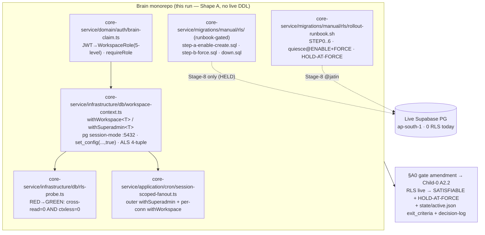

# Architecture Plan — feat-tenancy-rls-brain-native

> Filled by Aryan (Architect) in Stage 2.
> Validates against [schemas/architecture.schema.json](../schemas/architecture.schema.json).
> Brain-native rebuild of withdrawn legacy Child-1 (`feat-tenancy-auth-rls-hardening`). The universal C5 hard gate of the binding 7-child strangler-fig migration epic.

| Field | Value |
|-------|-------|
| **req_id** | `feat-tenancy-rls-brain-native` |
| **Actor** | architect (Aryan) |
| **Timestamp** | 2026-05-24T14:20:00Z |
| **Lane** | high-stakes |
| **Paradigm** | `sql` (SQL/DDL + connection-handling) |
| **Parent epic** | `chore-migrate-legacy-to-brain` |
| **Deliverable boundary** | **Shape A** (build-the-primitive-and-DDL-now, defer-the-FORCE-flip) — bound here, headline §A0 amendment below |

---

## 1. Context

The Brain monorepo is scaffolding only — `apps/core-service/src/{domain,application,infrastructure,interfaces,bootstrap}` are `.gitkeep` stubs (verified: `apps/core-service/src/*/.gitkeep`); there is **no Prisma schema, no generated client, no running service** against the live shared Supabase Postgres (`find . -name schema.prisma` → 0 hits in Brain; legacy only). The one real tenant-isolation implementation lived inside the legacy Express/Prisma backend and was withdrawn 2026-05-24 ("legacy = reference-only"). Consequently the live shared Postgres (ap-south-1) still has **0 RLS across 44 workspace-scoped tables / 66 `workspaceId` refs** — an OPEN P0 cross-tenant leak (top item in `pending-founder-attention.md`).

Per the binding Child-0 architecture (`spike-legacy-migration-architecture/06-architecture-plan.md` §A2.1), **RLS-live + cron-session-scoped is the universal C5 hard entry gate** every later child (money → connectors → metric/OLAP → AI → frontend → decommission) depends on. This slice builds that primitive **Brain-native** — properly, modularly, to the DDD standard — mining the proven legacy logic (fail-closed policy shapes, the 44-table FK-scope classification, the probe GREEN predicate, cron scoping, the 6-step rollout ceremony) **without carrying a line of legacy code**.

The load-bearing tension Stage 1 surfaced and bound: "Brain-native RLS" hides two things — (1) the **infrastructure artifacts** (session-context primitive, RLS DDL, probe, runbook) which genuinely should be Brain code now; and (2) the **runtime consumer** that must hold `app.workspace_id` on every connection once RLS is FORCE'd. Because RLS policies are fail-closed by design, the moment RLS goes FORCE-on, *any* consumer that does not set workspace context gets **0 rows → production outage**, not a leak. The only thing hitting the live DB today is the running legacy Express deployment; there is no Brain runtime. Therefore the honest deliverable boundary is **Shape A: author the primitive + DDL + probe + runbook as Brain code, and DEFER the live FORCE flip to Stage 8** (runbook-gated). The C5 gate becomes **"satisfiable Brain-native"** — which is exactly the requirement's own success metric. Shape B (a context-injecting facade shim into the live legacy app) is OUT OF SCOPE: it requires standing up the first Brain runtime against the live DB (scope inflation) and either edits legacy or proxies — colliding with CF-BN-NOLEGACY-1.

This plan is short by design (the analysis is *inherited* and *proven* — re-derivation is forbidden by the synthesis). The novel work is: (a) the headline gate-language amendment, (b) re-expressing the primitive Brain-native against a `pg`-driven session-mode client (no Prisma exists yet), and (c) a LOCAL pgbouncer-txn-pool integration test the legacy child never had.

---

## 0. ★ HEADLINE DELIVERABLE — CF-BN-GATE-BOUNDARY-1 amendment (the act Rohan signs at Stage 6)

> This is the §A0 of the plan because it is the binding CRITICAL. Stage 3 Track G applies it; Stage 6 (Rohan) signs it; this run mirrors a non-blocking heads-up to the Founder (already done at Stage 1 synthesis).

### A0.1 — The exact amendment to Child-0 `06-architecture-plan.md`

**File to edit (Track G, @vikram):** `.engineering-os/runs/2026-05-24T00-58-39Z__a49c05__spike-legacy-migration-architecture__rishabhporwal/06-architecture-plan.md`

**(a) §A2.2 sequence table — Child-1 row, "Exit / PARITY criterion" column (currently line 501):**

- **FROM:** `RLS live + verified on all workspace-scoped tables; cron paths session-scoped; **zero behavior change to live API** (same responses)`
- **TO:** `RLS **satisfiable Brain-native** — session-context primitive + RLS DDL (ENABLE+CREATE fail-closed + FORCE step + symmetric down) + CF-SEC-1 probe + 6-step rollout runbook all present as Brain code (core-service), unit + LOCAL-pgbouncer-integration verified; cron paths session-scoped Brain-native. **FORCE execution on the live DB is DEFERRED to Stage-8 per the named HOLD-AT-FORCE state (A0.2); the gate column G1/G2 reads SATISFIABLE (not LIVE) at end of this child.** Zero behavior change to live API (no live DDL applied this run → legacy keeps working unchanged).`

**(b) §A2.2 sequence table — Child-1 "RLS+session gate (G1+G2)" column (currently "ESTABLISHES the gate (G1+G2 go GREEN here)"):**

- **TO:** `ESTABLISHES the gate Brain-native (G1+G2 become SATISFIABLE here; they go LIVE at the Stage-8 FORCE ceremony under the HOLD-AT-FORCE state, gated by Child-3 residual-writer conversion — see A0.2)`

**(c) §A2.2 sequence table — Child-2 row, "Entry criterion" column (currently line 502: "RLS live; ROUND_HALF_EVEN rule agreed"):**

- **TO:** `RLS **satisfiable Brain-native AND the C5 FORCE-readiness pre-conditions met** (primitive + DDL + probe + runbook present; Child-3 residual no-context writers converted; complete bare-write grep GREEN) — i.e. the gate is FORCE-ready, even if the Stage-8 FORCE ceremony for a given table set has not yet executed; ROUND_HALF_EVEN rule agreed.`

  > Rationale for (c): Child-2 (money) does **shadow compute**, it does not itself need RLS *forced* live — it needs the isolation contract to *exist and be trustworthy* and the runtime path to be context-aware. Reconciling the entry to "satisfiable + FORCE-ready" (not "live") removes the ghost criterion the persona's CRITICAL identified, without weakening isolation: the FORCE ceremony still gates any child that writes to the live DB through the converted runtime.

**(d) Add a note under §A2.1 (universal gate definition):**

- `**C5 gate states (added by feat-tenancy-rls-brain-native, 2026-05-24):** the gate has THREE machine-checkable states: NOT-SATISFIABLE (no Brain primitive/DDL/probe exists) → SATISFIABLE (Brain code present + LOCAL-verified; this is the exit state of Child-1) → LIVE/FORCED (step-b-force.sql applied on the live DB at Stage-8 under HOLD-AT-FORCE, gated by Child-3 residual-writer conversion + complete bare-write grep GREEN). Downstream dependency checks read SATISFIABLE for Child-2 entry and LIVE only for any child that writes to the live DB through the converted runtime.`

### A0.2 — The named **HOLD-AT-FORCE** state (recorded in the binding architecture)

**State name: `HOLD-AT-FORCE` (C5 — universal, applies to the live FORCE ceremony of any child).**

- **Definition:** the live DB rollout runs STEP 0–4 only (region-assert both URLs → quiesce-crons → context-code verify → ENABLE+CREATE fail-closed policy → CF-SEC-1 probe GREEN). It **HOLDS before STEP 5 (`step-b-force.sql` / FORCE per table)**. FORCE is not executed until ALL of: (i) a context-aware Brain runtime is the live consumer for the FORCE'd table set, OR the live consumer is proven 100% service-role; (ii) Child-3 converts the residual no-context writers (the O7 carry-forward — see §15 R-O7); (iii) a **complete** bare-write grep returns ZERO hits; (iv) the FK-scope live EXPLAIN gate passes per table.
- **Why named in the architecture (not informal):** the legacy sibling's Stage-8 was held at FORCE by an explicit Founder directive (`feat-tenancy-auth-rls-hardening` decision-log 2026-05-24T09:25:28Z: "HOLD at STEP-5 FORCE"). The Founder has already ratified this exact discipline. Naming it at the gate level makes the C5 dependency check machine-honest for Children 2–7 instead of enforcing against a ghost "RLS live" criterion.
- **Reversibility:** because FORCE is never applied this run, there is nothing to roll back on the live DB this run (legacy is untouched). The reversibility tree for the eventual FORCE is `NO FORCE → DISABLE → DROP POLICY` (DDL, in `down.sql`), carried in the runbook.

### A0.3 — Reflect in `state/active.json` (Track G, @vikram — same commit as the amendment)

Add to this req's entry an explicit `exit_criteria` block so the downstream pre-flight check reads the real criterion:
```json
"exit_criteria": {
  "c5_gate_state": "SATISFIABLE",
  "deliverables_present": ["session-context primitive (core-service infra)","RLS DDL (manual/rls, runbook-gated)","CF-SEC-1 probe","6-step rollout runbook","auth/role-claim contract"],
  "force_deferred_to": "stage-8",
  "named_hold_state": "HOLD-AT-FORCE (Child-0 A0.2; gated on Child-3 residual-writer conversion + complete bare-write grep GREEN + FK-EXPLAIN)",
  "force_NOT_run_this_child": true
}
```

### A0.4 — Decision-log entry (Track G emits; Rohan countersigns at Stage 6)

A `type: "architecture-gate-amendment"` row in `.engineering-os/memory/decision-log/2026/05/2026-05-24.jsonl` citing the original gate language (line 501/502), the new language, the reason (no Brain runtime → FORCE-without-runtime = outage), and the Founder-visibility pointer (`pending-founder-attention.md`). This is the append-only Decision Log act; it is the artifact Rohan signs at Stage 6.

---

## 2. Proposed solution

Build the C5-gate-establishing isolation unit **Brain-native in `core-service`** (Identity/Tenancy → `core`, per Child-0 A1 row 186), in three layers + the gate amendment:

1. **Session-context primitive (the Single Primitive).** One module — `apps/core-service/src/infrastructure/db/workspace-context.ts` — owning a session-mode (`DIRECT_URL` :5432) connection and exporting `withWorkspace<T>()` / `withSuperadmin<T>()`. Inside an explicit transaction it issues `set_config('app.workspace_id', $1, true)` (tx-local, bind-param, injection-safe) as the first statement, runs the caller's `fn(tx)`, and the context is scrubbed at commit/rollback. **Departure from legacy (justified):** legacy `rls-prisma.ts` wrapped a generated PrismaClient; the Brain monorepo has **no Prisma schema/client yet**, so the primitive is built against the `pg` driver's pool + a thin transaction handle (a `PoolClient` inside `BEGIN…COMMIT`). The exported signature is identical so a future Brain runtime (or a Prisma-backed adapter) consumes the same contract — Single-Primitive Rule holds at the interface, not the ORM. The correlation 4-tuple (CF-SEC-5) rides an `AsyncLocalStorage`, re-expressed Brain-native.

2. **RLS DDL — runbook-gated, manual.** `apps/core-service/migrations/manual/rls/` (NOT a migration-runner path — structurally un-applicable, CF-BN-DDL-GATING-1): `step-a-enable-create.sql` (ENABLE + CREATE fail-closed `ws_isolation` policy on all 44 tables, with the 4 FK-scope shapes), `step-b-force.sql` (FORCE per table — Stage-8 only), `down.sql` (symmetric `NO FORCE → DISABLE → DROP POLICY`). Policy shapes re-expressed verbatim-equivalent from the proven legacy DDL (mined, not imported). A `README.md` in that dir marks the whole tree HOLD-AT-FORCE / Stage-8-only.

3. **Probe + cron-scoping + auth-claim.** The CF-SEC-1 fail-closed probe (RED-by-default → GREEN on cross-read=0 AND context-less=0 per table; Decision-Log write under `withSuperadmin`), the cron fan-out re-expressed as Brain-native session-scoped enumeration (outer `withSuperadmin` + per-connection `withWorkspace` + per-connection try/catch + proof-of-attempt), and the auth/role-claim contract (Supabase JWT → Brain 5-level `WorkspaceRole`; `requireRole` on mutations) — all claim-MAPPING, no new RBAC.

4. **The 6-step rollout runbook + the gate amendment (§A0).** The runbook is the Stage-8 deploy artifact (authored this run, executed by @jatin at Stage 8): STEP 0 region-assert both URLs → STEP 1 quiesce-crons → STEP 2 context-code verify → STEP 3 ENABLE+CREATE → STEP 4 probe GREEN → STEP 5 FORCE (HELD) → STEP 6 byte-identical smoke. Quiesce applies at **ENABLE and FORCE** (CF-C1-ROLLOUT-ORDER-1 sharpened).

**What is GREEN at end of this run vs deferred (the falsifiable boundary):** GREEN = primitive + DDL + probe + runbook + auth-claim present as Brain code; unit tests + LOCAL pgbouncer-txn-pool integration test pass; gate amendment + HOLD-AT-FORCE state recorded; `state/active.json` exit_criteria reflects SATISFIABLE. DEFERRED to Stage-8 = live region-assert, live ENABLE/FORCE, live probe run, FK-EXPLAIN gate, byte-identical live smoke, Child-3 residual-writer conversion.

### Diagram



---

## 3. Paradigm

**Declared paradigm:** `sql`  *(SQL/DDL + connection-handling)*

**Justification (≥20 words):** Pure deterministic data-layer work — RLS DDL (ENABLE/CREATE/FORCE fail-closed policies), tx-local session-context binding via `set_config` bind-param, FK-scope classification, cron session-scoping, and JWT→role claim mapping. No patterns-without-rules (no ML), no natural-language boundary (no LLM), no metric/money/numeric-parity dimension (Maya not needed). The cheapest correct paradigm; matches the legacy child and the Child-0 + Stage-1 recommendation exactly. Cost-routing audit clean — zero LLM tokens.

> Reminder: SQL > ML > small_llm >> frontier_llm.

---

## 4. API design

This slice is data-layer + a library primitive; it adds **no new public network surface** this run (no Brain runtime exists). The auth-claim is an internal library contract, not an endpoint.

### gRPC protos added or changed
- **None.** (The primitive is an in-process library; future services import it. No proto contract changes; the OLTP store contract is unchanged — only RLS policies are added at Stage-8.)

### tRPC procedures added or changed
- **None this run.** (No Brain runtime/router exists yet. `requireRole` is the guard a future router will call; it is shipped as a pure function with tests, not wired into a route.)

### MCP tools added or changed
- **None.**

### REST endpoints added or changed
- **None this run.** The legacy `/api/cron/*` endpoints remain legacy-owned (reference-only). The Brain-native cron-fanout module is a library function (consumed by a future ingestion/core runtime), not a live endpoint this run.

### Breaking changes
- **None.** No public surface changes. The live legacy API is byte-identical (no DDL applied → CF-C1-ZERO-BEHAVIOR-1 holds trivially this run).

### Versioning strategy
No public-surface version bump. The `workspace-context` primitive's exported interface (`withWorkspace<T>` / `withSuperadmin<T>`) is bound here as a **v1 internal contract** that Children 3–7 import unchanged; any future change to that signature is a CTOA-gated internal-contract change. The RLS policy name (`ws_isolation`) and the GUC names (`app.workspace_id`, `app.is_superadmin`) are bound as stable identifiers consumed by the probe, the runbook, and every future consumer.

---

## 5. Data model changes

### Postgres
- **Tables added:** none.
- **Tables changed:** none in *schema*. RLS is added to 44 existing workspace-scoped tables — but **as runbook-gated manual DDL, NOT applied this run** (CF-BN-DDL-GATING-1). No column/index/type change ships to the live DB this run.
- **Indexes:** none this run. (FK-scope hot-table `workspace_id` denorm + `CREATE INDEX CONCURRENTLY` is **design-only** here — the live backfill is deferred per the requirement non-goal; the runbook's FK-EXPLAIN gate decides per table at Stage-8.)
- **RLS policies:** authored (not applied). Four fail-closed shapes, all `(… = current_setting('app.workspace_id', true)::uuid)`:
  1. **Direct (21 tables)** — `USING/WITH CHECK (workspace_id = current_setting('app.workspace_id',true)::uuid)`.
  2. **connId-FK 1-hop (~18 tables)** — `connection_id IN (SELECT id FROM <conn_table> WHERE workspace_id = current_setting(...)::uuid)`.
  3. **orderId-FK 2-hop (`woocommerce_line_items`, 1 table)** — nested subquery through `woocommerce_orders` → `woocommerce_connections`.
  4. **Dual-policy / global (4 tables: `audit_logs`, `notifications` nullable-ws; `system_settings` superadmin-only)** — ws-scoped policy + `superadmin_system_rows` policy `(current_setting('app.is_superadmin',true) = 'true')` for null/system rows (CF-C1-AUDITLOG-1.a). **System-workspace sentinel** reserved for null-ws system rows per Child-0 A1.4.

  **BANNED shapes (CF-C1-RLS-DEFAULT-1.a, static-grep gate):** `OR … IS NULL`, `COALESCE(...)`, `USING(true)`, session-level `SET`, bare-singleton RLS query. Fail-closed = 0 rows when context unset.

### ClickHouse
- **Tables added:** none.
- **Materialized views added:** none. (OLAP is Child-4; not in scope.)

### Migration plan
*(Step-by-step; reversible; reviewed by Shreya (Stage 4) + Tanvi (Stage 5).)*

1. **This run applies NO migration to any DB.** The RLS DDL is authored into `apps/core-service/migrations/manual/rls/` — a path no migration runner scans (CF-BN-DDL-GATING-1). A `README.md` marks it Stage-8/HOLD-AT-FORCE-only.
2. The **reversible** live sequence is fully specified in `step-a-enable-create.sql` (additive: ENABLE+CREATE; owner still bypasses), `step-b-force.sql` (FORCE; the structural moment — Stage-8 only, HELD), and `down.sql` (`ALTER TABLE … NO FORCE; DISABLE; DROP POLICY` — symmetric, fully reversible).
3. **Reversibility proof:** at end of this run the live DB is unchanged → trivially reversible (nothing applied). The eventual live application is reversible via `down.sql` (DDL rollback, not a feature flag — FORCE rollback is a DDL per the sharpened CF-C1-ROLLOUT-ORDER-1).
4. **FK-scope live EXPLAIN gate** is documented as a Stage-8 pre-step (runbook), not run this run.

---

## 6. Event model

- **Topics added:** none.
- **Topics changed:** none.
- **Partition key:** `workspace_id` (always) — N/A this run (no Kafka path; ingestion is Child-3). The cron-fanout module preserves the per-workspace boundary so the eventual Kafka envelope (Child-3) inherits a clean workspace scope.
- **Exactly-once strategy:** N/A this run.

---

## 7. Single-Primitive sweep

> The session-context primitive is the *new* primitive this slice introduces and binds. It is built **once** (`workspace-context.ts`) and consumed N times (every scoped read/write, the probe, the cron fan-out, the future Brain runtime). Any per-call-site re-implementation = violation, flagged at Stage 6.

| Primitive | Status |
|-----------|--------|
| Audience Builder | reused (untouched — not in scope) |
| Consent | reused (untouched; CF-SEC-3.HARD carried, not triggered this run) |
| Decision Log | **extended** — the CF-SEC-1 probe writes its RED→GREEN transition to the append-only audit/Decision-Log under `withSuperadmin` (system-workspace sentinel for null-ws rows). No fork. |
| Notifications | reused (gets dual-policy RLS shape authored, not applied) |
| Attribution | reused (untouched) |
| Identity | **extended** — the auth/role-claim contract (`brain-claim.ts`) maps Supabase JWT → Brain 5-level WorkspaceRole; `requireRole` is the single guard. Claim-mapping, not a new RBAC model. |
| **Session-context (NEW, bound here)** | **introduced** — `withWorkspace<T>` / `withSuperadmin<T>` in `core-service/infrastructure/db/workspace-context.ts`. Single Primitive; bound path + signature (CF-BN-OWNER-1). Justification: there is no existing Brain tenancy primitive; it cannot be an extension of anything (the monorepo is scaffolding). One sentence per the rule: *every workspace-scoped DB access in Brain — now and in Children 3–7 — goes through this one module.* |

---

## 8. Multi-tenancy enforcement (4 layers)

- [x] **JWT** — claim validation: `brain-claim.ts` maps the already-verified Supabase JWT (`sub`) + `WorkspaceMember.role` → `BrainClaim` with `workspaceRoleLevel`; `requireRole(claim, minRole)` guards mutations. (The JWKS *verify* is reused from legacy `auth.ts` design — re-expressed Brain-native; no re-login storm.)
- [x] **Service-side** — `withWorkspace(workspaceId, fn)` asserts the workspaceId is a valid UUID (defense-in-depth shape guard) and binds it as the *only* path to scoped data; the claim's `workspaceId` is the source. A future router asserts `request.workspace_id == claim.workspaceId` before calling `withWorkspace`.
- [x] **DB RLS** — Postgres RLS authored on all 44 workspace-scoped tables (fail-closed; applied at Stage-8). ClickHouse query-gateway: N/A this run (Child-4).
- [x] **Kafka envelope** — N/A this run (Child-3). The cron-fanout preserves per-workspace scope so the eventual envelope asserts a clean `workspace_id`.

---

## 9. Observability plan

> Proportionate to the slice. No Brain runtime exists, so "runtime metrics/dashboards" would be over-build. The observability that ships is the **probe verdict** (the falsifiable isolation signal) + the cron **proof-of-attempt** logs + the runbook's machine-asserted go/no-go.

| Pillar | Items |
|--------|-------|
| **Metrics** | `rls_probe_verdict` gauge per table (RED=0/GREEN=1), RED-by-default — emitted by the probe at Stage-8. No always-on runtime metric this run (no runtime). |
| **Logs** | CF-SEC-5 correlation 4-tuple (`requestId`/`traceId`/`workspaceId`/`userId`) on every primitive invocation + every cron per-connection `cron.sync.attempted` proof-of-attempt log (ok/failed) + `silent_skip` alarm log if `attempted < totalConnected`. |
| **Traces** | The ALS-carried 4-tuple is the trace seed for the future Brain runtime; bound now, consumed later. No tracer wired this run. |
| **Alarms** | (Stage-8) probe verdict != GREEN → HALT runbook (no FORCE). `cron.sync.alarm.silent_skip`. No live alarm wired this run. |
| **Dashboards** | None this run (no runtime to dashboard). The probe's `formatProbeResult` stdout table is the human-readable artifact the runbook prints. |

---

## 10. Test strategy

> Positive AND negative per the code-coverage standard. The headline addition vs the legacy child is the **LOCAL pgbouncer-txn-pool integration test** (CF-C1-POOL-1.a sharpened) so Stage-5 QA is completable without live-DB access.

| Layer | Plan |
|-------|------|
| **Unit** | `withWorkspace`/`withSuperadmin`: (+) sets `app.workspace_id` as first stmt via bind-param; (+) clears `is_superadmin`; (+) runs `fn(tx)` inside the tx; (−) rejects non-UUID workspaceId; (−) rejects empty/non-string; (−) throws if `DIRECT_URL` unset. `requireRole`/`assembleClaim`: (+) OWNER≥ADMIN passes; (−) VIEWER<ADMIN throws 403; (+) level ordering exact; (−) unknown role rejected. Probe: (+) GREEN when cross=0 AND ctxless=0; (−) RED when cross>0; (−) RED when ctxless>0; (−) RED on query error. |
| **Integration** | **★ LOCAL pgbouncer-txn-pool test (CF-C1-POOL-1.a, mandatory Stage-3 deliverable + Stage-5 QA gate):** spin a local Postgres + pgbouncer in **transaction-pool mode** (docker-compose, `:6543` pooled + `:5432` session), seed ALPHA/BETA workspaces with non-overlapping rows, apply `step-a-enable-create.sql` + `step-b-force.sql` to the *local* DB. Assert: (a) **no context leak across pooled connections** — interleaved concurrent `withWorkspace(ALPHA)` / `withWorkspace(BETA)` transactions each see ONLY their own rows; (b) **txn-end clears context** — a connection returned to the pool and reused under a different workspace does not carry the prior `app.workspace_id` (issue a context-less query post-tx → 0 rows under FORCE); (c) **session-level SET would leak** (negative control: prove a `SET` outside a tx leaks across the pool — documenting *why* the primitive bans it). Run the full probe against the local FORCE'd DB → GREEN. |
| **Contract** | Static SQL banned-pattern grep (CF-C1-RLS-DEFAULT-1.a): assert the DDL contains zero `OR.*IS NULL`, `COALESCE`, `USING (true)`, `SET ` (session). Assert every workspace-scoped table from the 44-table list has exactly one `ws_isolation` policy (+ dual policy where required). No proto/tRPC contract this run. |
| **E2E (web)** | N/A (no Brain web surface this run). |
| **E2E (mobile)** | N/A. |
| **Load** | N/A this run (Phase 0–1; no runtime). FK-scope EXPLAIN cost is a Stage-8 per-table gate, documented in the runbook. |
| **Real-network smoke** | **Deferred to Stage-8** (byte-identical live API corpus smoke + live probe + region-assert both URLs) — this is the load-bearing Shape-A deferral; the runbook STEP 0 + STEP 6 are the smoke. **The LOCAL pgbouncer integration test is the Stage-3/5 substitute** that closes the legacy child's "tested-only-in-isolation" gap. Noted explicitly so Stage-5 PASS does not require live-DB access. |
| **Mutation testing targets** | `requireRole` (the `>=` comparison — flip to `>` must fail a test); the fail-closed policy predicate logic in the probe's verdict computation (flip `&&` to `||` must fail). |

---

## 11. Security considerations (forwarded to Shreya)

- **Fail-closed is the whole point.** Every policy is `(col = current_setting('app.workspace_id', true)::uuid)` → 0 rows when unset. Shreya should grep-verify the banned shapes are absent (CF-C1-RLS-DEFAULT-1.a) and that no `USING(true)` / `OR … IS NULL` / `COALESCE` slipped in.
- **Injection-safe context.** `set_config('app.workspace_id', $1, true)` uses a bind parameter; `SET LOCAL` (string-interpolated) is banned. The UUID shape guard in `withWorkspace` is defense-in-depth (the workspaceId is sourced from a verified claim, but a malformed value should fail at the app layer, not deep in a tx).
- **`withSuperadmin` is the privilege-escalation surface.** It must be statically grep-gated to the cron outer enumeration + the future erasure path only. Any other call-site = a finding. Shreya owns this gate at Stage 4.
- **CF-SEC-3.HARD carried, NOT triggered this run.** No live PII processing occurs (probe/backfill are Stage-8). The tripwire **re-arms before any third-party-brand PII** is processed. Founder is legal owner of Sugandh Lok (the only in-scope brand) — resolved on record.
- **CF-RES-1.a** — region `ap-south-1` asserted on BOTH `:6543` + `:5432` at Stage-8 runbook STEP 0 (Postgres-level, never DNS-trusted; `.env.bak.singapore` proves a move happened). Not run this run (no live DDL).
- **Audit/Decision-Log immutability** — probe RED→GREEN transitions are append-only writes under `withSuperadmin`; null-ws system rows use the reserved system-workspace sentinel (CF-C1-AUDITLOG-1.a), never co-mingled into a tenant's log.
- **CF-BN-NOLEGACY-1** — zero legacy code imported/edited/committed. Any diff touching `legacy project/` is a drift bounce.

---

## 12. India context

- **DPDP §8(6) cross-tenant isolation** is the PRIMARY lens — this slice closes the live 0-RLS cross-tenant-leak P0 (Brain-native, FORCE deferred). Residency `ap-south-1` confirmed; asserted at Stage-8.
- RTO/COD/GST/pincode/courier data is workspace-scoped data this RLS protects downstream — no isolation = cross-brand leakage of India-commerce data. No money/GST handling in this slice (Child-2); minor-units seam not violated (no money types introduced).
- No outbound channel → no DLT/NCPR/DND/calling-hours surface.
- Region adapter unaffected — RLS is region-agnostic (the GUC + policy shape are identical across regions); the seam does not block ae/sa later.

---

## 13. Region adapter impact

**None.** RLS policies and the session-context primitive are region-agnostic (`workspace_id` is the tenant key in every region; the GUC `app.workspace_id` is identical ae/sa/in). The only region-varying concern is *where the DB physically lives* — handled by CF-RES-1.a (assert `ap-south-1`), not by a RegionAdapter branch. The primitive's interface does not change per region; a future region's DB is a different `DIRECT_URL`, not a different primitive. No RegionAdapter method added or stubbed.

---

## 14. Cost estimate

| Item | Value |
|------|-------|
| **Expected daily volume** | 0 incremental live volume this run (no live DDL, no runtime). At Stage-8: RLS adds a per-query policy-predicate cost (subquery for FK tables) — bounded by the FK-EXPLAIN gate (hot tables → `workspace_id` denorm). |
| **LLM tokens / day** | **0** (paradigm = sql; no LLM path). |
| **₹ / month at expected load** | **₹0 incremental** this run. At Stage-8: no new infra (RLS is a property of the existing Postgres); marginal CPU for policy evaluation, absorbed by the existing Supabase instance. The second session-mode client (`:5432`) is capped at `connection_limit=10` to stay under the plan ceiling — no new managed service. |

---

## 15. Risks

| Risk | Severity | Mitigation |
|------|----------|------------|
| **R-GHOST: ship Shape A without amending the gate** → Child-2 pre-flight reads "RLS live = false" and blocks on a ghost criterion (the persona CRITICAL) | **CRITICAL** | §A0 headline amendment (Track G) — decision-logged, reflected in `state/active.json` exit_criteria, signed by Rohan at Stage 6. This is the must-fix; folded into the acceptance contract. |
| **R-O7: residual no-context writers fail-CLOSED post-FORCE (the legacy QA-bounce class, F1)** — inner sync libs / backfill / `discoverChannels` writing via a bare (non-context) client return 0 rows / WITH-CHECK-reject once FORCE'd | **HIGH** | This child ships the *primitive* + a static **bare-write grep** as a runbook STEP-5 prerequisite (must be GREEN before FORCE). The actual conversion of those writers is **Child-3** (they live in connector sync paths). The HOLD-AT-FORCE state (A0.2) explicitly gates FORCE on this conversion + a *complete* grep (the legacy grep was DEFECTIVE — excluded `backfill`/`discoverChannels`; the Brain grep must NOT `grep -v` those). Folded into the runbook + the acceptance contract as a `must-fix` note. |
| **R-POOL: context leaks across pgbouncer txn-pool** if `set_config(...,true)` is mis-scoped or session-SET creeps in | **HIGH** | Session-mode `:5432` client + tx-local `set_config(...,true)` + explicit `$transaction`; session-SET banned (grep gate). The **LOCAL pgbouncer integration test** (§10) proves no-leak + clears, at Stage-3 — closing the legacy "untestable-in-isolation" gap. |
| **R-ENABLE: even ENABLE-without-FORCE gates `authenticated`-role reads** → partial outage between ENABLE and FORCE | **HIGH** | RLS DDL is runbook-gated/manual (not applied this run, CF-BN-DDL-GATING-1) AND quiesce-crons applies at **ENABLE and FORCE** (CF-C1-ROLLOUT-ORDER-1 sharpened) AND the runbook documents that ENABLE is not a safe partial state for non-service-role paths (requires the role-audit pre-step). |
| **R-DDLDRIFT: a stray migration runner applies the RLS DDL early** | MEDIUM | `migrations/manual/rls/` is a path NO runner scans; README marks it Stage-8-only; no Prisma schema exists in Brain to auto-apply it. |
| **R-FK-COST: FK-transitive subquery policy is slow on hot tables** (`shopify_orders`, `shopify_line_items`) | MEDIUM | Default JOIN/subquery policy + per-table live `EXPLAIN(ANALYZE,BUFFERS)` decision-gate at Stage-8; hot tables escalate to `workspace_id` denorm (additive col + chunked-5000 online backfill + `CREATE INDEX CONCURRENTLY` + IS-NULL=0 verify) — **design-only this run**, live backfill deferred. |

---

## 16. Alternatives considered (≥1)

| Alternative | Why rejected |
|-------------|--------------|
| **Shape B — context-injecting facade/ACL shim into the live legacy app so RLS can FORCE now** | Rejected (binding). The only mechanism that sets context without editing legacy is a Brain-resident network-boundary shim = the first Brain runtime against the live DB = scope inflation beyond a child-sized slice; and a package can't be `npm install`'d into legacy without editing `legacy project/` (violates CF-BN-NOLEGACY-1). Confirmed by the persona + synthesis (CF-BN-SHAPE-A-1). |
| **Wrap a generated Prisma client (mirror legacy `rls-prisma.ts` 1:1)** | Rejected. The Brain monorepo has no Prisma schema/client (`find schema.prisma` → 0). Introducing Prisma to host a one-file primitive is a premature heavy dependency (over-build) and pre-empts the Child-3/4 ORM decision. The primitive is built against the `pg` driver with the *identical exported signature*, so Single-Primitive Rule holds at the interface; a Prisma adapter can back it later without changing consumers. |
| **Apply ENABLE+CREATE to the live DB now (FORCE deferred), treat ENABLE as a safe partial** | Rejected. ENABLE alone gates `authenticated`-role reads → partial outage (persona Concern 3). With no Brain runtime + a live legacy consumer, even the additive step is hazardous; runbook-gated/manual DDL (apply nothing this run) is the only safe boundary. |
| **Soft-read the success metric ("satisfiable") as equivalent to "RLS live" without a formal amendment** | Rejected. The gate is defined in the binding Child-0 spike (status `done`); a child cannot silently amend a binding gate by restating it softer. A decision-logged amendment + named hold state is the only honest mechanism (the persona CRITICAL). |

---

## 17. Tracks (work decomposition for Stage 3)

> **Owner:** all build tracks → **@vikram** (backend-developer; SQL/DDL + connection-handling, no frontend, no intelligence). The Stage-8 runbook *execution* → **@jatin** (platform-devops) — the runbook *artifact* (Track F) is authored by @vikram this run. **No @ananya / @karan / @maya** (no web/mobile/AI/numeric-parity dimension). **No new service created** → no new deploy-pipeline track (core-service already scaffolded; the rollout runbook IS the deploy artifact for the live FORCE ceremony, executed at Stage-8). Tracks A→F can run **sequentially in one builder pass** (B depends on A; C/D/E depend on A; F depends on B+C+D; G is independent and can land first). G is the headline.

### Track G — Gate-language amendment + HOLD-AT-FORCE state  *(owner: @vikram)*  ★ HEADLINE / CRITICAL

Dependencies: none (land first; it is the binding act).

Tasks:
1. Edit Child-0 `06-architecture-plan.md` §A2.2 Child-1 exit row (line 501) + gate column → SATISFIABLE wording per §A0.1(a)(b).
2. Edit Child-0 §A2.2 Child-2 entry row (line 502) → "satisfiable + FORCE-ready" per §A0.1(c).
3. Add the C5 three-states note under §A2.1 per §A0.1(d) and the named HOLD-AT-FORCE state block per §A0.2.
4. Update `state/active.json` this-req entry with the `exit_criteria` block per §A0.3 (write `.bak.<ts>` first).
5. Append the `architecture-gate-amendment` decision-log row per §A0.4 (cite original line 501/502 language + reason + founder-visibility pointer).

### Track A — Session-context primitive (the Single Primitive)  *(owner: @vikram)*

Dependencies: none.

Tasks:
1. Create `apps/core-service/src/infrastructure/db/workspace-context.ts`: a `pg` Pool on `DIRECT_URL` (:5432, session-mode), `connection_limit=10`, throw if `DIRECT_URL` unset.
2. Add the `CorrelationContext` 4-tuple + `AsyncLocalStorage` store + `getCorrelation()` (CF-SEC-5).
3. Implement `withWorkspace<T>(workspaceId: string, fn: (tx: PoolClient) => Promise<T>, correlationOverride?): Promise<T>` — UUID guard; `BEGIN`; `set_config('app.workspace_id',$1,true)` (bind-param) + `set_config('app.is_superadmin','false',true)`; `fn(tx)`; `COMMIT`/`ROLLBACK` (context scrubbed at tx-end).
4. Implement `withSuperadmin<T>(fn, correlationOverride?)` — `set_config('app.is_superadmin','true',true)` + clear `app.workspace_id`; same tx discipline. Add the static-gate doc comment (banned outside cron fan-out + erasure).
5. Export the bound interface; add a barrel/index so Children 3–7 import one path. Write the package `README` line documenting the v1 internal contract + GUC names.

### Track B — RLS DDL (runbook-gated, manual)  *(owner: @vikram)*

Dependencies: A (GUC names) — can author in parallel.

Tasks:
1. Create `apps/core-service/migrations/manual/rls/README.md` marking the tree Stage-8/HOLD-AT-FORCE-only, un-applicable by any runner (CF-BN-DDL-GATING-1).
2. Author `step-a-enable-create.sql`: ENABLE + CREATE `ws_isolation` fail-closed policy for the 21 direct + ~18 connId-FK 1-hop + 1 orderId-FK 2-hop tables (mine the legacy shapes — re-express, do not import).
3. Author the dual-policy block: `audit_logs` + `notifications` (ws-scoped + `superadmin_system_rows`), `system_settings` (superadmin-only) — system-workspace sentinel note (CF-C1-AUDITLOG-1.a).
4. Author `step-b-force.sql`: `FORCE ROW LEVEL SECURITY` per table (44) — header marks STEP-5/Stage-8-only/HELD.
5. Author `down.sql`: symmetric `NO FORCE → DISABLE → DROP POLICY` for all 44 (DDL rollback).

### Track C — CF-SEC-1 fail-closed probe  *(owner: @vikram)*

Dependencies: A (consumes `withWorkspace`/`withSuperadmin`).

Tasks:
1. Create `apps/core-service/src/infrastructure/db/rls-probe.ts`: the 44-entry `PROBE_TABLES` typed list (direct/fk/fk2hop/dual) — re-express from the legacy probe's classification.
2. Implement `probeTable` (ALPHA count → BETA cross-read count → context-less count) + verdict `GREEN iff cross=0 AND ctxless=0` (RED-by-default).
3. Implement `runRlsProbe` (sequential per-table) + `formatProbeResult` (runbook stdout).
4. Implement `writeProbeDecisionLog` — append RED→GREEN transition under `withSuperadmin` (system-workspace sentinel for null-ws); failure must not suppress the verdict.

### Track D — Cron session-scoped fan-out (Brain-native)  *(owner: @vikram)*

Dependencies: A.

Tasks:
1. Create `apps/core-service/src/application/cron/session-scoped-fanout.ts`: the reusable fan-out shape — outer `withSuperadmin` enumeration (read all CONNECTED connections) + per-connection `withWorkspace(c.workspaceId)` execution.
2. Per-connection try/catch (one failure does not skip others) + `cron.sync.attempted` proof-of-attempt log (ok/failed) with the 4-tuple.
3. `silent_skip` alarm log when `attempted < totalConnected`. (Library function — not wired to a live endpoint this run; consumed by the future ingestion/core runtime + Child-3.)

### Track E — Auth / role-claim contract  *(owner: @vikram)*

Dependencies: none (pure functions).

Tasks:
1. Create `apps/core-service/src/domain/auth/brain-claim.ts`: `WORKSPACE_ROLE_LEVEL` (OWNER5…VIEWER1), `BrainClaim` interface (incl. 4-tuple), `requireRole`/`assertRole`, `assembleClaim` — re-express the legacy mapping (claim-MAPPING, no new RBAC).
2. Document the JWKS-verify reuse seam (the verified JWT `sub` → membership lookup → claim) as the source of `workspaceId` that flows into `withWorkspace`.

### Track F — Rollout runbook (Stage-8 artifact)  *(owner: @vikram authors; @jatin executes Stage-8)*

Dependencies: B, C, D.

Tasks:
1. Create `apps/core-service/migrations/manual/rls/rollout-runbook.sh`: `set -euo pipefail`, machine-asserted go/no-go per step.
2. STEP 0 region-assert both URLs (Postgres-level, same-instance cross-check); STEP 1 quiesce-crons (at ENABLE and FORCE); STEP 2 context-code verify.
3. STEP 3 ENABLE+CREATE via psql; STEP 4 run probe → GREEN-or-HALT; **STEP 5 FORCE — HELD** (gated on Child-3 conversion + complete bare-write grep GREEN + FK-EXPLAIN); STEP 6 byte-identical smoke + re-probe. Rollback section = `down.sql`.
4. Add the **complete bare-write grep** prerequisite (must NOT `grep -v` `backfill`/`discoverChannels` — correct the legacy DEFECTIVE grep, R-O7) + the FK-scope EXPLAIN gate as a STEP-3 pre-step.

### Track T — Tests (positive + negative + LOCAL pgbouncer integration)  *(owner: @vikram)*

Dependencies: A, B, C, E.

Tasks:
1. Unit tests for `withWorkspace`/`withSuperadmin` (+ context set/clear, − UUID/empty/unset-DIRECT_URL).
2. Unit tests for `requireRole`/`assembleClaim` (+ ordering, − insufficient role 403) + probe verdict (+ GREEN, − RED on cross/ctxless/error).
3. **LOCAL pgbouncer-txn-pool integration test** (docker-compose Postgres+pgbouncer txn-mode; apply step-a+step-b locally; assert no-leak across pooled conns, context-clears at tx-end, session-SET-leaks negative-control; full probe GREEN).
4. Static contract test: SQL banned-pattern grep (no `OR…IS NULL`/`COALESCE`/`USING(true)`/session-`SET`) + every 44 table has its `ws_isolation` (+ dual) policy.

### Over-engineering self-check (PASS/FAIL per item)

- [x] **PASS** — Plan length matches high-stakes band; long sections are *inherited* contract enumeration (CF-* + 44-table map) and the headline amendment, not new derivation. Re-derivation explicitly forbidden by synthesis.
- [x] **PASS** — Every file in §17 is required: primitive (A), DDL (B), probe (C, CF-SEC-1), cron (D, CF-C1-CRON-SCOPE-1.a), claim (E, 1b), runbook (F, CF-C1-ROLLOUT-ORDER-1), tests (T), amendment (G, CF-BN-GATE-BOUNDARY-1). No "while we're in there" files.
- [x] **PASS** — New deps: only the `pg` driver (justified — no Prisma exists; cheapest correct client) + a local-only docker-compose for the integration test (dev-dependency, not shipped). No premature Prisma.
- [x] **PASS** — No new abstraction for hypothetical future use; the one new primitive is mandated by the requirement and the Single-Primitive Rule, with a one-sentence justification (§7).
- [x] **PASS** — No observability beyond what the requirement names (probe verdict + cron proof-of-attempt + runbook asserts); no runtime dashboards (no runtime).
- [x] **PASS** — Tests target behavior at the isolation boundary + the pool-correctness gap; no trivial getter tests; proportionate (mutation targets are the two load-bearing comparisons).
- [x] **PASS** — No Child 2–7 scope pulled forward: FK-denorm backfill = design-only; live probe/region-assert/smoke = Stage-8; OLAP/money/connectors/AI all out.

---

## 18. CTO Advisor paradigm sign-off

> One-line confirmation from CTO Advisor that the paradigm choice is acceptable. Recorded in `cto-advisor.journal.md`.

**Confirmed by CTO Advisor:** `sql` paradigm confirmed at Stage-1 synthesis (`05-stage1-synthesis.md` line 13: "Paradigm: `sql` … confirmed; no Maya co-owner") and at intake (`02-cto-advisor-review.md` line 139). Aryan affirms — no refinement; pure SQL/DDL + connection-handling, zero LLM path. Rohan's binding Stage-6 sign-off covers the §A0 gate amendment (the architecture-governance act he countersigns).
