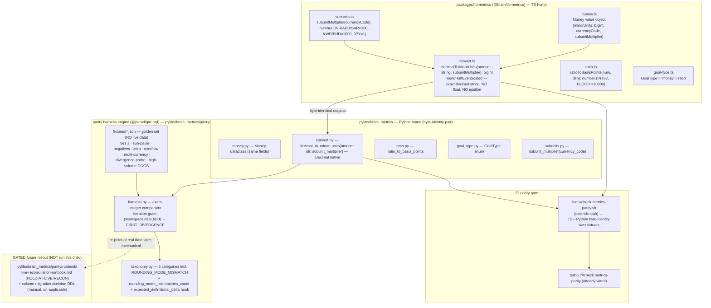

# Architecture Plan — feat-money-minor-units-parity (Child 2)

> Filled by Aryan (Architect) in Stage 2. Co-owner: Maya (intelligence-engineer) — numeric mechanics (§3, §5 conversion rules, §7 the harness engine, §10 fixtures, §17 Track M).
> Validates against [schemas/architecture.schema.json](../../../../.claude/plugins/cache/brain-engineering-os-marketplace/brain-engineering-os/0.26.0/schemas/architecture.schema.json).
> Binding. Stages 3–8 execute this plan; required deviation routes back to Aryan as a plan-amendment (never freelanced).

| Field | Value |
|-------|-------|
| **req_id** | `feat-money-minor-units-parity` |
| **Actor** | architect (Aryan); co-owner intelligence-engineer (Maya) on the numeric mechanics |
| **Parent epic** | `chore-migrate-legacy-to-brain` (Child 2 of 7 — the C7 money-parity gate) |
| **Timestamp** | 2026-05-24T14:05:00Z |
| **Lane** | high-stakes (trigger surfaces: `money`, `schema-proto`) |
| **Paradigm** | `sql` (deterministic value object + exact-integer comparator; zero float, zero LLM) |
| **Deliverable boundary** | **Shape A (design + primitive + golden-fixture harness; defer the live reconciliation/backfill to a gated Stage-8 ceremony)** — mirrors Child-1 HOLD-AT-FORCE. ZERO live legacy-DB read, ZERO MU served to users, ZERO backfill this child. |

---

## 1. Context

Legacy stores money as Postgres `Decimal` and computes metrics in TS IEEE-754 float (`compute-daily.ts`). Brain's locked invariant is **money = integer minor-units (BIGINT/Int64 + `currency_code`), never float/NUMERIC**. Before any Brain metric or OLAP materialization can land (Child 4), Brain needs (a) the canonical **Money value object** + the conversion/comparator homes, and (b) a **deterministic golden-fixture parity harness** that PROVES `SUM(legacy Decimal ×subunit_multiplier via ROUND_HALF_EVEN) == SUM(Brain BIGINT)` at zero tolerance — without touching live data. This is the **C7 money-parity gate** of the binding Child-0 architecture (`06-architecture-plan.md` §A5).

This is **Child 2** of the strangler-fig epic. Child 0 (architecture, binding) fixed the numeric rules; Child 1 (RLS, `readiness-complete`) established the HOLD-AT-FORCE rollout discipline this child mirrors for the future live column migration. The Stage-1 synthesis (`05-stage1-synthesis.md`) accepted a `money-finance-parity-realist:sonnet` persona with 1 CRITICAL + 2 HIGH + 2 MED + 1 LOW concern, folded into the binding **CF-C2-\*** contract. Two of those are genuine scope-refinements of the bound Child-0 design (NOT re-litigation): the **string-typed conversion API** (the Child-0 §A5.2 skeleton shipped the wrong `number` signature) and the **5th reconciliation category `ROUNDING_MODE_MISMATCH`** (the harness formula is invalid for division-derived Postgres intermediates). Both are bound here as Stage-2 deliverables.

**Why now:** every downstream money/metric number (the realized-GMV billing base, the P&L, the CM waterfall) depends on this type + harness. Retrofitting integer-money or a parity gate after metrics land is the brutal day-one-invariant retrofit Brain explicitly avoids. The `subunit_multiplier` field is added NOW precisely to avoid a future irreversible value-rewriting column migration at the ae/sa Phase-4 seam.

**What this child does NOT do (hard boundaries, CF-C2-NO-LIVE-1 / CF-C2-SCOPE-DEFER-1):** no live legacy-Postgres query; no MU value served to a user; no backfill of existing rows; no metric definitions / CM waterfall / OLAP materialization (Child 4); no Definitional-Delta Register population (Child 4 — only the `expected_definitional_delta` *hook* is present). `legacy project/` is reference-only: read for logic, import/edit/commit NOTHING (CF-BN-NOLEGACY-1, reaffirmed by Founder 2026-05-24). The legacy `Number(decimalString)*100` float pattern is the anti-pattern being CORRECTED, not ported.

---

## 2. Proposed solution

Ship the **canonical `Money` value object** + the **exact decimal-string conversion primitive** + the **comparator** ONCE in each language, at a single home per language, consumed N times (Single-Primitive Rule). In TypeScript: `packages/lib-metrics` (`@brain/lib-metrics`). In Python: `pylibs/brain_metrics`. The two are a byte-identity parity pair already declared as such in the existing scaffolding (`packages/lib-metrics/package.json` line 5, `pylibs/brain_metrics/pyproject.toml` line 5). The exact exported interface signatures are LOCKED in §4 below and bound as v1 internal contracts that Child 4 imports unchanged.

The conversion is **exact decimal-string arithmetic, never `Number(str) * 100`** (CF-C2-STRING-API-1, CRITICAL). `decimalToMinorUnits(amount: string, subunitMultiplier: number): bigint` parses the decimal string on `.`, scales by the subunit exponent using integer/BigInt math only, and applies `ROUND_HALF_EVEN` on the *exact* fractional remainder — no IEEE-754 multiply, no `1e-10` epsilon. TypeScript **rejects a non-string at the type level** (the parameter is typed `string`) and at runtime (a guard that throws on non-string). The Python side already receives a string (Prisma returns Decimal as string); it uses `decimal.Decimal(str)` natively. We do NOT add `decimal.js` — the conversion is a small audited inline pure function (see §16 for the rejection rationale); Single-Primitive: ONE implementation per language, used everywhere.

The **parity harness** is the `@paradigm: sql` exact-integer comparator from Child-0 M-A5-1, exercised this child against a **golden fixture set** (synthetic legacy-Decimal rows × known Brain-MU expected values) with ZERO live-DB read (CF-C2-GOLDEN-1). The harness emits the FIRST_DIVERGENCE report, now extended with a **5th category `ROUNDING_MODE_MISMATCH`** (CF-C2-RECON-TAXONOMY-1) and a `rounding_mode_mismatches_count` for division-derived fields (`miscExpensesProrated`, `cm3`, audited `cogs`/`totalAdSpend`), plus the unpopulated `expected_definitional_delta` hook for Child 4. The fixture set MUST include the divergence-proving probe (CF-C2-FIXTURE-PROOF-1) that PASSES on the string path and FAILS on the number path — without it, CI-green does not discharge the CRITICAL.

**CI** extends the existing `tools/check-metrics-parity.sh` (currently a stub) + the turbo `//#check:metrics-parity` task (already wired with the right inputs, turbo.json lines 56-63) into a real **TS↔Python byte-identity gate** (CF-QA-1.HARD): both languages run the same fixture vectors and their BIGINT outputs are compared byte-for-byte; a single divergence fails CI. The `goalType money|ratio` split (resolves Child-0 A1 #8) ships as a shared enum + the typed `goalValue` rule in both registries. The **live column migration/backfill is a GATED future rollout** — this child authors the runbook skeleton (mirroring Child-1's HOLD-AT-FORCE), it does NOT run it.

### Diagram



---

## 3. Paradigm

**Declared paradigm:** `sql`

**Justification (≥20 words):**

The Money value object is a deterministic value type; the conversion is pure exact-decimal arithmetic (`ROUND_HALF_EVEN ×subunit_multiplier`); the parity harness is an integer comparator with zero float arithmetic and zero LLM/ML (Child-0 line 685 already tags it `@paradigm: sql`). This is the canon's most important invariant in its purest form — LLMs never produce a money/metric number; money is integer minor-units, never float/NUMERIC. The string-path correction *reinforces* the paradigm: exact arithmetic, no epsilon, no floating point anywhere in the conversion or the harness. Any reach toward ML/LLM here would be a paradigm-bypass anti-pattern. Cost-routing audit clean — zero LLM tokens (§14). CTOA confirmed `sql` at Stage-1 intake and synthesis; Aryan affirms.

> SQL > ML > small_llm >> frontier_llm. No paradigm-3/4 surface exists on this child.

---

## 4. API design

This child adds shared cross-language **value-object contracts** (the `schema-proto` trigger surface), not network surfaces. No gRPC/tRPC/REST/MCP endpoint is added or changed this child (no runtime serves money yet — that is Child 4+). The "API" here is the **locked exported interface** of the two registry packages, bound as v1 internal contracts.

### gRPC protos added or changed
- **None this child.** The `Money` value object is a shared *library* contract now. NOTE for Child 4: when a proto-defined gRPC `Money` message is introduced, it MUST mirror this value object field-for-field (`int64 minor_units`, `string currency_code`, `int32 subunit_multiplier`). Recorded as a forward-binding note, not a deliverable here. (`protos/` exists but no money message is added this child.)

### tRPC procedures added or changed
- **None this child.**

### MCP tools added or changed
- **None this child.**

### REST endpoints added or changed
- **None this child.**

### Locked library interface contracts (v1 internal — Child 4 imports unchanged)

**TypeScript (`@brain/lib-metrics`):**
```typescript
// money.ts
export interface Money {
  readonly minorUnits: bigint;        // BIGINT/Int64 minor units (e.g. paise)
  readonly currencyCode: string;       // ISO 4217 alpha-3, e.g. "INR"
  readonly subunitMultiplier: number;  // 100 (INR/AED/SAR), 1000 (KWD/BHD), 1 (JPY)
}
export function makeMoney(minorUnits: bigint, currencyCode: string): Money; // resolves subunitMultiplier from currencyCode

// convert.ts  — CF-C2-STRING-API-1 (CRITICAL): string-in, exact decimal-string arithmetic, NO Number()*100, NO 1e-10 epsilon
export function decimalToMinorUnits(amount: string, subunitMultiplier: number): bigint;
//   - `amount` is a decimal STRING (e.g. Prisma Decimal serialization "1234.565").
//   - Rejects non-string at the TYPE level (param type) AND at runtime (throws TypeError on typeof !== "string").
//   - subunitMultiplier MUST be passed (read from the Money/currency), never hardcoded 100 (CF-C2-SUBUNIT-1).

// ratio.ts  — M-A5-Q1: ratio → INT32 FLOOR(ratio ×10000) basis-points; NOT ROUND_HALF_EVEN
export function ratioToBasisPoints(numerator: bigint, denominator: bigint): number; // INT32; denominator==0 → throws (caller guards)

// subunits.ts  — CF-C2-SUBUNIT-1
export function subunitMultiplier(currencyCode: string): number; // default 100; KWD/BHD=1000; JPY=1

// goal-type.ts  — resolves Child-0 A1 #8
export type GoalType = "money" | "ratio";
```

**Python (`brain_metrics`) — byte-identical pair:**
```python
# money.py
@dataclass(frozen=True)
class Money:
    minor_units: int
    currency_code: str
    subunit_multiplier: int

def make_money(minor_units: int, currency_code: str) -> Money: ...

# convert.py  — CF-C2-STRING-API-1
def decimal_to_minor_units(amount: str, subunit_multiplier: int) -> int:
    """amount MUST be a string (not float). Raises TypeError on non-str. Uses decimal.Decimal natively."""

# ratio.py
def ratio_to_basis_points(numerator: int, denominator: int) -> int: ...  # FLOOR(num*10000/den)

# subunits.py
def subunit_multiplier(currency_code: str) -> int: ...

# goal_type.py
from enum import Enum
class GoalType(str, Enum):
    MONEY = "money"
    RATIO = "ratio"
```

### Breaking changes
- **None.** These packages are currently stubs (`.gitkeep` + empty `__init__.py`); this is the first real content. Additive. No live consumer exists.

### Versioning strategy
*(See [`api-versioning-strategy`](../../../../.claude/plugins/cache/brain-engineering-os-marketplace/brain-engineering-os/0.26.0/skills/api-versioning-strategy/SKILL.md).)*

The exported signatures above are bound as **v1 internal contracts**. The field set of `Money` (`minorUnits`/`currencyCode`/`subunitMultiplier`) and the conversion signature (`string` in, `subunitMultiplier` parameter) are stable identifiers consumed by Child 4's metric engine and the harness. Any future change to these signatures is a **CTOA-gated internal-contract change** (mirrors Child-1's binding of `withWorkspace<T>` at line 152). No public network surface is versioned this child. When Child 4 introduces a proto `Money` message, it inherits these field names verbatim (forward-binding note in §4 gRPC above).

---

## 5. Data model changes

### Postgres
- **Tables added:** none this child.
- **Tables changed:** none applied this child. (The eventual `*_mu BIGINT` columns + the `WorkspaceMetricGoal.goalType` enum split are **design-only** here, captured in the gated migration runbook skeleton — see Migration plan. No DDL applied to any live DB, CF-C2-NO-LIVE-1.)
- **Indexes:** none this child.
- **RLS policies:** none added this child. (RLS is Child-1's surface; the harness *design* depends on the C5 gate being SATISFIABLE Brain-native, which it is — see §8. No live RLS read this child.)

### ClickHouse
- **Tables added:** none this child. (The `shadow_workspace_daily_metrics` shape is bound in Child-0 M-A5-2 and materialized in Child 4, not here.)
- **Materialized views added:** none this child.

### Conversion rules (binding — Maya co-owns; inherited from Child-0 §A5.2 / M-A5-Q1/Q2, sharpened by CF-C2-\*)

| Source class | Rule | Brain rep | Suffix |
|---|---|---|---|
| **Money** (`Decimal(12,2)`, `Decimal(12,4)`, `Decimal(18,4)` …) | `ROUND_HALF_EVEN(exact_decimal_string × subunit_multiplier)` — **paise canonical even for 4-decimal sources** (M-A5-Q2); sub-paise discarded once at the boundary; exact decimal-string arithmetic (CF-C2-STRING-API-1) | `BIGINT`/`Int64` | `_mu` |
| **Ratio/percent** | `FLOOR(ratio × 10_000)` from integer counts (M-A5-Q1); NOT ROUND_HALF_EVEN; shadow-compare via `ROUND_HALF_EVEN(legacy_decimal × 100) == brain_bp`, zero tolerance | `INT32` | `_bp` |
| **Count** | identity | `INT64` | (none) |

`subunit_multiplier`: INR/AED/SAR = 100, KWD/BHD = 1000, JPY = 1 (ISO 4217 exponent). Default 100. The conversion + comparator **read this field, never hardcode 100** (CF-C2-SUBUNIT-1). Current universe is INR-primary (Sugandh Lok); the field is added NOW to avoid a value-rewriting migration at the ae/sa Phase-4 seam.

### Migration plan
*(Step-by-step; reversible; reviewed by Shreya (Stage 4) + Tanvi (Stage 5).)*

**This child applies NO migration to any database.** The live column migration/backfill is a **GATED future rollout (named state `HOLD-AT-LIVE-RECON`)**, mirroring Child-1's HOLD-AT-FORCE. This child authors the **runbook skeleton + the reversibility tree**, and runs nothing.

1. **This child = type + golden-fixture harness only.** Zero live legacy-DB read, zero MU served, zero backfill (CF-C2-NO-LIVE-1). At end of this child the live DB is unchanged → trivially reversible (nothing applied). Reversibility of the *library packages* = `git revert` (they are pure additive package content with no live consumer).
2. **The gated runbook skeleton** is authored into `pylibs/brain_metrics/parity/runbook/live-reconciliation-runbook.md` (+ a sibling `column-migration-skeleton.sql` under `parity/runbook/` — a path **no migration runner scans**, mirroring Child-1's `migrations/manual/rls/` un-applicable-path discipline, CF-BN-DDL-GATING analog). A `README.md` marks the whole `runbook/` tree **HOLD-AT-LIVE-RECON / Stage-8-only**.
3. **The named `HOLD-AT-LIVE-RECON` state** (recorded here; the live ceremony is a future child/Stage-8): the live reconciliation runs only when ALL of: (i) the C5 RLS gate is **LIVE/FORCED** (not merely SATISFIABLE) for the read tables — because the harness will then read live legacy + Brain under workspace context; (ii) Child-3 connectors have populated Brain's raw store so a Brain MU value *exists* to compare; (iii) Child-4 metric materialization exists for the metric grain. None hold this child → the live run is correctly impossible now. The deliverable bar: **"the Money type + conversion rules + harness engine are PROVEN on golden fixtures and CI-locked, such that the future live reconciliation is a mechanical re-point at real data, not a re-derivation."**
4. **Reversibility of the eventual live migration** (documented in the runbook, NOT run): the `*_mu` columns are ADDITIVE (legacy `Decimal` columns are untouched during shadow); rollback = drop the additive `*_mu` columns + flip the read source back to legacy `Decimal`. The `goalType` enum split is additive (new column, legacy `goalValue` retained until cutover). No destructive step until the legacy-reads-decommissioned gate (Child 7).
5. **Reviewed by:** Shreya (Stage 4 — confirms no live data / no legacy edit / no secret), Tanvi (Stage 5 — the parity gate is squarely hers).

---

## 6. Event model

- **Topics added:** none this child.
- **Topics changed:** none this child.
- **Partition key:** `workspace_id` (always) — N/A this child (no Kafka surface).
- **Exactly-once strategy:** N/A this child. (Conversion idempotency is a *function* property — `decimalToMinorUnits` is a pure deterministic function: same input string ⇒ same BIGINT, always. Recorded so Child-4's ingest path knows re-ingesting a row yields the identical MU value, M-A5-Q2 "rounding must be idempotent.")

---

## 7. Single-Primitive sweep

> Did this introduce any per-channel forks? The dominant Single-Primitive risk this child is a TS-only / Python-only divergent money representation (the legacy anti-pattern). Bound below.

| Primitive | Status |
|-----------|--------|
| **Money value object** | **NEW primitive, built ONCE per language, consumed N times** — the canonical money rep. Single home per language (`packages/lib-metrics` / `pylibs/brain_metrics`), byte-identity enforced in CI. CF-C2-PRIMITIVE-1: forbid a TS-only/Python-only divergent rep. The two languages are a *pair*, not two implementations. |
| **Conversion function** | **ONE implementation per language** (audited inline; `decimal.js` rejected, §16). No second money-conversion path anywhere; callers (Child 4) import this, never re-implement `×100`. |
| **Parity harness engine** | **ONE engine** (`pylibs/brain_metrics/parity/harness.py`), exercised on fixtures now, re-pointed at live data later. No second comparator. |
| Audience Builder | reused (untouched — not this child's surface) |
| Consent | reused (untouched) |
| Decision Log | reused (untouched; the harness run + paradigm sign-off log to it, no new Decision Log surface) |
| Notifications | reused (untouched) |
| Attribution | reused (untouched) |
| Identity | reused (untouched) |

**Sweep result: clean.** One new foundational primitive (Money + conversion + harness), justified by the requirement, built once per language, byte-identity-CI-locked. No per-channel/per-currency fork: `subunit_multiplier` parameterizes the single rule rather than forking it.

---

## 8. Multi-tenancy enforcement (4 layers)

> This child adds NO runtime that touches tenant data — the deliverables are pure library functions + golden fixtures (synthetic, no real workspace data). The 4 layers are therefore **not exercised this child**, but the design must not preclude them downstream.

- [x] **JWT** — N/A this child (no api-gateway path; no request). Child-4 consumers enforce it.
- [x] **Service-side** — N/A this child (no service call). The Money type carries `currency_code` per workspace primary currency (CF-MAYA-2); the eventual harness reads per-`workspace_id` (iteration grain (workspace,date,field)).
- [x] **DB RLS** — **harness DESIGN depends on the C5 gate being SATISFIABLE Brain-native** (it is — `feat-tenancy-rls-brain-native` `readiness-complete`, Child-0 §A2.2 entry gate). LIVE/FORCED RLS is required only at the future live-reconciliation ceremony (HOLD-AT-LIVE-RECON), NOT at this child's exit (CF-C2-ENTRY-GATE-1). No live RLS read this child.
- [x] **Kafka envelope** — N/A this child (no Kafka).

**Fixtures carry synthetic `workspace_id`s only.** No real workspace data, no live read. The harness iteration grain is `(workspace_id, date, field)` so the future live run is per-tenant-scoped by construction.

---

## 9. Observability plan

> Proportionate to the slice. There is no Brain runtime serving money this child — runtime metrics/dashboards would be over-build (same calibration as Child-1 §9). The observable artifact is the **CI parity verdict** + the **harness report**.

| Pillar | Items |
|--------|-------|
| **Metrics** | None wired to a runtime this child (no runtime). The harness report's `rows_checked`, `fields_checked`, `rounding_mode_mismatches_count`, and PASS/FAIL are the measured signals (emitted to stdout/JSON, not a metrics backend). |
| **Logs** | The harness emits a structured FIRST_DIVERGENCE JSON record on FAIL (`{workspace_id, date, field, legacy_mu, brain_mu, delta, category}`). CI logs the byte-identity diff on parity failure. No PII (synthetic fixtures). |
| **Traces** | N/A (no distributed call path). |
| **Alarms** | CI: `check:metrics-parity` non-zero exit → fails the build (the gate). No live alarm (no runtime). |
| **Dashboards** | None this child (nothing to dashboard). The harness JSON report is the human-readable artifact; the CI job summary is the go/no-go. |

---

## 10. Test strategy

> Coverage standard (Founder, memory): positive AND negative per feature; tests clear + cover all positive and negative scenarios. Proportionate to a foundational money primitive (high risk ⇒ exhaustive vectors), NOT padded. Maya owns the numeric/fixture tests (Track M); Vikram owns the package/CI/contract tests (Track V).

| Layer | Plan |
|-------|------|
| **Unit** | **TS (`@brain/lib-metrics`) + Python (`brain_metrics`), mirrored:** (1) the 6 banker's-rounding ties (`1234.565→123456`, `1234.575→123458`, `0.005→0`, `0.015→2`, `999.995→100000`, `0.025→2`); (2) **negative variants** of all 6 (CF-C2-NEG-VECTORS-1: `-1234.565→-123456`, negative sub-paise, negative zero) from `shopify_refund_line_items.subtotal_amount`; (3) **4-decimal sub-paise truncation** (M-A5-Q2: `1234.5678→123457`, `999.9999→100000`); (4) **zero** (`0.00→0`, `0.000→0`); (5) **BIGINT overflow boundary** (large-GMV near Int64 max — assert no silent wrap; INT32 ratio max for `_bp`); (6) **multi-currency subunit** (`subunit_multiplier`: KWD `×1000`, JPY `×1`, INR/AED/SAR `×100` — same input string, different MU); (7) **non-string rejection** (TS: type-level + runtime `TypeError` on `decimalToMinorUnits(1234.565 as any)`; Python: `TypeError` on float input); (8) **ratio FLOOR** (`ratioToBasisPoints`: `23.33% → 2333`, `1/3 → 3333`, denominator 0 → throws). |
| **Integration** | **The golden-fixture harness run** (`pylibs/brain_metrics/parity/`): synthetic legacy-Decimal rows × known Brain-MU expected values across all fixture classes → assert PASS with zero divergence; inject a deliberate 1-paise drift → assert FIRST_DIVERGENCE fires with the correct `(workspace,date,field,delta)`. **5th-category test:** a `miscExpensesProrated`/`cm3` division-derived fixture where legacy used Postgres ROUND_HALF_UP on a `.X45` midpoint → assert it classifies `ROUNDING_MODE_MISMATCH` (NOT `BLOCKING_BUG`) and increments `rounding_mode_mismatches_count`. **expected_definitional_delta hook test:** assert the hook exists and is *unpopulated* (Child-4 plugs in). |
| **Contract** | **★ CF-C2-FIXTURE-PROOF-1 (HIGH, divergence-proving probe):** a golden fixture in the `Decimal(12,4)` ad-spend / coq range where the string path gives the correct BIGINT and the `Number(str)*100` path gives a DIFFERENT BIGINT. The test runs BOTH paths and asserts: string path == expected, number path != expected (proves the bug is caught). If an analytic value cannot be found, the search + bit-pattern argument is documented and the probe is constructed to fail-on-number-path by direct comparison. **A green CI without this fixture does NOT discharge CF-C2-STRING-API-1.** Plus: the goalType enum + Money field set are diffed TS↔Python for identical shape. |
| **E2E (web)** | N/A this child (no web surface). |
| **E2E (mobile)** | N/A this child (no mobile surface). |
| **Load** | N/A (Phase 0–1; pure functions). The **high-volume COGS accumulation fixture** (CF-C2-FLOAT-COGS-1) stands in for load: a >10k-line-item synthetic accumulation at `coq Decimal(12,4)` proving Brain's per-line-item integer path is exact while documenting the legacy float-accumulation drift class as a known harness artifact (not a Brain bug). |
| **Real-network smoke** | **N/A by design — there is no network/live-DB surface this child** (CF-C2-NO-LIVE-1). The **TS↔Python byte-identity CI gate over the full golden fixture set is the mandatory PASS substitute** (same calibration as Child-1, where the LOCAL test substituted for live smoke). Noted explicitly so Stage-5 PASS does not require live-DB access. |
| **Mutation testing targets** | `decimalToMinorUnits` / `decimal_to_minor_units` (the rounding branch + the non-string guard), `ratioToBasisPoints` (the FLOOR + zero-denominator branch), and the harness category classifier (`ROUNDING_MODE_MISMATCH` re-derivation branch). These are the load-bearing correctness branches; mutants that survive there are real coverage gaps. |

---

## 11. Security considerations (forwarded to Shreya)

- **No live data, no PII, no secret, no outbound channel this child.** Fixtures are synthetic. DPDP CF-SEC-3.HARD is carried but NOT triggered (re-arms before third-party-brand PII at Child 3). Residency `ap-south-1` confirmed; not exercised (no live read).
- **No legacy edit/import/commit** (CF-BN-NOLEGACY-1): Shreya should grep `git status` is `.engineering-os/**` + the two package dirs + `tools/` only; ZERO `legacy project/**` changes. Any `legacy project/` diff = drift bounce.
- **Integer-overflow safety:** the BIGINT/Int64 boundary test (§10) is the security-relevant correctness check — a silent numeric wrap on a large-GMV workspace would be a money-integrity defect. Forwarded as a must-verify.
- **Non-string-rejection guard** is a defense-in-depth control (prevents a caller smuggling a float through the boundary) — forwarded as a must-verify that the runtime guard throws, not just the type.

---

## 12. India context

| Lens | Impact |
|------|--------|
| **GST** | Indirect but load-bearing — GST is extracted **per-SKU by slab (0/5/18/40)**, never blended; per-line tax amounts are money and depend on this exact paise type. The M-A5-Q2 sub-paise ruling (paise canonical, exact) protects per-line precision. Definitional GST extraction is Child 4; this child guarantees the *type* does not lose per-line precision. |
| **COD** | Indirect — `shiprocket_shipments.codAmount` + `charges` are in the harness money-field scope (Child-0 M-A5-1). COD amounts convert paise-exact via the same primitive. Type-level only this child. |
| **RTO** | Indirect — RTO provision figures are money and MUST flow through the canonical paise type. Not exercised this child (no metric compute). |
| **Currency-at-entry (CF-MAYA-2)** | `WorkspaceCost.currency @default("USD")` vs INR-primary workspaces: the Money `currency_code` + `subunit_multiplier` semantics support normalization to the workspace primary currency at entry. The *type contract* accommodates it this child; the *normalization compute* is a Child-4 metric concern (the FX-exclusion mechanic, Child-0 M-A5-3). Recorded so Child 4 plugs in without a type change. |
| **Festival seasonality / Pincode / Telecom (DLT/DND)** | None this child (no time-series, no channel, no PII). |

---

## 13. Region adapter impact

The **`subunit_multiplier` field IS the region/multi-currency seam** for money (CF-C2-SUBUNIT-1). India (INR) implemented; the field generalizes the `×100` rule to ISO 4217 exponents so the ae/sa Phase-4 GCC seam (AED/SAR `×100` — safe; KWD/BHD `×1000`; JPY `×1`) needs no breaking change. This is a Child-2 **type-contract** decision precisely because adding the field after BIGINT columns are populated would require a value-rewriting column migration — the irreversible move the architecture avoids. No `RegionAdapter` interface method is added this child (currency-exponent is a pure lookup, `subunitMultiplier(currencyCode)`); the lookup table is the seam. FX-rate conversion is explicitly EXCLUDED from Brain's money model (Child-0 line 533: money at rest = MU + currency_code; conversion is a Child-4 presentation concern with a live-rate service) — the legacy hardcoded `EXCHANGE_RATES` (`pnl.ts:42-56`) is NOT ported.

---

## 14. Cost estimate

| Item | Value |
|------|-------|
| **Expected daily volume** | N/A — pure deterministic functions + CI fixtures; no runtime, no live volume this child. |
| **LLM tokens / day** | **0** — `@paradigm: sql`, zero LLM/ML on this child (cost-routing audit clean). |
| **₹ / month at expected load** | **₹0 incremental** — no new infra, no new managed service, no LLM spend. CI runtime is the existing turbo `check:metrics-parity` task (already wired); the fixture run is milliseconds. |

---

## 15. Risks

| Risk | Severity | Mitigation |
|------|----------|------------|
| **R-STRING-API:** a caller (Child 4) passes `Number(prismaDecimal)` into conversion, reintroducing the legacy float landmine | **CRITICAL** | TS param typed `string` (type-level rejection) + runtime `TypeError` guard; `decimal.js` rejected so no float path exists in the primitive; CF-C2-FIXTURE-PROOF-1 probe fixture FAILS on the number path — a regression to float is caught in CI, not production. (CF-C2-STRING-API-1) |
| **R-PHANTOM-BUG:** the live reconciliation classifies division-derived `cm3`/`miscExpensesProrated` ROUND_HALF_UP-vs-ROUND_HALF_EVEN drift as a permanent BLOCKING_BUG, freezing cutover | HIGH | 5th category `ROUNDING_MODE_MISMATCH` + the re-derivation rule (re-derive legacy via Brain's Decimal path; if it matches Brain → classify ROUNDING_MODE_MISMATCH, not BLOCKING_BUG) + `rounding_mode_mismatches_count`; enumerated division-derived field list. Designed now, populated at the live run. (CF-C2-RECON-TAXONOMY-1) |
| **R-HOLLOW-PASS:** CI goes green on the 6 vectors but the string-vs-number bug is still latent (the 6 vectors survive by epsilon coincidence) | HIGH | The divergence-proving probe fixture (CF-C2-FIXTURE-PROOF-1) — without it, a green CI does NOT discharge the CRITICAL; Tanvi's Stage-5 gate asserts the probe exists and fails-on-number-path. |
| **R-SUBUNIT-MIGRATION:** the `×100` rule hardcoded ⇒ value-rewriting migration at the ae/sa Phase-4 KWD/BHD seam | MEDIUM | `subunit_multiplier` field added NOW (default 100); conversion + comparator read it, never hardcode 100. (CF-C2-SUBUNIT-1) |
| **R-DIVERGENT-REP:** a TS-only and a separately-evolved Python-only money rep drift apart (the legacy anti-pattern) | MEDIUM | Single-Primitive: one rep per language as a *byte-identity pair*; the CI parity gate fails on a single divergence. (CF-C2-PRIMITIVE-1) |
| **R-FLOAT-COGS:** high-volume (>10k line-item) COGS float-accumulation drift mistaken for a Brain bug at the future live run | MEDIUM | Documented as a known harness artifact + a high-volume fixture proving Brain's per-line-item integer path is exact. (CF-C2-FLOAT-COGS-1) |
| **R-SCOPE-CREEP:** a builder pulls in metric definitions / live read / backfill / Definitional-Delta population | MEDIUM | Hard boundaries in §1 + CF-C2-NO-LIVE-1/SCOPE-DEFER-1 in the acceptance contract; Shreya/Tanvi bounce any live-data or legacy-edit diff. |

---

## 16. Alternatives considered (≥1)

| Alternative | Why rejected |
|-------------|--------------|
| **Use `decimal.js@10.6.0` for the TS conversion** (the persona's suggestion; claimed "already a Prisma transitive dep") | **Rejected.** The claim is FALSE in the Brain monorepo — `decimal.js` is NOT in `pnpm-lock.yaml` (verified) and Brain has no Prisma (Child-1 confirmed no Prisma schema/client). It would be a NEW general-purpose dependency whose vast surface we'd use ~1% of, for a conversion that is a small, fully-testable, exact-decimal-string parse of a single scalar. The Single-Primitive + no-new-deps checks favor an **audited inline pure function** (parse on `.`, scale by subunit exponent, ROUND_HALF_EVEN on the exact remainder using BigInt). Aryan's CF-C2-STRING-API-1 ruling: **inline, no dependency.** (decimal.js documented here as the considered-and-rejected alternative, version verified real: 10.6.0, zero runtime deps.) |
| **Keep the Child-0 `number`-typed skeleton + a `1e-10` epsilon guard** | **Rejected** — this is the CRITICAL bug. A `number` param invites `Number(prismaDecimal)`; the epsilon is unprovable across the INR 0–10M range; the 6 vectors pass by coincidence, not proof. The string path makes a float caller physically impossible and removes the epsilon entirely (exact arithmetic). |
| **Higher-precision minor unit (sub-paise / ×10000) for 4-decimal sources** | **Rejected** (Child-0 M-A5-Q2, re-affirmed) — paise is India's minimum legal currency unit; sub-paise has no real-world meaning; introducing a second precision unit fractures the Single-Primitive. Paise (×subunit_multiplier) is universal; sub-paise discarded once at the boundary. |
| **Run the live reconciliation this child** | **Rejected** — violates CF-C2-NO-LIVE-1 and the requirement non-goal (line 53); the live run is correctly impossible until C5 LIVE + Child-3 raw store + Child-4 materialization exist. Golden-fixture proof + a gated runbook is the right boundary (mirrors Child-1 HOLD-AT-FORCE). |
| **Dual-write the legacy `workspace_daily_metrics` Postgres rollup with MU** | **Rejected** (Child-0 A5.1 rule 2) — a paise-writer + rupee-float-writer on one table is a data race; Brain shadow numbers go to ClickHouse (Child 4), never the legacy Postgres rollup. Not even attempted this child (no materialization here). |

---

## 17. Tracks (work decomposition for Stage 3)

**Two builders, run IN PARALLEL.** @maya (intelligence-engineer) owns the numeric mechanics; @vikram (backend-developer) owns the TS package homes, the type contract surface, CI parity wiring, the goalType split, and the gated migration runbook skeleton. The handoff depth is **prescriptive** (high-stakes + foundational + scope-creep-prone) — see the separate `07-handoff-to-developer.md`. Tasks are 2–5 min each.

> Dependency note: Track V1 (package scaffolding + locked signatures) and Track M's interface stubs are tightly coupled at the signature boundary. To run truly in parallel, **the locked signatures in §4 are the contract** — both builders code to them independently; Vikram owns the TS file homes/exports, Maya owns the conversion *bodies* + Python side + fixtures + harness. They integrate at the CI byte-identity gate (Track V3).

### Track M — Numeric mechanics + fixtures + harness  *(owner: @maya)*  — **parallel**

Dependencies: the locked signatures in §4 (contract, not code — no wait on Vikram).

Tasks:
1. Implement `decimal_to_minor_units(amount: str, subunit_multiplier: int) -> int` in `pylibs/brain_metrics/brain_metrics/convert.py` — `Decimal(amount)` native, `ROUND_HALF_EVEN`, raise `TypeError` on non-str. (CF-C2-STRING-API-1)
2. Implement `decimalToMinorUnits(amount: string, subunitMultiplier: number): bigint` body in `packages/lib-metrics/src/convert.ts` — **exact decimal-string arithmetic, NO `Number()*100`, NO `1e-10` epsilon, BigInt math**; runtime non-string `TypeError` guard. (CF-C2-STRING-API-1; audited inline, no `decimal.js`)
3. Implement `ratio_to_basis_points` / `ratioToBasisPoints` (FLOOR ×10000, zero-denominator throws) in both languages. (M-A5-Q1)
4. Implement `subunit_multiplier` / `subunitMultiplier` lookup (INR/AED/SAR=100, KWD/BHD=1000, JPY=1) in both languages. (CF-C2-SUBUNIT-1)
5. Author the golden fixture set `pylibs/brain_metrics/parity/fixtures/*.json` (synthetic, NO live data): 6 ties + 6 negatives + sub-paise + zero + overflow + multi-currency + high-volume-COGS. (CF-C2-GOLDEN-1/NEG-VECTORS-1/FLOAT-COGS-1)
6. Author the **divergence-proving probe fixture** (string path correct, number path different) + document the search/bit-pattern argument. (CF-C2-FIXTURE-PROOF-1)
7. Implement the harness engine `pylibs/brain_metrics/parity/harness.py` (@paradigm: sql, exact-integer comparator, iteration grain (workspace,date,field), FIRST_DIVERGENCE report shape).
8. Implement `pylibs/brain_metrics/parity/taxonomy.py` — 5 categories incl. `ROUNDING_MODE_MISMATCH` + re-derivation rule + `rounding_mode_mismatches_count` + unpopulated `expected_definitional_delta` hook; enumerate division-derived fields (`miscExpensesProrated`, `cm3`; audit `cogs`, `totalAdSpend`). (CF-C2-RECON-TAXONOMY-1)
9. Write the mirrored unit tests (positive + negative, §10) on the Python side + the harness integration tests (PASS, injected-drift FIRST_DIVERGENCE, ROUNDING_MODE_MISMATCH classification, hook-unpopulated).

### Track V — TS homes + type contract + CI parity + goalType + runbook skeleton  *(owner: @vikram)*  — **parallel**

Dependencies: the locked signatures in §4 (contract). Track V3 (CI gate) integrates Maya's outputs — soft-depends on Track M tasks 1-2 existing, but Vikram scaffolds + wires in parallel and the gate goes green once both bodies land.

Tasks:
1. **V1 — TS package homes:** create `packages/lib-metrics/src/{money,convert,ratio,subunits,goal-type,index}.ts` with the locked exported signatures (§4); add `tsconfig`, `build`/`test` scripts; ensure `@brain/lib-metrics` exports the public surface. (No new npm dep — `decimal.js` NOT added.)
2. **V1 — Money value object:** implement `Money` interface + `makeMoney(minorUnits, currencyCode)` (resolves `subunitMultiplier` via the lookup) in `money.ts`; Python `money.py` `Money` dataclass + `make_money` mirror.
3. **V2 — goalType split:** `GoalType = "money" | "ratio"` in `goal-type.ts` + `GoalType` enum in `goal_type.py`; the typed `goalValue` rule (money→BIGINT MU, ratio→INT32 bp). (resolves Child-0 A1 #8) Document the future `WorkspaceMetricGoal.goalType` column in the runbook skeleton (design-only, no DDL applied).
4. **V3 — CI byte-identity parity gate:** rewrite `tools/check-metrics-parity.sh` from stub into a real gate — run the golden fixture vectors through BOTH the TS function and the Python function, compare BIGINT outputs byte-for-byte, exit non-zero on a single divergence; assert the divergence-probe fixture is present. Confirm the turbo `//#check:metrics-parity` inputs already cover both dirs (they do — turbo.json 56-63); add `packages/lib-metrics/test` invocation. (CF-QA-1.HARD)
5. **V4 — gated migration runbook skeleton:** author `pylibs/brain_metrics/parity/runbook/live-reconciliation-runbook.md` (named state `HOLD-AT-LIVE-RECON`; STEP 0 region-assert → STEP 1 C5-LIVE precondition → STEP 2 re-point harness at live legacy + Brain → STEP 3 per-(workspace,date) reconciliation → STEP 4 triage by 5-category taxonomy → STEP 5 cutover decision; HELD before live run) + `column-migration-skeleton.sql` (additive `*_mu` columns + `goalType` enum, in a no-runner-scanned path) + a `README.md` marking the tree Stage-8-only. Mirror Child-1's `migrations/manual/rls/` discipline. NOTHING run this child.
6. **V5 — TS unit tests:** mirror the §10 vectors on the TS side (incl. the non-string type+runtime rejection test + the divergence-probe both-paths test) so the byte-identity gate has both halves.

> **No new service is created or changed this child** (the deliverables are two existing library packages + CI + a runbook doc). Per TECH/00 §3.4, a deploy-pipeline track ships WITH a service — there is no service here, so **no new deploy-pipeline track**; the CI parity gate (Track V3) IS the shipped pipeline artifact for this child (analogous to Child-1's runbook-as-deploy-artifact). The existing `//#check:metrics-parity` turbo task + (future) GitHub Actions `turbo --affected` run picks it up via the already-correct inputs.

### Over-engineering self-check

| Check | Verdict |
|-------|---------|
| Plan length matches handoff-depth band (high-stakes + foundational + scope-creep-prone ⇒ prescriptive) | **PASS** — prescriptive is the correct band for a foundational money primitive consumed N times; the separate 07 carries the line-level acceptance contract. |
| Every §17 file required by the requirement | **PASS** — money/convert/ratio/subunits/goal-type/index (the locked contract), the harness+taxonomy+fixtures (the parity gate), CI (the byte-identity gate), runbook skeleton (the gated rollout the requirement names line 53/57). No "while we're in there" files. |
| No new npm/pip/uv deps unless justified | **PASS** — ZERO new deps; `decimal.js` explicitly rejected (§16) in favor of audited inline. |
| No abstractions for hypothetical future use | **PASS** — `subunit_multiplier` is NOT hypothetical: it is added now precisely to avoid a future *irreversible* migration (a Single-Primitive parameterization, not a speculative abstraction). The `expected_definitional_delta` hook is an explicit Child-4 contract point (Child-0 §A5.2), present-but-unpopulated by binding design. |
| No observability beyond what the requirement names | **PASS** — only the CI verdict + harness report; no runtime metrics/dashboards (no runtime exists). |
| No tests for trivial getters | **PASS** — tests target the conversion/rounding/classification branches (behavior at the integration point), not trivial accessors. |
| Test strategy proportionate to risk | **PASS** — exhaustive vectors are warranted for a money primitive (a 1-paise silent drift is a financial defect); the high-volume fixture stands in for load; no padded counts. |

**Over-engineering audit result: PASS (all 7).**

---

## 18. CTO Advisor paradigm sign-off

> One-line confirmation from CTO Advisor that the paradigm choice is acceptable.

**Confirmed by CTO Advisor:** `sql` confirmed at Stage-1 intake (`02-cto-advisor-review.md` §Paradigm) AND Stage-1 synthesis (`05-stage1-synthesis.md` §Reaffirmations: "Paradigm: sql (unchanged) — deterministic value object + exact-integer comparator; zero float in the harness; no ML/LLM. The string-path correction reinforces this."). Aryan affirms at Stage 2: 2026-05-24T14:05:00Z. No re-invoke needed (paradigm unchanged from the binding Stage-1 sign-off).
