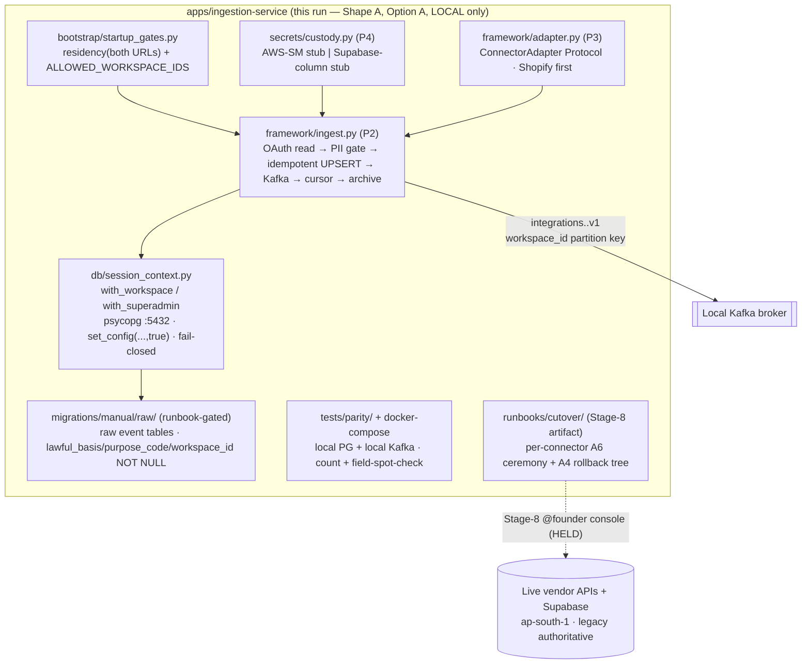

# Architecture Plan — feat-connector-framework-cutover (Child 3)

> Filled by Aryan (Architect) in Stage 2. Co-owned with Maya (intelligence-engineer) on the raw event-store schema + consent columns + per-adapter PII manifest (§5 + §A-SCHEMA). Mirrors the Child-1 (Shape-A) and Child-2 (Shape-A) boundary discipline: build the framework + first connector + LOCAL parity harness + the ceremony runbook **present + LOCAL-verified**; ZERO live token moved; the live single-owner flip deferred to a Stage-8 named **HOLD-AT-CUTOVER** state.

| Field | Value |
|-------|-------|
| **req_id** | `feat-connector-framework-cutover` (Child 3 of `chore-migrate-legacy-to-brain`) |
| **Actor** | architect (Aryan); co-owner intelligence-engineer (Maya) on §5 / §A-SCHEMA |
| **Timestamp** | 2026-05-24T20:55:00Z |
| **Lane** | high-stakes (inherited; 6 trigger surfaces) |
| **Paradigm** | `sql` + OAuth/connection/event-handling — **AFFIRMED** (carried from Stage-1 sign-off; no re-invoke) |
| **Binding inputs** | `02-cto-advisor-review.md` (13 intake constraints + armed escalation) + `05-stage1-synthesis.md` (24 CF-* contract + 2 CRITICAL rulings + FIRED escalation + Maya conditional-YES) + Child-0 `06-architecture-plan.md` (A1.3 connector table, A4 rollback tree, M-A5-Q3 windows + count-based carve-out) |
| **Shape** | **Shape A** (framework + runbook present + LOCAL-verified; no live flip) |
| **Runtime-scope ruling (CF-C3-RUNTIME-SCOPE-DECISION-1)** | **OPTION A** — LOCAL-only harness + mandatory real-pooler integration test inside HOLD-AT-CUTOVER. **No @jatin deploy-pipeline track this child.** (§3a-ii) |
| **Named HOLD state** | `HOLD-AT-CUTOVER` (mirrors Child-1 HOLD-AT-FORCE / Child-2 HOLD-AT-LIVE-RECON) |
| **Build gated on** | (1) Founder Secrets Option A/B (CF-C3-SECRETS-INTERIM-1, FIRED escalation) **AND** (2) Child-1 RLS primitive merged to `development` (build-base) — both before Stage-3 build authorization |

---

## 0. ★ HEADLINE DELIVERABLE — the runtime-scope ruling + the named HOLD-AT-CUTOVER state

> This is §A0 because CF-C3-RUNTIME-SCOPE-DECISION-1 is the binding CRITICAL the whole child hinges on (the Shape-B trap that bit Child 1). Stage 3 builds inside this ruling; Stage 6 (Rohan) signs it; Stage 8 (Founder at console) executes the HOLD ceremony.

### A0.1 — Runtime-scope ruling: **OPTION A** (LOCAL-only + mandatory real-pooler integration test inside HOLD-AT-CUTOVER)

**Ruling:** I bind **Option A**. The framework (3a-i) ships LOCAL-verified against a docker-compose harness (local Postgres + local Kafka broker). **No live Supabase connection, no MSK/Glue Schema Registry provisioned, no deploy pipeline, no live token moved this child.** The gap Option A would otherwise leave — "the live cutover is the first real connection to the prod pooler" — is closed by a **mandatory `real-pooler integration test` as STEP 0.5 of the Stage-8 HOLD-AT-CUTOVER runbook** (a read-only connect + `set_config` + `SELECT 1` round-trip against the real Supabase `:6543` pooler AND `:5432` direct, executed at the console immediately before the first token is pointed at Brain, with the Founder present).

**Why Option A over Option B (justified against the Shape-A discipline + the Shape-B trap):**
1. **Option B is the exact Shape-B trap that bit Child 1.** Standing up the *first live Brain runtime + first managed Kafka (MSK Serverless) + first Glue Schema Registry + the first @jatin deploy pipeline* — inside the **highest-risk child** (single-owner cutover) — multiplies irreversible infra surface with **zero parity benefit this child**, because the live flip is HELD at Stage 8 regardless. Child-1's CTOA explicitly named "decide-during-build" as how the Shape-B trap happened; choosing B here would be choosing the trap deliberately.
2. **A staging runtime buys nothing the pooler integration test doesn't buy more cheaply.** The only real-world fact a staging deploy would surface pre-cutover is "can a Python service in the real network connect+`set_config`+produce" — which the STEP-0.5 pooler integration test surfaces directly, at the console, the moment it matters, without standing up MSK/Glue/ArgoCD. The connector's correctness (idempotent UPSERT, envelope, cursor, PII manifest) is fully provable against the local broker.
3. **Reversibility (the prime directive).** Option A leaves ZERO new live infra to tear down if the child is rolled back. Option B would leave a provisioned MSK topic + Glue schema + a deployed staging service — each its own rollback surface. Shape A is reversible by `git revert`; that is the whole point of the named-HOLD pattern.
4. **The deploy pipeline graduates with the runtime, not before it.** Per Brain's phased-deployables doctrine, `ingestion-service` runs as part of the `data` deployable (ingestion+analytics+intelligence) only when the data runtime actually deploys. That deploy belongs to the child that first puts a live Brain consumer in the path — which under HOLD-AT-CUTOVER is the Stage-8 ceremony, gated by the Founder, **not** a normal Stage-3 build. So the @jatin deploy-pipeline track is correctly **deferred to the Stage-8 cutover ceremony's infra prerequisites**, authored as a runbook section here, not built this child.

**What minimally must exist for the first Brain ingest runtime + first Kafka topic (this child, LOCAL only):**
- Python deps declared in `apps/ingestion-service/pyproject.toml` (currently `deps=[]`): `psycopg[binary,pool]`, `aiokafka`, `httpx`, `pydantic`, `pydantic-settings` + dev `pytest`, `pytest-asyncio`, `testcontainers` (resolve+pin latest-stable at build — see §14 version note).
- The Python session-context primitive (`db/session_context.py`) — the Child-1 `withWorkspace` contract re-expressed Python-native (CF-C3-PY-SESSION-CTX-1).
- The single ingest primitive (`framework/ingest.py`) + the adapter interface (`framework/adapter.py`) + first adapter (Shopify).
- The Kafka topic **naming + envelope contract** (proto-defined; topic provisioned only LOCALLY in the docker-compose harness): `integrations.<vendor>.v1`, `workspace_id` as the partition key (§6).
- The startup gate module (`bootstrap/startup_gates.py`): residency assert (both URLs) + workspace allowlist (CF-C3-RESIDENCY-ASSERT-1 + CF-C3-WORKSPACE-ALLOWLIST-1).
- A docker-compose test harness (local Postgres + local Kafka) — the LOCAL parity harness lives here (§10).

### A0.2 — The named **HOLD-AT-CUTOVER** state (recorded in the binding architecture)

**State name: `HOLD-AT-CUTOVER` (Child-3 — the per-connector live single-owner flip).**

- **Definition:** the live per-connector token transfer + webhook re-registration (or legacy-cron-disable for polling connectors) + legacy-plaintext-delete is **DEFERRED to a Stage-8 gated ceremony**, executed **one connector at a time, lowest-risk first, Shiprocket last**, with the Founder at the console and the A4 rollback tree armed. This child's exit = the framework + first adapter + LOCAL parity harness + the per-connector ceremony runbook **present + LOCAL-verified**; **ZERO live token moved in a normal pipeline run.**
- **The Stage-8 ceremony runs (per connector):** STEP 0 startup-gates GREEN (residency both URLs + workspace allowlist) → **STEP 0.5 real-pooler integration test** (the Option-A gap-closer) → STEP 1 write credential to custody (per Founder Option A/B) → STEP 2 **live HTTP round-trip auth test against the vendor** (proves Brain can read+use the credential) → STEP 3 token transfer / webhook re-registration (Shopify: all-shops-atomic bulk; Shiprocket: disable legacy cron) → STEP 4 first Brain ingest (Shiprocket `days=7`) → STEP 5 count-parity + field-spot-check within window N → STEP 6 **THEN** delete/seal legacy plaintext. It **HOLDS before STEP 3** until the credential-custody decision (CF-C3-SECRETS-INTERIM-1) is on record and STEP 2 auth test is GREEN.
- **Why named in the architecture (not informal):** the legacy sibling Child-1 was held at FORCE by explicit Founder directive; Child-2 was held at LIVE-RECON. The Founder has ratified this discipline twice. Naming HOLD-AT-CUTOVER makes the irreversible flip an explicit Stage-8 gated act, never a normal-run side effect.
- **Reversibility:** because no token moves this run, there is nothing to roll back on any vendor this run (legacy stays authoritative + receiving). The Stage-8 per-connector rollback is the A4 tree (§A4-LOCAL), branching **before** the STEP-6 delete (`failed auth test = abort, cred still in legacy, no restore needed`). Shopify is reversible via 60-day order-API backfill within the 4h window (atomic ≠ irreversible for Shopify); Shiprocket has NO replay → sequenced LAST + ≥2-week pre-shadow.

### A0.3 — Reflect in `state/active.json`

Add `exit_criteria` so the downstream pre-flight check reads the real criterion:
```json
"exit_criteria": {
  "shape": "A",
  "runtime_scope": "OPTION_A_LOCAL_ONLY_PLUS_POOLER_IT_AT_CUTOVER",
  "deliverables_present": ["python session-context primitive","single ingest primitive + adapter interface","Shopify first adapter","Kafka envelope proto + topic naming","startup gates (residency + allowlist)","per-adapter PII manifest","raw event-store schema DDL (runbook-gated)","LOCAL parity harness","per-connector ceremony runbook (Stage-8)"],
  "live_flip_deferred_to": "stage-8",
  "named_hold_state": "HOLD-AT-CUTOVER",
  "live_token_moved_this_child": false,
  "no_msk_no_glue_no_deploy_pipeline_this_child": true
}
```

### A0.4 — Decision-log entry

A `type: "architecture-plan"` row citing: the Option-A ruling + rationale, the HOLD-AT-CUTOVER state definition, the locked primitive signatures (§A0.5), the Maya co-own ACCEPT, and the two Stage-3 build gates (Founder Option A/B + Child-1 merge to `development`). Appended this run.

### A0.5 — ★ Locked primitive paths + exported signatures (binding — Stage 3 builds these verbatim)

> Same discipline as Child-1 (`withWorkspace<T>` path+signature lock) and Child-2 (locked library interface contracts). Any change to a path or exported signature below is a CTOA-gated plan amendment, never a build-time drift.

**(P1) Python session-context primitive — CF-C3-PY-SESSION-CTX-1** · `apps/ingestion-service/src/infrastructure/db/session_context.py`
```python
# @paradigm: sql (connection-handling; no ML, no LLM)
# The Python-native re-expression of the Child-1 TS withWorkspace contract.
# The TS withWorkspace cannot be imported by a Python service — this is a backing
# re-implementation of the SAME contract, NOT a new app-layer scoping model.
# Session-mode (DIRECT_URL :5432) + tx-local set_config('app.workspace_id', $1, true)
# as the FIRST statement inside an explicit BEGIN/COMMIT; scrubbed at tx end.
# GUC names IDENTICAL to Child-1: app.workspace_id, app.is_superadmin.

async def with_workspace(
    workspace_id: str,
    fn: Callable[[psycopg.AsyncConnection], Awaitable[T]],
) -> T: ...
    # - workspace_id validated as UUIDv4 (defense-in-depth, mirrors Child-1 UUID_REGEX); raises on invalid.
    # - BEGIN → SELECT set_config('app.workspace_id', %s, true) → set_config('app.is_superadmin','false',true) → fn(conn) → COMMIT; ROLLBACK on error.
    # - fail-closed: an empty/None workspace_id raises; never runs fn without a bound context.

async def with_superadmin(
    fn: Callable[[psycopg.AsyncConnection], Awaitable[T]],
) -> T: ...
    # - set_config('app.is_superadmin','true',true) + set_config('app.workspace_id','',true).
    # - STATIC GATE: callable only from the cron outer-enumeration path + the DPDP erasure path + the residency/probe path (grep before deploy).
```

**(P2) Single ingest primitive — CF-C3-SINGLE-PRIMITIVE-1** · `apps/ingestion-service/src/application/framework/ingest.py`
```python
# @paradigm: sql + event-handling. ONE generic primitive consumed N times.
# OAuth/credential read → per-adapter PII-manifest check → idempotent UPSERT
# under with_workspace → Kafka produce to integrations.<vendor>.v1 → cursor persist → raw archive.
# Same code path for live + backfill (bounded vs unbounded window param).

async def ingest_batch(
    adapter: ConnectorAdapter,        # P3
    workspace_id: str,
    window: IngestWindow,             # bounded (live) | unbounded (backfill) — same path
    *, dry_run: bool = False,         # LOCAL parity harness uses dry_run to skip the live flip
) -> IngestResult: ...
    # IngestResult: { events_received:int, events_upserted:int, events_deduped:int, cursor_advanced_to:str, kafka_offsets:list[int] }
    # Idempotency key: (workspace_id, vendor, vendor_event_id) — UPSERT ON CONFLICT DO UPDATE; re-ingest is a no-op on counts.
```

**(P3) Adapter interface — CF-C3-SINGLE-PRIMITIVE-1 + CF-C3-PII-ADAPTER-GATE-1** · `apps/ingestion-service/src/domain/framework/adapter.py`
```python
# @paradigm: sql. Per-connector quirks are CONFIG behind this interface, NOT N bespoke ingest paths.
class ConnectorAdapter(Protocol):
    vendor: str                                  # "shopify" | "woocommerce" | "meta" | "google" | "klaviyo" | "shiprocket" | "unicommerce"
    pii_manifest: PiiManifest                    # CF-C3-PII-ADAPTER-GATE-1 — declared at the adapter (see §A-SCHEMA, Maya-co-owned)
    token_model: TokenModel                      # oauth_token | refresh_token | api_key | email_password (Child-0 A1.3)
    replay: ReplayCapability                     # full(60d) | window | partial | none(Shiprocket)
    async def fetch(self, creds: Credential, window: IngestWindow) -> AsyncIterator[RawEvent]: ...
    def normalize(self, raw: RawEvent) -> NormalizedEvent: ...   # vendor-shape → raw-event-store row (NO money conversion — lands raw, Child-2 converts at ACL)
    def idempotency_key(self, raw: RawEvent) -> str: ...
```

**(P4) Credential-custody interface — CF-C3-SECRETS-INTERIM-1 (TWO backing impls, Founder swaps via config)** · `apps/ingestion-service/src/infrastructure/secrets/custody.py`
```python
# @paradigm: sql. The Founder's Option A/B decision is a CONFIG/adapter swap, NOT a re-architecture.
class CredentialCustody(Protocol):
    async def get(self, workspace_id: str, vendor: str) -> Credential: ...
    async def put(self, workspace_id: str, vendor: str, cred: Credential) -> None: ...
    async def seal(self, workspace_id: str, vendor: str) -> None: ...   # delete/encrypt-in-place at cutover STEP 6
# Backing impls (BOTH stubbed this child; Founder decision selects one at Stage-3/8):
#   secrets/aws_secrets_manager_custody.py  — Option A: IAM-scoped GetSecretValue, ap-south-1
#   secrets/supabase_column_custody.py      — Option B: read over with_workspace RLS-session conn; seal = encrypt column
# App-level Shopify HMAC secret (SHOPIFY_CLIENT_SECRET) is a separate custody line under whichever option (config key shopify.app_hmac_secret).
```

---

## 1. Context

Child 3 of the strangler-fig migration. The legacy `looqus` backend (`legacy project/backend/`, reference-only) ingests from Shopify / Meta / Google / Shiprocket / Klaviyo / Unicommerce / WooCommerce with **vendor credentials in legacy plaintext** (`schema.prisma:286/498-501/522/559/699/1014`, confirmed) and a cron `findMany`-across-all-workspaces fan-out. Brain needs a **Brain-native connector/ingestion framework** that receives each vendor's events **workspace-scoped, idempotently, into the raw event store (Postgres under RLS) + Kafka `integrations.*.v1`**.

**Verified ground-truth this run (file:line):**
- `apps/ingestion-service/` is a **bare DDD scaffold** — `pyproject.toml` `dependencies=[]`, only `.gitkeep` under `src/{bootstrap,application,infrastructure,domain,interfaces}` (no Python code, no Kafka, no deploy pipeline). This is the CF-C3-FIRST-RUNTIME-1 surface.
- Child-1 `withWorkspace`/`withSuperadmin` primitive present at `apps/core-service/src/infrastructure/db/workspace-context.ts` (TS; **cannot be imported by a Python service** → CF-C3-PY-SESSION-CTX-1).
- Shopify HMAC is keyed on the **app-level** `SHOPIFY_CLIENT_SECRET` (`legacy project/backend/src/lib/shopify/client.ts:5,69`; `webhooks.ts:35`) with **14 webhook topics** (`webhooks.ts:9-24`) and a single `webhookSubscriptionCreate` mutation (`webhooks.ts:468`) → CF-C3-SHOPIFY-ENDPOINT-ATOMIC-1 confirmed.
- Shiprocket bare-writers `discoverChannels` (`shiprocket-sync.ts:341`), `backfillShiprocketCourierNames` (`:716`), `backfillShiprocketPincodes` (`:917`) are live legacy writers → CF-C3-FORCE-UNLOCK-SCOPE-1 (retire at decommission, never edit).
- Brain Python pkg convention confirmed: `pylibs/brain_metrics/brain_metrics/*.py` + `tests/`; proto codegen via `protos/buf.gen.yaml` (betterproto `v1.2.5`, `@bufbuild/protoc-gen-es v2.4.0` — both real, pinned).
- **No Secrets Manager / vault / KMS anywhere** (Stage-1 grep CLEAN) → CF-C3-SECRETS-INTERIM-1 FIRED escalation.

**Over-engineering posture (carried from Child-1/Child-2):** bind the *contracts + gates* (single ingest primitive, Python session-context, credential-custody interface, raw event-store schema with day-one consent columns, count-based parity harness, the ceremony runbook). DEFER all live infra (MSK, Glue, deploy pipeline, live tokens) behind HOLD-AT-CUTOVER. Single connector first (Shopify — lowest risk, full 60-day replay). No numeric shadow harness (CF-C3-PARITY-COUNT-1 — explicit Child-0 carve-out lines 655-669).

---

## 2. Proposed solution

Build the connector framework **Brain-native in `apps/ingestion-service`** (Connectors → `ingestion`, Child-0 A1 row 183) as ONE generic ingest primitive + N adapters (config, not bespoke paths), LOCAL-verified, with the live flips deferred behind HOLD-AT-CUTOVER:

1. **Python session-context primitive (P1).** `db/session_context.py` — `with_workspace()` / `with_superadmin()` re-expressing the Child-1 TS contract against `psycopg` async + tx-local `set_config('app.workspace_id', $1, true)`. Same GUC names, same fail-closed semantics. The framework's EVERY write goes through it (CF-C3-RLS-CONSUME-1); the legacy "workspaceId-but-no-RLS" model never leaks into Brain.
2. **Single ingest primitive (P2) + adapter interface (P3).** `framework/ingest.py` (OAuth read → PII-manifest check → idempotent UPSERT under `with_workspace` → Kafka produce → cursor → raw archive; same path for live + backfill) consuming `ConnectorAdapter` (P3). **First adapter: Shopify** (lowest risk — full 60-day order-API replay; the all-shops-atomic ceremony is the most-scrutinized so building it first de-risks the pattern). Adapters for Meta/Google/Klaviyo/Unicommerce/Woo/Shiprocket are config-shaped follow-ons (interface present, Shiprocket stub flagged HIGHEST-risk).
3. **Raw event-store schema + per-adapter PII manifest (§5 / §A-SCHEMA, Maya co-owned).** Postgres raw tables under RLS, each PII-bearing table carrying **non-nullable `lawful_basis` / `purpose_code` / `workspace_id` from day one** (CF-C3-CONSENT-COLUMN-1) stamped at ingest-write (never backfilled). DDL is runbook-gated (manual, Stage-8), mirroring Child-1's `migrations/manual/`.
4. **Kafka envelope + topic contract (§6).** Proto-defined `IntegrationEvent` envelope with `workspace_id` partition key; topics `integrations.<vendor>.v1`. Provisioned LOCALLY only this child.
5. **Credential-custody interface (P4) — two stubbed backings.** Founder Option A/B is a config swap.
6. **Startup gates.** Residency assert on both URLs, refuse-to-start (CF-C3-RESIDENCY-ASSERT-1); `ALLOWED_WORKSPACE_IDS` allowlist (CF-C3-WORKSPACE-ALLOWLIST-1, Sugandh-Lok-only).
7. **LOCAL parity harness (§10) + the per-connector ceremony runbook (§A-RUNBOOK).** The runbook is the Stage-8 deploy artifact (mirrors Child-1's rollout-runbook), NOT executed in a normal run.

**Falsifiable boundary — GREEN at end of this run vs DEFERRED:** GREEN = P1–P4 + Shopify adapter + envelope proto + startup gates + raw-schema DDL (runbook-gated) + LOCAL parity harness + ceremony runbook present as Brain code; unit tests + LOCAL docker-compose (PG + Kafka) integration test pass. DEFERRED to Stage-8 HOLD-AT-CUTOVER = the real-pooler integration test, any live token transfer, live HTTP auth test, count-parity against live legacy, legacy-plaintext-delete, MSK/Glue provisioning, deploy pipeline.

### Diagram



---

## 3. Paradigm

**Declared paradigm:** `sql` + OAuth/connection/event-handling (idempotent UPSERT + Kafka producer + cursor persistence). **AFFIRMED** — carried from Rohan's Stage-1 sign-off (§18); no re-invoke (unchanged).

**Justification (≥20 words):** Pure deterministic data movement — receive vendor events, dedupe (idempotent UPSERT keyed on `(workspace_id, vendor, vendor_event_id)`), write workspace-scoped under RLS, emit to Kafka. **No ML, no LLM, no cost-routing path** — cost-routing audit clean. Any "smart-route" / "AI-classify incoming events" would be a Child-5 paradigm over-reach and is explicitly out of scope. Connectors land **raw**; money Decimal→MU conversion is a Child-2 compute concern at the ACL, NOT an ingest concern.

---

## 4. API design

- **gRPC protos added:** ONE — the Kafka event envelope `IntegrationEvent` in `protos/events/integrations.proto` (codegen → `packages/proto-ts/gen` + `pylibs/proto_py/proto_py/_gen`). Fields: `workspace_id` (string, partition key), `vendor` (string), `vendor_event_id` (string, idempotency), `event_type` (string), `occurred_at` (google.protobuf.Timestamp), `ingested_at` (Timestamp), `payload` (bytes — raw vendor JSON), `lawful_basis` (string), `purpose_code` (string). NO money fields (lands raw).
- **gRPC service contracts:** none this child (the ingest primitive is invoked in-process / by the Stage-8 ceremony, not over the wire; the proto contract is the Kafka envelope only).
- **tRPC / MCP / REST:** none added or changed this child.
- **Breaking changes:** **None.** `ingestion-service` is a bare scaffold; this is its first real content. Additive. The webhook-receiver HTTP endpoint (Shopify's shared `callbackUrl`) is **designed** (in the runbook) but **not stood up live** this child.
- **Versioning strategy:** the `IntegrationEvent` envelope is bound as a **v1 proto contract** (`integrations.<vendor>.v1` topic suffix matches the proto version). Adding a vendor is additive (new topic, same envelope). Any field-shape change to `IntegrationEvent` is a CTOA-gated proto change (mirrors Child-1's `withWorkspace<T>` binding + Child-2's `Money` field binding). Child-4's metric registry consumes these topics + the raw-store schema verbatim.

---

## 5. Data model changes — raw event store (★ Maya co-owned — co-own ACCEPTED)

> **Maya co-own decision: ACCEPTED.** One-line rationale: CF-C3-CONSENT-COLUMN-1 requires non-nullable `lawful_basis`/`purpose_code`/`workspace_id` on every PII-bearing raw table from day one, and that column set + the per-adapter PII-manifest field set **pre-shape fields Child-4's metric registry consumes** (which fields are available to roll up + per-purpose retention/erasure scoping) — so the schema is genuinely a Child-3/Child-4 seam, not a pure ingest concern. Maya co-designs §A-SCHEMA (the raw-store DDL + consent columns + PII manifest); I own the framework/runtime/runbook. This is the same mechanism as Child-2.

### Postgres (raw event store — DDL runbook-gated, manual, Stage-8; NOT a migration-runner path)
- **Tables added (design this child; DDL in `apps/ingestion-service/migrations/manual/raw/`, applied Stage-8 only):** raw landing tables per Child-0 A1 (`shopify_orders`, `shopify_line_items`, `shopify_customers`, `shopify_products`, `woocommerce_orders`, `meta_ads_daily`, `google_ads_daily`, `klaviyo_email_performance`, `shiprocket_shipments`, `unicommerce_products`, + a per-connector `connector_cursor` table). Each lands **raw** (vendor-shape money stays as-is — Child-2 converts at the ACL; CF-C3 does NOT pull money conversion in).
- **Consent columns (CF-C3-CONSENT-COLUMN-1, NON-NULLABLE on every PII-bearing table, stamped at ingest-write, never backfilled):**
  - `workspace_id UUID NOT NULL` (RLS scope key)
  - `lawful_basis TEXT NOT NULL` (enum-checked; init `owner_brand_controller`)
  - `purpose_code TEXT NOT NULL` (enum-checked: `analytics_performance` | `logistics_tracking` | `email_performance` | `catalog_sync`)
  - `ingested_at TIMESTAMPTZ NOT NULL DEFAULT now()`
- **RLS:** every raw table gets the Child-1 fail-closed `ws_isolation` policy shape (ENABLE+CREATE in `step-a`, FORCE in `step-b`, symmetric `down.sql`) — re-expressed verbatim-equivalent from Child-1's proven DDL. **No live RLS applied this child** (runbook-gated, Stage-8).
- **Indexes:** `(workspace_id, vendor_event_id)` UNIQUE per raw table (the idempotency key); `(workspace_id, ingested_at)` for cursor/window queries.

### ClickHouse
- **None this child.** The raw→metric materialization is Child-4 (Child-0 M-A5-2). Connectors land raw in Postgres only.

### Per-adapter PII manifest (CF-C3-PII-ADAPTER-GATE-1 — Maya co-owned, checked by the ingest primitive before write)
Each adapter declares a code-level `PiiManifest` (field → DPDP §2(t) personal-data flag + lawful_basis + purpose_code). Sugandh-Lok scope:
| Adapter | PII fields | lawful_basis | purpose_code |
|---|---|---|---|
| Shopify | `email, first_name, last_name` | `owner_brand_controller` | `analytics_performance` |
| WooCommerce | `customer_email, customer_phone, billing_*, shipping_*` | `owner_brand_controller` | `analytics_performance` |
| Shiprocket | `delivery_pincode, delivery_city, delivery_state` | `owner_brand_controller` | `logistics_tracking` |
| Klaviyo / Meta / Google | **NO individual PII (aggregates only); Conversions-API / enhanced-conversions hashed-PII OUT OF SCOPE until separately gated** | — | `email_performance` / `analytics_performance` |
The ingest primitive **refuses to write** a field flagged personal-data unless the adapter's manifest declares its lawful_basis + purpose_code (fail-closed; forces an explicit decision at each future adapter).

### Migration plan (reversible)
DDL lives in `migrations/manual/raw/{step-a-enable-create.sql, step-b-force.sql, down.sql}` + a `README.md` marking the tree HOLD-AT-CUTOVER / Stage-8-only. Reversibility: nothing applied to any live DB this child → `git revert` is the rollback. The Stage-8 application is symmetric (`down.sql` = `NO FORCE → DISABLE → DROP POLICY → DROP TABLE`).

---

## 6. Event model

- **Topics:** `integrations.<vendor>.v1` — one per vendor (`integrations.shopify.v1`, etc.). Provisioned **LOCALLY only** this child (docker-compose Kafka); MSK provisioning deferred to the Stage-8 ceremony infra prerequisites (Option A).
- **Envelope:** the proto `IntegrationEvent` (§4). **Partition key = `workspace_id`** (Brain envelope invariant — per-workspace ordering + tenant isolation on the spine).
- **Delivery semantics:** at-least-once produce; consumer idempotency via `(workspace_id, vendor, vendor_event_id)` (the same key as the Postgres UPSERT) so a redelivery is a no-op. Producer acks=all (durability over latency — ingest is not latency-critical).
- **No consumer this child** (Child-4 analytics is the first consumer). The producer + envelope + topic naming are the contract bound here.

---

## 7. Single-Primitive sweep

| Candidate | Existing primitive? | Decision |
|---|---|---|
| Workspace-scoped DB access | Child-1 TS `withWorkspace` (cannot import from Python) | **Re-express, don't re-invent** — `with_workspace()` (P1) is the SAME contract (same GUC names, same fail-closed, same tx-local `set_config`) in Python. Single-Primitive holds at the *interface*, not the language (mirrors Child-1's "interface, not the ORM" ruling). |
| Connector ingest | none (bare scaffold) | **ONE new primitive** — `ingest_batch` (P2). Per-connector quirks (Shopify webhook vs Shiprocket poll vs Google refresh_token) are CONFIG behind `ConnectorAdapter` (P3), not N bespoke paths (CF-C3-SINGLE-PRIMITIVE-1). Justified: there is no existing ingest primitive to extend. |
| Credential custody | none (no Secrets Manager) | **ONE interface, two backings** — `CredentialCustody` (P4). Justified: the Founder's Option A/B must be a config swap, not a re-architecture (CF-C3-SECRETS-INTERIM-1). |
| Kafka envelope | none (`protos/events/.gitkeep` only) | **ONE proto** — `IntegrationEvent`. Justified: first event on the spine; the envelope is the reusable contract for all 7 vendors. |
| Money conversion | Child-2 `brain_metrics` / `lib-metrics` | **DO NOT touch** — connectors land raw; Child-2 converts at the ACL. Pulling money in would violate the scope carve-out. |
| Numeric shadow-compare | Child-2 harness | **DO NOT build** — CF-C3-PARITY-COUNT-1 (Child-0 carve-out lines 655-669); Child-3 parity is count-based + field-spot-check only. |

**Sweep result:** 3 new primitives (ingest, custody interface, envelope proto) + 1 re-expression (session-context). All justified; no bespoke per-connector paths; no over-reach into money/shadow harness.

---

## 8. Multi-tenancy enforcement (4 layers)

| Layer | This child |
|---|---|
| **JWT → service assertion** | The Stage-8 ceremony reads credentials for a workspace only after the `ALLOWED_WORKSPACE_IDS` startup allowlist passes (CF-C3-WORKSPACE-ALLOWLIST-1, Sugandh-Lok-only). The ingest primitive asserts `workspace_id` is a valid UUID before any DB touch (P1 UUID guard). |
| **Postgres RLS** | Every raw-store write goes through `with_workspace` (P1) → tx-local `set_config('app.workspace_id', …)` → Child-1 fail-closed RLS policy. The legacy "workspaceId-but-no-RLS" model is NOT reproduced (CF-C3-RLS-CONSUME-1). Cron-style outer enumeration uses `with_superadmin` + per-connection `with_workspace` (mirrors Child-1's session-scoped fan-out). |
| **ClickHouse query-gateway** | N/A this child (no ClickHouse). |
| **Kafka envelope** | `workspace_id` is the partition key + a required envelope field (§6). |

---

## 9. Observability plan

Proportionate to the requirement (no gold-plating). The ingest primitive emits (structured logs + counters; named in the requirement's reliability/parity needs):
- **Metrics:** `ingest_events_received_total{vendor,workspace_id}`, `ingest_events_upserted_total`, `ingest_events_deduped_total`, `ingest_cursor_lag_seconds{vendor}`, `ingest_credential_read_failures_total{vendor}` (the Shiprocket-lockout tripwire), `ingest_pii_manifest_rejections_total{vendor,field}` (the CF-C3-PII-ADAPTER-GATE-1 fail-closed counter).
- **Shiprocket-specific:** `shiprocket_attempted_vs_connected` alarm (Child-0 A1.3 + synthesis — no-replay connector needs an attempted-vs-connected gap alarm).
- **Logs:** correlation 4-tuple (request/trace/workspace/user) carried through the session-context (mirrors Child-1 CF-SEC-5), structured.
- **Traces:** ingest_batch span per (vendor, workspace_id, window).
- **Alarms (defined in the runbook, armed at Stage-8):** credential-read-failure > 0 (lockout); count-parity outside window N; residency-assert failure (refuse-to-start, paged).
- **Dashboards:** one ingest-health panel set (events received/upserted/deduped + cursor lag per vendor) — authored in the runbook, stood up at Stage-8.

---

## 10. Test strategy

Proportionate to risk; positive + negative scenarios per the code-clarity/coverage standard. The **LOCAL parity harness** is the headline test artifact.

- **Unit (LOCAL):** `with_workspace` fail-closed (empty/None/invalid-UUID raises; context scrubbed on rollback); `ingest_batch` idempotency (re-ingest same batch → `events_upserted` unchanged, `events_deduped` increments); PII-manifest gate (undeclared PII field → write refused); adapter `normalize`/`idempotency_key` per Shopify; custody interface both stubs (get/put/seal contract).
- **LOCAL integration (docker-compose: local Postgres + local Kafka):** ingest a fixture Shopify order batch → assert raw-store rows under RLS (cross-workspace read returns 0) + Kafka envelope produced with `workspace_id` partition key + cursor advanced. Negative: a second workspace's session cannot read the first's raw rows.
- **LOCAL parity harness (CF-C3-PARITY-COUNT-1 — count-based + field-spot-check, NOT numeric shadow):** `tests/parity/` — given a legacy-shaped fixture and a Brain-ingested set, assert `COUNT(brain) == COUNT(legacy) ± 1 (clock skew)` + key-field spot-check (e.g. `order_id, total_price` raw) on last N rows, per the M-A5-Q3 per-connector windows. This is the local-runnable form of the Stage-8 parity check.
- **DEFERRED to Stage-8 HOLD-AT-CUTOVER (NOT this child):** the real-pooler integration test (STEP 0.5), the live HTTP vendor auth test (STEP 2), the live count-parity against legacy. These need live creds + the Founder at the console — they are runbook steps, not Stage-3 tests.

---

## 11. Security considerations (forwarded to Shreya, Stage 4)

- **CF-C3-SECRETS-INTERIM-1 (FIRED escalation, build-gating):** credential custody is an interface (P4) with two stubbed backings; Stage-3 build is GATED on the Founder's Option A/B decision. Shreya must verify the selected backing never logs/serializes a credential and that `seal()` is the LAST cutover step.
- **CF-C3-ROLLBACK-CRED-WINDOW-1 / CF-C3-DELETE-SEQUENCE-1 (must-fix):** the runbook sequence is **write-to-custody → live HTTP auth test → parity confirmed → THEN delete/seal legacy plaintext** (cred SEALED, not deleted, during the rollback window). Deleting before Brain custody is proven = lockout (Shiprocket `email/password` is unrecoverable); Shreya verifies the A4 rollback branch sits BEFORE the delete.
- **App-level Shopify HMAC secret** (`SHOPIFY_CLIENT_SECRET`) must be present in Brain's env BEFORE the first webhook arrives (else events drop; Shopify retries 48h on 5xx) and is NOT covered by per-brand rotation — its own custody line (P4 config key).
- **CF-C3-RESIDENCY-ASSERT-1:** startup gate asserts ap-south-1 on both `DATABASE_URL` + `DIRECT_URL`, refuse-to-start on fail.
- **CF-C3-WORKSPACE-ALLOWLIST-1:** `ALLOWED_WORKSPACE_IDS` startup check, Sugandh-Lok-only; CF-SEC-3 re-fires before any non-Sugandh-Lok PII enters prod.
- **PII fail-closed gate (CF-C3-PII-ADAPTER-GATE-1):** the ingest primitive refuses to write undeclared PII.

---

## 12. India context

| Lens | Impact |
|---|---|
| **RTO / COD** | Shiprocket is the RTO/COD source + the HIGHEST-blast-radius connector (no replay). Its runbook models a **polling-gap** (CF-C3-SHIPROCKET-POLL-MODEL-1): disable legacy cron → verify no legacy Shiprocket cron scheduled → Brain first poll `days=7` (covers the gap) → shipment-count parity. 72h window + ≥2-week pre-shadow; sequenced LAST. COD reconciled from order-level API on rollback. |
| **DPDP** | Day-one consent columns (CF-C3-CONSENT-COLUMN-1) + per-adapter PII manifest (CF-C3-PII-ADAPTER-GATE-1) + workspace allowlist (CF-C3-WORKSPACE-ALLOWLIST-1) + residency assert (CF-C3-RESIDENCY-ASSERT-1). |
| **Festival seasonality** | CF-C3-NO-CUTOVER-AT-FESTIVAL-1 — runbook scheduling constraint: no live cutover during a known festival traffic window (RTO/COD volume amplifies the data-loss window). |
| **Telecom (DLT/NCPR/DND)** | N/A — inbound ingest only; no outbound channel sent. |

---

## 13. Region adapter impact

Connectors are India-implemented (Shopify/Meta/Google/Shiprocket/Klaviyo India). The residency assertion (ap-south-1) is the region-varying concern, enforced at startup (CF-C3-RESIDENCY-ASSERT-1). No new RegionAdapter interface needed this child — the residency gate is a startup config assertion, not a per-region behavior fork. Vendor-API regional quirks (if any future region adds them) sit behind the adapter interface (P3), not a fork.

---

## 14. Cost estimate

- **LLM tokens/day:** **0** — `sql` paradigm, no inference path. Cost-routing audit clean.
- **Infra ₹/month this child:** **₹0 net-new** — Option A provisions NO live infra (no MSK, no Glue, no deploy pipeline). LOCAL docker-compose only (developer machine / CI).
- **Stage-8 (deferred, for Founder visibility, NOT this child):** MSK Serverless + Glue Schema Registry for the live data deployable — budgeted when the Stage-8 ceremony's infra prerequisites are authorized, not now.
- **Version note (no invented versions):** Python deps to be pinned by the builder at "resolve+pin latest-stable" (`psycopg[binary,pool]`, `aiokafka`, `httpx`, `pydantic`, `pydantic-settings`, `pytest-asyncio`, `testcontainers`). Proto plugins are already real+pinned in `protos/buf.gen.yaml` (betterproto `v1.2.5`, protoc-gen-es `v2.4.0`). Builder MUST NOT invent a version (the `betterproto v0.0.3` bounce class).

---

## 15. Risks

| ID | Risk | Mitigation |
|---|---|---|
| R-CUT-01 | Live single-owner flip is irreversible-the-instant-the-token-moves | HOLD-AT-CUTOVER: no token moves this child; Stage-8 ceremony with Founder + A4 rollback tree (§A4-LOCAL). |
| R-CRED-01 | Delete legacy plaintext before Brain custody proven = lockout (Shiprocket unrecoverable) | CF-C3-ROLLBACK-CRED-WINDOW-1: write→auth-test→parity→THEN seal; rollback branch before delete. **must-fix in acceptance contract.** |
| R-SHIP-01 | Shiprocket no-replay → botched cutover loses RTO/COD events | Sequenced LAST; ≥2-week pre-shadow; polling-gap `days=7` first poll; attempted-vs-connected alarm. |
| R-SHOPIFY-01 | All-shops-atomic flip drops events if endpoint not responsive before flip | Runbook: app-level HMAC secret present + endpoint responsive BEFORE flip; reversible via 60-day order-API backfill within 4h. |
| R-SHAPE-B-01 | Standing up first runtime+Kafka+deploy inside highest-risk child = scope explosion | **Option A ruling** — LOCAL only; no MSK/Glue/deploy this child. The trap is closed by the ruling itself. |
| R-PY-CTX-01 | Python session-context drifts from Child-1 TS contract → isolation gap | P1 locked signature + same GUC names + fail-closed; LOCAL integration test asserts cross-workspace read = 0. |
| R-SECRETS-01 | Stage-3 build authorized before Founder Option A/B = compliance fiction | build_gated_on CF-C3-SECRETS-INTERIM-1; custody is a stubbed interface (P4) so design proceeds without the decision. |
| R-FORCE-EDGE-01 | Over-promising Child-1 FORCE unlock | CF-C3-FORCE-UNLOCK-SCOPE-1 documented: legacy bare writers live until **Shiprocket decommission**; Child-1 FORCE gated there, NOT on shipping this framework. |

---

## 16. Alternatives considered

1. **Option B (full-runtime LOCAL+STAGING + MSK + Glue + @jatin deploy track).** REJECTED — it is the Shape-B trap that bit Child 1; multiplies irreversible infra inside the highest-risk child with zero parity benefit (live flip is HELD regardless); the STEP-0.5 pooler integration test surfaces the only real pre-cutover fact at the console more cheaply. (Full rationale §A0.1.)
2. **Split Child 3 into separate requirements (3a framework vs 3b ceremony).** REJECTED — same call as Child-1 (1a/1b in one req) and Child-2 (Shape A in one req); fragmenting the dependency graph buys nothing; the named HOLD-AT-CUTOVER keeps it reversible without a split.
3. **N bespoke per-connector ingest paths.** REJECTED — CF-C3-SINGLE-PRIMITIVE-1; per-connector quirks are config behind `ConnectorAdapter` (P3).
4. **Build a numeric shadow-compare harness for connectors.** REJECTED — CF-C3-PARITY-COUNT-1 / Child-0 carve-out (lines 655-669); count-based + field-spot-check only.
5. **Edit legacy `discoverChannels`/`backfill*` to be context-aware.** REJECTED — CF-BN-NOLEGACY-1 (legacy reference-only); the Brain framework IS the replacement; legacy writers retire at decommission (CF-C3-FORCE-UNLOCK-SCOPE-1).

---

## 17. Tracks (work decomposition for Stage 3)

> Two parallel builders: **@vikram** (backend framework/runtime/runbook) + **@maya** (raw schema/consent columns/PII manifest — the co-owned seam). **No @jatin deploy track this child** (Option A). Each task is 2–5 min, file-pathed. Build authorization is GATED (see §A-GATES).

### Track V — Framework + runtime + runbook *(owner: @vikram)* — parallel
- V1. Declare `apps/ingestion-service/pyproject.toml` deps (resolve+pin latest-stable: `psycopg[binary,pool]`, `aiokafka`, `httpx`, `pydantic`, `pydantic-settings`; dev `pytest`, `pytest-asyncio`, `testcontainers`). **No invented versions.**
- V2. `src/infrastructure/db/session_context.py` (P1) — `with_workspace` / `with_superadmin`, tx-local `set_config`, UUID guard, fail-closed, same GUC names as Child-1.
- V3. `src/domain/framework/adapter.py` (P3) — `ConnectorAdapter` Protocol + `PiiManifest`/`TokenModel`/`ReplayCapability`/`IngestWindow`/`RawEvent`/`NormalizedEvent` types.
- V4. `src/application/framework/ingest.py` (P2) — `ingest_batch` (OAuth read → PII gate → idempotent UPSERT under `with_workspace` → Kafka produce → cursor → archive; `dry_run` for harness).
- V5. `src/infrastructure/secrets/custody.py` (P4) + `aws_secrets_manager_custody.py` (stub) + `supabase_column_custody.py` (stub) + Shopify app-HMAC custody config key.
- V6. `src/interfaces/adapters/shopify_adapter.py` — first adapter (fetch/normalize/idempotency_key + PII manifest: email/first_name/last_name).
- V7. `src/bootstrap/startup_gates.py` — residency assert (both URLs, refuse-to-start) + `ALLOWED_WORKSPACE_IDS` allowlist.
- V8. `protos/events/integrations.proto` — `IntegrationEvent` envelope (workspace_id partition key); wire into `buf.gen.yaml` codegen (ts + py).
- V9. `tests/` — unit (P1 fail-closed, P2 idempotency, PII gate, custody stubs) + LOCAL docker-compose integration (PG + Kafka: cross-workspace read = 0, envelope produced, cursor advanced).
- V10. `tests/parity/` — LOCAL count-based + field-spot-check harness (CF-C3-PARITY-COUNT-1), parameterized by the M-A5-Q3 per-connector windows.
- V11. `runbooks/cutover/` (§A-RUNBOOK) — per-connector A6 ceremony + A4 rollback tree (Shopify all-shops-atomic bulk + reverse; write→auth-test→parity→seal sequencing; Shiprocket polling-gap days=7; Meta/Google 48h re-validation; STEP 0.5 real-pooler IT; no-cutover-at-festival; workspace allowlist). **Stage-8 artifact, not executed.**
- V12. `migrations/manual/raw/README.md` — mark the DDL tree HOLD-AT-CUTOVER / Stage-8-only.
- V13. Document CF-C3-FORCE-UNLOCK-SCOPE-1 in the Child-1 HOLD-AT-FORCE ledger (timing: legacy bare writers die at Shiprocket decommission).

### Track M — Raw event-store schema + consent columns + PII manifest *(owner: @maya)* — parallel (co-owned seam)
- M1. `migrations/manual/raw/step-a-enable-create.sql` — raw landing tables (Child-0 A1 set) + non-nullable `workspace_id`/`lawful_basis`/`purpose_code`/`ingested_at` on every PII-bearing table + `(workspace_id, vendor_event_id)` UNIQUE + Child-1 `ws_isolation` policy shape (ENABLE+CREATE).
- M2. `migrations/manual/raw/step-b-force.sql` (FORCE per table, Stage-8) + `down.sql` (symmetric NO FORCE→DISABLE→DROP POLICY→DROP TABLE).
- M3. `src/domain/framework/pii_manifest.py` — `PiiManifest` enum sets (lawful_basis, purpose_code) + the per-adapter manifest table (§5); the fail-closed check the ingest primitive calls.
- M4. `connector_cursor` table DDL + the cursor-persistence contract (consumed by P2).
- M5. Confirm the consent-column set pre-shapes Child-4 metric fields (per-purpose retention/erasure scoping) — one-paragraph forward-binding note for Child-4 in §A-SCHEMA.

### Over-engineering self-check (PASS/FAIL per item)
- [x] **Plan length matches handoff band** — PASS (high-stakes; prescriptive depth; mirrors Child-1/Child-2 length).
- [x] **Every §17 file required by the requirement** — PASS (every file maps to a CF-* constraint; no "while we're in there").
- [x] **No new deps unless justified** — PASS (deps are the minimum for a Python ingest runtime; each justified; resolve+pin, no invented versions).
- [x] **No abstractions for hypothetical future** — PASS (Single-Primitive: 3 new primitives + 1 re-expression, all consumed this child or by the bound Stage-8 ceremony).
- [x] **No observability beyond requirement** — PASS (metrics/logs/alarms map to the parity + reliability + lockout needs the requirement names; nothing speculative).
- [x] **No tests for trivial getters** — PASS (tests target behavior at integration points: idempotency, RLS isolation, PII gate, parity).
- [x] **Test strategy proportionate to risk** — PASS (LOCAL harness + integration; live tests correctly deferred to Stage-8 runbook).
- **Result: 7/7 PASS.**

---

## 18. CTO Advisor paradigm sign-off

`sql` + OAuth/connection/event-handling — **AFFIRMED by Aryan**, carried from Rohan's Stage-1 sign-off (`05-stage1-synthesis.md` line 14 + `02-cto-advisor-review.md` §Paradigm). No change → no re-invoke. Cost-routing audit clean (no inference path).

---

# ============================================================
# §A-GATES — Stage-3 build authorization gates (BOTH must clear)
# ============================================================
1. **Founder Secrets Option A/B on record** (CF-C3-SECRETS-INTERIM-1, FIRED escalation) — the custody interface (P4) is built stubbed regardless, but the BACKING selection + the runbook's truthful custody mechanism wait on this. **Stage-3 build cannot start until on record.**
2. **Child-1 RLS primitive merged to `development`** (build-base) — `ingestion-service` `with_workspace` re-expresses the Child-1 contract; the build base branch needs the merged primitive. Resolve when the Founder merges `feature/feat-tenancy-auth-rls-hardening` → `development`. (Non-blocking for Stage-2 design; blocking for Stage-3 build.)

# ============================================================
# §A4-LOCAL — Per-connector rollback tree (Stage-8, armed; from Child-0 A4 + M-A5-Q3)
# ============================================================
Per connector, in window N (Shopify/Woo 4h, Meta/Google 8h, Klaviyo/Unicommerce 12h, Shiprocket 72h + ≥2-week pre-shadow):
`STEP 2 live auth test FAILS → ABORT (cred still in legacy, no token moved, no restore needed)`
`STEP 5 parity FAILS within N → restore legacy token + re-register legacy webhook (Shopify all-shops bulk reverse) / re-enable legacy cron (Shiprocket); backfill gap from API where available (Shopify/Meta/Google); Shiprocket → accept documented gap or extend shadow`
`Legacy plaintext is SEALED (not deleted) until parity sustained + window N elapsed → THEN STEP 6 delete/seal.`

# ============================================================
# §A-RUNBOOK + §A-SCHEMA — authored in Track V11 + Track M (skeletons bound above)
# ============================================================
The per-connector ceremony runbook skeleton (Shopify all-shops-atomic; Shiprocket polling-gap; the write→auth→parity→seal sequence; STEP 0.5 pooler IT; festival/allowlist constraints) and the raw event-store schema + consent columns + PII manifest are the deliverables of Tracks V11 and M respectively, bound by the locked contracts in §A0.5, §5, §6, §A4-LOCAL.
