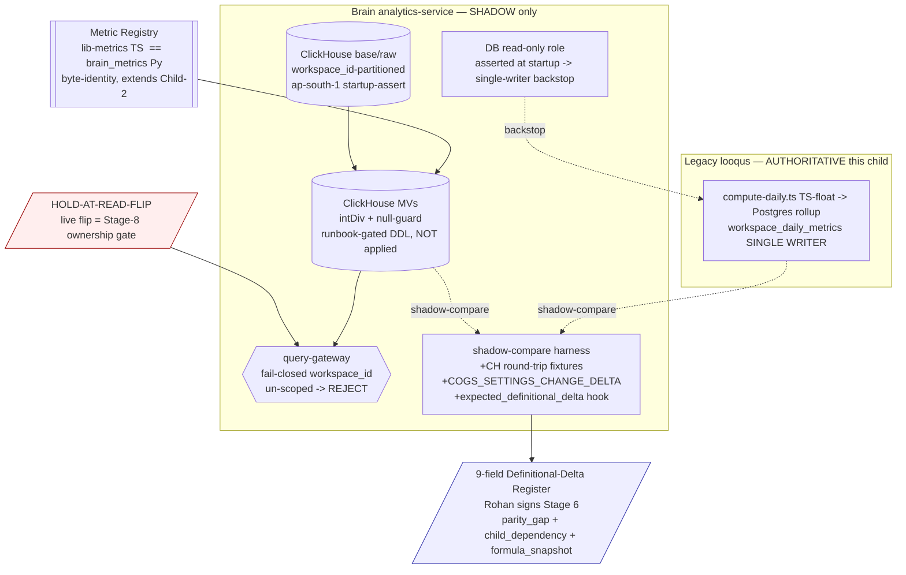

# Architecture Plan — feat-metric-engine-olap-split (Child 4)

> Stage 2 binding plan. Authored by Aryan (architect); **co-owned with Maya (intelligence-engineer)** on the metric-registry definitions, the 9-field Definitional-Delta Register (DDR), the ClickHouse round-trip + COGS-settings-change fixtures, and the taxonomy categories.
> **Shape A — `HOLD-AT-READ-FLIP`:** build the metric registry + canonical definitions + ClickHouse base/MV DDL (runbook-gated, NOT applied) + workspace-scoped query-gateway + shadow-compare harness extension + the populated DDR, all Brain-native and LOCAL/shadow-verified. The **live read-source flip is HELD** to a Stage-8 named ownership gate; legacy stays authoritative. **ZERO live read-source flip, ZERO live ClickHouse DDL applied, ZERO Brain write to the legacy Postgres rollup, this child.**
> **No-prod-cutover guardrail (binding):** no `git commit` (Founder commits at end-review); no live ClickHouse DDL execution; no live read-source flip; ZERO edit to `legacy project/**`. Stage-2 act writes only this run folder + EOS bookkeeping.

| Field | Value |
|-------|-------|
| **req_id** | `feat-metric-engine-olap-split` (Child 4 of EPIC `chore-migrate-legacy-to-brain`) |
| **Actor** | architect (Aryan); co-owner intelligence-engineer (Maya) on Track M |
| **Timestamp** | 2026-05-25T06:30:00Z |
| **Lane** | high-stakes (inherited; 4 trigger surfaces: money, schema-proto, multi-tenancy, india-compliance) |
| **Paradigm** | `sql` exclusively (M-A1-Q1; zero inference path; Rohan sign-off carried — Aryan affirms) |
| **Binding inputs** | `02-cto-advisor-review.md` + `05-stage1-synthesis.md` (the CF-C4-* contract §8 + must-resolve §9) + personas `03`/`04` + Child-0 architecture (A1.5/A5.2/A3.3) + the committed Child-2 foundation |
| **Named HOLD** | `HOLD-AT-READ-FLIP` (Stage-8 ownership gate) |
| **Build base** | `feature/feat-tenancy-auth-rls-hardening` (carries committed Child-1/2/3 code) — see §16 |

---

## 1. Context

Child 4 is the data engine behind the runnable UI. The legacy app computes workspace-day rollups in **TS float** (`legacy project/backend/src/lib/workspace-metrics/compute-daily.ts` — `cm1` line 187, `cm2` line 234, `miscExpensesProrated` lines 236–243 with `getDaysInMonth(dateAtNoonUtc)` line 238, `cm3` line 245) and stores them as `Decimal` in Postgres rollup tables (`workspace_daily_metrics` schema:857, `product_daily_aggregates` schema:313, `shopify_analytics_daily` schema:334, `meta_ads_daily_metrics` schema:818, `google_ads_daily_metrics` schema:736, etc.). Brain's locked paradigm: every KPI is a **deterministic SQL definition in the metric registry**, computed identically in TS (`packages/lib-metrics`) and Python (`pylibs/brain_metrics`) with CI-enforced parity, money in integer minor-units, materialized in **ClickHouse** (OLAP) — **never** dual-written to the legacy Postgres rollup (single-writer, C2).

This child **extends the committed Child-2 foundation** (it does not re-derive it): the byte-identity money pair (`packages/lib-metrics/src/{convert,ratio,subunits,goal-type}.ts` ↔ `pylibs/brain_metrics/brain_metrics/{convert,ratio,subunits,goal_type}.py`), the parity harness engine + 5-category taxonomy (`pylibs/brain_metrics/brain_metrics/parity/{harness.py,taxonomy.py}` with the **present-but-unpopulated `expected_definitional_delta` hook**, taxonomy.py:166), the CI byte-identity gate (`tools/check-metrics-parity.sh` + `tools/parity-runner.py` + `packages/lib-metrics/src/parity-runner.ts`), and the golden fixtures (`pylibs/brain_metrics/brain_metrics/parity/fixtures/golden_fixtures.json`). The `analytics-service` is an empty DDD scaffold today (`apps/analytics-service/src/{bootstrap,application,domain,infrastructure,interfaces}/.gitkeep`, `dependencies = []`).

**The one CRITICAL the personas found and Rohan independently re-verified:** ClickHouse `/` on `Int64` returns `Float64`, NOT integer FLOOR. Every ratio MV expression in the M-A1-1 draft (`aov_mu`, `acos_bp`, `blended_roas_x100`, `conversion_rate_bp`, `rto_rate_bp`, `prepaid_rate_bp`, `misc_expenses_prorated_mu`) is wrong-by-default, and the committed harness has **zero ClickHouse round-trip coverage** (it is a TS↔Python `decimal_to_minor_units` fixture comparator only — `harness.py` never touches ClickHouse). All positive-integer fixtures stay GREEN because Float64-truncation == FLOOR for positives, so the ratio-parity guarantee is structurally inert until fixed. `CF-C4-RATIO-DIVOP-1` (`intDiv` + null-guard on EVERY division + ClickHouse round-trip fixtures) is the **gate on the entire MV DDL pass — no DDL is authored before it is bound**.

**Over-engineering posture:** this child builds the *contracts + the shadow + the gates* and runs **zero infra at this stage** (ClickHouse DDL is a runbook artifact, applied Stage-8; no new service is deployed). It does not pull forward Child-5 (AI reads), Child-6 (frontend), or the live flip. The registry is built ONCE per language as a byte-identity pair extending the Child-2 home — no new metric primitive, no per-channel fork.

---

## 2. Proposed solution

A **shadow metric engine** added behind the Child-0 facade, with four locked surfaces:

1. **Metric registry (TS↔Python byte-identity, extends Child-2):** the canonical metric definitions — the revenue ladder (Gross→Net→Net-Net-Tax→Net Revenue), CM1 (4a), CM2/CM3/True-CM2 + MER/aMER/paMER (4b), COD/RTO counts+rates, Goal RAG — each ONE definition with a TS and Python expression that produce byte-identical integer outputs, asserted by the extended parity harness. The registry is the single source of truth; the ClickHouse MVs materialize it; the harness asserts it. Money = `_mu` BIGINT; ratios = `_bp` INT32 FLOOR(×10,000) (Child-2 `ratioToBasisPoints` / `ratio_to_basis_points`); counts = INT64.

2. **ClickHouse base + MV DDL (runbook-gated, never applied this child):** a workspace-partitioned base/raw layer + Materialized Views that materialize the registry definitions. **Every division uses `intDiv()` with an explicit null/zero-denominator guard.** The DDL lives as a Stage-8 runbook artifact (no runner-scanned execution path), mirroring the Child-1/2 `runbook/` discipline. The `cogs_mu` refresh model is pinned (§5 / `CF-C4-COGS-MV-REFRESH-1`).

3. **Workspace-scoped query-gateway (the OLAP analogue of Child-1 RLS):** a single Python entry-point in `analytics-service` through which every ClickHouse read passes. It **fail-closed rejects any un-scoped query** (missing/empty `workspace_id` → raise, never "return everything") and **injects the mandatory `workspace_id` predicate**. ClickHouse has no Postgres-style RLS, so isolation is enforced here. Verified by a **two-workspace** isolation test (seed ws_A + ws_B, query as ws_A, assert ZERO ws_B rows) + a killed mutant.

4. **Shadow-compare harness extension + the 9-field DDR:** extend the committed `harness.py` with (a) ClickHouse round-trip fixtures (`intDiv` vs `/` divergent), (b) a `COGS_SETTINGS_CHANGE_DELTA` taxonomy category + fixture, (c) the populated `expected_definitional_delta` hook driven by the DDR, and (d) a separate **correctness-fixture gate** for `parity_gap:true` Brain-native metrics. The DDR (9 fields) is authored + populated this child and signed by Rohan at Stage 6; it gates the HELD cutover, not the build.

The **single-writer (C2)** is enforced structurally: Brain's metric engine has **no write path to the legacy Postgres rollup** (writes ClickHouse only), proven by a real 3-pattern static grep gate (SQL targets + Prisma camelCase model writes + ORM-abstracted), backed by a **DB read-only role** for the analytics-service Postgres user asserted at startup.

### Diagram



---

## 3. Paradigm

**Declared paradigm: `sql` exclusively.**

**Justification (≥20 words):** Every metric is a deterministic SQL aggregation or integer-arithmetic combination over the ClickHouse base layer (M-A1-Q1, Child-0 line 272: "No metric requires ML"). The COGS lookup is a SQL join; proration is integer division with a ClickHouse calendar function (`toDaysInMonth`); ratios are `intDiv(num × 10000, denom)`. There is **zero inference path** — LLMs never produce a number in Brain (this is the entire point of the metric registry). Any `@paradigm: haiku/sonnet/ml` decorator appearing anywhere in the metric materialization path at Stage 6 = a paradigm violation and an automatic BOUNCE. Cost-routing audit: clean (no inference → no cost-routing decision). Rohan's Stage-1 intake + synthesis sign-off is carried; Aryan affirms; no re-invoke (paradigm unchanged).

---

## 4. API design

**No public REST/tRPC surface added this child** (the read surface that serves the UI is Child-6; the AI read is Child-5). Internal contracts locked here:

- **Metric-registry definition contract (the Aryan↔Maya integration seam):** a typed registry record per metric, present in BOTH languages with byte-identical structure. Home: `packages/lib-metrics/src/registry/` (TS) ↔ `pylibs/brain_metrics/brain_metrics/registry/` (Python). Shape (locked):
  ```
  MetricDefinition {
    id:            string            // e.g. "cm2_mu", "rto_rate_bp"
    kind:          "money" | "ratio" | "count"
    unit:          "mu" | "bp" | "count"
    formula_ts:    (inputs) => bigint | number   // pure; integer arithmetic; zero float for money
    formula_py:    callable                       // byte-identical counterpart
    clickhouse_sql: string          // the MV expression — intDiv + null-guard (NEVER "/")
    display_only:  boolean          // true for blended_roas_x100, acos_bp (CM2-first; ROAS never a decision metric)
    parity_class:  "shadow_compare" | "correctness_fixture"   // correctness_fixture = parity_gap:true Brain-native
  }
  ```
- **Query-gateway signature (locked, `CF-C4-QUERY-SCOPE-1`):**
  ```python
  # apps/analytics-service/src/infrastructure/clickhouse/query_gateway.py
  def query_metrics(workspace_id: str, definition_id: str, date_range: DateRange, *, _client=...) -> list[MetricRow]:
      # FAIL-CLOSED: workspace_id falsy/empty/None -> raise UnscopedQueryError (NEVER default-to-all).
      # Injects "WHERE workspace_id = %(workspace_id)s" as a bound param (no string interp).
      # Single entry-point; no raw ClickHouse read may bypass it (Stage-5 grep asserts).
  ```
  `workspace_id` is the **first positional, non-optional** parameter (no `Optional[str]` — the persona O5 false-GREEN class). A raw `clickhouse_connect` client call outside this module is a Stage-5 static-gate failure.
- **gRPC protos:** no new proto this child (the analytics read proto is a Child-5/6 concern; the registry is an internal lib contract, not a wire contract). Recorded; bound at the consuming child.
- **Breaking changes:** none. Additive only (new lib + new shadow service code + runbook DDL). No public surface changes → no `api-versioning-strategy`, no CTOA breaking-change gate.

---

## 5. Data model changes

**No live DDL applied this child.** Two stores, both shadow/runbook-gated:

- **ClickHouse (NEW, Brain shadow):** base/raw layer (workspace-partitioned, `ORDER BY (workspace_id, date)`) + Materialized Views materializing the registry. DDL home: `apps/analytics-service/migrations/clickhouse/` (runbook-gated artifact, `README.md` Stage-8-only, NOT applied — mirrors `apps/core-service/migrations/manual/rls/` from Child-1). **Residency:** ClickHouse endpoint **ap-south-1 asserted at service startup**, refuse-to-start on mismatch (`CF-C4-RESIDENCY-1`, mirrors Child-3 `CF-C3-RESIDENCY-ASSERT-1`).
- **Legacy Postgres rollup:** UNTOUCHED. Brain has **zero write path** to it. The analytics-service Postgres user is provisioned **read-only** (the structural single-writer backstop the grep cannot provide).

**`CF-C4-RATIO-DIVOP-1` (CRITICAL — binds BEFORE any MV DDL is authored).** Every division in any MV body:
```sql
-- BANNED (Float64 coercion; coercion garbage / inf / Int max on zero-denom):
total_ad_spend_mu * 10000 / net_sales_mu
-- REQUIRED (integer FLOOR + fail-closed NULL on zero/absent denominator):
if(net_sales_mu > 0, intDiv(total_ad_spend_mu * 10000, net_sales_mu), NULL)
```
Bound for: `aov_mu`, `acos_bp`, `blended_roas_x100`, `conversion_rate_bp`, `rto_rate_bp`, `prepaid_rate_bp`, `meta_ctr_bp`, `meta_cpc_mu`, `meta_cpm_mu`, `google_ctr_bp`, `google_avg_cpc_mu`, **and `misc_expenses_prorated_mu`** (`CF-C4-PRORATED-DIVOP-1`). The MV expression for prorated misc uses `intDiv(monthly_amount_mu, toDaysInMonth(date))` — **`toDaysInMonth(date)`, NEVER a `30` constant** (the finance-realist F1 disguised-bug class).

**`CF-C4-COGS-MV-REFRESH-1` — `cogs_mu` refresh model PINNED (decision):** `cogs_mu` is computed by a **scheduled full daily recompute** keyed on `(workspace_id, date)`, NOT a true incremental MV. Rationale: a ClickHouse incremental MV is permanently wrong on a coq-settings-change day (it captures the old `coq` for events before the change and the new `coq` for events after — see persona O3; the legacy `compute-daily.ts` re-runs the full day each night so it always uses the current `coq`). A scheduled full recompute keyed on the day preserves exact-integer-equality vs legacy by construction. **Because a true MV is NOT used for `cogs_mu`, the `COGS_SETTINGS_CHANGE_DELTA` taxonomy category + fixture are still authored** (Maya, `CF-C4-COGS-MV-REFRESH-1`) to (a) document the divergence class for any reviewer and (b) prove the recompute model produces zero delta on a modelled coq-change-mid-day fixture — the kill-test goes RED if the model reverts to incremental. This category is **distinct from `EXPECTED_DEFINITIONAL_DELTA`** (that label is for formula changes, not data-staleness).

---

## 6. Multi-tenancy (all 4 layers)

| Layer | This child's expression |
|---|---|
| **1. JWT** | Inherited from Child-1 (core-service issues the workspace-scoped claim); analytics-service consumes `workspace_id` from the authenticated context — no new JWT surface. |
| **2. Service assertion** | The query-gateway `query_metrics(workspace_id, ...)` **fail-closes** on a falsy `workspace_id` (`UnscopedQueryError`) — the service-layer assertion that no read is ever un-scoped. |
| **3. Store enforcement** | ClickHouse has no RLS → the gateway **injects the mandatory `workspace_id` predicate as a bound param** on every read; base/MV tables are `ORDER BY (workspace_id, date)`. Verified by the **two-workspace** isolation test (`CF-C4-QUERY-SCOPE-ISOLATION-1`): seed ws_A + ws_B, query as ws_A, assert ZERO ws_B rows + a killed mutant (drop the predicate → test RED). Postgres single-writer backstop: analytics-service Postgres user is **read-only** (`CF-C4-SINGLE-WRITER-GREP-2`). |
| **4. Kafka envelope** | N/A this child (no event emission; the raw event store is fed by Child-3 ingestion which already carries the `workspace_id` envelope). |

---

## 7. Region adapter impact

India metric semantics only (RegionAdapter India impl). GST-2.0 per-SKU tax (`total_tax_mu`) is summed from **event-level per-SKU rates via the RegionAdapter India tax extraction**, NOT a blended workspace rate (`CF-C4-GST-EVENT-TAX-1`) — but this is a **`child_dependency: child-3-shopify-connector` DDR row** (legacy `analytics-sync.ts:42-43` pulls `taxes` as a ShopifyQL day-level aggregate; per-SKU line tax requires Child-3 ingest). No UAE/GCC metric semantics (Phase 4, deferred). ClickHouse residency ap-south-1 is the india-compliance expression (DPDP scope — OLAP derives from order/customer events). No new region-varying concern is introduced outside the RegionAdapter interface.

---

## 8. Scope ruling — `CF-C4-SCOPE-SPLIT-1` (4a / 4b)

**RULING: COLLAPSE 4a + 4b into ONE tracked build, with the two gate types kept structurally distinguishable.** (Burden-on-collapsing met; one-line rationale below.)

**Rationale:** the parity-harness ownership and the single-writer gate are a single seam — fragmenting them across two builds re-introduces exactly the cross-pipeline ownership gap Rohan avoided by not splitting into two `/requirements`. The CM-waterfall (4b) shares the identical registry home, harness, and ClickHouse MV substrate as the core ladder (4a); a separate build would duplicate all of it. Maya co-owns both halves, so there is no owner boundary to respect by splitting. **The distinction Rohan required is preserved at the gate level, not the build level:** the registry's `parity_class` field tags every metric as `shadow_compare` (4a-style exact-equality vs legacy) or `correctness_fixture` (4b-style `parity_gap:true` Brain-native, no legacy comparand). 4b's definitional deltas can NEVER be smuggled in as 4a parity bugs because a `correctness_fixture` metric is routed to a different gate (the worked-example correctness fixture) and is never compared against the exact-equality harness. The DDR's `parity_gap` field is the structural enforcement.

---

## 9. Shadow-compare harness extension (the verify-the-verifier core)

The committed `harness.py` is a fixture-driven TS↔Python `decimal_to_minor_units` comparator (`_compare_field` line 41; loads `golden_fixtures.json`; the `expected_definitional_delta` hook at taxonomy.py:166 is present-but-unpopulated). This child extends it on **three axes**, each with a real-path test + a killed mutant (`CF-C4-VERIFY-THE-VERIFIER-1`):

| Gate | Real-path integration test | Killed mutant (must go RED) |
|---|---|---|
| **Ratio `intDiv` round-trip** (`CF-C4-RATIO-DIVOP-1`) | New ClickHouse round-trip fixtures run the actual MV expression against a ClickHouse test container (or a vetted ClickHouse SQL evaluator) for: non-zero-remainder ratio (`1/3`→3333 bp), zero-denominator day (`rto_orders=1, total_shipments=0` → NULL, never inf/Int-max), and a Float64-vs-FLOOR divergent value; assert == `ratio_to_basis_points`. | Revert one MV division from `intDiv(...)` to `/` → the zero-denominator / divergent fixture goes RED. (Today this mutant is invisible — no CH fixtures exist.) |
| **Two-workspace isolation** (`CF-C4-QUERY-SCOPE-ISOLATION-1`) | Seed ws_A + ws_B rows in the CH test container; `query_metrics("ws_A", ...)`; assert returned rows all have `workspace_id == "ws_A"` and ZERO have `ws_B`. | Remove the `workspace_id` predicate injection from the gateway → test RED. Also: `query_metrics("", ...)` and `query_metrics(None, ...)` MUST raise `UnscopedQueryError` (not return rows). |
| **Single-writer enforcement** (`CF-C4-SINGLE-WRITER-GREP-2`) | The 3-pattern static grep gate runs over `apps/analytics-service/**` + `packages/lib-metrics/**`: (a) SQL write keywords (INSERT/UPDATE/UPSERT/DELETE/COPY) within N chars of any legacy rollup table name; (b) Prisma camelCase model writes (`.create/.upsert/.update/.createMany/.delete` on `workspaceDailyMetrics`/`productDailyAggregates`/`shopifyAnalyticsDaily`/`metaAdsDailyMetrics`/`googleAdsDailyMetrics`); (c) raw-client write outside the gateway. Plus a service-startup assertion that the analytics Postgres role is read-only. | Plant a `prisma.workspaceDailyMetrics.upsert(...)` mutant in Brain code → grep gate RED. (The Child-3 lesson: the grep must NOT be `grep -v`-defective and MUST catch camelCase, which a SQL-table-name-only grep misses.) |

The `expected_definitional_delta` hook (taxonomy.py:166) is **wired to the DDR**: a mismatch on a metric with a DDR row classified `EXPECTED_DEFINITIONAL_DELTA` is non-blocking; a `parity_gap:true` metric is **never** routed here (it has no shadow — it goes to the correctness-fixture gate); the `COGS_SETTINGS_CHANGE_DELTA` category is added (NOT folded into `EXPECTED_DEFINITIONAL_DELTA`). The fail-safe of the existing taxonomy (unexplained delta → `BLOCKING_BUG`) is preserved.

**`CF-C4-PARITY-SCOPE-1`:** every harness run **declares its input source** (legacy-sourced vs Brain-Child-3-sourced). A legacy-sourced GREEN proves **formula/representation parity only** (not ingest parity) and is explicitly **not a cutover license** — the live flip (Stage-8) additionally requires Child-3's connector cut over for that source.

**Child-2 carry-forwards landed here:** F3 (the byte-identity gate also asserts `expected_minor_units` per fixture — extend `parity-runner.ts`/`tools/parity-runner.py` to compare both the conversion result AND the declared `expected_minor_units`) + N1 (clean up the stale `ratio.py` docstring — the `# F4 fix` comment block at ratio.py:64–65 referencing "Child 4" is now this child; resolve it).

---

## 10. Definitional-Delta Register (DDR) — 9 fields, day-one rows (Maya authors)

Home: `pylibs/brain_metrics/brain_metrics/parity/definitional_delta_register.py` (the canonical machine-readable register the harness hook reads) + a human-readable `definitional_delta_register.md` Maya authors for Rohan's Stage-6 signature. Schema (9 fields, `CF-C4-DDR-1` EXPANDED): `legacy_formula` (file:line) · `brain_formula` (registry id) · `reason` · `shadow_compare_classification` · `delta_direction_and_magnitude` · `business_impact` · **`parity_gap:bool`** · **`child_dependency:str|null`** · **`formula_snapshot:str`** (exact expression at sign-off, not a mutable id pointer).

**Two structural sign-off rules (enforced in code, not prose):** a `parity_gap:true` row can NEVER be signed as "shadow-compare GREEN" (it has no shadow); a row with a non-null `child_dependency` can NEVER be signed before that dependency's gate is GREEN.

| Metric / row | parity_gap | child_dependency | legacy_formula (file:line) | Notes |
|---|---|---|---|---|
| `cm2_mu` (pnl.ts lagged vs compute-daily daily) | false | null | `compute-daily.ts:234` (`cm2 = cm1 - totalAdSpend`); divergent path `pnl.ts:195` | Brain canonicalizes on `compute-daily.ts` daily; `EXPECTED_DEFINITIONAL_DELTA`. Direction/magnitude documented. |
| `misc_expenses_prorated_mu` | false | null | `compute-daily.ts:236-243` (`monthlyAmt / getDaysInMonth(dateAtNoonUtc)`) | **`CF-C4-DDR-MISC-PRORATE-1`:** Brain pins `intDiv(monthly_amount_mu, toDaysInMonth(date))`; Feb-boundary worked example (28 & 29 day); triage asks "is Brain's `toDaysInMonth` correct?" BEFORE stamping expected-delta. |
| `cogs_mu` (coq-settings-change) | false | null | `compute-daily.ts` (nightly full recompute) | `COGS_SETTINGS_CHANGE_DELTA` category; full-recompute model → zero delta; fixture proves it. |
| `true_cm2_mu` | **true** | null | NONE (no legacy field — `compute-daily.ts` stops at `cm2` line 234) | **`CF-C4-DDR-TRUE-CM2-1`:** RTO-provision formula pinned IN FULL + hand-calc worked example (Sugandh Lok date if RTO data exists); routed to correctness-fixture gate; Rohan's sign-off explicitly acknowledges no legacy shadow. |
| `pamer`, `amer`, `ltv_cac` | **true** | null | NONE (Brain-native) | parity_gap correctness-fixture rows. |
| `total_tax_mu` | false | **child-3-shopify-connector** | `analytics-sync.ts:42-43,208,256` (ShopifyQL `taxes` day-level aggregate) | **`CF-C4-DDR-GST-TAX-1`:** Brain = SUM(event-level per-SKU GST-2.0 line tax via RegionAdapter); magnitude est. ~0–2% homogeneous-SKU, ~5–10% mixed 0/18% slab; NOT signable/measurable pre-Child-3. Feeds Net-Net-Tax→CM1 → whole ladder. |
| FX re-statement (`WorkspaceCost.currency`) | false | **child-3-workspace-cost-currency-migration** | `workspace-costs.ts:9-21` + `pnl.ts:11-17` (`EXCHANGE_RATES INR:83.5` + `convertCurrency`) | **`CF-C4-DDR-FX-RESTATEMENT-1`:** shadow-phase MV uses the SAME static `83.5` as legacy (no live rate service in Child-4 scope) so the compare isn't contaminated by two simultaneous FX changes. |
| `blended_roas_x100`, `acos_bp` | false | null | `compute-daily.ts` (schema:879-880) | `display_only:true`; ROAS never a decision metric (CM2-first). Documented divergence, non-blocking. |

---

## 11. Observability plan

Proportionate to the requirement (no gold-plating):
- **Harness report** (existing `HarnessReport.to_dict()` — extend with `clickhouse_roundtrip_checked`, `cogs_settings_change_delta_count`, `correctness_fixture_pass`, and the per-run `input_source` declaration). This IS the parity observability surface; it's a CI artifact, not a runtime dashboard.
- **Query-gateway:** structured log on `UnscopedQueryError` (the multi-tenancy alarm signal); no metric/dashboard beyond what the requirement names.
- **Residency startup assert:** a single startup log line (region asserted) + refuse-to-start error on mismatch.
- **No runtime metrics/traces/alarms beyond the above** — this is a shadow build with no live serving path; runtime observability for the served read surface is Child-5/6. (Over-engineering check item.)

---

## 12. Test strategy

Proportionate to risk; every high-stakes gate has a real-path test + a killed mutant (§9). Concretely:
- **TS↔Python registry parity:** extend `tools/check-metrics-parity.sh` to cover the new registry definitions (byte-identity over the formula pair) + the F3 carry-forward (also assert `expected_minor_units`).
- **ClickHouse round-trip:** the new fixtures + a CH test container (or vetted SQL evaluator) — the kill-test for `intDiv` (§9 row 1). Integration test, guarded/skippable in CI if no container, but the fixture set + the evaluator path are committed.
- **Two-workspace isolation:** the gateway test (§9 row 2) — non-vacuous (two seeded workspaces), + the un-scoped-rejection test.
- **Single-writer grep:** the 3-pattern static gate + its planted-mutant kill-test (§9 row 3).
- **Correctness-fixture gate:** hand-calc worked examples for `true_cm2_mu`/`pamer`/`amer`/`ltv_cac` (Maya) — the `parity_gap:true` gate.
- **No tests for trivial getters; no 200-case suite for a config line.** Tests target the parity/isolation/single-writer integration points.
- **Real-network smoke:** N/A this child (no live network path; ClickHouse is shadow + runbook-gated). The ClickHouse-container round-trip is the closest real-path proof and is required.

---

## 13. Cost estimate

**Zero inference cost** (sql-only, no LLM/ML path). Build-time only: CI parity gate runtime (seconds). ClickHouse infra cost is **not incurred this child** (DDL is a runbook artifact, applied Stage-8). Estimate: **0 tokens/day, ₹0/month** for this child's deliverables. (Stage-8 ClickHouse Cloud ap-south-1 cost is a separate provisioning decision, out of scope.)

---

## 14. Alternatives considered

- **(A) True incremental ClickHouse MV for `cogs_mu`** — REJECTED. Permanently wrong on coq-settings-change days (persona O3); cannot preserve exact-integer-equality vs legacy's nightly full recompute. Chose scheduled full daily recompute (§5).
- **(B) Split 4a/4b into two tracked builds** — REJECTED (§8). Fragments harness ownership; duplicates the registry/MV substrate; Maya co-owns both so there's no owner boundary. Kept the gate-type distinction via `parity_class`/`parity_gap` instead.
- **(C) Query-gateway as a scoped-view layer (per-workspace CH views)** — REJECTED. Multiplies DDL by workspace count, doesn't scale, and a missing view fails open. Chose mandatory predicate injection through a single fail-closed entry-point (the Child-1 RLS analogue, but app-enforced since CH has no RLS).
- **(D) `Optional[workspace_id]` gateway signature** — REJECTED. That is the exact O5 false-GREEN class (the test passes vacuously on empty data). `workspace_id` is the first non-optional positional param; falsy → raise.

---

## 15. Migration plan / reversibility

Fully reversible by construction — this child applies **nothing live**:
- ClickHouse DDL is a runbook artifact (not executed); reverting = delete the runbook file.
- The shadow harness + registry + gateway are additive Brain code on a feature branch; reverting = revert the commit.
- Zero legacy edit; zero Postgres write; zero read-source flip. The legacy rollup remains the single writer and authoritative.
- The HELD live flip (Stage-8) is reversible at that time by the facade flag (legacy-reads-fallback), per Child-0 A4 Child-4 row.

---

## 16. Build base (carried from Stage-1)

Build on **`feature/feat-tenancy-auth-rls-hardening`** — it carries the committed Child-1 RLS primitive, Child-2 metric foundation (sha 3c1134f), and Child-3 connector code. This child imports `@brain/lib-metrics` + `brain_metrics` + extends `tools/check-metrics-parity.sh` — all present on this branch. **Merge-to-`development` is the eventual ideal** (the standing Founder git-flow), but is NOT a build prerequisite (same resolution Child-3 used). No `git commit` this child — Founder commits at end-review. Recorded, not blocking.

---

## 17. Tracks (work decomposition) + builders

Two parallel tracks (Aryan-owned plumbing + Maya-owned registry/DDR/fixtures), integrating at the metric-registry definition contract (§4) and the extended parity gate. **Build is gated on `CF-C4-RATIO-DIVOP-1` being bound before any MV DDL is authored** — Track V0 below is that gate-task and runs first.

### Track V — @vikram (backend-developer) — OLAP plumbing + query-gateway + single-writer + TS registry

- **V0 (GATE, do first):** Bind `CF-C4-RATIO-DIVOP-1` as the MV-DDL pre-condition — author the `intDiv` + null-guard expression template + the banned-`/` static check; no MV DDL file is created until this template is in place. (`apps/analytics-service/migrations/clickhouse/_divop_template.sql` + a lint check.) [2–4 min]
- **V1:** ClickHouse base/MV DDL (runbook-gated, NOT applied) — base layer `ORDER BY (workspace_id, date)`; MVs materializing the registry definitions; **every division uses the V0 template**; `cogs_mu` as scheduled full-recompute (§5); `misc_expenses_prorated_mu` uses `intDiv(monthly_amount_mu, toDaysInMonth(date))`. Home: `apps/analytics-service/migrations/clickhouse/` + `README.md` (Stage-8-only). [4–6 min]
- **V2:** Query-gateway — `apps/analytics-service/src/infrastructure/clickhouse/query_gateway.py` with the locked signature (§4); fail-closed `UnscopedQueryError`; bound-param predicate injection; single entry-point. [4–6 min]
- **V3:** Two-workspace isolation test + un-scoped-rejection test + killed mutant (`CF-C4-QUERY-SCOPE-ISOLATION-1`, `CF-C4-VERIFY-THE-VERIFIER-1`). [4–6 min]
- **V4:** Single-writer 3-pattern static grep gate (SQL targets + Prisma camelCase + raw-client-outside-gateway) + the planted-mutant kill-test + the analytics Postgres **read-only role startup assertion** (`CF-C4-SINGLE-WRITER-GREP-2`). [4–6 min]
- **V5:** ClickHouse **residency ap-south-1 startup assertion** (refuse-to-start on mismatch, `CF-C4-RESIDENCY-1`) — mirror Child-3's pattern. [2–4 min]
- **V6:** TS registry home `packages/lib-metrics/src/registry/` — `MetricDefinition` records (TS side), `display_only` on ROAS/acos, `parity_class` tagging; export from `index.ts`. [4–6 min]
- **V7:** Extend `tools/check-metrics-parity.sh` + `parity-runner.ts` for registry parity + Child-2 carry-forward F3 (also assert `expected_minor_units`). [2–4 min]
- **V8 (deploy track — runbook-as-artifact):** No new service is *deployed* this child (analytics-service already scaffolded; ClickHouse DDL is runbook-gated, applied Stage-8). The deploy artifact is the `migrations/clickhouse/README.md` runbook + the read-only-role provisioning note for @jatin. **No GitHub Actions/ArgoCD change** — analytics-service is an existing Phase-0 deployable with no new live surface this child. (Documented decision, mirrors Child-1/2/3 runbook-as-deploy-artifact.) [2–3 min]

### Track M — @maya (intelligence-engineer) — metric registry definitions + 9-field DDR + ClickHouse fixtures + taxonomy

- **M1:** Python registry home `pylibs/brain_metrics/brain_metrics/registry/` — the byte-identity counterpart of V6; the revenue ladder + CM1 (4a) + CM2/CM3 (4b) formulas; `formula_py` callables; export from `__init__.py`. [4–6 min]
- **M2:** True-CM2 RTO-provision formula pinned IN FULL + `pamer`/`amer`/`ltv_cac` — `parity_class: "correctness_fixture"`, `parity_gap:true`; hand-calc worked examples (`CF-C4-DDR-TRUE-CM2-1`). [4–6 min]
- **M3:** The 9-field DDR — `definitional_delta_register.py` (machine-readable, drives the harness hook) + `definitional_delta_register.md` (Rohan's Stage-6 signable) with ALL day-one rows (§10), the two structural sign-off rules in code (`CF-C4-DDR-1`). [4–6 min]
- **M4:** ClickHouse round-trip parity fixtures (`CF-C4-RATIO-DIVOP-1`) — non-zero-remainder, zero-denominator, Float64-vs-FLOOR divergent — + wire into the harness as the `intDiv` kill-test. [4–6 min]
- **M5:** `COGS_SETTINGS_CHANGE_DELTA` taxonomy category + the coq-change-mid-day fixture proving the full-recompute model = zero delta (`CF-C4-COGS-MV-REFRESH-1`); audit the `ROUNDING_MODE_MISMATCH` classification for `miscExpensesProrated` so it covers ONLY the Postgres ROUND_HALF_UP story, not a Float64 coercion artifact (`CF-C4-PRORATED-DIVOP-1`). [4–6 min]
- **M6:** Wire the `expected_definitional_delta` hook (taxonomy.py:166) to the DDR; route `parity_gap:true` to the correctness-fixture gate; Child-2 carry-forward N1 (clean the stale `ratio.py` docstring). [2–4 min]
- **M7:** `CF-C4-DDR-MISC-PRORATE-1` Feb-boundary worked example + `CF-C4-DDR-GST-TAX-1` magnitude estimate + `CF-C4-DDR-FX-RESTATEMENT-1` shadow-phase rate pin (the DDR row content). [2–4 min]

**Integration seam:** V6 (TS registry) ↔ M1/M2 (Python registry) must produce byte-identical outputs, asserted by V7's extended `check-metrics-parity.sh`. The harness extensions (M4/M5/M6) consume the gateway (V2) for the round-trip fixtures.

### Over-engineering self-check (mandatory)

| # | Item | Verdict |
|---|---|---|
| 1 | Plan length matches high-stakes band | PASS — high-stakes, multi-builder, 1 CRITICAL + 9 CF-C4-* binds; prescriptive depth is warranted (verify-the-verifier is 4th-occurrence). |
| 2 | Every §17 file required by the requirement | PASS — every file maps to a CF-C4-* or a named must-resolve (§9 of synthesis). No "while we're in there" files. |
| 3 | No unjustified new deps | PASS — `clickhouse_connect` (or the project's chosen CH client) is the ONE new analytics-service dep, justified (it is the OLAP store); the builder resolves+pins latest-stable (no invented version). No new TS dep (registry extends `@brain/lib-metrics`). |
| 4 | No abstractions for hypothetical future | PASS — registry extends the Child-2 home (Single-Primitive); no per-channel/per-currency fork; `MetricDefinition` is the minimum contract the MVs + harness both need. |
| 5 | No observability beyond requirement | PASS (§11) — harness report + the un-scoped-query alarm + residency startup line only; no runtime dashboards (no live serving path). |
| 6 | No trivial tests | PASS — tests target parity/isolation/single-writer integration points + the correctness-fixture worked examples. |
| 7 | Test strategy proportionate to risk | PASS — mutation/kill-tests on the 3 high-stakes gates exactly where a tautological test could hide (the documented 4th-occurrence root cause); nothing more. |

**Result: 7/7 PASS.** No FAIL to trim or justify.

### Single-Primitive sweep

Clean. The metric registry is ONE home per language (extends `packages/lib-metrics` + `pylibs/brain_metrics`, byte-identity pair) — no second registry, no per-metric-family fork. The query-gateway is ONE entry-point (no per-call-site CH read). The DDR is ONE register (machine + human view of the same rows). The taxonomy extends the existing 5-category enum (adds `COGS_SETTINGS_CHANGE_DELTA` — a 6th category, justified: data-staleness is genuinely distinct from formula-change `EXPECTED_DEFINITIONAL_DELTA`). The `intDiv` template is ONE template applied to every division. No new primitive without justification.

### must-fix folded into the builder acceptance contract (pass-1 items)

All carried into `07-handoff-to-developer.md` §acceptance as REQUIRED pass-1 (shift-left, so Security/QA do not bounce on them): `CF-C4-RATIO-DIVOP-1` (CRITICAL, gates DDL), `CF-C4-PRORATED-DIVOP-1`, `CF-C4-COGS-MV-REFRESH-1`, `CF-C4-SINGLE-WRITER-GREP-2`, `CF-C4-QUERY-SCOPE-ISOLATION-1`, `CF-C4-RESIDENCY-1`, `CF-C4-DDR-1` (9 fields), `CF-C4-DDR-MISC-PRORATE-1`, `CF-C4-DDR-TRUE-CM2-1`, `CF-C4-DDR-GST-TAX-1`, `CF-C4-DDR-FX-RESTATEMENT-1`, `CF-C4-VERIFY-THE-VERIFIER-1` (real-path + killed mutant per gate), `CF-C4-PARITY-SCOPE-1`, Child-2 carry-forwards F3 + N1.

---

## 18. Definition of Done (Stage 2)

- [x] All sections filled (no TBD); `@paradigm: sql` declared + justified (§3)
- [x] Single-Primitive sweep complete (§17); 4 multi-tenancy layers addressed (§6)
- [x] Observability (§11) + test strategy incl. real-path/kill-tests (§9/§12) + ≥1 alternative + rejection (§14)
- [x] Cost estimate (§13); region adapter impact (§7); reversible migration plan (§15)
- [x] Each track has 2–6 min tasks with file paths (§17); every pinned version real / resolve-and-pin (over-eng #3)
- [x] Every `must-fix` folded into the builder acceptance contract (§17)
- [x] Scope ruling (§8); HOLD-AT-READ-FLIP boundary (§1); build base (§16)
- [x] CTOA paradigm sign-off recorded (carried; journal one-liner)
- [x] Tracks tagged @vikram / @maya; Maya co-own confirmed
