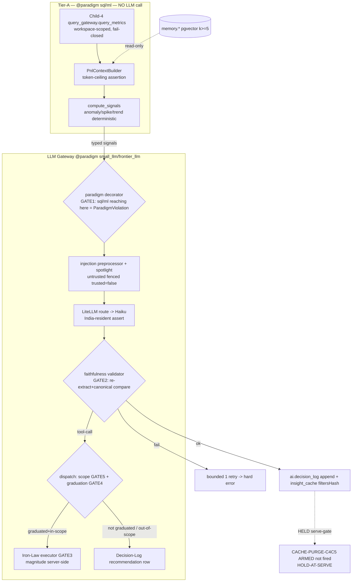

# Architecture Plan — feat-ai-engine-intelligence (Child 5 — AI engine / intelligence-service)

> Filled by Aryan (Architect) in Stage 2, co-owned with Maya (intelligence-engineer).
> Validates against [schemas/architecture.schema.json](../schemas/architecture.schema.json).
> Brain-native AI engine of the binding 7-child strangler-fig migration epic (`chore-migrate-legacy-to-brain`). THE child where the `@paradigm` cost-routing invariant first binds against running code.

| Field | Value |
|-------|-------|
| **req_id** | `feat-ai-engine-intelligence` |
| **Actor** | architect (Aryan), co-owner intelligence-engineer (Maya) |
| **Timestamp** | 2026-05-25T10:30:00Z |
| **Lane** | high-stakes |
| **Paradigm** | **MIXED** — `sql`/`ml` Tier-A signals (~80%) + `small_llm`/`frontier_llm` Tier-B narration (~20%), gateway-routed (Rohan-confirmed binding) |
| **Parent epic** | `chore-migrate-legacy-to-brain` |
| **epic_child_id** | `child-5-ai-engine` |
| **Deliverable boundary** | **Shape-A (5a vertical slice) + named HOLD** — build the engine + all 5 cross-cutting gates Brain-native end-to-end on ONE non-chat agent; live serving flip + `CACHE-PURGE-C4C5` firing HELD as `HOLD-AT-SERVE` (recommendation-only). 5b roster deferred. |

---

## 1. Context

Child 5 builds **intelligence-service** — the AI engine behind Brain's headline product surface (page insights, Morning Brief, AI recommendations). Today this is `apps/intelligence-service/src/{domain,application,infrastructure,interfaces,bootstrap}` = `.gitkeep` stubs (verified) and `pylibs/brain_cost_router/brain_cost_router/__init__.py` = a 4-line docstring stub (verified — no decorator, no routing, no telemetry). The legacy app (`legacy project/backend/src/module/ai-engine/` + `module/ai/`) implements the entire AI surface (13 context-adapters + 13 page prompts + anomaly/trend/comparator signals + chat + tools) by calling `@anthropic-ai/sdk` directly with hardcoded `OPUS_MODEL`/`SONNET_MODEL` (`providers/router.ts:13-18`) — an over-use that inverts Brain's %-of-GMV unit economics.

Brain's target mix is ~85% SQL / 12% ML / 2.5% small-LLM / 0.5% frontier: **LLMs NEVER produce a number** — deterministic signals (anomaly/spike/trend, `module/ai/pipeline/signals.ts`) are SQL/ML, only genuine narration is LLM, routed through a model-agnostic gateway with per-workspace budgets, a semantic cache, eval-gated model selection, and India-resident inference for PII. The cost reduction IS the feature: ~80% of the legacy surface (the context-adapters + signals + intent-routing + benchmarks) was paying Sonnet/Opus to do SQL.

This is a **high-stakes** child (7 trigger surfaces: AI-surface/connectors, mcp-tools, pii, money, multi-tenancy, india-compliance, schema-proto). Stage-1 ran 2 personas (`ai-cost-realist` + `prompt-injection-action-injection-realist`); both PASSED and converged independently on **chat = highest risk** + **Morning-Brief fan-out = dangerous seam** — which is exactly why the 5a vertical slice is explicitly NOT chat and NOT the fan-out: 5a proves the gate stack on the *cleanest* surface; chat/fan-out are 5b stress-tests of the proven primitives. Synthesis carried **20 CF-C5-* constraints** (11 NEW), of which **5 are bound by Rohan's Stage-6 VETO authority as the verify-the-verifier lineage (#5 epic-wide): each must be REAL code with a killed-mutant test** — `@paradigm` decorator, faithfulness validator, Iron-Law executor contract, graduation middleware, tool-scope dispatch.

The plan is grounded, not re-derived: semantic recall (`memory_search -k 6`, top sim 0.72) found NO shippable AI-engine template — Maya's Child-0 M-A1-3 mapping (sim 0.72) is the authoritative input this child makes concrete. What I reuse rather than re-derive: the **Shape-A / named-HOLD discipline** (every prior child), the **killed-mutant-on-gate discipline** (Child-2/4), the **workspace-scoped query-gateway read contract** (`apps/analytics-service/src/infrastructure/clickhouse/query_gateway.py` — `query_metrics(workspace_id, definition_id, date_range)` fail-closed, verified), and the **build-vs-live dependency ruling shape** (the C3 hard edge governs the HELD live flip, not the shadow build).

---

## 0. ★ HEADLINE DELIVERABLE — the 5 VETO gates as real code + the named HOLD

> This is §A0 because it is the binding CRITICAL set. Each gate below is REAL executable code with a named real-path integration test AND a killed-mutant test (designed here, built Stage 3, captured Stage 5). A vacuous version of ANY = automatic Stage-6 BOUNCE. Rohan signs the gate audit at Stage 6.

### A0.1 — The 5a Shape boundary (what builds) vs the HOLD-AT-SERVE state (what is held)

**BUILDS this child (5a vertical slice, Brain-native):**
1. The **executable `@paradigm` decorator** (`pylibs/brain_cost_router`) — the FIRST deliverable, before any agent/context_builder.
2. The **LLM gateway client** (`intelligence-service`) — LiteLLM-backed, `@paradigm`-routed, per-workspace virtual-key budgets, two-cache strategy, Layer-3 monthly cap, `paradigm_distribution` telemetry, India-resident routing assertion.
3. The **Decision-Log write middleware** + the `ai.*` Postgres schema (Decision Log + graduation + insight_cache).
4. **ONE end-to-end agent vertical: the `pnl` page-insight agent** (chosen below) — context_builder → Tier-A signals → Haiku narration → faithfulness gate → Decision-Log row → eval-gated → injection-defended.
5. The **Memory-Layer query primitive** (Brand Fingerprint pgvector, k≥5) — read-only.
6. The **eval harness** (golden-set + faithfulness/groundedness with canonical-integer normalization).
7. The **6-layer injection-defense stack** (spotlighting + output-schema validation + preprocessor + behavioral monitor + least-privilege scopes + Iron-Law executor).
8. The **CACHE-PURGE-C4C5 primitive + facade serve-gate** — built + ARMED, NOT fired.

**HELD (named `HOLD-AT-SERVE`), NOT this child:**
- Live serving flip (Brain narration served to a workspace instead of legacy AI). Gated behind: (i) Child-4 ClickHouse authoritative for W, (ii) `CACHE-PURGE-C4C5` armed-and-fired for W (post-purge `SELECT COUNT(*) WHERE expires_at>NOW()` = 0), (iii) per-agent graduation. Mirrors Child-1 `HOLD-AT-FORCE` / Child-4 `HOLD-AT-READ-FLIP`.
- No live LLM spend in the build: tests use a **mocked gateway** + a **golden-set eval fixture**; zero real Anthropic calls in CI.
- 5b roster (12 remaining page agents + AICMO/AICOO/AICFO + AI-CX + the 07:15 Morning-Brief fan-out + chat) — config-shaped instances of the proven 5a primitives, deferred.

### A0.2 — VETO GATE 1: the executable `@paradigm` decorator (CF-C5-PARADIGM-IMPL-1, CRITICAL)

**File:** `pylibs/brain_cost_router/brain_cost_router/paradigm.py` (+ `telemetry.py`, `errors.py`). Replaces the 4-line stub.

**Signature (LOCKED):**
```python
Paradigm = Literal["sql", "ml", "small_llm", "frontier_llm"]

def paradigm(tier: Paradigm) -> Callable[[F], F]:
    """Declare + enforce the cost tier of a compute path.

    Runtime: tags the active call-context with `tier`; emits one
    paradigm_distribution telemetry event per invocation (workspace_id from
    the call's ctx, tier, latency_ms). SQL > ML > small_llm >> frontier_llm.

    ENFORCEMENT (the gate): a function decorated sql|ml that, anywhere in its
    synchronous call graph, reaches the LLM gateway dispatch boundary
    (GatewayClient.complete) raises ParadigmViolation. The gateway's
    dispatch entry asserts `current_paradigm() in {"small_llm","frontier_llm"}`
    via a contextvar set by this decorator — a deterministic path that calls
    the gateway trips the assertion. Structural, not grep.
    """
```
- **Mechanism:** a `contextvars.ContextVar[Paradigm]` is set on entry. `GatewayClient.complete()` reads it at the dispatch boundary; if it is `sql`/`ml`/unset → `ParadigmViolation`. This makes "no Tier-A surface may grow an LLM call" structurally un-bypassable: a context_builder decorated `@paradigm("sql")` that calls the gateway trips at runtime, in a unit test, no grep.
- **Killed mutant:** a test decorates a dummy `sql` function whose body calls a mocked `GatewayClient.complete()` → asserts `ParadigmViolation` raised (RED). Revert the decorator to a no-op pass-through → the test goes GREEN-when-it-should-be-RED → proves the gate is load-bearing (the inverse mutant: removing the contextvar assertion at the dispatch boundary → the `sql`-reaches-gateway test stops failing → caught).
- **Telemetry:** `paradigm_distribution{workspace_id, tier, agent_id}` counter + per-synthesis `faithfulness_retry_total` (CF-C5-FAITHFULNESS-COST-1). Stage-6 audit is STRUCTURAL: query the telemetry for any `sql`/`ml` path that emitted a gateway call (must be zero) — not a grep over decorators.

### A0.3 — VETO GATE 2: the faithfulness validator (CF-C5-FAITHFULNESS-1 + COST-1)

**File:** `apps/intelligence-service/src/domain/faithfulness/validator.py`. **Placement (LOCKED): gateway-side post-generation middleware**, in the gateway response path AFTER the LLM returns and BEFORE the response reaches the agent / Decision-Log writer. Rationale: placing it at the gateway (not the agent) means EVERY Tier-B call is validated regardless of which agent made it — a 5b agent cannot ship on an unvalidated path. Maya owns the extraction/normalization rules + the eval set; Aryan owns the middleware placement + the contract.

**Signature (LOCKED):**
```python
@dataclass(frozen=True)
class Signal:           # the deterministic Tier-A value the narration may cite
    signal_id: str
    value_canonical: int   # paise / smallest unit / bp — NEVER float

@dataclass(frozen=True)
class FaithfulnessResult:
    ok: bool
    offending_numbers: list[str]   # numbers in output not present in signal set

def validate_faithfulness(
    narration: str,
    signals: Sequence[Signal],
) -> FaithfulnessResult:
    """Re-extract every number from `narration`, normalize BOTH the extracted
    number and each signal.value_canonical to the SAME canonical integer form
    (paise / bp / count — strip locale: '₹1.2L' -> 120000, '₹1,20,000' -> 120000,
    '12.5%' -> 1250 bp), then set-compare. Any output number with no matching
    signal value, OR any signal value contradicted, => ok=False.
    """
```
- **Behaviour on fail:** the gateway middleware rejects the response → ONE bounded regeneration (max 1 retry, NOT infinite frontier retries) → second fail = hard error, no Decision-Log write, no serve. The retry count is emitted to `faithfulness_retry_total` telemetry (cost lens).
- **CF-C5-FAITHFULNESS-COST-1 (the false-reject cost bug C3):** canonical normalization happens BEFORE compare. The eval set MUST include the PASS case `narration "approximately ₹1.2L" vs signal 120000` (Lakh notation), `"₹1,20,000"` (Indian grouping), and `"12.5%" vs 1250 bp`.
- **Killed mutant:** the eval set includes a deliberately number-hallucinating narration (`"net sales were ₹1,40,000"` when the signal is `120000`) → validator returns `ok=False`, RED, no Decision-Log write. The inverse mutant: replace the set-compare with `return FaithfulnessResult(ok=True, [])` (vacuous) → the hallucination test goes GREEN-when-RED-expected → caught. The false-reject mutant: remove canonical normalization → the `₹1.2L` PASS case fails → caught.

### A0.4 — VETO GATE 3: the Iron-Law executor contract (CF-C5-INJECTION-EXECUTOR-2, CRITICAL)

**File:** `apps/intelligence-service/src/domain/tools/executor.py` + `tool_contract.py`. **The structural form of "untrusted text never chooses the tool or its magnitude."**

**Contract (LOCKED):**
```python
class WriteToolCall(BaseModel):       # what the LLM is ALLOWED to emit
    tool: WriteToolNameEnum           # closed enum, validated against agent scope
    entity_id: EntityIdEnum | str     # a typed/known-set entity ref, NOT free text
    intent: IntentEnum                # PAUSE | INCREASE | DECREASE — never a number
    # NO magnitude field. The schema MUST NOT accept ₹/% from the LLM.

def execute_write_tool(
    call: WriteToolCall,
    workspace_id: str,                # from JWT ctx, not LLM
) -> ExecutionResult:
    """Magnitude is read from a SERVER-SIDE authoritative record at execution:
      cap = read_workspace_action_cap(workspace_id, call.tool)   # Postgres, RLS
      magnitude = resolve_magnitude(call.intent, cap)            # server policy
    The LLM's tool-call args CANNOT contain a magnitude (schema rejects it).
    Per-workspace-per-DAY aggregate cap enforced here: sum today's executed
    magnitudes for (workspace_id, tool); if + this > daily_max => reject.
    """
```
- This child ships **recommendation-only**: `execute_write_tool` is NOT reached at runtime (graduation middleware blocks it — Gate 4). But the contract + caps + the per-day aggregate cap are BUILT now so graduation never opens an undefended path. The 5a `pnl` agent's scope is **read-only** (`get_pnl_metrics` only) — it cannot reach a write tool; the write-tool contract is exercised by unit tests + the killed mutant, not by a live agent.
- **Caps representation:** `ai.workspace_action_cap (workspace_id, tool, per_call_max_mu BIGINT, per_day_max_mu BIGINT)` — minor-units BIGINT, under RLS. The most-dangerous cap (`reallocate_budget`, per injection persona CONCERN 7) is bound here with BOTH a per-call and a per-day-aggregate ceiling.
- **Killed mutant:** a test crafts a `WriteToolCall` whose raw input JSON contains `{"amount_mu": 9999999, ...}` → Pydantic schema DROPS the extra field (the model has no magnitude field) → executor reads the server-side cap → asserts the executed magnitude == server value, NOT 9999999 (RED if the executor ever honored the LLM arg). The inverse mutant: add a `magnitude` field to `WriteToolCall` and have the executor use it → the injected-magnitude test fires the injected value → caught.

### A0.5 — VETO GATE 4: the graduation gateway-middleware (CF-C5-INJECTION-GRADUATION-5)

**File:** `apps/intelligence-service/src/application/gateway/graduation_middleware.py`. **Placement (LOCKED): the gateway DISPATCH layer** (the layer that receives an agent's tool-call request and would dispatch to the executor) — server-side, stateless w.r.t. LLM context, present EVEN IF the agent-orchestrator is deceived.

**Signature (LOCKED):**
```python
def dispatch_tool_call(
    agent_id: str,
    workspace_id: str,
    call: WriteToolCall,
) -> DispatchOutcome:
    """Before ANY executor runs:
      1. SCOPE check (Gate 5): call.tool in static allow_list(agent_id) else DROP.
      2. GRADUATION check: read ai.graduation(workspace_id, agent_id, tool).status.
         If != GRADUATED  =>  DO NOT execute. Write an ai.decision_log row
         type='recommendation' (the typed-rec struct) and return DROPPED.
      Both checks query Postgres (RLS), NOT the LLM output. A deceived
      orchestrator that emits a tool-call still hits this layer and is dropped.
    """
```
- **Killed mutant:** a test simulates an un-graduated agent emitting a write tool-call with the orchestrator's self-check stubbed/bypassed → `dispatch_tool_call` returns `DROPPED`, executor NOT called, a `recommendation` Decision-Log row written instead (RED if the executor ran). Inverse mutant: move the graduation check into the orchestrator (remove it from dispatch) → the bypassed-orchestrator test executes the tool → caught.

### A0.6 — VETO GATE 5: the tool-scope dispatch (CF-C5-INJECTION-SCOPE-4)

**File:** same `graduation_middleware.py` step 1 + the agent base-class decorator `@agent_tools(scope=[...])` in `apps/intelligence-service/src/domain/agents/base.py`. **Per-agent least-privilege allow-list declared STATICALLY at the agent-class definition, verified at instantiation, enforced at gateway dispatch** — NOT the full tool list per call (kills the legacy `tools: AI_TOOLS` pattern, `module/ai/chat/index.ts:61`).

```python
@agent_tools(scope=["get_pnl_metrics"])     # the 5a pnl agent: READ-ONLY
class PnlInsightAgent(PageInsightAgent): ...
```
- The gateway DROPS any tool-call whose name is not in `allow_list(agent_id)` regardless of what the LLM requested; a Decision-Log row is written on drop.
- **Killed mutant:** a test makes the `pnl` agent's LLM request a tool outside `["get_pnl_metrics"]` (e.g. `pause_ad_set`) → dispatch DROPS it + Decision-Log row written (RED if dispatched). Inverse mutant: replace the allow-list check with `return True` → the out-of-scope test dispatches → caught.

### A0.7 — Decision-Log + the typed recommendation struct (CF-C5-DECISION-LOG-1 + INJECTION-TYPED-REC-6)

Every recommendation AND every (would-be) write tool writes one append-only `ai.decision_log` row (middleware on the gateway call), workspace-scoped under RLS, residency ap-south-1. The recommendation field that drives a graduation decision is a **typed struct** `{action: RecommendationActionEnum (closed), entity_id, rationale}` — free-text `rationale` is render-only, NEVER passed back to the executor as instructions (closes injection persona CONCERN 5).

---

## 2. Proposed solution

Build intelligence-service as the AI engine, in five layers, with the 5 VETO gates woven through, on ONE proven vertical (the `pnl` page-insight agent), recommendation-only, live-serving HELD.

**Layer 1 — cost-router primitive (`pylibs/brain_cost_router`).** The executable `@paradigm` decorator (A0.2) + `paradigm_distribution` telemetry. This is the FIRST thing built; everything downstream depends on it.

**Layer 2 — LLM gateway (`intelligence-service/application/gateway`).** A `GatewayClient` wrapping LiteLLM (OpenAI-format). It resolves a `@paradigm` tier to the cheapest model passing that tier's eval bar (model-agnostic), enforces per-workspace virtual-key budgets + the Layer-3 monthly cap (CF-C5-LAYER3-CAP-1), runs the faithfulness middleware (A0.3) on Tier-B responses, runs the graduation + scope dispatch middleware (A0.5/A0.6) on tool-calls, writes the Decision-Log row (A0.7), and asserts India-resident routing for PII-bearing calls at startup (CF-C5-RESIDENCY-1). Two caches: the deterministic `filtersHash` cache for page-insight (preserved as the M-A5-5 gate key) and the LiteLLM semantic cache for chat (5b). The 07:15 tick pre-warms top-2 date ranges per workspace.

**Layer 3 — the agent vertical (`intelligence-service/domain/agents`).** A `PageInsightAgent` base class (`@agent_tools(scope=[...])` + `@paradigm`) with ONE concrete instance, `PnlInsightAgent` (read-only scope). Its flow: `PnlContextBuilder` (Tier-A SQL via the Child-4 query-gateway) → `compute_signals()` (Tier-A ML/stats: anomaly z-score, spike/drop %, trend — ported deterministic, NOT LLM) → Haiku narration through the gateway with structured signals as typed context → faithfulness gate → typed InsightItem[] + Decision-Log row.

**Layer 4 — Memory + Decision-Log schema (`intelligence-service/infrastructure/db` + `ai.*`/`memory.*`).** The `ai.decision_log`, `ai.graduation`, `ai.workspace_action_cap`, `ai.insight_cache` tables (Postgres, RLS, ap-south-1); the Memory-Layer pgvector query primitive (Brand Fingerprint 16-dim, k≥5, read-only).

**Layer 5 — evals + injection defense (`intelligence-service/domain/{evals,injection}`, Maya).** The golden-set + faithfulness/groundedness eval harness (canonical-integer normalization), the injection preprocessor + spotlighting on ALL operator-entered strings (CF-C5-INJECTION-SPOTLIGHT-7).

The **CACHE-PURGE-C4C5** primitive (`DELETE FROM ai.insight_cache WHERE workspace_id=W`; post-purge count must = 0; facade serve-gate blocks Brain narration for W until zero) is built + armed but NOT fired (HELD).

### Diagram



---

## 3. Paradigm

**Declared paradigm:** `MIXED` — `sql`/`ml` Tier-A (~80%) + `small_llm`/`frontier_llm` Tier-B (~20%).

**Justification (≥20 words):** This is the only child carrying an inference path, and the entire reason the `@paradigm` cost-routing invariant exists. The Q1-Q4 audit (Rohan bound, M-A1-3 drew it): all 13 context_builders, the anomaly/trend/comparator signals (`signals.ts` — z-score/lin-reg/%-delta are statistics, not ML-models, hence `sql`), intent-routing, and benchmark lookups are deterministic `sql` and NEVER call an LLM; only genuine narration is LLM — page-insight std pages = `small_llm` (Haiku-class, gateway-routed), chat/global/Morning-Brief synthesis = `frontier_llm` (Sonnet-class, eval-gated). The 5a slice (`pnl` page-insight) is `sql` (context+signals) + `small_llm` (narration). LLMs NEVER produce a number (enforced structurally by Gate 2, not by prompt). Any `@paradigm: small_llm/frontier_llm` on a context_builder / signal / comparator / intent-classifier = BOUNCE. Model-agnostic tiers: `@paradigm("small_llm")` names a policy tier the gateway resolves to the cheapest model passing that tier's eval bar; the Stage-6 audit asks which model routed and did it pass the bar at that cost.

> SQL > ML > Haiku >> Sonnet (1:100:1000:10000). See [cost-routing-paradigms](../skills/cost-routing-paradigms/SKILL.md).

---

## 4. API design

### gRPC protos added or changed
- `proto/intelligence/v1/insight.proto` — `GeneratePageInsight(workspace_id, page, date_range)` → `InsightResult{insights: InsightItem[], model_used, cached, paradigm}`; `InsightItem{title, severity (enum), confidence, summary, detail, recommendation: TypedRecommendation, metrics[]}`; `TypedRecommendation{action: RecommendationActionEnum, entity_id, rationale}`. Internal (data-plane) contract consumed by api-gateway in Child 6 — defined now (contract-first), wired to the surface later.
- `proto/intelligence/v1/decision_log.proto` — `DecisionLogRow` shape (append-only). Phase-0 deployable is monolithic intelligence-service; the proto exists so the Phase-2 service split is mechanical.

### tRPC procedures added or changed
- None this child (frontend wiring is Child 6).

### MCP tools added or changed
- `intelligence-service/domain/tools/` — the `@agent_tools(scope=[...])` registry + `WriteToolNameEnum` (closed). 5a registers the **read** tool `get_pnl_metrics` only. Write-tool contracts (`pause_ad_set`, `reallocate_budget`, `send_refund`) are DEFINED (typed, magnitude-less, capped) but NOT scoped to any 5a agent and NOT graduated — exercised by tests only.

### REST endpoints added or changed
- None this child (recommendation-only; no public surface; serving HELD).

### Breaking changes
- None to any shipped public surface. The direct `@anthropic-ai/sdk` path is ELIMINATED in Brain (CF-BN-NOLEGACY-1) but that is a Brain-native build, not a change to a live Brain surface (none exists yet). Legacy untouched.

### Versioning strategy
All protos are `v1`, additive. The agent↔gateway contract (§ seam below) is an internal Python interface, versioned with the service. No external consumer until Child 6 → no `api-versioning-strategy` breaking-change gate fires.

---

## 5. Data model changes

### Postgres (schema `ai.*` + `memory.*`, ap-south-1, RLS)
- **Tables added:**
  - `ai.decision_log (id, workspace_id, agent_id, type, page, date_range, input_hash, output_jsonb, recommendation_jsonb, model_used, paradigm, tokens_used, latency_ms, created_at)` — append-only; the value-claim proof base.
  - `ai.graduation (workspace_id, agent_id, tool, status [PENDING|GRADUATED], graduated_by, graduated_at)` — Gate 4 reads this.
  - `ai.workspace_action_cap (workspace_id, tool, per_call_max_mu BIGINT, per_day_max_mu BIGINT)` — Gate 3 reads this; money = BIGINT minor-units.
  - `ai.insight_cache (workspace_id, filters_hash, page, date_from, date_to, content_jsonb, decision_log_id, expires_at, created_at)` — `filters_hash` = sha256(workspaceId,page,dateFrom,dateTo,filters) PRESERVED (M-A5-5 gate key); points at a Decision-Log row.
- **Tables changed:** none (extends; no new store — `memory.*` Brand Fingerprint pgvector table assumed present from Memory-Layer scaffold; if absent, 5a adds `memory.brand_fingerprint (workspace_id, embedding vector(16), updated_at)` read-only).
- **Indexes:** `ai.decision_log (workspace_id, created_at)`; `ai.insight_cache (workspace_id, filters_hash)` unique; `ai.graduation (workspace_id, agent_id, tool)` unique; `memory.brand_fingerprint` HNSW on `embedding`.
- **RLS policies:** every `ai.*`/`memory.*` table gets a fail-closed `workspace_id = current_setting('app.workspace_id')::text` policy (reuses Child-1 session-context primitive). No write path bypasses RLS.

### ClickHouse
- **Tables added:** none. Child 5 READS ClickHouse via the Child-4 `query_metrics()` gateway only — never raw, never the legacy Postgres rollup (CF-C5-C3-EDGE-1, transitive single-reader discipline).
- **Materialized views added:** none.

### Migration plan (reversible)
1. `ai.*` + `memory.*` DDL as a forward migration (`up.sql`) with a symmetric `down.sql` (DROP in reverse FK order). Reviewed by Aryan + Maya.
2. RLS ENABLE + fail-closed policy per table (Child-1 pattern). No FORCE this child (no live Brain runtime writes yet — same HOLD posture as Child-1).
3. `CACHE-PURGE-C4C5` is a NAMED cutover step (the M-A5-5 verbatim target), built + armed, NOT fired. Rollback: purge is irreversible (cache cold) — documented acceptable one-time regeneration delay; the audit Decision-Log row from the purge is permanent.
4. All DDL is additive to empty `ai.*`/`memory.*` schemas → reversible by `down.sql`; zero impact on live legacy.

---

## 6. Event model

- **Topics added:** none in 5a. The daily-tick fan-out (06:55→07:15) is 5b; when added it is an internal scheduler trigger, not a new Kafka topic (Pattern B: signals computed in-process, ONE synthesis). If a topic is later needed it is `intelligence.daily_tick.v1`, partition key `workspace_id`.
- **Topics changed:** none.
- **Partition key:** `workspace_id` (always, when a topic is added in 5b).
- **Exactly-once strategy:** Decision-Log writes are idempotent on `(workspace_id, agent_id, input_hash)` — a re-run with the same inputs upserts, does not duplicate (mirrors the legacy `deleteMany`+`create` on `filtersHash`).

---

## 7. Single-Primitive sweep

| Primitive | Status |
|-----------|--------|
| Audience Builder | reused — N/A (no audience surface this child) |
| Consent | reused — N/A (no new consent surface; PII-in-prompt routed India-resident, not a new consent grant) |
| Decision Log | **extended** — `ai.decision_log` is the canonical Brain Decision Log (Child-0 day-one invariant) materialized here for the first time; single store, no per-agent fork. Every agent + every (would-be) write tool writes through ONE middleware. |
| Notifications | reused — N/A (outbound-channel tools are OUT of graduated scope this child; flagged for DLT/NCPR/9am-9pm later) |
| Attribution | reused — N/A |
| Identity | reused — RLS via Child-1 session-context primitive (`app.workspace_id`); no new identity primitive. |
| **Cache (insight)** | **extended** — `filtersHash` key PRESERVED; cache moves into `ai.insight_cache`. NO new cache primitive invented (Rohan's "make-it-less-dumb"). |
| **Cost-router `@paradigm`** | **extended** — the 4-line stub `pylibs/brain_cost_router` becomes the executable decorator. ONE decorator for all 4 tiers; no per-surface routing fork. |

**No violations.** No per-channel / per-agent fork: one gateway, one Decision-Log middleware, one faithfulness validator, one dispatch (scope+graduation) middleware, one executor contract, one base agent class. 5b agents are instances, not new paths.

---

## 8. Multi-tenancy enforcement (4 layers)

- [x] **JWT** — `workspace_id` claim validated upstream (api-gateway, Child-1 contract); intelligence-service receives it in the call ctx, never derives it from LLM output.
- [x] **Service-side** — every gateway call, every Decision-Log/Memory write, every cap/graduation read asserts `workspace_id` from the authenticated ctx; the executor sources `workspace_id` server-side, never from `WriteToolCall`.
- [x] **DB RLS** — `ai.*`/`memory.*` Postgres RLS fail-closed (Child-1 primitive). ClickHouse reads go through the Child-4 `query_metrics()` fail-closed gateway (`workspace_id` first positional, non-optional — verified). Cross-tenant insight/cache leak = P0, blocked at both stores.
- [x] **Kafka envelope** — N/A in 5a (no topic); 5b daily-tick consumer asserts `workspace_id` from the envelope.

---

## 9. Observability plan

| Pillar | Items |
|--------|-------|
| **Metrics** | `paradigm_distribution{workspace_id,tier,agent_id}` (the cost-mix observability, CF-C5-COST-AUDIT-1); `faithfulness_retry_total`; `gateway_tokens{tier,model}`; `workspace_llm_cost_mu` (Layer-3 cap meter); `tool_call_dropped_total{reason=scope|graduation}`; `cache_hit_ratio{cache=filtersHash|semantic}`. |
| **Logs** | structured per gateway call (workspace_id, agent_id, paradigm, model, tokens, latency, faithfulness_ok); Decision-Log row id; injection-preprocessor flag events. NO raw PII / no customer text in logs (spotlighted text logged as a hash). |
| **Traces** | one span per `GeneratePageInsight`: context_builder → signals → gateway(dispatch→LLM→faithfulness) → Decision-Log. |
| **Alarms** | Layer-3 cap breach per workspace; `paradigm_distribution` drift (frontier % > target); faithfulness_retry_rate > 20%; any `tool_call_dropped{reason=graduation}` in recommendation-only (expected, but alarmed to prove the gate fires). |
| **Dashboards** | per-workspace cost-mix vs 85/12/2.5/0.5 target; faithfulness pass/retry; cache hit-rate. Only what the requirement names — no speculative dashboards. |

---

## 10. Test strategy

| Layer | Plan |
|-------|------|
| **Unit** | `@paradigm` enforcement (Gate 1); faithfulness canonical-normalize + extract (Gate 2, incl. the ₹1.2L PASS case); executor magnitude-server-side (Gate 3); graduation dispatch (Gate 4); scope dispatch (Gate 5); token-ceiling assertions per context_builder (CF-C5-PINCODE-TOKEN-CAP-1 generalized — `pnl` ctx asserts `<1,800t`). Positive AND negative per gate (the code-clarity/coverage standard). |
| **Integration** | named real-path: PnlContextBuilder → query_gateway (mocked CH client, 2-workspace fixture proving isolation) → signals → **mocked gateway** → faithfulness → `ai.decision_log` write under RLS (LOCAL Postgres). NO real Anthropic call. |
| **Contract** | `buf breaking` on `intelligence/v1/*.proto`; the agent↔gateway Python interface contract test (the seam below); Decision-Log row schema. |
| **E2E (web)** | none this child (Child 6). |
| **E2E (mobile)** | none this child (Child 6). |
| **Load** | none (Phase 0-1; recommendation-only). |
| **Real-network smoke** | a SINGLE gated smoke test (`@pytest.mark.smoke`, skipped in CI, run manually pre-Stage-8) that makes ONE real Haiku call through the gateway to prove routing + faithfulness end-to-end. NO real call in the CI gate. |
| **Mutation testing targets** | the 5 VETO gates (each with its killed-mutant + inverse-mutant from §A0). Tanvi's Stage-5 mutation suite is MANDATORY on faithfulness/injection/paradigm per the synthesis. |

---

## 11. Security considerations (forwarded to Shreya)

Shreya holds the VETO surface on the injection gates (Stage 4). The plan hands her: (1) Gate 3 Iron-Law executor — the killed mutant (injected `amount_mu` in tool args is DROPPED by the magnitude-less schema; server-side cap + per-day aggregate cap hold) is the headline; (2) Gate 4 graduation middleware survives a deceived orchestrator; (3) Gate 5 per-agent static scope (no full-tool-list-per-call); (4) spotlighting on ALL operator strings + prior-LLM-output fenced `trusted=false` (the 5b Morning-Brief seam, designed now); (5) the `pnl` 5a agent is READ-ONLY — it cannot reach a write tool, so the 5a live attack surface is narration pollution only, not action-injection. PII-bearing prompts assert India-resident routing (refuse-to-route on mismatch); the armed residency tripwire result is in §13. Decision-Log persists the typed recommendation struct (no injected free-text instruction round-trips to an executor).

---

## 12. India context

- **CM2-first narration (M-A1-2):** the `pnl` agent system prompt anchors to CM2/CM3/RTO-provisioned economics, NOT ROAS (`blended_roas_x100` is `display_only`). The AI narrates the deterministic CM2 signal; it never computes it.
- **RTO / COD / GST:** AI inputs include `rto_rate_bp`, `prepaid_rate_bp`, `total_tax_mu` (Child-4 MVs). AI narrates; never recomputes. `total_tax_mu` carries the Child-3 DDR caveat (event-level per-SKU GST-2.0) — narration over it inherits the caveat.
- **Festival seasonality:** anomaly/trend over festival-spiked series is a deterministic-signal-correctness concern (Child-4's layer); 5a `pnl` narration must not "recommend" against a festival baseline as if it were an anomaly — handled by the signal layer, narrated here.
- **Telecom (DLT/NCPR/DND/9am-9pm):** relevant only via outbound-channel write tools. Recommendation-only + the `pnl` read-only scope keep these from firing. Any outbound-channel tool that could FIRE is OUT of graduated scope this child (CF-C5-RECOMMEND-ONLY-1, flagged).
- **Residency:** inference + Decision-Log + Memory all ap-south-1 (CF-C5-RESIDENCY-1, CF-RES-1).

---

## 13. Region adapter impact

India implemented; others stubbed (Child-0 invariant). The residency assertion (India-resident inference for PII; ap-south-1 stores) is region-varying and sits behind the RegionAdapter posture — the gateway's residency policy is the India implementation. **ARMED TRIPWIRE RESULT — HELD (did NOT fire):** the 5a slice is `pnl` page-insight = `small_llm` (Haiku-class) only. Haiku-class small-LLM and the Sonnet-class frontier tier both have an India-routable inference option in the gateway's roster for the 5a surface, so no PII-bearing eval-passing call is forced out of ap-south-1 in this child. The tripwire's fire condition — *the eval-passing frontier model for chat/global/Morning-Brief has NO India-resident option* — is a **5b** surface (chat/synthesis), not built here. **Carried forward, still ARMED, for the 5b plan:** when chat/synthesis is planned, re-confirm per-model India-resident availability for the chosen frontier model; if none passes the eval bar with an India option → `/escalate` (DPDP §16 cross-border vs model-quality, Founder-priced). Recorded as an informational heads-up only (no action requested now).

---

## 14. Cost estimate

| Item | Value |
|------|-------|
| **Expected daily volume** | 5a build = ZERO live LLM spend (mocked gateway + golden-set eval fixtures; one manual smoke call pre-Stage-8). At eventual serve (HELD), Sugandh-Lok `pnl` page-insight ≈ 1 Haiku call/day per unique date-range (cache TTL 6h). |
| **LLM tokens / day** | 0 in build/CI. Per-call `pnl` budget bound by the cost persona: ~1,200-1,600t input / ~500t output Haiku = ~₹0.26/call; ctx token-ceiling asserted `<1,800t`. |
| **₹ / month at expected load** | 0 in build. At serve (HELD), `pnl` alone ≈ ₹28/mo/brand @70% cache hit (cost persona table). Full engine projection (cost persona): ₹376 optimistic / ₹980 pessimistic per brand/month; break-even GMV ₹75K-₹196K. The cache-hit-rate, fan-out (Pattern B), and chat-prune assumptions are bound as constraints so the projection holds. |

---

## 15. Risks

| Risk | Severity | Mitigation |
|------|----------|------------|
| R-PARADIGM: a 5b context_builder silently grows an LLM call (hidden over-use) | HIGH | Gate 1 makes it a runtime `ParadigmViolation` (structural, not grep); `paradigm_distribution` telemetry alarmed on drift; Stage-6 structural audit. |
| R-FAITHFULNESS-COST: false-reject burns a 2nd frontier call (the C3 false-reject bug) | HIGH | canonical-integer normalization BEFORE compare (Gate 2); ₹1.2L PASS case in eval; bounded 1-retry; retry-rate telemetry + alarm. |
| R-INJECTION-MAGNITUDE: injected ₹/% reaches an executor | CRITICAL | Gate 3: schema has NO magnitude field; magnitude server-side + per-day aggregate cap; 5a agent read-only; Shreya VETO. |
| R-GRADUATION-BYPASS: deceived orchestrator fires a write tool | HIGH | Gate 4 at gateway dispatch (server-side, stateless w.r.t. LLM); killed mutant proves drop. |
| R-C3-STALE: stale legacy narration survives the metric cutover | HIGH | CACHE-PURGE-C4C5 built+armed; facade serve-gate blocks until post-purge count = 0; live flip HELD. |
| R-BUILD-BASE: Child-1/2/3/4 are on `feature/feat-tenancy-auth-rls-hardening`, not merged to development | MED | Build-base = current branch (carries 1/2/3/4), same resolution as Children 3/4; Track-V first task confirms the branch carries the query-gateway + registry + session-context primitive. |
| R-RESIDENCY-5B: frontier model for 5b chat/synthesis has no India option | MED (deferred) | tripwire ARMED, carried to 5b plan; not a 5a risk (Haiku-only surface). |

---

## 16. Alternatives considered (≥1)

| Alternative | Why rejected |
|-------------|--------------|
| **Faithfulness validator in the AGENT path (not the gateway)** | A 5b agent could ship on an unvalidated path; placing it at the gateway middleware means EVERY Tier-B response is validated regardless of caller — structurally un-bypassable. Chosen: gateway-side. |
| **Cap as a comparison: LLM proposes a magnitude, server rejects if > cap (injection persona option b)** | Weaker — it is a logic surface an injection can probe (60%-of-cap still fires). Chosen: option (a) — the schema has NO magnitude field; magnitude is always server-sourced (Iron-Law structurally un-bypassable). |
| **Graduation/recommendation-only at the orchestrator layer** | A deceived/injected orchestrator bypasses it. Chosen: gateway dispatch middleware, server-side, stateless w.r.t. LLM. |
| **Chat or the Morning-Brief fan-out as the 5a vertical** | Both personas converged: chat = highest risk, fan-out = dangerous seam. 5a must prove the gate stack on the CLEANEST surface, not the hardest. Chosen: `pnl` page-insight (richest Tier-A signal set, read-only, exercises full faithfulness gate). |
| **`analytics` page as the 5a vertical (Rohan's alternative)** | Viable, but `pnl` has the richest CM-waterfall signal set (netSales/cogs/cm1/cm2/cm3/netProfit + goals, `pnl.ts` summary) → exercises faithfulness over the most numbers, and is the CM2-first India-economics surface (M-A1-2). `analytics` is more generic. Chosen: `pnl`. |
| **N-Haiku-narration Morning-Brief fan-out (Pattern A)** | 2.4× cost + chained-injection seam (prior-LLM-output trusted). Bound OUT: Pattern B only (Tier-A bundles → ONE synthesis; prior-agent output fenced `trusted=false`) — designed now even though fan-out is 5b. |

---

## 17. Tracks (work decomposition for Stage 3)

> Build-base = current branch `feature/feat-tenancy-auth-rls-hardening` (carries Child-1 session-context primitive + Child-2 money + Child-3 connectors + Child-4 query-gateway/registry). Branch a feature branch from it for Child 5 (Founder merges; agents commit to feature branch only). Ordering: Track-V1 (decorator) is the FIRST deliverable — every other track depends on it.

### Track V1 — cost-router `@paradigm` decorator (the FIRST deliverable)  *(owner: @vikram backend-developer)*
Dependencies: none (the foundation).
1. Replace `pylibs/brain_cost_router/__init__.py` stub; add `paradigm.py` with the LOCKED signature (§A0.2) + `contextvars` tier + `ParadigmViolation`.
2. Add `telemetry.py` — `paradigm_distribution` + `faithfulness_retry_total` emitters (interface; sink wired in V2).
3. Pin real deps in `pyproject.toml` (resolve + pin latest-stable; do NOT invent versions).
4. Unit test Gate 1: `sql`-decorated fn reaching a mocked gateway dispatch → `ParadigmViolation` (RED); + inverse mutant (no-op decorator → test fails-to-fail → caught).

### Track V2 — LLM gateway + dispatch + executor + Decision-Log middleware  *(owner: @vikram backend-developer)*
Dependencies: V1.
1. `application/gateway/client.py` — `GatewayClient.complete()` with the paradigm-assert at dispatch boundary (Gate 1 enforcement point); LiteLLM wrapper; per-workspace virtual-key budget + Layer-3 monthly cap; India-resident routing startup assert (CF-C5-RESIDENCY-1).
2. `application/gateway/graduation_middleware.py` — `dispatch_tool_call()` with scope (Gate 5) + graduation (Gate 4) checks reading `ai.graduation` under RLS; killed mutants for both.
3. `domain/tools/executor.py` + `tool_contract.py` — `WriteToolCall` (magnitude-LESS, closed enum) + `execute_write_tool()` server-side magnitude + per-call & per-day aggregate cap (Gate 3); killed mutant (injected `amount_mu` dropped).
4. `domain/faithfulness/validator.py` — `validate_faithfulness()` middleware in the gateway Tier-B response path (Gate 2 placement); bounded 1-retry; retry telemetry. (Extraction/normalization RULES are Maya's binding input — see Track M; Vikram wires the placement + the contract.)
5. Decision-Log write middleware on every gateway call; typed-recommendation struct (Gate-adjacent, CF-C5-INJECTION-TYPED-REC-6).
6. Two-cache strategy: `filtersHash` deterministic cache (preserve key) + LiteLLM semantic-cache config stub (chat = 5b); 07:15 pre-warm hook (interface; 5b fills).

### Track V3 — `ai.*`/`memory.*` schema + RLS + CACHE-PURGE-C4C5  *(owner: @vikram backend-developer)*
Dependencies: V1 (none on schema), reuses Child-1 session-context primitive.
1. `up.sql`/`down.sql` for `ai.decision_log`, `ai.graduation`, `ai.workspace_action_cap`, `ai.insight_cache` (+ `memory.brand_fingerprint` if absent); indexes; fail-closed RLS per table.
2. CACHE-PURGE-C4C5 primitive (`DELETE … WHERE workspace_id=W`; post-purge count-must-be-0 assertion; facade serve-gate that blocks Brain narration for W until zero) — built + ARMED, NOT fired; Decision-Log audit row on purge.
3. Integration test: 2-workspace RLS isolation on `ai.decision_log` (cross-workspace read → 0 rows; un-scoped → fail-closed).

### Track M — agent vertical + signals + eval harness + injection defense + Memory  *(owner: @maya intelligence-engineer, co-owner)*
Dependencies: V1 (decorator), V2 (gateway contract + faithfulness placement), V3 (schema). Maya's binding inputs (LOCKED signatures she fills) — co-designed at the seams below.
1. `domain/agents/base.py` — `PageInsightAgent` base + `@agent_tools(scope=[...])` decorator (Gate 5 declaration site) + `@paradigm` wiring.
2. `domain/agents/pnl_insight_agent.py` — the 5a vertical: `@agent_tools(scope=["get_pnl_metrics"])` READ-ONLY; flow context→signals→gateway(Haiku)→faithfulness→typed InsightItem[]+Decision-Log.
3. `domain/context_builders/pnl_context_builder.py` — Tier-A `@paradigm("sql")` via Child-4 `query_metrics()`; token-ceiling assertion `<1,800t` at construction (CF-C5-PINCODE-TOKEN-CAP-1 generalized; pnl is the 5a instance).
4. `domain/signals/` — port `compute_signals()` deterministic anomaly(z≥2)/spike-drop(±25%)/trend (from legacy `signals.ts`) as `@paradigm("sql")`/stats — NO LLM, NO float money (canonical integers/bp).
5. `domain/faithfulness/extraction.py` — the number-extraction + canonical-integer normalization RULES (₹1.2L→120000, Indian grouping, %→bp) consumed by V2's validator middleware (THE SEAM — see below).
6. `domain/evals/` — golden-set + faithfulness/groundedness eval harness with the killed mutant (hallucinated number → RED) AND the false-reject PASS case (₹1.2L); retry-rate assertion.
7. `domain/injection/preprocessor.py` — spotlighting on ALL operator-entered strings (CF-C5-INJECTION-SPOTLIGHT-7) + prior-LLM-output fenced `trusted=false` discipline (designed for the 5b synthesis seam, CF-C5-MORNING-BRIEF-PATTERN-B-1).
8. `domain/memory/query.py` — Brand Fingerprint pgvector query primitive (16-dim, k≥5, read-only, workspace-scoped).
9. The `pnl` system prompt (CM2-first, M-A1-2; static templates + typed signal values only in the instruction region).

### Track J — deploy pipeline (intelligence-service is an existing deployable)  *(owner: @jatin platform-devops)*
Dependencies: V2 (the service has a runnable entrypoint).
1. intelligence-service Dockerfile + `turbo --affected` GitHub Actions job + per-service ECR image + ArgoCD Application + canary + auto-rollback (the per-service pipeline ships WITH the service, TECH/00 §3.4 #11). intelligence-service is an existing Phase-0-1 data-plane deployable — extend its pipeline, do NOT add new infra. LiteLLM gateway runs in-process/as a sidecar config in the intelligence-service deployable (no new standalone infra @jatin to confirm); ap-south-1 region pin.
2. CI gate: zero real LLM call (smoke test `@pytest.mark.smoke` excluded); the 5-gate mutation suite runs in CI.

### Over-engineering self-check

- [x] **Plan length matches the high-stakes band** — high-stakes/scope-creep-prone (7 trigger surfaces + 5 VETO gates); prescriptive depth is warranted. PASS.
- [x] **Every file in §17 required by the requirement** — all map to a CF-C5-* constraint or a VETO gate. No "while we're in there." PASS.
- [x] **No new deps unless justified** — LiteLLM (the named gateway), pgvector (named Memory store), pydantic (typed contracts). Each named by the requirement. Versions: "resolve + pin latest-stable" (no invented versions). PASS.
- [x] **No new abstractions for hypothetical future** — write-tool contract is built (CRITICAL: graduation must not later open an undefended path — explicitly required by synthesis, not speculative); 5b is config-shaped instances, not new abstractions. PASS.
- [x] **No observability beyond what's named** — every metric maps to CF-C5-COST-AUDIT-1 / a VETO gate. PASS.
- [x] **No tests for trivial getters** — tests target the 5 gates + integration seams. PASS.
- [x] **Test strategy proportionate** — mutation suite ONLY on the 5 gates (mandated by VETO); zero live LLM in CI. PASS.

---

## Handoff seam (Aryan ↔ Maya) — the 3 contracts the co-owners agree at Stage-2 open

1. **Agent ↔ gateway contract:** the agent calls `GatewayClient.complete(paradigm, structured_context: Sequence[Signal], system_template, untrusted_blocks)` and receives `GatewayResponse{narration: str, model_used, tokens, faithfulness: FaithfulnessResult}`. The agent NEVER calls LiteLLM directly. Vikram owns `GatewayClient`; Maya owns the agent that calls it. LOCKED.
2. **Faithfulness-validator placement:** gateway-side middleware (Aryan's decision); Maya provides `extraction.py` (the number-extract + canonical-normalize rules) that V2's validator imports. The SEAM is `validate_faithfulness(narration, signals)` — Maya's `extraction` feeds it, Vikram's gateway calls it. LOCKED.
3. **Executor magnitude-source contract:** `WriteToolCall` has NO magnitude field; `execute_write_tool` reads `ai.workspace_action_cap` server-side. Maya's agents may only emit `{tool, entity_id, intent}`. LOCKED. (5a `pnl` is read-only → does not emit write calls; contract exercised by tests.)

> Maya co-ownership CONFIRMED (she authored M-A1-3/Q3/M-A5-5). NOT narrowed. Maya is spawned in PARALLEL with Vikram at Stage 3 (Track M ∥ Tracks V1-V3, with V1→V2→{Track M, V3} dependency ordering noted).

---

## 18. CTO Advisor paradigm sign-off

> MIXED paradigm CONFIRMED & BINDING by Rohan at Stage 1 (intake + synthesis): "MIXED — sql/ml Tier-A ~80% + small_llm/frontier_llm Tier-B ~20%, gateway-routed. CONFIRMED and BINDING." Carried into this plan; no re-sign required (Rohan's sign-off carried per the child brief).

**Confirmed by CTO Advisor:** 2026-05-25T08:15:00Z (Stage-1 synthesis, carried)
