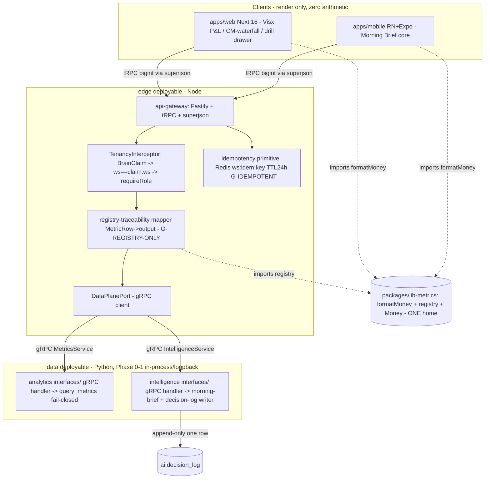

# Architecture Plan — feat-frontend-dashboard-morningbrief (Child 6 of EPIC chore-migrate-legacy-to-brain)

> Filled by Aryan (Architect) in Stage 2. BINDING. Stages 3–8 execute this plan; any required deviation routes back through the Aryan amendment loop (§A0.5) — never freelancing.
> Pairs with `07-handoff-to-developer.md` (prescriptive builder handoff). High-stakes lane.

| Field | Value |
|-------|-------|
| **req_id** | `feat-frontend-dashboard-morningbrief` |
| **Actor** | architect (Aryan) |
| **Timestamp** | 2026-05-25T08:30:00Z |
| **Lane** | high-stakes (auth · multi-tenancy · money · schema-proto · pii · india-compliance) |
| **Paradigm** | `sql` / render-only (Rohan Stage-1 intake + synthesis sign-off CARRIED; affirmed below, no re-invoke) |
| **Scope** | 6a runnable vertical (this build) → 6b long tail (deferred). Live operator cutover HELD (`CF-C6-HOLD-AT-ROUTE-FLIP`). |
| **Builders** | Vikram (BFF + data-seam spine + 3 integrity gates — critical path) · Ananya (web) · Karan (mobile) · Maya (CONSULT only) |
| **Build base** | current branch `feature/feat-tenancy-auth-rls-hardening` (carries committed Child-1/2/4/5) |

---

## 1. Context

Child 6 is the child that makes Brain **visible** — the Founder's explicit standing directive is "a runnable app I can SEE." The legacy frontend is Next/Zustand + axios→REST; Brain's stack is locked (Next 16 / Tamagui / Visx / tRPC / Redux Toolkit / TanStack Query / RN+Expo). The UI **renders** numbers from the metric registry (Child 4) and AI recommendations (Child 5) — it NEVER computes a metric, never calls an LLM, never produces a number. Money displays come from BIGINT minor-units formatted at the edge.

**Ground truth (verified on disk this session, not trusted from prose):**
- `apps/api-gateway`, `apps/web`, `apps/mobile` are **bare `.gitkeep` DDD scaffolds** — `package.json` stubs, zero implementation, zero tRPC anywhere (`apps/web/package.json` even still says "Next.js 15" — a stale stub; the locked stack is Next **16**, flagged in §15 R7).
- **No gRPC service surface exists.** `protos/` has only `brain/health/v1/health.proto` + `events/integrations.proto`. There is no `MetricsService`/`IntelligenceService`/`WorkspaceService` proto. `apps/analytics-service/src/interfaces/` + `apps/intelligence-service/src/interfaces/` are bare — the Python data plane exposes in-process functions only.
- The **data-plane functions exist** (Python, in-process): `analytics-service` `query_metrics(workspace_id: str, definition_id: str, date_range: DateRange, *, _client) -> list[MetricRow]` (fail-closed `UnscopedQueryError`, `query_gateway.py:199`); the registry pair (`packages/lib-metrics/src/registry/` ↔ `pylibs/brain_metrics/.../registry/`); Child-5 `InsightItem{TypedRecommendation{action:closed-enum, entity_id, rationale:render-only}}` (`recommendation.py`) + the graduation middleware decision-log write path (`graduation_middleware.py:221 _write_decision_log`).
- The **Child-1 auth contract exists Brain-native**: `apps/core-service/src/domain/auth/brain-claim.ts` (5-role model, `requireRole()`, the `WORKSPACE_ROLE_LEVEL` map, and an explicit forward note: "A future router MUST assert `request.workspace_id == claim.workspaceId` before calling `withWorkspace`") + `infrastructure/db/workspace-context.ts` (`withWorkspace`/`withSuperadmin`).
- The **money primitive home exists**: `packages/lib-metrics` — `Money`/`makeMoney`/`subunitMultiplier` (CF-C2-SUBUNIT-1: never hardcode 100). **There is NO `formatMoney` display formatter anywhere in Brain** (grepped — confirmed). The TS `MetricUnit` already includes `'x100'`; the Python `MetricUnit` is `Literal["mu","bp","count"]` (NO `x100`) and `blended_roas_x100` uses `unit:"bp"` on BOTH sides — the ROAS divergence the number-fidelity persona found.

**The load-bearing implication (both personas converged on it):** Child 6 is **not pure frontend**. To render even one number end-to-end, the **api-gateway tRPC BFF + auth/tenancy choke point + the gateway↔Python-data-plane read seam must be built from zero** — and the integrity contracts that protect money-faithfulness (G-BIGINT, G-REGISTRY-ONLY) and the moat (G-IDEMPOTENT) must be specified at the proc layer **before** any card or mutation is written. That BFF seam (`CF-C6-DATA-SEAM-1`) is THE Stage-2 must-decide and is ruled in §2 below. This is the Shape-B "figure-it-out-during-build" trap that bit Child 1, now wearing a BFF hat — so it is ruled here, not deferred.

---

## 2. Proposed solution

**THE DATA-SEAM RULING (`CF-C6-DATA-SEAM-1`, CRITICAL): proto-first gRPC contracts authored now, bound IN-PROCESS at runtime in Phase 0–1.** This is not a compromise — it is exactly what `technical-context.md:76` mandates: *"Phase 0–1 = the `data` deployable (Python: ingestion + analytics + intelligence in one process)… Because gRPC contracts exist from day one, splitting is mechanical (flip in-process call → network call), not a rewrite."* And `:139` names the two contracts by name: `MetricsService` + `IntelligenceService`. So:

1. **Author the protos now** — `protos/brain/metrics/v1/metrics.proto` (`MetricsService.QueryMetrics`, `GetKpiSummary`, `GetPnlWaterfall`) + `protos/brain/intelligence/v1/intelligence.proto` (`IntelligenceService.GetMorningBrief`, `SubmitInsightResponse`, `RegisterPushToken`). These ARE the contract the later 7-service split is mechanical against. Money fields are `int64` minor units + a `string currency_code`; the JSON seam to the client is `bigint` via **superjson** (canon `:139`). The amended `InsightItem` carries `expected_impact{revenue_mu,cm2_mu,impact_label} + risk` (the §3-ruled CF-C6-MB-CONTRACT-COMPLETENESS-1 amendment).
2. **Bind in-process at runtime** — the api-gateway's data-plane adapter implements a single `DataPlanePort` interface. In Phase 0–1 the `data` deployable is a Python process; the gateway reaches it via a thin **gRPC handler on the Python side** (in `analytics-service/src/interfaces/` + `intelligence-service/src/interfaces/`, the bare folders) that wraps the existing in-process `query_metrics` / morning-brief functions, served on a **localhost loopback** inside the LOCAL harness (and, in Phase-0 deploy, same-task sidecar). The gateway always speaks the gRPC contract. **There is no second code path** to delete at the split — the wire is already gRPC; what graduates is only the network topology (loopback → cross-task), which is config, not code.
3. **Why not pure in-process (TS calling Python directly)?** Impossible across the runtime boundary (Node→Python) without a wire protocol anyway; and a bespoke HTTP/JSON shim would be the throwaway second path the canon explicitly forbids. **Why not the full split-service gRPC mesh now?** Over-build — `technical-context.md:76` defers the 7-service split + EKS to Phase 2; building it now multiplies infra with zero parity benefit. The ruled middle — **proto-first contract, in-process/loopback binding** — is the canon's "logical separation now, physical separation later," and it makes Vikram's BFF the single tenancy + integrity choke point with a real contract under it.

**The 6a runnable vertical (what ships + how it LAUNCHES):** a vertical slice that renders end-to-end-truthful against a deterministic **Sugandh-Lok LOCAL seed**, behind the HOLD (no live cutover):
- **Vikram (the spine, critical path):** the two protos; the api-gateway **Fastify + tRPC** server; the **auth/tenancy choke point** (`TenancyInterceptor` that consumes the Child-1 `BrainClaim`, asserts `request.workspace_id === claim.workspaceId`, and calls `requireRole` on every workspace procedure); the **BigInt-safe superjson transport** (G-BIGINT); the **registry-traceability mapper** `MetricRow → tRPC output` (G-REGISTRY-ONLY); the **idempotent `morningBrief.submitResponse`** mutation with Redis dedup (G-IDEMPOTENT); the `as_of`/`data_epoch` flow (CF-C6-AS-OF-STAMP-1); the graduated-status field (CF-C6-MB-GRADUATED-LABEL-1); `registerPushToken`; the canonical **`formatMoney`** in `lib-metrics`; the **LOCAL run harness** (docker-compose + seed wiring).
- **Ananya (web, gated on Vikram's BFF):** Command Center/Home (revenue+profit strip, revenue-quality, Top-3-actions placeholder, integration-health) + **P&L / CM-waterfall (Visx)** + **one drill-to-source drawer** + auth/login + workspace switcher; consumes `formatMoney`; binds cards to the `as_of` epoch; renders ROAS via the `scale` field (CF-C6-ROAS-DISPLAY-CONTRACT-1).
- **Karan (mobile, gated on Vikram's BFF + the amended InsightItem proto):** the **Morning-Brief core** — three-signal / ≤3-action render of the amended `InsightItem`, read-only; the approve/reject/edit → Decision-Log mutation with the client idempotency-key lifecycle; the graduated-label state; offline stale-but-labelled + device-side SLO metric; the a11y action card; `registerPushToken` rotation + deep-link handler. **Push SEND is OUT** (notifications-service, later child — confirmed §12).
- **Maya (CONSULT only — confirmed, NOT upgraded to co-owner; rationale §16):** confirms the Morning-Brief content-contract field semantics (`rationale` render-only, action enum closed, the approve/reject/edit payload matches the Child-5 decision-log write path) + the registry-DERIVED deterministic source for `expected_impact{revenue_mu,cm2_mu}`/`risk` (the §3 amendment) + the ROAS-scale + confidence-pre-format display semantics.

### Diagram

---

## 3. Paradigm

**Declared paradigm:** `sql` / render-only.

**Justification (≥20 words):** The UI renders pre-computed deterministic values — KPIs come from the metric registry / `query_metrics` (paradigm-1 SQL/ClickHouse); AI narration + recommendations are produced AND faithfulness-validated upstream in Child 5 (the only place paradigms 3/4 live) and arrive already validated; the UI renders that text, it never generates it. **There is zero inference path in this child.** Hard rule for Stage 6: any `@paradigm("small_llm"|"frontier_llm"|"ml")` decorator, any LLM client, or any metric arithmetic in `apps/web` / `apps/mobile` / the gateway read path is a paradigm violation → BOUNCE. The faithfulness invariant is enforced upstream (Child-5 validator) and DEFENDED here (the UI renders the SAME registry value the narration was validated against — bound by the `as_of`/`data_epoch` stamp, CF-C6-AS-OF-STAMP-1, so no independent re-fetch can drift the displayed number from the narrated number). Even display-only floats (`confidence`) arrive pre-formatted server-side (CF-C6-NO-UI-FLOAT-1) so the UI never multiplies.

**Affirmed — Rohan's Stage-1 intake + synthesis sign-off carried; no re-invoke** (`sql`/render-only is structural for a presentation child; nothing in Stage-2 design changes it). Cost-routing audit clean: this child keeps the UI OFF the LLM, which DEFENDS the %-of-GMV cost model.

---

## 4. API design

### gRPC protos added (proto-first; the contract the later 7-service split is mechanical against — `CF-C6-DATA-SEAM-1`)

- **`protos/brain/metrics/v1/metrics.proto`** — `MetricsService`:
  - `QueryMetrics(QueryMetricsRequest{workspace_id, definition_ids[], date_range}) returns (QueryMetricsResponse{rows[], data_epoch})` — wraps the existing `query_metrics`. `MetricRow` mirrors `query_gateway.py` field-for-field; **all `_mu` = `int64`, all `_bp` = `int32` (Nullable→`google.protobuf.Int32Value`)**; carries `currency_code` (string) + `data_epoch` (the ClickHouse snapshot ts — CF-C6-AS-OF-STAMP-1).
  - `GetKpiSummary` + `GetPnlWaterfall` — typed shapes whose every field is a registry `definition_id` (no derived/ad-hoc field — CF-C6-REGISTRY-ONLY-BFF-1). Any cross-row aggregate is a NAMED registry metric obtained via `QueryMetrics`, never computed in the handler.
  - `MetricDefinition` proto gains **`int32 scale = 10000|100|1`** so the display layer reads scale instead of branching on metric-ID strings (CF-C6-ROAS-DISPLAY-CONTRACT-1 — see §5).
- **`protos/brain/intelligence/v1/intelligence.proto`** — `IntelligenceService`:
  - `GetMorningBrief(workspace_id, date) returns (MorningBrief{items[], data_epoch})` where `InsightItem` is the **AMENDED** struct: existing `{title, severity(enum), confidence_display_pct:int32, summary, detail, recommendation:TypedRecommendation}` **+ `ExpectedImpact{int64 revenue_mu, int64 cm2_mu, string impact_label}` + `Risk risk`** (the §3 CF-C6-MB-CONTRACT-COMPLETENESS-1 amendment). `TypedRecommendation` mirrors the closed `RecommendationActionEnum` exactly (`recommendation.py`); `rationale` is render-only. `confidence` arrives as `confidence_display_pct:int32` (e.g. 87), NOT a raw float (CF-C6-NO-UI-FLOAT-1).
  - `SubmitInsightResponse(workspace_id, insight_id, response_kind{APPROVE|REJECT|EDIT}, edit_payload?, idempotency_key:string) returns (SubmitResponse{decision_log_row_id, status:GraduationStatus{QUEUED_FOR_EXECUTION|LOGGED_AS_VOTE}})` — the idempotent mutation; **status is server-driven** (CF-C6-MB-GRADUATED-LABEL-1).
  - `RegisterPushToken(workspace_id, user_id, device_id, expo_push_token) returns (RegisterPushTokenResponse{registered:bool})` — idempotent upsert (CF-C6-MB-PUSH-TOKEN-1).

### tRPC procedures added (the locked client contract; web + mobile, same router; mobile additive)

- Router tiers per canon `:139` (`public → authed → workspace → owner`):
  - `metrics.kpiSummary` · `metrics.pnlWaterfall` · `metrics.queryRange` — **workspace** tier (`requireRole(ANALYST)`); output validated by the registry-traceability mapper.
  - `morningBrief.get` — **workspace** tier; returns the amended `InsightItem[]` + `as_of`.
  - `morningBrief.submitResponse` — **workspace** tier (`requireRole(MANAGER)` to log an approval-vote); input carries `idempotency_key:UUID`; G-IDEMPOTENT path.
  - `auth.session` / `workspace.list` / `workspace.switch` — authed/workspace tier (workspace switcher).
  - `device.registerPushToken` — **mobile-additive**, workspace tier.
- **superjson transformer** registered on the tRPC instance so `bigint` round-trips byte-faithfully (G-BIGINT; canon `:139` "money fields `bigint` minor units + `currency_code` (superjson)"). **Cursor pagination only** (OFFSET banned in prod, canon `:139`) — relevant for `metrics.queryRange`.

### MCP tools added or changed
- **None this child.** (The api-gateway MCP server is a separate surface; not in 6a scope. Noted so Stage-6 does not expect it.)

### REST endpoints added or changed
- **None.** axios→tRPC is BOUND (CF-C6-NEW-LAYER-1); any REST/axios in Brain client code = drift bounce. Public REST is a Phase-4 thin tRPC adapter (out of scope).

### Breaking changes
- **The `InsightItem` / `intelligence` proto amendment is ADDITIVE** (new fields `expected_impact`, `risk`, `confidence_display_pct`; the proto did not previously exist as a network contract — it was a Python domain struct only). No consumer is broken (nothing consumes a network InsightItem today). The Python domain `InsightItem` (`recommendation.py`) gains the same fields, populated registry-derived (Maya consult). **Mechanism (Aryan ruling, CF-C6-MB-CONTRACT-COMPLETENESS-1):** execute as a **Child-6 additive amendment to the committed Child-5 contract** (not a separate Child-5 amendment loop) — the proto did not yet exist, so authoring it here IS the first network contract; the Python domain-struct field addition is additive + frozen-model-safe; Maya confirms semantics. This is the cheaper, lower-blast-radius path and keeps the contract whole for the build.
- The `MetricDefinition` `scale` field is additive on both registries (byte-identity preserved — see §5).

### Versioning strategy
Protos are authored at `v1` from day one (the contract source-of-truth; `buf` lint + breaking on `FILE`). All additions are additive; no `v2` needed. tRPC contract is internal (web+mobile only) — versioned with the app, not a public surface (no `api-versioning-strategy` CTOA gate triggered: no breaking change to a public surface). Generated stubs via the existing pinned `buf.gen.yaml` plugins (`buf.build/bufbuild/es:v2.4.0` + `buf.build/community/danielgtaylor-betterproto:v1.2.5` — both verified-existing in the repo config; do NOT invent versions).

---

## 5. Data model changes

### Postgres
- **Tables added:** `core.device_tokens` (`workspace_id` uuid, `user_id` uuid, `device_id` text, `expo_push_token` text, `updated_at` timestamptz; UNIQUE `(workspace_id, user_id, device_id)`; RLS-scoped per Child-1) — backs `registerPushToken`, idempotent upsert. **DDL is runbook-gated (Stage-8), NOT applied this child** (mirrors the Child-1/3/4 HOLD discipline). For the LOCAL harness it is created against the local Postgres fixture only.
- **Tables changed:** none.
- **Indexes:** the UNIQUE `(workspace_id, user_id, device_id)` (serves the idempotent upsert).
- **RLS policies:** `core.device_tokens` gets the standard Child-1 fail-closed policy `(workspace_id = current_setting('app.workspace_id', true)::uuid)` — reuses the Child-1 primitive, no new policy shape.
- **`ai.decision_log`:** unchanged shape. The mutation writes ONE append-only row per (idempotency_key) — the dedup is the Redis primitive in front of the existing `_write_decision_log` writer (`graduation_middleware.py:221`), NOT a schema change.

### ClickHouse
- **Tables added:** none. **Materialized views added:** none. Child 6 READS the Child-4 `brain.workspace_daily_metrics_computed` MV via the existing `query_metrics` gateway. Zero OLAP schema change.

### Registry (the byte-identity pair — additive)
- `MetricDefinition` gains **`scale: 10000 | 100 | 1`** in BOTH `packages/lib-metrics/src/registry/types.ts` AND `pylibs/brain_metrics/.../registry/types.py` (CF-C6-ROAS-DISPLAY-CONTRACT-1). `blended_roas_x100` sets `scale:100`; `_bp` metrics `scale:10000`; `_mu`/`count` `scale:1`. The display path reads `value / scale` (here, ROAS = `value/100` → "2.50×", never `/10000` → wrong "2.5%"). **Chosen over changing the `unit` tag** because the Python `MetricUnit` is `Literal["mu","bp","count"]` (no `x100`) and adding `x100` there + flipping the tag risks the byte-identity parity gate; an additive `scale` field is parity-safe and self-documenting. The parity gate (`tools/check-metrics-parity.sh`) must assert `scale` is byte-identical across the pair.

### Migration plan (reversible)
1. Registry `scale` field added additively (both languages) → parity gate proves byte-identity → reversible (drop field; no data migration, formula unchanged).
2. `core.device_tokens` DDL authored as a **runbook-gated migration** (`apps/core-service/migrations/manual/` style) — applied LOCALLY for the harness; live apply HELD to Stage-8. Rollback = `DROP TABLE core.device_tokens` (no dependents).
3. No ClickHouse change. No backfill. No live read-source flip (HELD — CF-C6-HOLD-AT-ROUTE-FLIP).

---

## 6. Event model

- **Topics added:** none.
- **Topics changed:** none.
- **Partition key:** `workspace_id` (always) — N/A, no new topic this child.
- **Exactly-once strategy:** N/A at the event layer. The mutation idempotency is at the **request** layer (Redis `ws:<workspace_id>:idem:<key>` TTL 24h, G-IDEMPOTENT) in front of the append-only `ai.decision_log` writer — the cross-cutting idempotency primitive from `multi-tenancy.md`, NOT a per-mutation invention.

---

## 7. Single-Primitive sweep

| Primitive | Status |
|-----------|--------|
| Audience Builder | reused — N/A (no audience surface this child) |
| Consent | reused — N/A (no consent surface; render-only) |
| Decision Log | **extended (consumer side only)** — the mobile mutation writes through the EXISTING `_write_decision_log` (`graduation_middleware.py`); the only new thing is the Redis dedup primitive IN FRONT of it. No second writer. |
| Notifications | reused — N/A; push SEND is OUT (notifications-service, later). Only `registerPushToken` (a token-registration primitive, not a notifications fork). |
| Attribution | reused — N/A |
| Identity | **reused** — the gateway consumes the EXISTING Child-1 `BrainClaim` + `requireRole` + `withWorkspace`. No new auth model. |

**New primitives introduced this child (each one home, with one-sentence justification):**
- **`formatMoney(minorUnits: bigint, currencyCode: string, locale?: string): string`** — ONE home in `packages/lib-metrics/src/money.ts`, exported from `index.ts`; reads `subunitMultiplier` (never hardcodes 100), BigInt integer division (never `Number()` before dividing), lakh/crore as an integer threshold (`>=10_000_000`→crore, `>=100_000`→lakh), never rounds. **Justification:** no money display formatter exists in Brain; both web + mobile import this ONE function — two independent formatters is the highest-probability lakh/crore drift path (CF-C6-FORMATMONEY-CANONICAL-1). ZERO local reimpls (Stage-6 grep gate).
- **The idempotency primitive** — ONE cross-cutting `idempotency_key` + Redis `ws:<workspace_id>:idem:<key>` check, applied to the ONE mutating proc (`morningBrief.submitResponse`). **Justification:** the canon's cross-cutting write-idempotency primitive (`multi-tenancy.md`), reused not invented; one home in the gateway mutation path.
- **The auth/tenancy choke point** — ONE `TenancyInterceptor` in the gateway (`request.workspace_id === claim.workspaceId` + `requireRole`). **Justification:** the canon's "api-gateway is the single auth/tenancy/rate-limit choke point" (`:64`); consumes the existing `BrainClaim` — one choke, not per-procedure auth.
- **`DataPlanePort` + the two gRPC contracts** — ONE port the gateway speaks; the two protos ARE the day-one contract (implementation of the proto-first non-negotiable, not a new abstraction).

**Sweep result: clean.** No per-channel fork; one `formatMoney`; one idempotency primitive; one auth choke; one data-plane port. The Decision Log + Identity are extended/reused at the contract, not re-homed.

---

## 8. Multi-tenancy enforcement (4 layers)

- [x] **JWT** — claim validation in api-gateway: the gateway consumes the already-verified Supabase JWT → assembles/receives the Child-1 `BrainClaim` (`brain-claim.ts`).
- [x] **Service-side** — `request.workspace_id === claim.workspaceId` asserted in the `TenancyInterceptor` BEFORE any data-plane call (the explicit forward-note in `brain-claim.ts`), + `requireRole` on every workspace procedure. The gRPC call to the data plane carries `x-workspace-id` metadata (canon `:139`).
- [x] **DB RLS / ClickHouse query gateway** — the Python data plane's `query_metrics` is fail-closed on a falsy `workspace_id` (`UnscopedQueryError`, `query_gateway.py`); `device_tokens` is Postgres-RLS-scoped (Child-1 policy). The gateway passes the asserted `workspace_id` through; it NEVER defaults to all-workspaces.
- [x] **Kafka envelope** — N/A this child (no new topic). Noted: the mutation writes via the existing decision-log writer, not a new event.

**Negative control (Stage-5, companion proof):** a request scoped to ws_A returns ZERO ws_B rows; an unscoped / role-insufficient request is rejected fail-closed (CF-C6-GATEWAY-TENANCY-1).

---

## 9. Observability plan

| Pillar | Items |
|--------|-------|
| **Metrics** | (1) device-side `morning_brief.render_success_latency_ms{workspace_id}` (OTel, emitted from the device — measures the 07:20 SLO from the user's perspective, CF-C6-MB-OFFLINE-SLO-1); (2) web Core-Web-Vitals (LCP/INP/CLS) via the Next instrumentation hook (CF-C6-PERF-A11Y-1). NO metrics beyond these two the requirement names. |
| **Logs** | Structured gateway logs carry the correlation 4-tuple `{request_id, trace_id, workspace_id, user_id}` (CF-SEC-5, reused from `brain-claim.ts`). **NO PII in client logs / Sentry** (CF-C6-PII-CLIENT-1) — order/customer/RTO/pincode fields are scrubbed from client breadcrumbs. |
| **Traces** | `x-traceparent` propagated tRPC → gateway → gRPC data-plane call (canon metadata `:139`); one trace spans render-request → metric-read. |
| **Alarms** | (1) `morning_brief.render_success_latency_ms` p95 breach in the 07:00–09:00 IST window → P1; (2) gateway tenancy-assertion failure (`ws != claim.ws`) → security alarm (should be impossible; a fire = leak attempt). NO speculative alarms. |
| **Dashboards** | One local Grafana/console view in the harness for the two SLO metrics (harness-scoped; live dashboards = Stage-8). |

---

## 10. Test strategy

| Layer | Plan |
|-------|------|
| **Unit** | `formatMoney` (lakh/crore thresholds, subunit-aware, BigInt division, no-round, AED/SAR/JPY/KWD); the registry-traceability mapper (every output field → a `definition_id`); the `TenancyInterceptor` (`ws==claim.ws`, `requireRole` `>=` boundary — flip `>=`→`>` must fail); the idempotency-key client lifecycle (Karan); the graduated-label state machine (Karan). |
| **Integration** | The 3 killed-mutant gates (§ below + handoff §3) run against the REAL tRPC stack + a local data-plane gRPC handler + local Postgres/Redis fixtures. The 4 companion negative controls (tenancy isolation, formatMoney `/100`-mutant parity, graduated-label all-`logged_as_vote`, offline stale-but-labelled). |
| **Contract** | `buf lint` + `buf breaking` (FILE) on the two new protos; tRPC schema-diff (the locked client contract); registry parity gate extended to assert `scale` byte-identity across the TS↔Python pair (`tools/check-metrics-parity.sh`). |
| **E2E (web)** | Playwright smoke against the LOCAL harness: login → workspace switch → Command Center renders → P&L/CM-waterfall renders a seeded value byte-faithful to the registry → open the drill drawer → see source rows. (The "I can SEE it run" acceptance.) |
| **E2E (mobile)** | Detox (or Expo equivalent) smoke: open Morning Brief → 3 cards render with `expected_impact` formatted via `formatMoney` → tap Approve → `logged_as_vote` label shown → exactly ONE decision-log row. Airplane-mode → stale-but-labelled Brief, CTAs disabled. |
| **Load** | N/A (Phase-3+; not this child). |
| **Real-network smoke** | The LOCAL run harness IS the smoke: `docker-compose up` (Postgres + Redis + ClickHouse fixture) + `pnpm dev` (web + gateway) + Expo run — the app LAUNCHES and renders Sugandh-Lok seeded data through the REAL data path. This is the mandatory-for-PASS verification (the runnable-harness acceptance, CF-C6-RUNNABLE-HARNESS-1). No live network / no live Supabase. |
| **Mutation testing targets** | **The 3 integrity gates (verify-the-verifier, 6th occurrence — bound under Rohan Stage-6 VETO, NOT self-adopted):** G-BIGINT (mutant: bare-JSON-number serializer → round-trip RED), G-IDEMPOTENT (mutant: remove Redis dedup → two rows RED), G-REGISTRY-ONLY (mutant: orphan `reduce` → traceability + arithmetic-grep RED). Plus the `requireRole` `>=`→`>` flip and the `formatMoney` `/100`-hardcode mutant. |

**The three integrity gates (real-path test + killed mutant — each must go RED on the mutant):**

| Gate | Real-path test | Killed mutant (must go RED) | Owner |
|------|----------------|------------------------------|-------|
| **G-BIGINT** (CF-C6-BIGINT-JSON-1) | Transmit `9_000_000_000_000_000_000` paise (> `Number.MAX_SAFE_INTEGER`) through the FULL tRPC stack; assert the client-received `bigint` is byte-identical to the sent value. | Switch the BFF transformer from superjson to a bare JSON number → the round-trip assertion goes RED (precision lost above 2^53). | Vikram build · Tanvi capture · Rohan re-run |
| **G-IDEMPOTENT** (CF-C6-MB-IDEMPOTENCY-1) | Submit the same approve payload twice with the SAME `idempotency_key` → assert exactly ONE `ai.decision_log` row; the 2nd call returns the cached first response (200, not 409). | Remove the Redis dedup check before the write → double-submit produces TWO rows → the single-row assertion goes RED. | Vikram build · Tanvi capture · Rohan re-run |
| **G-REGISTRY-ONLY** (CF-C6-REGISTRY-ONLY-BFF-1 + RENDER-ONLY-1) | Assert every field in each KPI tRPC response traces to a `MetricDefinition.id` (or the typed `_METRIC_COLUMNS` mapper); a static grep proves NO arithmetic in `apps/api-gateway/src` / `apps/web` / `apps/mobile` outside the `formatMoney` path. | Inject an orphan BFF field (`rows.reduce((s,r)=>s+r.cm2_mu,0)`) → the traceability assertion + the arithmetic grep both go RED. | Vikram build · Tanvi capture · Rohan re-run |

---

## 11. Security considerations (forwarded to Shreya)

- **The gateway is the auth/tenancy choke point built for the FIRST time** — `request.workspace_id === claim.workspaceId` + `requireRole` on every workspace procedure; a missing/insufficient assertion is a P0 cross-workspace render leak. The `>=` role comparison is a mutation-test target.
- **BigInt precision at the JSON seam** — superjson is mandatory; a bare JSON number silently truncates money > 2^53 (G-BIGINT).
- **Idempotency on the only mutation** — the append-only Decision Log is the moat; a double-write cannot be deleted post-write (G-IDEMPOTENT).
- **PII at the client edge** — order/customer/RTO/pincode rendered in the UI; NO PII in client logs / Sentry breadcrumbs (CF-C6-PII-CLIENT-1). Mobile: refresh token in `expo-secure-store`, access token in memory; **cert pinning (current + rotation pin) + MASVS L1** (canon `:139`).
- **Residency** — the read path is ap-south-1 (CF-RES-1 inherited; the gateway calls a same-region data plane; the LOCAL harness uses local fixtures — no live region).
- **`rationale` is render-only** — never echoed back as an instruction; the action enum is closed (Child-5 `TypedRecommendation`); a11y tree must not place `rationale` so a screen-reader primes the Approve button (CF-C6-MB-A11Y-ACTION-1).
- **No live cutover** — everything renders against the seed behind the HOLD; zero live operator surface flipped.

---

## 12. India context

- **Currency:** ₹ lakh/crore grouping via the ONE `formatMoney`; region-aware (reads `subunitMultiplier`) so AED/SAR is a Phase-4 adapter flip, not a fork. The UI never applies a tax rate — money displayed is post-per-SKU-GST Net Revenue from the registry.
- **RTO/COD/pincode:** rendered from Child-4 registry aggregates; the UI renders, never recomputes the r* / RTO-adjusted CM2 formula (6b has the full pages; 6a renders the strip + drill).
- **Telecom compliance (DLT/NCPR/DND/calling-hours):** **N/A** — Child 6 sends nothing outbound. **Push SEND (the 07:15 dispatch) is OUT of scope — RATIFIED here** (`CF-C6-MB-PUSH-TOKEN-1`). Child 6 delivers ONLY `registerPushToken` (idempotent upsert, Expo token rotation on foreground) + the deep-link handler. The `notifications-service` push SEND is a **named SLO dependency** — Child 6 cannot meet the 07:15→07:20 SLO alone; flagged for the later notifications child.
- **Festival seasonality:** Sale/Event-Mode surfaces are 6b (deferred); the seam is a higher-cadence config of the same render primitives, not built now.

---

## 13. Region adapter impact

- `formatMoney` reads `subunitMultiplier(currencyCode)` — the region-varying money-display concern is already behind the lookup (KWD/BHD=1000, JPY=1, INR/AED/SAR=100). Phase-4 GCC needs no breaking change.
- **i18n/RTL seam only** (CF-C6-I18N-SEAM-1): strings externalized via `next-intl` (web) + the RN i18n equivalent (mobile); Arabic/RTL layouts are a Phase-4 adapter flip — **no translations / no RTL layouts built now**. The seam is in-scope; the GCC activation is not.

---

## 14. Cost estimate

| Item | Value |
|------|-------|
| **Expected daily volume** | LOCAL only this child (Sugandh-Lok seed, one workspace). No production traffic — behind the HOLD. |
| **LLM tokens / day** | **0** — `sql`/render-only; zero inference path in this child. (This child DEFENDS the cost model by keeping the UI off the LLM.) |
| **₹ / month at expected load** | **₹0 incremental** at the LLM layer; the read path reuses the existing Child-4 ClickHouse + Child-1 Postgres (no new managed infra this child — Fargate/MSK/ClickHouse provisioning is Stage-8/Jatin). Redis for idempotency is the only new runtime dependency (local in the harness; the existing edge Redis in Phase-0 deploy). |

---

## 15. Risks

| Risk | Severity | Mitigation |
|------|----------|------------|
| R1 — BigInt truncation > 2^53 silently corrupts money the moment the BFF serializes a bare JSON number | CRITICAL | superjson transformer mandatory; G-BIGINT killed-mutant gate in pass-1 acceptance (handoff §3). |
| R2 — double-write to the append-only Decision Log corrupts the moat (mobile retry / double-tap / offline replay) | CRITICAL | Redis dedup primitive in front of the writer; client generates the key at action-initiation; G-IDEMPOTENT killed-mutant gate. |
| R3 — BFF computes an orphan number (JS `reduce` month-sum) — unregistered, faithfulness-blind, BigInt-truncating | HIGH | registry-traceability mapper; arithmetic-grep gate; cross-row aggregates must be NAMED registry metrics via `query_metrics`; G-REGISTRY-ONLY. |
| R4 — cache-vs-fresh: narration validated against a stale epoch contradicts a fresh KPI card on screen | HIGH | `as_of`/`data_epoch` flows through the contract; UI binds card + narration to the same epoch or shows a staleness label (CF-C6-AS-OF-STAMP-1). |
| R5 — Vikram's BFF is the critical path; Ananya/Karan blocked until the contract + gates exist | HIGH | `build_gated_on`: Vikram ships the proto + tRPC contract + the 3 gates FIRST; Ananya/Karan stub against the typed contract the moment it lands (parallel after the contract handshake, not after the whole spine). |
| R6 — two independent `formatMoney` impls (web + mobile) drift on lakh/crore | HIGH | ONE `formatMoney` in lib-metrics; Stage-6 grep gate for any local reimpl; `/100`-hardcode mutant parity test. |
| R7 — `apps/web/package.json` stub says "Next.js 15"; locked stack is Next 16 | MEDIUM | Ananya pins Next **16** + the locked stack (React 19 / Turbopack / Visx / tRPC / Redux Toolkit / TanStack Query); any axios/Zustand = drift bounce. Builder resolves+pins latest-stable within the locked majors (do NOT invent a version). |
| R8 — push SEND scope-creep pulled into Child 6 | MEDIUM | Ratified OUT (§12); only `registerPushToken` + deep-link IN; notifications-service named as the SLO dependency. |
| R9 — a11y: `rationale` primes the screen-reader toward Approve; under-sized thumb targets | MEDIUM | `rationale` as `accessibilityRole="text"` separated from the button group; CTAs ≥48dp/44pt, ≥8dp spacing, card-bottom; WCAG AA contrast audited on Tamagui tokens (CF-C6-MB-A11Y-ACTION-1). |

---

## 16. Alternatives considered (≥1)

| Alternative | Why rejected |
|-------------|--------------|
| **Data seam = pure in-process (TS gateway calls Python directly) OR a bespoke HTTP/JSON shim** | Node→Python has no in-process call; a bespoke HTTP/JSON shim is the throwaway second code path the canon explicitly forbids (`technical-context.md:76`: the split must be "flip in-process call → network call, not a rewrite"). The ruled proto-first/in-process-loopback binding leaves ZERO second path to delete at the Phase-2 split. |
| **Data seam = full split-service gRPC mesh + EKS now** | Over-build. `technical-context.md:76` defers the 7-service split + EKS/Karpenter to Phase 2; building it now multiplies infra (EKS, provisioned MSK, Debezium) with zero parity benefit while the live flip is HELD regardless. The proto-first contract makes the future split mechanical without paying for it today. |
| **ROAS fix = change `unit:'bp'` → `'x100'` + add `x100` to Python `MetricUnit`** | Risks the TS↔Python byte-identity parity gate (Python `MetricUnit` is `Literal["mu","bp","count"]`; flipping the tag touches the parity-critical enum). The additive `scale` field is parity-safe, self-documenting, and lets the display layer read scale without branching on metric-ID strings. |
| **Maya = co-owner** | Rejected — kept CONSULT (default held). Child 6 RENDERS; metric defs (Child-4) and AI content (Child-5) are shipped and OWNED by Maya there. The §3 amendment is registry-DERIVED deterministic field semantics she CONFIRMS (a contract-confirmation seam), not metric/AI definition she AUTHORS here. The proto + tRPC + render are Vikram/Karan build work. No owner-boundary justifies co-ownership; consult is the right depth. |
| **Collapse 6a + 6b into one build** | Rejected — the runnable-app goal makes the split load-bearing (dangerous-first: the auth/tenancy/money/contract spine + the 3 gates are the risky unit and ship first; the ~28-route long tail is mechanical repetition behind a proven primitive). Burden-on-collapsing not met. Split HELD. |

---

## 17. Tracks (work decomposition for Stage 3)

> **Build order:** Vikram's **Track V-CONTRACT (V0–V3)** is the critical path — the proto + tRPC contract + the 3 killed-mutant gates land FIRST. Ananya + Karan start the moment the typed contract handshake lands (V0–V1), building against the generated types in parallel; they integrate against Vikram's full spine (V4–V8) as it completes. `build_gated_on: V0-V1 (the proto + tRPC contract + generated client types)`.

### Track V — api-gateway BFF + data-seam spine + 3 integrity gates  *(owner: @vikram, backend-developer — CRITICAL PATH)*

Dependencies: committed Child-1 (`brain-claim.ts`/`workspace-context.ts`), Child-4 (`query_metrics`/registry), Child-5 (`recommendation.py`/`_write_decision_log`). Build base = current branch.

Tasks (2–5 min each):
1. **V0 — protos.** Author `protos/brain/metrics/v1/metrics.proto` (`MetricsService`: `QueryMetrics`/`GetKpiSummary`/`GetPnlWaterfall`; `MetricRow` `_mu=int64`/`_bp=Int32Value`/`currency_code`/`data_epoch`) + `protos/brain/intelligence/v1/intelligence.proto` (`IntelligenceService`: `GetMorningBrief` with the AMENDED `InsightItem`+`ExpectedImpact`+`Risk`+`confidence_display_pct`; `SubmitInsightResponse` with `idempotency_key`+server-driven `status`; `RegisterPushToken`). `buf lint` clean.
2. **V1 — codegen + tRPC scaffold.** `buf generate` (existing pinned plugins) → TS + Python stubs; stand up Fastify + tRPC with the **superjson transformer** registered; export the typed client contract. **HANDSHAKE POINT — Ananya/Karan unblock here.**
3. **V2 — G-BIGINT gate.** superjson `bigint` round-trip; real-path test (`9e18` paise byte-identical) + killed mutant (bare-number serializer → RED).
4. **V3 — auth/tenancy choke + G-REGISTRY-ONLY + G-IDEMPOTENT.** `TenancyInterceptor` (`ws==claim.ws` + `requireRole`; `>=`→`>` mutation target); the `MetricRow→output` registry-traceability mapper + arithmetic-grep gate + orphan-`reduce` killed mutant; the `morningBrief.submitResponse` Redis dedup + double-submit killed mutant. + the tenancy negative control (ws_A→0 ws_B rows; unscoped→fail-closed).
5. **V4 — data-plane gRPC handlers.** Thin handlers in `apps/analytics-service/src/interfaces/` (wraps `query_metrics`) + `apps/intelligence-service/src/interfaces/` (wraps morning-brief + the `_write_decision_log` writer); served on localhost loopback in the harness. `DataPlanePort` gRPC client in the gateway.
6. **V5 — `as_of` + graduated-status + push-token.** `data_epoch` through `QueryMetrics`+`GetMorningBrief`; `status:{QUEUED_FOR_EXECUTION|LOGGED_AS_VOTE}` server-driven (Day-1 all `LOGGED_AS_VOTE`); `registerPushToken` idempotent upsert + `core.device_tokens` RLS DDL (runbook-gated, applied LOCAL-only).
7. **V6 — `formatMoney` (lib-metrics).** `formatMoney(minorUnits: bigint, currencyCode: string, locale?): string` in `packages/lib-metrics/src/money.ts` + export from `index.ts`; subunit-aware, BigInt division, lakh/crore integer thresholds, no-round; unit tests incl. the `/100`-hardcode mutant parity. (Maya consult on display semantics.)
8. **V7 — registry `scale` field.** Add `scale:10000|100|1` to BOTH `types.ts` + `types.py` + `blended_roas_x100`=`scale:100`; extend `tools/check-metrics-parity.sh` to assert `scale` byte-identity. (Maya consult on ROAS-scale + confidence-pre-format.)
9. **V8 — Python domain `InsightItem` amendment + LOCAL run harness + deploy artifact.** Add `expected_impact{revenue_mu,cm2_mu,impact_label}`+`risk`+`confidence_display_pct` to `recommendation.py` (registry-DERIVED, Maya consult on semantics + deterministic source); the docker-compose + `pnpm dev`/Expo run harness + the Sugandh-Lok seed wiring (feeds the REAL data path). **Deploy = the run-harness README as the Stage-8 artifact** (NO new CI/ArgoCD — the edge deployable already exists Phase-0; @jatin Stage-8). Document the no-new-pipeline decision.

### Track A — web (apps/web, Next 16)  *(owner: @ananya, frontend-web-developer)*

Dependencies: **V1 handshake** (typed tRPC contract) → integrates against V3–V7 as they land.

Tasks:
1. Pin Next **16** + locked stack (React 19/Turbopack/Visx/tRPC client/Redux Toolkit/TanStack Query/nuqs/shadcn+Tailwind); resolve+pin latest-stable within the locked majors (NO invented versions); **zero axios, zero Zustand** (drift bounce).
2. Auth/login + workspace switcher (consumes `auth.session`/`workspace.*`; every call workspace-scoped).
3. Command Center/Home (revenue+profit strip, revenue-quality, Top-3-actions placeholder, integration-health) — all KPIs via `metrics.kpiSummary`, money via `formatMoney`.
4. P&L / CM-waterfall (**Visx**) via `metrics.pnlWaterfall`; **one drill-to-source drawer** (proves CF-C6-DRILL-TO-SOURCE-1).
5. Bind every card to the `as_of` epoch (or show the staleness label) — CF-C6-AS-OF-STAMP-1; render ROAS via the `scale` field (CF-C6-ROAS-DISPLAY-CONTRACT-1).
6. i18n string-externalization seam (`next-intl`); NO translations/RTL. PII never in client logs/Sentry. Perf budget LCP<2s/INP<200ms/CLS<0.1/route-JS<100KB; WCAG AA; Magic UI scoped to login/empty-state ONLY (dashboards stay shadcn + Visx).
7. Playwright smoke against the LOCAL harness (login→workspace→P&L renders a registry-faithful value→drill drawer→source rows).

### Track K — mobile (apps/mobile, RN + Expo)  *(owner: @karan, mobile-developer)*

Dependencies: **V1 handshake** + the AMENDED `InsightItem` proto (V0) → integrates against V3–V5 as they land.

Tasks:
1. Pin RN + Expo + locked stack (Tamagui/tRPC client/Redux Toolkit); zero axios/Zustand.
2. Morning-Brief core: three-signal / ≤3-action render of the amended `InsightItem` (problem/evidence/recommended-action/`expected_impact` via `formatMoney`/`risk`/`confidence_display_pct`); `rationale` render-only.
3. approve/reject/edit → `morningBrief.submitResponse`: generate `idempotency_key` at action-initiation, persist until a non-error response (offline-replay reuses it) — the client side of G-IDEMPOTENT.
4. Graduated-label state (CF-C6-MB-GRADUATED-LABEL-1): render server-driven `status`; Day-1 all `LOGGED_AS_VOTE` → "Log approval"/"Support this action", NOT "Approve & Execute"; never infer graduation client-side.
5. Offline stale-but-labelled (CF-C6-MB-OFFLINE-SLO-1): on fetch failure show last Brief + freshness label, CTAs disabled with tooltip; emit device-side `morning_brief.render_success_latency_ms{workspace_id}` (OTel).
6. a11y action card (CF-C6-MB-A11Y-ACTION-1): CTAs ≥48dp/44pt, ≥8dp spacing, card-bottom; `accessibilityRole`/distinct labels (action+consequence, NOT `rationale`); WCAG AA contrast on Tamagui tokens (destructive-red Reject especially).
7. `registerPushToken` rotation (call on foreground, idempotent upsert) + deep-link handler (push tap → Brief, silent re-auth via `expo-secure-store` refresh token); access token in memory; cert pinning + MASVS L1. Push SEND OUT.
8. Detox/Expo smoke: 3 cards render → tap Approve → `logged_as_vote` label + exactly ONE decision-log row; airplane-mode → stale-but-labelled + CTAs disabled.

### Track Maya — CONSULT (no build files)  *(consult: @maya, intelligence-engineer)*

Dependencies: gates V0 (proto) + V7/V8 (registry `scale` + Python `InsightItem` amendment).

Consult inputs (confirm, do not author build code):
1. The §3 amendment field semantics: `expected_impact{revenue_mu,cm2_mu,impact_label}` + `risk` are registry-DERIVED deterministic (Tier-A) — confirm the deterministic source (the same signal layer the faithfulness validator trusts; NOT the narration LLM).
2. The Morning-Brief content contract: `rationale` render-only / closed action enum / the approve/reject/edit payload matches the Child-5 decision-log write path.
3. The registry-display semantics behind CF-C6-ROAS-DISPLAY-CONTRACT-1 (`scale`) + CF-C6-NO-UI-FLOAT-1 (`confidence_display_pct`).

> **Maya is CONSULT, not co-owner** (confirmed; rationale §16). I have the Agent tool but am NOT spawning her at Stage 2 — her inputs are contract-confirmations folded into V0/V7/V8 as REQUIRED acceptance items; the orchestrator may spawn her as a consult alongside Vikram at Stage 3 if the content-seam semantics need live confirmation before V8.

### Track J — deploy (run-harness as artifact)  *(owner: @jatin, Stage-8 only)*

Dependencies: full Track V.
- **No new CI/ArgoCD/deploy-pipeline this child** — the `edge` (api-gateway+core) deployable already exists as the Phase-0 deployable; no NEW service is created (the gateway is an existing bounded context being implemented, not a new one). The LOCAL run harness README + the `core.device_tokens` runbook-gated DDL are the Stage-8 artifacts. Live deploy / Fargate / MSK / ClickHouse-Cloud provisioning / the live operator cutover are Stage-8/Jatin, all behind CF-C6-HOLD-AT-ROUTE-FLIP. (Mirrors the Children 1/3/4 runbook-as-deploy-artifact discipline.)

### Over-engineering self-check (mandatory)

| Item | Result |
|------|--------|
| Plan length matches handoff-depth band (high-stakes → prescriptive) | **PASS** — high-stakes, scope-creep-prone (build-from-zero BFF + 3 builders); prescriptive band justified. |
| Every §17 file required by the requirement (no "while we're in there") | **PASS** — every file maps to a 6a CF-C6-*; the long tail is explicitly 6b. |
| No new npm/pip/uv deps unless justified | **PASS** — superjson + Redis client (idempotency) + Visx + the locked-stack client deps are all named-in-canon; `buf` plugins reuse the existing pinned versions; NO invented versions. |
| No new abstractions for hypothetical future use (Single-Primitive) | **PASS** — one `formatMoney`, one idempotency primitive, one auth choke, one `DataPlanePort`; the protos implement the proto-first non-negotiable, not speculation. |
| No observability beyond what the requirement names | **PASS** — two metrics (MB-render-SLO + web CWV), two alarms (SLO breach + tenancy-assert), correlation 4-tuple reused; nothing speculative. |
| No tests for trivial getters/setters | **PASS** — tests target the integrity gates + auth boundary + formatMoney edges + render smoke. |
| Test strategy proportionate to risk | **PASS** — 3 killed-mutant gates + 4 negative controls + 2 render smokes; not 200 cases for a config change. |

**Result: 7/7 PASS.** No FAIL to justify.

---

## 18. CTO Advisor paradigm sign-off

> `sql`/render-only carried from Rohan's Stage-1 intake (`02-cto-advisor-review.md` §Paradigm, 2026-05-25T05:40:00Z) + synthesis (`05-stage1-synthesis.md` §4, 2026-05-25T07:10:00Z) — "I do not expect refinement; `sql`/render-only is structural for a presentation child." Aryan affirms; no re-invoke needed.

**Confirmed by CTO Advisor:** 2026-05-25T07:10:00Z (carried from Stage-1 synthesis).
