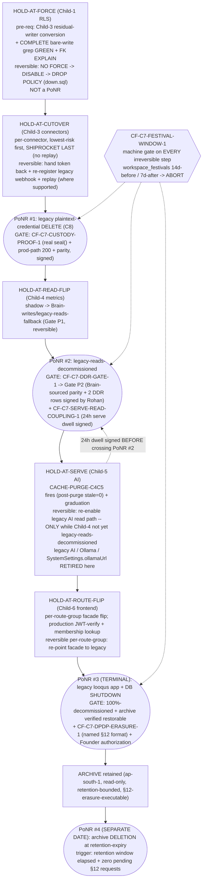

# Decommission Runbook — `feat-legacy-decommission` (Child 7, FINAL)

> Stage-2 binding artifact. Authored by Aryan (Architect). This is the **architecture plan in the shape of a runbook** — the deliverable Rohan/the persona/the requirement asked for. It is **runbook/design-only**: NO app code, NO `@paradigm` decorator, NO new runtime. The load-bearing artifact is the **per-hold Point-of-No-Return (PoNR) ledger** (§6) + the **ordered hold-release sequence** (§5) + the **§12-satisfying archive format** (§9) + the **DPDP close-out** (§10).
>
> **Execution is NOT this child.** Every step below is executed at the eventual production cutover by **Jatin (operator) + the Founder (at console)**, Stage-8, gated per the named holds. Writing this runbook decommissions nothing and destroys nothing at runtime. See the operator handoff `07-handoff-to-developer.md`.

| Field | Value |
|-------|-------|
| **req_id** | `feat-legacy-decommission` |
| **parent_epic** | `chore-migrate-legacy-to-brain` (Child 7 of 7 — the retirement) |
| **Actor** | architect (Aryan) |
| **Timestamp** | 2026-05-25T12:55:00Z |
| **Shape** | design/runbook-only (Child-0 analogue) — no code build; Rohan Stage-6 compliance+reversibility review IS the gate |
| **Paradigm** | `sql` / runbook (no compute; zero inference path) — Rohan Stage-1 intake+synthesis sign-off CARRIED; affirmed |
| **Archive-format tripwire (CF-C7-DPDP-ERASURE-1)** | **NOT FIRED** — a §12-satisfying format is named (§9, Option ALPHA primary). |

---

## 1. Context

Children 1–6 of the strangler-fig migration each built a Brain-native bounded context and parked its live cutover behind a **named HELD state** — the cutover code exists, is LOCAL-verified, but nothing live has moved. The six holds (grounded in each child's `11-final-review.md`):

| Hold | Child | What it gates | Evidence (final-review) |
|------|-------|---------------|-------------------------|
| **HOLD-AT-FORCE** | 1 RLS (`feat-tenancy-rls-brain-native` + `…-auth-rls-hardening`) | live `FORCE ROW LEVEL SECURITY` on the legacy DB | C3 FR:148 — "Child-1 FORCE remains HELD until Shiprocket DECOMMISSION + complete bare-write grep ZERO + sign-off" |
| **HOLD-AT-CUTOVER** | 3 connectors (`feat-connector-framework-cutover`) | per-connector single-owner token transfer + webhook re-reg + **legacy plaintext-credential delete**; Shiprocket LAST (no replay) | C3 FR:15, 141–142, 158 (Shiprocket last, no replay, polling-gap days=7) |
| **HOLD-AT-READ-FLIP** | 4 metrics (`feat-metric-engine-olap-split`) | `workspace_daily_metrics` read source: `legacy-writes/Brain-reads-shadow → Brain-writes/legacy-reads-fallback → legacy-reads-decommissioned` | C4 FR:163–164 (P2 = Brain-Child-3-sourced parity + 2 DDR rows + Rohan re-sign; CACHE-PURGE-C4C5 armed) |
| **HOLD-AT-SERVE** | 5 AI (`feat-ai-engine-intelligence`) | Brain AI reads ClickHouse-authoritative + **CACHE-PURGE-C4C5 fires** (post-purge stale count=0) + per-agent graduation; legacy AI/Ollama retired here | C5 FR:83, 145–150 (serve-gate blocks until post-purge=0; legacy direct-SDK/Ollama retired) |
| **HOLD-AT-ROUTE-FLIP** | 6 frontend (`feat-frontend-dashboard-morningbrief`) | per-route-group facade flip from legacy frontend to Brain surface; **production JWT-verify + membership lookup** replaces dev-only header-trust | C6 FR:129, 164 (route-flip HELD; production JWT-verify is the cutover requirement; Rohan re-sign) |
| **(no named hold — terminal)** | — | **legacy `looqus` app + DB shutdown + archive** | requirement scope line 46; program terminal PoNR |

Child 7 defines the **ONE safe ordered sequence** to release those holds, the **PoNR per hold**, the **rollback tree valid until each PoNR**, the **§12-satisfying archive of the retired PII store**, the **DPDP close-out**, and the **final-state verification checklist**. The order is forced by the Child-0 DAG (arch line 515: `0→1→2→4→5→6→7`, plus `1→3`, `3 feeds 4`) + the single-writer C2 / single-owner C8 constraints — it is the *authoritativeness-handoff* order, bottom-up from the data spine, not the build order.

**Why now:** all six children are at Stage-8 readiness behind their holds; the program cannot retire the legacy authoritative stack until exactly this sequence is written, bound, and Rohan-signed. A wrong order destroys legacy plaintext credentials before Brain custody is proven (dead connector, Shiprocket no-replay), or shuts the DB before parity is signed (silent billing-base error), or destroys the AI rollback tree (serve→read coupling). The PoNR ledger is what makes the irreversibility honest.

---

## 2. Proposed solution

A single binding runbook with four load-bearing parts:

1. **The ordered hold-release sequence (§5)** — six holds released bottom-up from the data spine, each referencing (never restating) its own child's parity gate + rollback tree. Net-new content per Rohan's "make it less dumb" ruling: the ONE order, the program-level PoNR ledger, the archive disposition, the DPDP close-out.
2. **The per-hold PoNR ledger (§6)** — THE load-bearing table. Each row: `{hold, pre-req gate (ref to the child's gate), reversibility action valid UNTIL the PoNR, the explicit PoNR line, what is destroyed/irreversible past it, the named CF-C7 gate (custody / P2 / dwell / festival), the verification command}`. Invariant: **no PoNR is crossed before its dependency's parity is signed AND its named gate is GREEN.**
3. **The five CF-C7-* gates bound (§7)** — CUSTODY-PROOF, DPDP-ERASURE, SERVE-READ-COUPLING, DDR-GATE, FESTIVAL-WINDOW — each attached to the exact PoNR row it guards.
4. **The §12-satisfying archive format (§9) + DPDP close-out (§10) + final-state verification checklist (§8).**

Nothing here executes. The operator runs this at Stage-8; the Founder authorizes each irreversible step at console.

### Diagram



---

## 3. Paradigm

**Declared paradigm:** `sql` / runbook (no compute)

**Justification (≥20 words):** This child produces an ordered decommission sequence + a PoNR ledger + verification checklists + a DPDP close-out. There is **zero inference path and zero new runtime**. Every verification command in the ledger is a deterministic SQL query, a grep, a shell assertion, or a manual sign-off — never an LLM call and never metric arithmetic. Any `@paradigm` LLM decorator, any new compute, or any LLM client introduced by this child is a paradigm violation → BOUNCE. This child actively **DEFENDS the cost model**: the HOLD-AT-SERVE step confirms retirement of the legacy direct-Anthropic-SDK + Ollama serving path (`legacy project/backend/src/module/ai/*`, `SystemSettings.ollamaUrl` schema.prisma:924), so the legacy uncapped-LLM path is gone at final state.

> Rohan's Stage-1 intake+synthesis sign-off is carried (sql/runbook, no compute). Affirmed; no re-invoke (paradigm unchanged and structural for a decommission runbook).

---

## 4. Scope of this child

**In scope (runbook/design only):**
- §5 the ordered hold-release sequence (references each child's own gate; does NOT restate it).
- §6 the per-hold PoNR ledger (the load-bearing artifact).
- §7 the five CF-C7-* gates bound to the PoNR rows.
- §8 the final-state verification checklist.
- §9 the §12-satisfying archive format + retention + decommission trigger.
- §10 the DPDP close-out + the `chore-security-governance-hardening-phase` handoff.

**Explicitly OUT of scope (per Rohan's "make it less dumb" / requirement out-of-scope):**
- Any new Brain application code, any `@paradigm` decorator, any new runtime.
- **Executing** any hold-flip, any plaintext-delete, any DB shutdown (that is Stage-8 / Founder-at-console; this child PLANS the execution — see `07-handoff-to-developer.md`).
- **Restating** the per-child cutover gates. Each held cutover already carries its own parity gate + rollback tree in its run (Child-1 6-step rollout + `down.sql`; Child-3 per-connector A4 rollback tree + ceremony; Child-4 read-source flip + CACHE-PURGE-C4C5; Child-5 serve-flip + graduation; Child-6 per-route-group flip + production JWT). This runbook **references and sequences** them.
- Editing legacy (`CF-BN-NOLEGACY-1` — legacy is being retired, never modified; already reference-only + untracked from git).

---

## 5. The ordered hold-release sequence (DAG-forced — the ONE safe order)

The order is the **authoritativeness-handoff order**, bottom-up from the data spine. It is forced; there is exactly one safe sequence (Rohan ruling (a), confirmed by the persona). Each step names its **pre-req** (the dependency's gate that must be signed first), its **reversibility action** (valid until the PoNR), and its **PoNR** (named in §6).

### Step 0 — Stage-8 pre-flight (before ANY step)
- **0.1 Festival gate (CF-C7-FESTIVAL-WINDOW-1):** run the festival query (§7.5) — if any active workspace has a festival within 14 days ahead, **ABORT the whole session** (no irreversible step proceeds in a peak window).
- **0.2 Residency assert:** confirm Brain stores (Supabase, ClickHouse Cloud, MSK, S3) are all `ap-south-1` (carried from each child's residency startup-assert). An out-of-region archive would be a DPDP §16 cross-border transfer.
- **0.3 Custody readiness (CF-C7-CUSTODY-PROOF-1, build_gated_on):** confirm the Founder's Option A/B `seal()`/`get()` path is a **real implementation (non-`NotImplementedError`)**. If it is still a stub → the connector cutover step (Step 2) is BLOCKED. (This does not block FORCE — Step 1.)

### Step 1 — Release HOLD-AT-FORCE (Child-1 RLS) — NOT a PoNR
- **Pre-req:** Child-3 residual-writer conversion complete + a **COMPLETE bare-write grep GREEN** (the legacy grep was DEFECTIVE — it must NOT exclude `backfill*`/`discoverChannels`; C3 FR:67 flags `CF-C3-FORCE-UNLOCK-SCOPE-1`) + FK-scope `EXPLAIN` per table (Child-1 plan). **Interlock:** C3 FR:148 says Child-1 FORCE stays HELD *until Shiprocket DECOMMISSION*. **Aryan's reconciliation (binding):** FORCE is RELEASABLE here once the bare-write grep is GREEN *for the connectors already cut over*; the FORCE→ table-by-table escalation completes as each connector's residual legacy writer is retired, and is **fully GREEN only after Shiprocket cutover (Step 2, last)** removes the final legacy writer. So FORCE *begins* at Step 1 and *completes* at the end of Step 2 — it is a ramp, not a single flip, and it is the only step that legitimately spans two holds.
- **Reversibility:** `NO FORCE → DISABLE ROW LEVEL SECURITY → DROP POLICY` (DDL in Child-1 `down.sql`). Fully reversible.
- **PoNR:** **NONE.** RLS FORCE is reversible DDL. (Recorded in §6 as the only hold with no PoNR — this is correct and load-bearing: the data spine must be tenant-isolated *before* Brain becomes its authoritative consumer, but isolating it destroys nothing.)

### Step 2 — Release HOLD-AT-CUTOVER (Child-3 connectors) — per-connector PoNR
- **Pre-req:** Child-3 framework live-readiness (the Stage-8 STEP 0.5 real-pooler IT) + Founder Option A/B custody decision on record **AND real `seal()` confirmed (CF-C7-CUSTODY-PROOF-1)**.
- **Order within the step:** one connector at a time, **lowest-risk / has-replay first, Shiprocket LAST** (no historical replay → largest rollback window, longest pre-cutover shadow ≥2 weeks; C3 FR:158). Per connector: write→live-auth-test (via the **production custody path**, not a legacy-column read)→parity GREEN within the rollback window→**seal**→**DELETE plaintext**.
- **Reversibility (UNTIL the per-connector plaintext-delete):** hand the token back to legacy + re-register the legacy webhook (or re-enable the legacy poll cron for polling connectors, e.g. Shiprocket polling-gap days=7) + replay from the vendor API where supported. Per Child-3 A4 rollback tree.
- **PoNR #1 (per connector): the legacy plaintext-credential DELETE (C8).** Past it: no rollback to legacy connector auth without re-issuing creds from the provider. For **Shiprocket** (no replay) this is the single highest-irreversibility step in the whole 7-child program. **Gate: CF-C7-CUSTODY-PROOF-1** (§7.1) + the festival blackout (§7.5).

### Step 3 — Release HOLD-AT-READ-FLIP (Child-4 metrics) — PoNR at `legacy-reads-decommissioned`
- **State machine:** `legacy-writes/Brain-reads-shadow → Brain-writes/legacy-reads-fallback → legacy-reads-decommissioned` (C4 FR).
- **Gate P1 (legacy-sourced parity GREEN)** → licenses ONLY the reversible `Brain-writes/legacy-reads-fallback` transition. Reversible: flip the read flag back.
- **Gate P2 (Brain-Child-3-sourced parity GREEN, run AFTER Shopify cutover (Step 2) AND after Rohan signs the 2 DDR rows `total_tax_mu` + `fx_restatement`)** → the ONLY gate that licenses the `legacy-reads-decommissioned` PoNR. (C4 FR:163: the live read-flip requires exact-integer-equality parity on Brain-Child-3-sourced data + the 2 UNSIGNED-PENDING rows signed + Rohan re-sign.)
- **Reversibility (UNTIL `legacy-reads-decommissioned`):** flip the read flag back to `legacy-reads-fallback`. Past `legacy-reads-decommissioned`: the metric rollup (the billing base — single-writer C2 final state) is Brain-authoritative-only.
- **PoNR #2: the `legacy-reads-decommissioned` transition.** **Gates: CF-C7-DDR-GATE-1 → Gate P2** (§7.4) + **CF-C7-SERVE-READ-COUPLING-1** (the 24h serve dwell from Step 4 must be signed BEFORE crossing this) + the festival gate (§7.5).

### Step 4 — Release HOLD-AT-SERVE (Child-5 AI) — flipped BEFORE PoNR #2 is crossed
- **Pre-req:** Child-4 at `Brain-writes/legacy-reads-fallback` (Step 3, reversible state) — NOT yet `legacy-reads-decommissioned`.
- **Action:** Brain AI reads ClickHouse-authoritative for the workspace + **CACHE-PURGE-C4C5 FIRES** (post-purge stale-narration count must = 0; C5 FR:83 serve-gate blocks until 0) + per-agent graduation. **Retire the legacy AI path:** `legacy project/backend/src/module/ai/*` (Ollama pipeline + providers), `SystemSettings.ollamaUrl` (schema.prisma:924), `OLLAMA_*`/`ANTHROPIC_API_KEY` legacy env.
- **Reversibility:** re-enable the legacy AI read path — **VALID ONLY while Child-4 is NOT yet `legacy-reads-decommissioned`** (C5 arch A4). This is the coupling hazard.
- **CF-C7-SERVE-READ-COUPLING-1 (§7.3):** a **minimum 24h dwell** of stable Brain serving (zero user-visible error escalation) between this serve-flip and crossing PoNR #2. PoNR #2 is NOT executable until the HOLD-AT-SERVE *sustained-stability* gate is explicitly signed (not "AI is serving" — proven stable over the dwell). This prevents an operator advancing both holds in one console session and silently destroying the AI rollback tree.
- **PoNR:** none of its OWN — the AI serve-flip is reversible. Its irreversibility is *coupled* to PoNR #2 (once that is crossed, the AI rollback tree is gone). Recorded in §6 as a coupled row.

### Step 5 — Release HOLD-AT-ROUTE-FLIP (Child-6 frontend) — per-route-group, reversible
- **Action:** per route group, flip the facade from the legacy frontend to the Brain surface; replace dev-only header-trust with **production JWT-verify + membership lookup** (C6 FR:129, 164); land M1+M2 (gRPC tenancy/trace wire) at the same cutover; real cert-pin hashes for the mobile build.
- **Reversibility:** per route group, re-point the facade to legacy (Child-0 A4). Reversible until the legacy app is shut down (Step 6).
- **PoNR:** none of its own (per-route-group reversible). Becomes irreversible only at Step 6 (legacy app shutdown).

### Step 6 — Legacy `looqus` app + DB SHUTDOWN — TERMINAL PoNR
- **Pre-req:** ALL contexts at sustained parity + `legacy-reads-decommissioned` reached everywhere + every connector's plaintext deleted (incl. Shiprocket) + Child-1 FORCE fully GREEN (bare-write grep ZERO hits) + the §12-satisfying archive produced and **verified restorable** (§9) + the festival gate GREEN + **Founder authorization at console**.
- **PoNR #3 (TERMINAL): legacy DB shutdown.** Past it: the live legacy store is gone. The **archive** remains (read-only, ap-south-1, §12-erasure-executable) — see §9.
- **Gate: CF-C7-DPDP-ERASURE-1** (§7.2) + festival (§7.5) + Founder authorization.

### Step 7 — Archive DELETION at retention-expiry — SEPARATE PoNR, SEPARATE DATE
- **PoNR #4: the archive deletion.** Triggered when the retention window elapses (§9) AND there are zero pending DPDP §12 requests. **"Archive" (Step 6 app shutdown) and "decommission" (Step 7 archive deletion) are TWO DATES, potentially months apart** (CF-C7-DPDP-ERASURE-1). Jatin must understand: shutting down the app ≠ deleting the archive.

---

## 6. The per-hold PoNR ledger — THE load-bearing artifact

> Invariant (binding, Rohan-signed at Stage 6): **no PoNR is crossed before (a) its dependency's parity is signed AND (b) its named CF-C7 gate is GREEN AND (c) the festival gate is GREEN AND (d) the Founder authorizes at console.** A `—` in the PoNR column means the hold is fully reversible and crosses no point-of-no-return on its own.

| # | Hold (step) | Pre-req gate (ref to the child's own gate — NOT restated) | Reversibility action (valid UNTIL the PoNR) | The explicit PoNR line | What is destroyed / irreversible past it | Named CF-C7 gate | Verification command (Stage-8) |
|---|---|---|---|---|---|---|---|
| **L0** | HOLD-AT-FORCE (Step 1) | Child-3 residual-writer conversion + **COMPLETE bare-write grep GREEN** (incl. `backfill*`/`discoverChannels`) + FK-scope `EXPLAIN` per table (Child-1 plan; C3 FR:67) | `NO FORCE → DISABLE ROW LEVEL SECURITY → DROP POLICY` (Child-1 `down.sql`) | **— (NONE)** | Nothing — RLS FORCE is reversible DDL | CF-C7-FESTIVAL-WINDOW-1 (the FORCE escalation that *completes* at Shiprocket is gated) | `bash` complete-bare-write grep → **0 hits**; per-table `EXPLAIN` shows the RLS predicate; cross-read probe = 0 rows, contextless = 0 rows |
| **L1** | HOLD-AT-CUTOVER — per connector, **Shiprocket LAST** (Step 2) | Child-3 framework live-readiness (Stage-8 STEP 0.5 real-pooler IT) + Founder Option A/B on record + **real `seal()` confirmed** | Hand token back + re-register legacy webhook / re-enable legacy poll cron (Shiprocket days=7) + replay from vendor API (where supported) — Child-3 A4 tree | **PoNR #1: legacy plaintext-credential DELETE (C8), per connector** | No rollback to legacy connector auth without re-issuing creds from the provider. **Shiprocket: no replay → a dead connector with no event-recovery path** (highest irreversibility in the program) | **CF-C7-CUSTODY-PROOF-1** (real `seal()` + prod-custody-path 200 + parity GREEN, all signed) + CF-C7-FESTIVAL-WINDOW-1 (Shiprocket pre-cutover blackout) | (1) assert `seal()`/`get()` are non-`NotImplementedError` (grep + a real round-trip); (2) Brain connector call **via prod custody path** returns vendor HTTP 200; (3) parity GREEN (event-count + key-field spot-check, Child-3 A5 M-A5-Q3) within window N; (4) operator + Founder sign the per-connector PoNR checklist → THEN `DELETE` |
| **L2** | HOLD-AT-READ-FLIP — to `legacy-reads-fallback` (Step 3, reversible) | **Gate P1** (Child-4 legacy-sourced shadow-compare GREEN, C4 FR) | Flip the read flag back to `legacy-reads-fallback` | **— (NONE for the fallback transition)** | Nothing — the fallback state is reversible | CF-C7-DDR-GATE-1 (P1 licenses ONLY this reversible step) | `bash tools/check-metrics-parity.sh` → exit 0 (legacy-sourced); read flag in `legacy-reads-fallback` |
| **L3** | HOLD-AT-READ-FLIP — to `legacy-reads-decommissioned` (Step 3, the cutover) | **Gate P2** (Brain-Child-3-sourced exact-integer-equality parity GREEN, run AFTER Shopify cutover (L1) **AND** after **Rohan signs DDR rows `total_tax_mu` + `fx_restatement`**; C4 FR:163–164) **+** the **24h serve-dwell signed** (from L5) | Flip the read flag back to `legacy-reads-fallback` (still possible until this PoNR) | **PoNR #2: the `legacy-reads-decommissioned` transition** | The metric rollup (`workspace_daily_metrics`, the **billing base**, single-writer C2 final state) is Brain-authoritative-only; the AI rollback tree (L5) is **also destroyed** by this same line | **CF-C7-DDR-GATE-1 → Gate P2** + **CF-C7-SERVE-READ-COUPLING-1** (24h dwell signed) + CF-C7-FESTIVAL-WINDOW-1 | Rohan's DDR full sign-off recorded (11/11 rows); `check-metrics-parity.sh` exit 0 on **Brain-Child-3-sourced** input; the L5 sustained-stability sign-off present; festival query empty |
| **L4** | HOLD-AT-SERVE (Step 4) | Child-4 at `legacy-reads-fallback` (L2, reversible) + Child-5 CACHE-PURGE-C4C5 armed | Re-enable legacy AI read path — **VALID ONLY while Child-4 NOT yet `legacy-reads-decommissioned`** (C5 arch A4) | **— (coupled; no own PoNR)** | Its rollback tree is **destroyed at PoNR #2 (L3)** — hence the dwell coupling | **CF-C7-SERVE-READ-COUPLING-1** (min 24h stable serving signed BEFORE L3) + CF-C7-FESTIVAL-WINDOW-1 | CACHE-PURGE-C4C5 fired → **post-purge stale-narration count = 0** (C5 FR:83 serve-gate); per-agent graduation recorded; 24h dwell with zero user-visible error escalation, signed; legacy `module/ai/*` + `SystemSettings.ollamaUrl` retired (grep absent at final state) |
| **L5** | HOLD-AT-ROUTE-FLIP — per route group (Step 5) | Child-6 production JWT-verify + membership lookup wired (replaces header-trust) + M1+M2 gRPC tenancy/trace wired + real cert-pin hashes (C6 FR:164) | Per route group: re-point the facade to legacy (Child-0 A4) | **— (NONE per group; irreversible only at L6)** | Nothing per-group; route groups are independently reversible until the legacy app is shut down | CF-C7-FESTIVAL-WINDOW-1 | Per route group: production JWT-verify rejects an unsigned/foreign-workspace token; membership lookup enforced; facade points at Brain; Rohan re-sign at the cutover gate |
| **L6** | Legacy `looqus` app + DB SHUTDOWN (Step 6) | ALL contexts at sustained parity + `legacy-reads-decommissioned` everywhere + every plaintext deleted (incl. Shiprocket) + Child-1 FORCE fully GREEN + **archive produced & verified restorable** (§9) + **Founder authorization** | Until shutdown: the archived snapshot + the facade re-point keep legacy restorable | **PoNR #3 (TERMINAL): legacy DB shutdown** | The live legacy store is gone. The archive remains (read-only, ap-south-1, §12-erasure-executable) | **CF-C7-DPDP-ERASURE-1** (named §12 format, §9) + CF-C7-FESTIVAL-WINDOW-1 + Founder authorization at console | Final-state checklist (§8) all GREEN; archive restore-test passes (restore a sample workspace partition, row-count + checksum match); festival query empty; Founder console authorization captured |
| **L7** | Archive DELETION at retention-expiry (Step 7) | Retention window elapsed (§9) + **zero pending DPDP §12 requests** | None past this — it is a deletion | **PoNR #4: archive deletion (SEPARATE DATE from L6)** | The retained PII archive is gone; only the PII-free `audit_log` (7y) remains | CF-C7-DPDP-ERASURE-1 (retention basis + decommission trigger) | Retention clock check + a `§12-requests-pending = 0` query; the PII-free audit entry for the deletion is written and retained |

**Reading the ledger:** there are exactly **four PoNRs** in the program (L1 per-connector delete, L3 read-decommission, L6 DB shutdown, L7 archive deletion). L0/L2/L4/L5 cross no point-of-no-return on their own. **No PoNR row's "Verification command" passes by reading a flag — each requires a positive proof** (a 200 via the prod custody path, a parity exit-0 on Brain-sourced data, a post-purge count = 0, an archive restore-test).

---

## 7. The five CF-C7-* gates (bound to the PoNR rows)

### 7.1 CF-C7-CUSTODY-PROOF-1 (HIGH) — guards PoNR #1 (L1, the per-connector plaintext-delete)
The plaintext-delete is **not crossable** until ALL of, signed in the per-connector PoNR checklist before `DELETE`:
1. **Founder Option A or B on record AND the corresponding `seal()`/`get()` path is confirmed non-`NotImplementedError`** — a real implementation has replaced the Child-3 stub (`aws_secrets_manager_custody.py` / `supabase_column_custody.py` both raise `NotImplementedError`; C3 FR:50, 79). NOT "the config swap was made" (you cannot config-swap between two stubs).
2. **A Brain connector call via the production custody path** (NOT a direct legacy-DB-column read) returns vendor **HTTP 200**. (A live-auth-test that reads the credential straight from the legacy Postgres column would pass but leave custody unproven — the exact bypass the persona found.)
3. **Parity GREEN** (event-count + key-field spot-check, Child-3 A5 M-A5-Q3) within the connector's rollback window N.
- **Shiprocket LAST** (no replay = maximum exposure) + an explicit pre-cutover calendar blackout (§7.5).
- **`build_gated_on`:** this gate's item (1) is **build-gated on the Founder** confirming the chosen Option A/B custody is a real implementation. **The runbook is WRITTEN assuming the gate; the Stage-8 DELETE is hard-gated on it.** (FIRED escalation addendum to the open Child-3 custody escalation — see synthesis §3, and `07-handoff-to-developer.md` §Founder authorization points.)

### 7.2 CF-C7-DPDP-ERASURE-1 (HIGH) — guards PoNR #3/#4 (L6/L7, the shutdown + archive deletion)
The runbook MUST name a §12-satisfying archive format + its erasure-query mechanism **before** naming DB shutdown as a PoNR. **It does — see §9 (Option ALPHA primary).** Therefore **the armed tripwire DOES NOT FIRE.** Binds: the chosen format satisfies §12; retention basis + period + decommission trigger are named; "archive" (L6) and "decommission" (L7) are TWO dates; a flat `pg_dump` is explicitly REJECTED (cannot run a scoped `DELETE` without a full restore — §9, §16).

### 7.3 CF-C7-SERVE-READ-COUPLING-1 (HIGH) — guards PoNR #2 (L3) via L4
A **minimum 24h dwell** of stable Brain AI serving (zero user-visible error escalation) between the HOLD-AT-SERVE flip (L4) and the `legacy-reads-decommissioned` transition (L3, PoNR #2). PoNR #2 is **not runbook-executable** until the HOLD-AT-SERVE sustained-stability gate is **explicitly signed** (not "AI is serving" — proven stable over the dwell). The L4 rollback row records the coupling: while at `legacy-reads-fallback`, rollback = re-enable legacy reads + re-enable legacy AI path; once `legacy-reads-decommissioned`, that rollback is GONE. Prevents an operator advancing both holds in one console session and silently destroying the AI rollback tree.

### 7.4 CF-C7-DDR-GATE-1 (MED) — guards PoNR #2 (L3)
Two distinct parity gates on HOLD-AT-READ-FLIP. **Gate P1** (legacy-sourced shadow-compare GREEN) → licenses ONLY the reversible `legacy-reads-fallback` transition (L2). **Gate P2** (a SECOND parity run on **Brain-Child-3-sourced** data, AFTER Shopify cutover (L1) AND after **Rohan signs** the 2 DDR rows `total_tax_mu` + `fx_restatement`) → the ONLY gate that licenses the `legacy-reads-decommissioned` PoNR (L3). The PoNR ledger row L3 references **P2, not P1**. **Sequencing:** Rohan's full DDR sign-off (the 2 remaining rows) is sequenced **AFTER Shopify cutover (L1) + BEFORE PoNR #2 (L3)** — exactly Rohan's ruling (d). Stops "first GREEN = cutover license," the most common migration cutover error. (C4 FR:55–56, 164: `total_tax_mu` shadow-compare is *not measurable* on legacy-sourced data, so a GREEN there is *not* a cutover license.)

### 7.5 CF-C7-FESTIVAL-WINDOW-1 (MED) — guards EVERY irreversible step (L1, L3, L6; advisory on L7)
A **machine-checkable Stage-8 pre-flight gate**, not advisory prose. No irreversible hold-flip executes within **14 days before / 7 days after** any festival in `workspace_festivals` for any active workspace.

```sql
-- run before EVERY irreversible step (L1 Shiprocket, L3 read-decommission, L6 DB shutdown); ABORT if any row returns
SELECT name, festival_date
FROM   workspace_festivals
WHERE  festival_date BETWEEN NOW() AND NOW() + INTERVAL '14 days';
```

Shiprocket gets an explicit pre-cutover calendar blackout (72h window × COD-4×-during-Diwali = maximum blast radius). The per-hold PoNR row carries this as a named precondition. Founder/Jatin own the calendar at Stage-8.

---

## 8. Final-state verification checklist (every item must be GREEN at L6)

> The definition of "the legacy stack is safely retired." Every line is a positive proof, not a flag-read. Rohan verifies this checklist at Stage 6 (the design IS the gate); Jatin executes + signs it at Stage 8.

**A. Every bounded context Brain-authoritative + at parity**
- [ ] **Tenancy/RLS (Child-1):** legacy DB had FORCE RLS while live; cross-read probe = 0, contextless = 0; complete bare-write grep = **0 hits** (incl. `backfill*`/`discoverChannels`).
- [ ] **Money (Child-2):** exact-integer-equality money parity GREEN (`check-metrics-parity.sh` byte-identical vectors); zero float in the Brain path.
- [ ] **Connectors (Child-3):** every connector single-owner on Brain; every legacy plaintext credential DELETED (incl. Shiprocket, last); each delete preceded by a signed CF-C7-CUSTODY-PROOF-1 checklist.
- [ ] **Metrics/OLAP (Child-4):** `workspace_daily_metrics` at `legacy-reads-decommissioned` (single-writer C2 final state); **Gate P2 GREEN on Brain-Child-3-sourced data**; **DDR 11/11 rows SIGNED by Rohan** (incl. `total_tax_mu` + `fx_restatement`); **zero Brain read path to legacy rollups** (grep: no Brain code reads legacy `workspace_daily_metrics`).
- [ ] **AI/Intelligence (Child-5):** Brain AI reads ClickHouse-authoritative; CACHE-PURGE-C4C5 fired → **post-purge stale-narration count = 0**; per-agent graduation recorded; **legacy AI retired** — `legacy project/backend/src/module/ai/*` (Ollama pipeline + providers), `SystemSettings.ollamaUrl` (schema.prisma:924), `OLLAMA_*`/legacy `ANTHROPIC_API_KEY` env all gone from the live path (cost-model defended).
- [ ] **Frontend (Child-6):** every route group on the Brain surface; **production JWT-verify + membership lookup** enforced (no dev-only header-trust); M1+M2 gRPC tenancy/trace wired; real cert-pin hashes shipped.

**B. Irreversibles proven before they were crossed**
- [ ] Each PoNR (#1 per-connector, #2 read-decommission, #3 shutdown, #4 archive-deletion) crossed only after its named gate GREEN + festival gate GREEN + Founder authorization.
- [ ] The 24h serve-dwell (CF-C7-SERVE-READ-COUPLING-1) was signed before PoNR #2.

**C. DPDP final state**
- [ ] Archive in **ap-south-1**, read-only, retention-bounded; **§12 erasure executable against the archive** (§9); retention basis + period + decommission trigger documented; "archive" and "decommission" are two dated steps.
- [ ] `AuditLog` null-`workspaceId` rows carried as **system-workspace-sentinel** (R-AUD-01) into the archive so system events stay attributable post-retirement.
- [ ] The PII-free `audit_log` (7y retention) is preserved through shutdown AND archive deletion.

**D. Legacy gone, nothing dangling**
- [ ] Legacy `looqus` app + DB shut down (PoNR #3); no Brain code path resolves to a legacy host/credential/read.
- [ ] `CF-BN-NOLEGACY-1` held throughout (legacy never edited; already reference-only + untracked from git).

---

## 9. The §12-satisfying archive format (CF-C7-DPDP-ERASURE-1 — tripwire NOT fired)

The legacy DB holds the all-workspace PII inventory (Child-0 A6.2: `ShopifyCustomer` email/name, `ShiprocketShipment` pincode/city/state, `ShopifyOrder.email`, `Invitation.email`). On retirement it becomes a **retained PII store** and must stay DPDP-accountable. The canon erasure mechanism (data-privacy-dpdp SKILL line 80) is: **PG tombstone + plaintext hard-delete → CH `ALTER TABLE … DELETE WHERE workspace_id=? AND customer_id=?` → S3 purge → consent `withdrawn` → keep the PII-free audit entry.** A flat `pg_dump`/`.sql`/`.tar` supports **none** of this — you cannot run a scoped `DELETE` against a dump without a full restore → **REJECTED**.

**Two §12-satisfying formats; the runbook names Option ALPHA as primary, BETA as the cost-bounded fallback:**

| Option | Format | §12 erasure mechanism | Residency | "Archive" vs "decommission" |
|---|---|---|---|---|
| **ALPHA (primary)** | Keep the legacy Postgres **live-but-read-only** in **ap-south-1** (app deprovisioned, DB demoted to a read-only role, all connectors/crons disabled) **until the retention window expires**, then wholesale-delete. | A §12 request during retention = a scoped live `DELETE WHERE workspace_id = ? AND (email = ? OR customer_email = ?)` against the still-addressable DB (mirrors the canon mechanism), then re-snapshot. **Erasure-scopable per data-principal by construction.** | DB stays ap-south-1 (CF-RES-1; out-of-region = DPDP §16). | **Archive** = L6 (app shutdown, DB demoted read-only). **Decommission** = L7 (DB wholesale-deleted at retention-expiry + zero pending §12). Two dates. |
| **BETA (cost-bounded fallback)** | Export to **S3 Parquet in ap-south-1, partitioned by `workspace_id`** (one prefix per workspace; PII columns isolated so a per-principal scope is a partition+predicate). | A §12 request = `s3:DeleteObject` on the affected workspace partition (+ re-write the principal-filtered partition if sub-workspace granularity is needed). **Erasure-scopable per partition.** | S3 bucket `ap-south-1`, KMS-encrypted at rest. | **Archive** = L6 (Parquet export verified restorable). **Decommission** = L7 (lifecycle-policy / `DeleteObject` on all partitions at retention-expiry). Two dates. |

**Retention basis + period (named, DPDP-required):** retain for the **shorter of** (a) the canon raw-data retention of **5 years** (data-privacy-dpdp SKILL line 81) OR (b) any active legal/tax obligation on the brand's order/invoice data, whichever is longer where law requires. The **PII-free `audit_log` is retained 7 years** (SKILL line 81) independent of the PII archive. **Decommission trigger (L7):** retention window elapsed **AND** a `§12-requests-pending = 0` check passes.

**Recommendation (Aryan):** **Option ALPHA** is primary — it is the simplest §12-faithful path (the erasure mechanism is the exact canon live-DELETE, no new export format to validate) and the Supabase read-only-DB cost is bounded and predictable for a single retired store. **Option BETA** is the fallback if the Founder wants to stop paying for a live Supabase project sooner; it costs design+validation work (the Parquet export must be proven restorable + the partition scheme proven per-principal-scopable) but eliminates ongoing DB compute. **Jatin/Founder pick at Stage-8;** both satisfy §12, so this is NOT an escalation. **The tripwire does not fire** (a §12-satisfying format is named).

**`AuditLog` null-`workspaceId`:** carried as **system-workspace-sentinel** (R-AUD-01) into whichever archive is chosen, so system events stay attributable and the per-principal scope filter is not polluted by null rows.

---

## 10. DPDP close-out + the chore-security-governance-hardening-phase handoff

**Close-out (bound at L6/L7, reviewed by Rohan Stage-6):**
- The retired PII store is **DPDP-accountable while archived**: ap-south-1, read-only, retention-bounded, §12-erasure-executable (§9).
- The **lineage map** (data-privacy-dpdp SKILL line 113) for the archive: a §12 erasure walks PG-tombstone+plaintext-hard-delete (ALPHA) or S3 partition delete (BETA) → keep the PII-free audit entry. Recorded so a DPDP request against the archive is a lookup, not an archaeology dig.
- **Residency assertion:** the archive region is asserted at L6 (ap-south-1); an out-of-region archive is a DPDP §16 cross-border transfer and is FORBIDDEN.
- **Two dated steps:** L6 (archive / app shutdown) and L7 (decommission / archive deletion) are recorded as separate dates in the Stage-8 execution log.

**Forward handoff → `chore-security-governance-hardening-phase` (deferred, not pulled into this child):**
- Residual governance hardening beyond the decommission (e.g. the formal Consent-Manager registration ahead of the DPDP 13-Nov-2026 / 13-May-2027 milestones; the field-level PII catalog as a standing artifact; any breach-scope tooling) is handed forward to `chore-security-governance-hardening-phase`. This child closes out the *retired legacy store's* DPDP accountability; the standing-platform governance hardening is its own phase.

---

## 11. Single-Primitive sweep

This child introduces **no new primitive** (it is a runbook). It references existing ones; none is forked.

| Primitive | Status |
|-----------|--------|
| Audience Builder | reused — N/A (no outbound; this child sends nothing) |
| Consent | reused — the §12 erasure close-out uses the existing consent `withdrawn` + the canon erasure mechanism (data-privacy-dpdp), not a new path |
| Decision Log | reused — the PII-free `audit_log` (7y) is retained through shutdown + archive deletion; not re-homed |
| Notifications | reused — N/A (no notification path) |
| Attribution | reused — N/A |
| Identity | reused — `AuditLog` null-rows → system-workspace-sentinel (R-AUD-01) carried into the archive; the existing identity/sentinel disposition, not a new one |

No per-channel / per-connector / per-region fork. The PoNR ledger sequences existing gates; it does not duplicate or fork them.

---

## 12. Multi-tenancy enforcement (4 layers)

This child changes no live tenancy code. At **final state** the 4 layers are confirmed in the verification checklist (§8.A): JWT (Child-6 production JWT-verify + membership), service-side (`request.workspace_id == metadata.workspace_id`, carried from Children 1/3/6), DB RLS (Child-1 FORCE while legacy live; Brain Postgres RLS + ClickHouse query-gateway at final state), Kafka envelope (Child-3 `workspace_id` partition key). The §9 archive is **per-workspace erasure-scopable** — tenancy survives into the retired store.

---

## 13. Observability plan (proportionate — runbook scope)

| Pillar | Items |
|--------|-------|
| **Metrics** | None net-new. The Stage-8 execution relies on each child's existing counters (Child-3 `ingest_*` + Shiprocket attempted-vs-connected alarm; Child-4 parity harness report; Child-5 `paradigm_distribution`/`faithfulness_retry_total` + post-purge stale count). |
| **Logs** | The Stage-8 **execution log** (operator-maintained): per PoNR row, the verification command output + the operator + Founder sign-off + timestamp. The PII-free `audit_log` entry per irreversible step (custody-delete, read-decommission, shutdown, archive-deletion). |
| **Traces** | N/A (no runtime added). |
| **Alarms** | Reuse Child-3 Shiprocket attempted-vs-connected (silent-drop detector) during its shadow window; reuse Child-5 serve-error escalation during the 24h dwell. |
| **Dashboards** | None net-new. |

---

## 14. Test strategy (runbook scope — no code)

| Layer | Plan |
|-------|------|
| **Unit / Integration / Contract / E2E / Load / Mutation** | **N/A — no code in this child.** Each referenced child's own test suite + parity gate already passed at its Stage-6 PASS. |
| **Real-network smoke** | **Deferred to Stage-8 execution, by design** (the named holds). The per-PoNR verification commands (§6) ARE the real-network proofs at cutover: the prod-custody-path vendor-200 (L1), the Brain-sourced parity exit-0 (L3), the post-purge count=0 (L4), the archive restore-test (L6). |
| **Runbook self-test (Stage-6, Rohan)** | The PoNR ledger is internally consistent: every PoNR's pre-req references a real, signed dependency gate; no PoNR is reachable before its gate is GREEN; the festival gate covers every irreversible step. Tanvi's degraded-QA = artifact-completeness + internal-consistency (no `TBD`; all 4 PoNRs have a verification command + a CF-C7 gate). |

---

## 15. Security considerations (forwarded to Shreya — design-level VETO)

Shreya reviews the **irreversibility / PoNR / credential-destruction design** as a design-level VETO (the Child-0 degradation), not code. Key surfaces: (1) the custody-proof gate (CF-C7-CUSTODY-PROOF-1) must close the "live-auth-test bypass via legacy-column read" hole — the gate requires the call through the **production custody path**, not a flag; (2) the §9 archive must not leak PII out of ap-south-1 (§16); (3) the plaintext-delete sequence is write→prod-path-200→parity→seal→delete, Shiprocket last; (4) no PoNR is crossable on a flag-read — each needs a positive proof. The FIRED custody escalation addendum (real `seal()` before the Stage-8 delete) is the load-bearing security gate.

---

## 16. India context

| Lens | Impact |
|------|--------|
| **Festival seasonality** | **Load-bearing — bound as a machine gate (CF-C7-FESTIVAL-WINDOW-1).** No irreversible flip in a 14d-before/7d-after festival window for any active workspace; Shiprocket gets a pre-cutover blackout (COD 4× during Diwali = max blast radius). |
| **COD / RTO** | Shiprocket webhooks feed `rto_value_mu` / `cod_amount_mu` / True-CM2 RTO provision; a missed webhook during the no-replay cutover is a silent billing-base error → the longest shadow + the custody-proof gate + the festival blackout protect it. |
| **GST** | `total_tax_mu` (per-SKU GST-2.0) is one of the 2 DDR rows that must be Rohan-signed at Gate P2 before PoNR #2 — the read-decommission cannot outrun the GST-tax parity on Brain-sourced data. |
| **Residency** | The archive stays ap-south-1 (CF-RES-1; §16). Asserted at L6. |
| **Telecom (DLT/NCPR/DND)** | None — this child sends nothing outbound. |

---

## 17. Region adapter impact

None. This child retires the India (`looqus`) legacy stack only; it adds no region and touches no `RegionAdapter` surface. The §9 archive residency (ap-south-1) is the India-region disposition; UAE/KSA (Phase 4) are unaffected.

---

## 14b. Cost estimate

| Item | Value |
|------|-------|
| **Expected daily volume** | 0 (runbook; no runtime) |
| **LLM tokens / day** | **0** (sql/runbook; zero inference path) |
| **₹ / month at expected load** | **₹0 net-new from this child.** This child *reduces* cost at final state by retiring the legacy uncapped direct-SDK/Ollama serving path. The only Stage-8 cost is the §9 archive: Option ALPHA = a bounded read-only Supabase project for the retention window; Option BETA = S3 Parquet storage in ap-south-1 (cheaper, no DB compute). Founder picks at Stage-8. |

---

## 15b. Risks

| Risk | Severity | Mitigation |
|------|----------|------------|
| Operator crosses a PoNR before its dependency parity is signed | **HIGH** | The PoNR ledger (§6) invariant + per-row verification command + Founder authorization; no flag-read passes a PoNR |
| Shiprocket plaintext deleted on unproven custody (dead connector, no replay) | **HIGH** | CF-C7-CUSTODY-PROOF-1 (real `seal()` + prod-path-200 + parity, signed) + Shiprocket LAST + longest shadow + build_gated_on the Founder's real `seal()` |
| Read-decommission crossed on legacy-sourced (P1) parity → false GREEN hides GST/FX delta | **MED** | CF-C7-DDR-GATE-1 (PoNR references Gate P2 on Brain-sourced data; Rohan signs the 2 DDR rows between P1 and P2) |
| Both serve + read holds flipped in one session → AI rollback tree silently destroyed | **HIGH** | CF-C7-SERVE-READ-COUPLING-1 (min 24h dwell signed before PoNR #2) |
| Archive not §12-erasure-scopable (flat dump) | **HIGH** | §9 Option ALPHA/BETA named (NOT pg_dump); tripwire does not fire; "archive" vs "decommission" two dates |
| Irreversible flip during a festival peak (max blast radius) | **MED** | CF-C7-FESTIVAL-WINDOW-1 machine gate on every irreversible step |
| Archive deleted while a §12 request is pending, or before retention basis | **MED** | L7 trigger = retention elapsed AND `§12-requests-pending = 0`; separate dated step from L6 |

---

## 16b. Alternatives considered (≥1)

| Alternative | Why rejected |
|-------------|--------------|
| **Flat `pg_dump`/`.sql` archive** | Not DPDP §12 erasure-scopable — a scoped per-principal `DELETE` requires a full restore + re-export, and a re-export can reintroduce data. REJECTED in favor of §9 ALPHA (live-read-only scoped DELETE) / BETA (S3 partition delete). |
| **Re-derive each child's per-hold gate in this runbook** | Rohan's "make it less dumb" ruling: each held cutover already carries its own parity gate + rollback tree in its run. Restating them duplicates + risks drift. This runbook **references + sequences** them. REJECTED. |
| **Shut down the legacy DB at L6 = the terminal-and-only event** | Conflates "archive" (app shutdown) with "decommission" (archive deletion). DPDP §12 obligation persists while the PII archive exists → the deletion is a SEPARATE dated PoNR (L7). REJECTED. |
| **Single combined console session for serve + read flips** | Destroys the AI rollback tree (the serve→read coupling). REJECTED via the 24h dwell gate (CF-C7-SERVE-READ-COUPLING-1). |
| **Treat the festival window as advisory prose** | An irreversible flip during Diwali is max blast radius for the anchor brand. REJECTED — bound as a machine query gate. |

---

## 17b. Tracks (work decomposition for Stage 3)

**There is NO Stage-3 code build for this child** (design/runbook-only; Child-0 analogue). The deliverable is this runbook + `07-handoff-to-developer.md`. The pipeline runs **1 → 2 (Aryan, here) → 6 (Rohan compliance+reversibility = the gate)**; EXECUTION is Stage-8 (Jatin + Founder at console). No `@vikram`/`@ananya`/`@karan`/`@maya` track, no new CI/ArgoCD/Dockerfile (no service created or changed — the deploy pipelines already ship with each child's service; the **Stage-8 execution is operator-run, not a deploy pipeline**).

### Track J — Stage-8 execution handoff *(owner: @jatin, deferred to Stage-8, NOT a Stage-3 build)*
Dependencies: this runbook Rohan-signed (Stage 6) + every prior held cutover at readiness + Founder's real `seal()` (CF-C7-CUSTODY-PROOF-1) + Founder's Option-ALPHA/BETA archive choice.
Captured in `07-handoff-to-developer.md`: the per-PoNR execution checklist, the Founder-at-console authorization points, the build_gated_on custody item, the festival pre-flight, the archive restore-test, the two-dated archive/decommission steps.

### Over-engineering self-check (mandatory)

| Item | PASS/FAIL | Note |
|------|-----------|------|
| Plan length matches the handoff-depth band | **PASS** | High-stakes + irreversible-decommission → prescriptive band justified; the PoNR ledger + gates are load-bearing, not padding. No per-child gate restated (Rohan's "less dumb" ruling honored). |
| Every §17 "file" required | **PASS** | No code files. Two artifacts only: this runbook + the operator handoff. No "while we're in there" scope. |
| No new deps | **PASS** | None — runbook. |
| No new abstractions for hypothetical future use | **PASS** | No new primitive (§11). References existing gates. |
| No observability beyond what's named | **PASS** | Reuses each child's existing counters/alarms; nothing net-new (§13). |
| No tests for trivial things | **PASS** | No code to test; the per-PoNR verification commands are the proofs (§14). |
| Test strategy proportionate to risk | **PASS** | The rigor lands on the PoNR ledger + the design review (Rohan Stage-6), not on tests of nonexistent code. |

**All 7 PASS.**

---

## 18. CTO Advisor paradigm sign-off

> sql/runbook (no compute). Carried from Rohan's Stage-1 intake (`02-cto-advisor-review.md` §Paradigm) + synthesis (`05-stage1-synthesis.md` §4): "Paradigm sql/runbook — CONFIRMED. Zero inference path, zero new runtime; any `@paradigm` LLM decorator or new compute = paradigm violation → BOUNCE."

**Confirmed by CTO Advisor:** carried 2026-05-25T08:15:00Z (synthesis). Re-affirmed by Aryan at Stage 2; no re-invoke (paradigm unchanged and structural for a decommission runbook). **Rohan's Stage-6 compliance + reversibility review IS the gate.**
