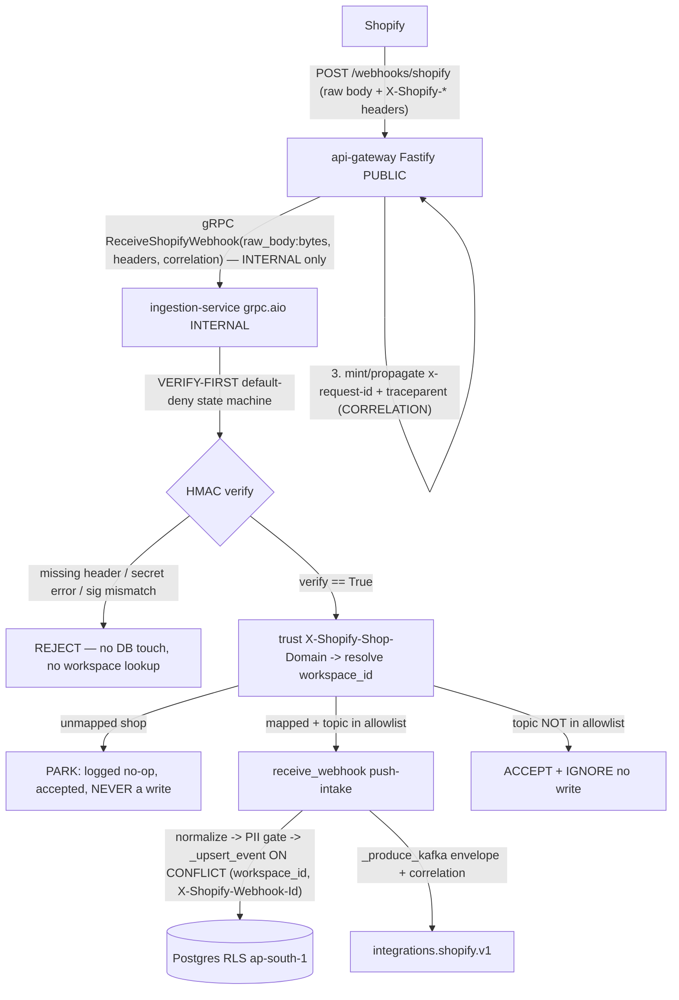

# Architecture Plan — connector-webhook-intake

> Filled by Aryan (Architect) in Stage 2. Binds the Option-C ruling + the 15-CF contract from `05-stage1-synthesis.md`.

| Field | Value |
|-------|-------|
| **req_id** | `connector-webhook-intake` |
| **Actor** | architect (Aryan) |
| **Timestamp** | 2026-05-29T20:30:00Z |
| **Lane** | high-stakes (2 personas, capped) |
| **Handoff depth** | prescriptive — folded into §17 (single small high-stakes slice; no separate 07; justified §0) |
| **Revised** | 2026-05-29 — GENERALIZATION REVISION (Founder directive; see §0-GEN) |

---

## 0-GEN. GENERALIZATION REVISION — 2026-05-29 (Founder directive, binding)

> **This section supersedes the Shopify-specific shape in §2/§4/§5/§7/§17/§17b below where they conflict. The original Stage-2 narrative is preserved for provenance; everywhere it says "Shopify-named rpc/route/table/header", read the generic form defined here.** The verify-first/default-deny state machine, the 4-mutation kill-test, the push-intake reuse, the idempotency anchor, NEVERLOG, correlation, residency, and Single-Primitive are ALL preserved unchanged — this revision only removes the hardcoded `shopify` shape and replaces it with a **vendor-dispatched registry**. Shopify becomes the FIRST registered vendor, not the shape.

### Why (Founder, 2026-05-29)
"We are making this product to ingest data from 100+ sources, not only Shopify — Shopify is just one example. Write generic code and schemas to accommodate 100+ product integrations." This binds `feedback_integration_extensible_schema` item #7 (verbatim: a `ReceiveWebhook(vendor, raw_body, headers,…)` contract; a webhook-verifier registry keyed by vendor; a generic `connector_identity_map(vendor, external_identity) → workspace_id`; a generic `POST /webhooks/:vendor` route; "code reads the registry instead of hardcoding `if (vendor === 'SHOPIFY')`"). The Stage-3 work is NOT committed, so it is free to reshape — this is a refactor-in-place, not a rewrite (the SOUND logic is preserved; only the dispatch shape generalizes).

### G1 — Proto: vendor-agnostic contract (was `ReceiveShopifyWebhook`)
- Service `brain.ingestion.v1.WebhookIngestService` (keep), RPC renamed → **`ReceiveWebhook(ReceiveWebhookRequest) returns (ReceiveWebhookResponse)`**.
- `ReceiveWebhookRequest`: **`string vendor = 1;`** (the dispatch key — Shopify is `"shopify"`, a value not a shape), `bytes raw_body = 2;` (FIDELITY anchor, unchanged), **`map<string,string> headers = 3;`** (renamed from `shopify_headers` — the FULL forwarded header set; the registry tells the servicer which keys matter per vendor), `string request_id = 4;`, `string trace_id = 5;`.
- `ReceiveWebhookResponse`: `Outcome outcome = 1; string request_id = 2;` — the `Outcome` enum (ACCEPTED/REJECTED/PARKED/IGNORED + UNSPECIFIED=0) is **unchanged**. NEVERLOG on the response unchanged.
- Codegen: SAME pinned plugins (`buf.build/bufbuild/es:v2.4.0`, `buf.build/community/danielgtaylor-betterproto:v1.2.5`) — no new plugin, no invented version. `buf breaking` is clean because the Stage-3 proto is uncommitted (net-new, no published baseline to break).

### G2 — Webhook-verifier registry (the core generic mechanism)
A single module `apps/ingestion-service/src/application/framework/webhook_registry.py` exporting:

```
@dataclass(frozen=True)
class VendorWebhookSpec:
    vendor: str
    verify_fn:          Callable[[bytes, str, str], bool]   # (raw_body, signature, secret) -> bool
    secret_fn:          Callable[[AppSecretProvider], str]   # provider -> secret  (NEVERLOG)
    signature_header:   str        # header carrying the signature to verify
    identity_header:    str        # header carrying the external identity (trusted POST-verify only)
    idempotency_header: str        # header that becomes vendor_event_id (NOT a body hash)
    topic_header:       str        # header carrying the event topic/type
    topic_allowlist:    frozenset[str]

WEBHOOK_VERIFIERS: dict[str, VendorWebhookSpec]   # vendor -> spec
```

- **Shopify is ONE registered entry** (the only one in this slice): `verify_fn = verify_shopify_hmac` (base64-HMAC-SHA256 over raw body — the EXISTING single primitive, untouched); `secret_fn = lambda p: p.get_shopify_hmac_secret()`; `signature_header = "x-shopify-hmac-sha256"`; `identity_header = "x-shopify-shop-domain"`; `idempotency_header = "x-shopify-webhook-id"`; `topic_header = "x-shopify-topic"`; `topic_allowlist = SHOPIFY_TOPIC_ALLOWLIST` (the existing frozenset, relocated into the spec).
- The servicer does `spec = WEBHOOK_VERIFIERS.get(request.vendor)` — **unknown/empty vendor → REJECT (default-deny)**, exactly like a missing signature. NO hardcoded `if vendor == "shopify"` anywhere on the path. Every per-vendor fact (which verify fn, which secret, which headers, which topics) is read from `spec`.
- **Adding vendor #2 is ZERO core change:** a new `verify_fn` (e.g. Meta `X-Hub-Signature-256` = hex `sha256=<hmac>`; Stripe = signed-timestamp `t=…,v1=…` scheme) + a new `WEBHOOK_VERIFIERS["meta"] = VendorWebhookSpec(...)` row + a `connector_identity_map` row. **No proto change** (vendor is a field), **no servicer change** (it dispatches by `request.vendor`), **no route change** (`/webhooks/:vendor` path-param), **no gateway-client change** (vendor is a request field). The per-vendor verifier fns ARE the single primitives; the registry is just the selector (Single-Primitive preserved).
- The verify fn signature stays `(raw_body: bytes, signature: str, secret: str) -> bool` so every vendor's verifier is constant-time-compare-shaped; vendors whose scheme needs the timestamp header (Stripe) read it from `headers` inside their verify_fn closure (the spec can carry extra header names; v1 needs only Shopify's 5). Keep the shape minimal — do NOT pre-build Meta/Stripe specs (Single-Primitive / no speculative abstraction); the registry shape is the only forward-looking surface and it is required by the Founder directive, not speculative.

### G3 — Generic identity resolver + schema (was `connector_shop_map` / `resolve_shop_workspace`)
- **Rename table** `connector_shop_map` → **`connector_identity_map`** with columns: `vendor TEXT NOT NULL`, `external_identity TEXT NOT NULL` (Shopify = shop_domain; Meta = page/app id; Stripe = account id), `workspace_id UUID NOT NULL`, `created_at TIMESTAMPTZ`. **PRIMARY KEY `(vendor, external_identity)`** (composite — two vendors' identities cannot collide; aligns with `customer_ref` collision-safety in feedback #5). No PII. Still system-scoped (read pre-workspace; it PRODUCES the workspace_id — RLS asymmetry §5/§11 unchanged, now keyed on the composite).
- **Rename resolver** `resolve_shop_workspace(shop_domain)` → **`resolve_identity_workspace(vendor, external_identity) -> workspace_id | None`** — system-scoped single-row point-lookup `WHERE vendor = $1 AND external_identity = $2` on the composite PK. None → PARKED (unchanged behavior). The servicer extracts `external_identity` from `headers[spec.identity_header]` POST-VERIFY only (MAP-AFTER-VERIFY preserved).
- Migration: `connector_shop_map` was authored-not-deployed (HELD-Stage-8, never seeded in prod), so the rename is a free re-author of the DDL (`step-a-create.sql` → create `connector_identity_map`; `down.sql` → drop it). No data migration — nothing live exists. Mirror into `tests/integration/pg-init/01-init.sql`. Test seed becomes `('shopify','sugandhlok.myshopify.com', <ws_id>)`.

### G4 — Route: generic `POST /webhooks/:vendor` (was `POST /webhooks/shopify`)
- One Fastify route with a **`:vendor` path-param**; drop the `/webhooks/shopify` literal. Still: raw-Buffer body (`parseAs:'buffer'`, FORWARD-FIDELITY), body-size cap + per-route rate-limit pre-forward (ABUSE-BOUND), outcome→HTTP map, NO Node verifier (SINGLE-PRIMITIVE), NEVERLOG, correlation mint, OUTSIDE the tRPC/JWT plugin.
- The route forwards `{ vendor: req.params.vendor, rawBody, headers: <full forwarded header set>, requestId, traceId }` to `ReceiveWebhook`. The gateway does NOT validate the vendor (it is not the authority — the registry is); an unknown vendor flows through and the Python servicer REJECTs it (default-deny stays server-side, the single source of truth). The client factory + wrapper rename `callReceiveShopifyWebhook` → `callReceiveWebhook` and add the `vendor` field.

### G5 — Preserved unchanged (explicit, so no reviewer mistakes the refactor for a regression)
verify-first/default-deny ordering; MAP-AFTER-VERIFY (identity trusted only post-verify); idempotency anchor = the vendor-declared `idempotency_header` (Shopify = `x-shopify-webhook-id`, flowing into `vendor_event_id`); push-intake reuse (`_upsert_event`/`_produce_kafka`/`_set_correlation`/`check_pii_fields`/`normalize`/`assert_workspace_allowed`, no `adapter.fetch`/window/custody); NEVERLOG (ids+outcome only); CORRELATION 4-tuple end-to-end; PII residency ap-south-1; Single-Primitive (per-vendor verify fns are the primitives, registry selects). The push-intake `receive_webhook` becomes vendor-parameterized too: `vendor` + `event_type` map come from the spec, and `RawEvent.vendor = request.vendor` (was hardcoded `"shopify"`), Kafka topic = `integrations.{vendor}.v1` (already the established envelope shape, §6).

### G6 — CF contract update (the 16 → 16 + 2 generic CFs)
The 16 CFs below (§17b) are PRESERVED, re-pointed at the generic shape. **TWO new CFs added:**
- **VENDOR-REGISTRY-DISPATCH-1 (CRIT)** — every per-vendor fact (verify fn, secret fn, signature/identity/idempotency/topic headers, topic allowlist) is read from `WEBHOOK_VERIFIERS[request.vendor]`. Unknown/empty vendor → REJECT (default-deny). **Verifiable:** a SECOND test-vendor (`"_test_token"`, a trivial constant-secret HMAC verifier) is registered ONLY in tests, and the full ACCEPTED→PARKED→IGNORED→REJECTED matrix runs GREEN against it with ZERO servicer/route/proto edits — proving genericity. **Bounce (S4/S6):** any path that works for Shopify but the 2nd-vendor matrix can't exercise → bounce.
- **NO-HARDCODED-VENDOR-1 (HIGH, grep-gate)** — a CI grep over the servicer + route + resolver + intake asserts NO vendor-literal branching: `rg -i '==\s*["'"'"']shopify|===\s*["'"'"']shopify|if.*vendor.*shopify' apps/ingestion-service/src/interfaces/grpc apps/ingestion-service/src/application/framework/webhook_* apps/api-gateway/src/interfaces/route.webhook*.ts` returns ZERO matches (the registry-key strings and the test-fixture are excluded by scoping the grep to the dispatch path, not the registry-definition module). **Bounce (S4/S6):** any vendor-literal branch on the dispatch path → bounce. (Registering Shopify in `webhook_registry.py` is allowed — that is the data, not a branch.)
- **VERIFY-THE-VERIFIER mutation set gains a 5th mutation:** (5) hardcode the servicer to the Shopify spec ignoring `request.vendor` → the 2nd-registered-test-vendor matrix goes RED. Joins the existing 4 (flip-verify-True, reorder-map-before-verify, default-deny→accept, anchor→body-hash).

### G7 — Refactor track split (supersedes §17 owners for this revision)
- **@maya (intelligence-engineer)** — proto rename (`ReceiveWebhook` + `vendor` field + `headers`); the `webhook_registry.py` + `VendorWebhookSpec` + Shopify entry; servicer `ReceiveShopifyWebhook`→`ReceiveWebhook` reading the registry by `request.vendor` (NO shopify literal); resolver rename → `resolve_identity_workspace(vendor, external_identity)`; `connector_identity_map` DDL rename + test seed; `receive_webhook` vendor-parameterization; **register a SECOND token-test-vendor in tests + run the full matrix against it to PROVE genericity** (VENDOR-REGISTRY-DISPATCH-1); the 5th mutation.
- **@vikram (backend-developer)** — route `/webhooks/shopify`→`/webhooks/:vendor` + `vendor` path-param forwarded; client/wrapper rename `callReceiveShopifyWebhook`→`callReceiveWebhook` + `vendor` field; update the gateway test-suite to the generic route; the NO-HARDCODED-VENDOR-1 grep-gate wired into the gateway test run.
- All live deploy / webhook registration / secret rotation remain **HELD-Stage-8** (NO-LIVE-1 unchanged).

---

## 0. Grounding (verified on disk, not assumed) + handoff-fold decision

All four consumed seams verified by reading the files this session:
- `verify_shopify_hmac(data: bytes, hmac_header: str, client_secret: str) -> bool` — `apps/ingestion-service/src/interfaces/adapters/shopify_adapter.py:81`. base64(HMAC-SHA256(raw_body, secret)) + `hmac.compare_digest`. The ONLY inbound base64/raw-body verifier. Takes `bytes` — fidelity anchor.
- `select_app_secret_provider()` → `EnvAppSecretProvider | AppSecretsManagerProvider | HeldAppSecretProvider`; `.get_shopify_hmac_secret() -> str`; fail-closed via `AppSecretUnavailableError` / `HeldAppSecretError` — `app_secret_factory.py` + `app_secret_provider.py:111,180,358,381`. Cached, lazy boto3, ap-south-1 residency-asserted, NEVERLOG.
- `ingest_batch(...)` — `apps/ingestion-service/src/application/framework/ingest.py:371`. **PULL-shaped**: it drives `adapter.fetch(creds, window)`, reads per-workspace custody, advances a cursor, assumes a window. A webhook has the RawEvent already in hand, needs NO custody read (verify uses the app secret), and has no window/cursor. Reusable *internals* (verified, with line refs): `_upsert_event` (`:257`, idempotent `ON CONFLICT (workspace_id, vendor_event_id)`, column allowlist, `raw_shopify_orders` mapped at `:177`), `_produce_kafka` (`:328`, envelope + correlation), `_set_correlation`/`get_correlation_context` (`:79,89`), `assert_workspace_allowed` (`bootstrap/startup_gates.py:135`), `check_pii_fields` PII gate, `_table_for`/`_RAW_TABLE_MAP` (`:246,157`), `with_workspace` (P1 RLS).
- `ShopifyAdapter.normalize(raw) -> NormalizedEvent` (`shopify_adapter.py:163`) + `SHOPIFY_PII_MANIFEST` (`:51`, fields email/first_name/last_name). The webhook path reuses `normalize` verbatim — same raw→row mapping, same PII manifest.

Decisive transport facts (verified):
- ingestion-service today is a **pure Kafka worker** — `pyproject.toml` deps = `psycopg, aiokafka, httpx, pydantic, boto3`. **No FastAPI, no uvicorn, no grpcio, no inbound server of any kind, and no service entrypoint/main yet** (only `bootstrap/startup_gates.py`). Adding an inbound server is a genuine net-new shape regardless of protocol.
- api-gateway (Fastify BFF) already depends on `@grpc/grpc-js ^1.12.6` + `@grpc/proto-loader ^0.7.15` (`apps/api-gateway/package.json`). It is the public choke point; `server.ts` mints/propagates `x-request-id` (`genReqId`, `:212`) and the correlation 4-tuple (`extractCorrelation`, `:256`). No webhook route exists.
- proto pipeline exists: `protos/buf.gen.yaml` pins `buf.build/bufbuild/es:v2.4.0` (TS) + `buf.build/community/danielgtaylor-betterproto:v1.2.5` (Python). `protos/events/integrations.proto` defines the Kafka envelope (`brain.events.integrations.v1`). **No service-RPC proto exists yet** (only event + metrics/intelligence/health protos).
- **No shop→workspace resolver exists** anywhere in the Python tree — it must be built (the unmapped-shop park is its first-class branch).

**Handoff-fold decision (Lever 5):** high-stakes ⇒ band default is a separate `07`. I am **folding into §17 + §17b** and writing NO separate 07, justified: this is a *single, narrow vertical slice* (one gateway route + one Python intake function + one proto RPC + one resolver), every CF is already enumerated by Stage 1, and the acceptance contract (§17b) is the prescriptive artifact. A separate 07 would duplicate §17 verbatim. The depth IS prescriptive — it lives in §17/§17b.

---

## 1. Context

The Founder directive: a production inbound webhook path for Shopify (extensible to other vendors) — receive → verify HMAC (fail-closed) → idempotent intake → produce to the Brain ingest path. This consumes three Stage-6-approved seams (`verify_shopify_hmac`, the app-secret provider, `ingest_batch` internals) that the HMAC-custody slice deliberately left a seam for (`app_secret_provider.py:37–49` literally documents this feature as the future consumer). Rohan ruled **Option C** at Stage 1 (gateway receives raw-faithful → forwards → Python verifies + intakes) and bound a 15-CF contract; the crux call delegated to me is the **internal transport** + **raw-body forward fidelity**. The slice is high-stakes (the HMAC gate IS the auth; shop→workspace IS the tenant boundary; Shopify payloads carry PII under DPDP). Live deploy + public webhook registration + rotation of the exposed `shpss_…` are HELD-Stage-8.

---

## 2. Proposed solution

**Option C, transport = gRPC.** A thin public Fastify route at the gateway captures the **raw request body buffer before any JSON parsing** and forwards it — byte-untouched — plus the `X-Shopify-*` headers and the correlation 4-tuple to the ingestion-service over a **new internal gRPC RPC** (`brain.ingestion.v1.WebhookIngest/ReceiveShopifyWebhook`). The raw body crosses the wire as proto `bytes` (no re-serialization, no JSON round-trip), so the bytes the gateway received == the bytes the verifier hashes == the bytes that get normalized. The gateway does NO HMAC work (no Node verifier — Single-Primitive), NO body parse, NO workspace lookup. It does the cheap public-edge work it already owns: body-size cap + rate-limit BEFORE forwarding, and correlation minting.

The ingestion-service stands up a **`grpc.aio` server bound to the internal pod network only** (NOT a public listener — this is explicitly not Option B's public FastAPI front door; it is reachable only from the gateway inside the cluster, mirroring the canon service↔service gRPC pattern). The servicer runs a **verify-first / default-deny state machine**: (1) missing/empty `X-Shopify-Hmac-Sha256` → REJECT; (2) fetch the app secret via `select_app_secret_provider().get_shopify_hmac_secret()` — any exception (`AppSecretUnavailableError`, `HeldAppSecretError`, anything) → REJECT via a default-deny `else`; (3) `verify_shopify_hmac(raw_body, hmac_header, secret)` → False → REJECT. ONLY after a True verify does it trust the attacker-controllable `X-Shopify-Shop-Domain`, resolve it to a `workspace_id` (unmapped → clean logged park, never a write, never a 500), validate `X-Shopify-Topic` against an allowlist (unknown → accepted-and-ignored so Shopify stops retrying), build a `RawEvent` from the verified body, and call a new **`receive_webhook`-shaped push-intake** that reuses `ingest_batch`'s `_upsert_event` + `_produce_kafka` + correlation internals — with the idempotency anchor = `X-Shopify-Webhook-Id` (NOT a body hash). A duplicate delivery is a recorded no-op via the existing `ON CONFLICT`; a malicious replay of a captured (body, signature) is, for v1, that same harmless recorded no-op.

The webhook path does NOT touch `adapter.fetch` (no contrived window), does NOT read per-workspace custody (verify uses the app secret), and does NOT advance a cursor (webhooks are not windowed). It reuses `ShopifyAdapter.normalize` + `SHOPIFY_PII_MANIFEST` verbatim, so the PII manifest gate and the column allowlist apply identically. Everything live/irreversible (deploy, the Shopify webhook subscription registration, the rotated real secret, public ingress/WAF/TLS) is authored-not-deployed and HELD-Stage-8.

### Diagram



---

## 3. Paradigm

**Declared paradigm:** `sql` *(+ io / event-handling)*

**Justification (≥20 words):** The entire path is cryptographic HMAC verification, a deterministic shop→workspace lookup, an idempotent Postgres UPSERT, and a Kafka produce. There is zero inference, zero model call, ₹0 recurring marginal cost, and no probabilistic surface anywhere. An LLM/ML paradigm would be a gross over-build for a constant-time-compare + UPSERT path. Confirms Rohan's Stage-1 first-pass; intelligence-service (Maya) co-own = NO for the AI dimension, but Maya (intelligence-engineer) owns the Python intake track because it lives in her runtime, not because of inference.

---

## 4. API design

### gRPC protos added or changed
- **NEW** `protos/brain/ingestion/v1/ingestion.proto`, package `brain.ingestion.v1`, service `WebhookIngest`, RPC `ReceiveShopifyWebhook(ReceiveShopifyWebhookRequest) returns (ReceiveShopifyWebhookResponse)`.
  - `ReceiveShopifyWebhookRequest`: `bytes raw_body = 1;` (FIDELITY anchor — opaque bytes, never a parsed struct), `map<string,string> shopify_headers = 2;` (carries `X-Shopify-Hmac-Sha256`, `X-Shopify-Shop-Domain`, `X-Shopify-Topic`, `X-Shopify-Webhook-Id`), `string request_id = 3;`, `string trace_id = 4;`.
  - `ReceiveShopifyWebhookResponse`: `enum Outcome { ACCEPTED=0; REJECTED=1; PARKED=2; IGNORED=3; }` `Outcome outcome = 1;` `string request_id = 2;`. NO secret, NO signature, NO PII in the response (NEVERLOG applies to the response too).
  - Codegen via the EXISTING pinned plugins (`buf.build/bufbuild/es:v2.4.0` TS, `buf.build/community/danielgtaylor-betterproto:v1.2.5` Python) — no new plugin, no invented version. `buf generate protos` regenerates into `packages/proto-ts/gen` + `pylibs/proto_py/proto_py/_gen`.

### tRPC procedures added or changed
- NONE. The webhook is a public machine-to-machine surface, not a user-authed tRPC procedure. It is a raw Fastify route, deliberately outside the tRPC plugin (no Supabase JWT — Shopify authenticates by HMAC).

### MCP tools added or changed
- NONE.

### REST endpoints added or changed
- **NEW (public, gateway)** `POST /webhooks/shopify` — raw-body Fastify route, registered with a content-type parser that preserves the untouched `Buffer` (`addContentTypeParser('application/json', { parseAs: 'buffer' }, …)` scoped to this route, OR a route-level `config` that disables JSON parsing). Returns 200 on ACCEPTED/PARKED/IGNORED (so Shopify stops retrying), 401 on REJECTED. NO body echo, NO error detail leakage.

### Breaking changes
- NONE. Net-new proto package (additive), net-new public route, net-new Python intake function. `ingest_batch`'s locked signature is UNTOUCHED — the push path is a SIBLING function reusing internals, not a signature change. No public-surface break ⇒ no CTOA/api-versioning gate fires.

### Versioning strategy
The proto is `v1` from birth (`brain.ingestion.v1`). Future vendors reuse the SAME envelope/topic shape (`integrations.<vendor>.v1`) per the established Single-Primitive event contract; a second vendor's inbound webhook adds a sibling RPC or a `vendor` discriminator on the request, gated by `buf breaking` in CI. No v2 needed for the Shopify-only slice.

---

## 5. Data model changes

### Postgres
- **Tables added:** ONE — `connector_shop_map` (the shop→workspace resolver backing). Columns: `shop_domain TEXT PRIMARY KEY` (e.g. `sugandhlok.myshopify.com`), `workspace_id UUID NOT NULL`, `vendor TEXT NOT NULL DEFAULT 'shopify'`, `created_at TIMESTAMPTZ`. Small mapping table; NOT per-vendor-forked (vendor is a string discriminator, honoring the integration-extensible-schema rule). **No PII.** This is the only NEW table; the webhook PII lands in the EXISTING `raw_shopify_orders` (verified at `ingest.py:177`) via the reused `_upsert_event` path — no new PII surface.
- **Tables changed:** NONE. `raw_shopify_orders` already carries `(workspace_id, vendor_event_id)` UNIQUE + the column allowlist + PII columns; the webhook reuses it unchanged.
- **Indexes:** `connector_shop_map` PK on `shop_domain` (the lookup key). Existing `(workspace_id, vendor_event_id)` UNIQUE on `raw_shopify_orders` is the idempotency anchor — reused, not re-created.
- **RLS policies:** `connector_shop_map` is read on the verify path BEFORE a workspace session is established (it is the thing that PRODUCES the workspace_id), so it is a system-scoped lookup, NOT workspace-RLS'd — it is read under a system role with a single-row `WHERE shop_domain = $1` and returns at most one workspace_id, which then becomes the `with_workspace` scope for the actual write. The PII write into `raw_shopify_orders` goes through the EXISTING `with_workspace` (P1 RLS) path inside `_upsert_event` — unchanged. **Document this asymmetry explicitly for Shreya (§11).**

### ClickHouse
- **Tables added:** NONE.
- **Materialized views added:** NONE. (Webhook intake feeds the raw store + Kafka; OLAP materialization is downstream, out of slice.)

### Migration plan
*(Reversible; 2-reviewer; LOCAL only — no live DB touch, NO-LIVE-1.)*
1. `migrations/manual/shop-map/step-a-create.sql` — `CREATE TABLE IF NOT EXISTS connector_shop_map (...)`. Mirror in `tests/integration/pg-init/01-init.sql` (the LOCAL parity init) so test and prod DDL do not diverge (the M1/F-4 discipline already enforced in `ingest.py:155`).
2. `migrations/manual/shop-map/down.sql` — `DROP TABLE IF EXISTS connector_shop_map;` (clean reverse; table is additive + empty in prod until Stage-8 seeds the one Sugandh-Lok row).
3. Seed row for LOCAL/test only: `sugandhlok.myshopify.com -> <sugandh_lok_workspace_id>` injected by the test harness, NOT committed as live data. Prod seeding of the real shop_domain row is HELD-Stage-8.
4. Reversibility: drop-table fully reverses; no data loss (no prod rows until Stage-8); no FK from existing tables.

---

## 6. Event model

- **Topics added:** NONE. Reuses `integrations.shopify.v1` (existing envelope `brain.events.integrations.v1.IntegrationEvent`, `protos/events/integrations.proto`). Produced via the reused `_produce_kafka` (`ingest.py:328`).
- **Topics changed:** NONE.
- **Partition key:** `workspace_id` (always — unchanged; `_produce_kafka` already keys on it at `:360`).
- **Exactly-once strategy:** At-least-once produce after DB commit (the existing `ingest_batch` posture, `ingest.py:517`), with consumer-side dedup on `(workspace_id, vendor, vendor_event_id)`. The webhook idempotency anchor `X-Shopify-Webhook-Id` flows into `vendor_event_id`, so a duplicate Shopify delivery → UPSERT no-op at the DB AND a dedup at the consumer. A produce failure leaves the row durably upserted (recoverable), never double-counted.

---

## 7. Single-Primitive sweep

| Primitive | Status |
|-----------|--------|
| Audience Builder | reused — N/A (no audience surface) |
| Consent | reused — `lawful_basis`/`purpose_code` stamped by the existing `normalize` + `SHOPIFY_PII_MANIFEST`; no new consent path |
| Decision Log | reused — Stage-2 decision appended to `ai.decision_log` per the standard journal/decision-log discipline |
| Notifications | reused — N/A (no outbound channel; inbound-only) |
| Attribution | reused — N/A (raw intake; attribution is downstream) |
| Identity | reused — shop→workspace is the connector identity boundary; reuses `assert_workspace_allowed` + `with_workspace` (P1), no new identity primitive |
| **HMAC verify (this slice's crux)** | **reused — EXACTLY ONE `verify_shopify_hmac` (Python). NO second verifier in Node or Python. Gateway's OAuth `validateShopifyHmac` (hex/sorted-query) NOT reused — different algorithm/purpose (SINGLE-PRIMITIVE-1 / CF-HMAC-ALGO-DISTINCT-1).** |
| **Ingest UPSERT/produce** | **extended — `receive_webhook` push path reuses `_upsert_event` + `_produce_kafka` + correlation internals; does NOT fork `ingest_batch`, does NOT add a fake adapter/window (PUSH-INTAKE-1).** |

No per-channel fork introduced. The shop→workspace map is vendor-discriminated by a string column, not a per-vendor table (integration-extensible-schema rule).

---

## 8. Multi-tenancy enforcement (4 layers)

- [x] **JWT** — N/A for the public webhook (Shopify authenticates by HMAC, not a Supabase JWT). The HMAC gate IS the authentication. Documented so this is not mistaken for a missing-auth bug. The gateway route is deliberately OUTSIDE the tRPC/JWT plugin.
- [x] **Service-side** — the ingestion servicer derives `workspace_id` ONLY from `connector_shop_map[verified shop_domain]` AFTER verify (MAP-AFTER-VERIFY-1). The attacker-controllable `X-Shopify-Shop-Domain` is trusted ONLY post-verify. `assert_workspace_allowed(workspace_id, allowed_workspace_ids)` (`startup_gates.py:135`) is the step-0 backstop before any write.
- [x] **DB RLS** — the PII write into `raw_shopify_orders` goes through the existing `with_workspace` (P1) RLS path inside `_upsert_event`. `connector_shop_map` is a system-scoped pre-resolution lookup (§5, flagged for Shreya).
- [x] **Kafka envelope** — `_produce_kafka` keys + stamps `workspace_id` in the envelope (`ingest.py:345,360`); consumers assert it. Unchanged.

---

## 9. Observability plan

| Pillar | Items |
|--------|-------|
| **Metrics** | Reuse the existing in-process counters (`ingest.py:105`): `ingest_events_received/upserted/deduped_total`, `ingest_pii_manifest_rejections_total`. ADD four webhook-scoped counters: `webhook_received_total`, `webhook_rejected_total{reason=missing_header|secret_unavailable|bad_signature}`, `webhook_parked_total` (unmapped shop), `webhook_ignored_total` (topic not in allowlist). No new metrics backend (Prometheus wiring stays Stage-8 per `ingest.py:102`). |
| **Logs** | ids + outcome ONLY (NEVERLOG VETO — §11). One structured line per webhook: `{request_id, trace_id, shop_domain (post-verify only), topic, outcome, workspace_id (post-map only)}`. NEVER: secret value, full HMAC signature, raw PII payload bytes. Reuses the gateway pino redact (`PII_REDACT_PATHS`) + the Python ids-only convention. |
| **Traces** | Correlation 4-tuple threaded: gateway `genReqId`/`extractCorrelation` (`server.ts:212,256`) → proto `request_id`/`trace_id` fields → `_set_correlation` in the Python intake → Kafka envelope `request_id`/`trace_id` (`ingest.py:355`). End-to-end (CORRELATION-1). |
| **Alarms** | (Authored-not-wired, Stage-8) alarm spec: spike in `webhook_rejected_total{reason=bad_signature}` (possible attack / secret drift), any `webhook_rejected_total{reason=secret_unavailable}` (fail-closed firing = secret misconfig), sustained `webhook_parked_total` (unmapped shop misconfig). No live alarm wired pre-Stage-8. |
| **Dashboards** | None new — proportionate to a vertical slice. The four counters are surfaced via the existing `get_counters()` test/monitoring hook (`ingest.py:117`). |

---

## 10. Test strategy

| Layer | Plan |
|-------|------|
| **Unit** | (Maya) verify-first state machine table-driven: valid→ACCEPTED; missing/empty `X-Shopify-Hmac-Sha256`→REJECTED; tampered body→REJECTED; tampered signature→REJECTED; `AppSecretUnavailableError`→REJECTED; `HeldAppSecretError`→REJECTED; unmapped shop→PARKED (no write); unknown topic→IGNORED (no write); duplicate `X-Shopify-Webhook-Id`→ACCEPTED no-op (deduped); legitimate order-update re-fire (same webhook-id, new bytes)→UPSERT-updates (NOT dropped). (Vikram) gateway raw-body capture: assert the forwarded buffer is byte-identical to the received buffer; oversized body rejected pre-forward; rate-limit triggers pre-forward. |
| **Integration** | (Maya) Postgres (testcontainers, already a dev dep) + the seeded `connector_shop_map` row: end-to-end verify→map→`_upsert_event`→row present under correct workspace_id; cross-shop body cannot write to another workspace. Kafka produce asserted via the existing harness. |
| **Contract** | `buf breaking` on the new `brain.ingestion.v1` proto (no break — net-new); TS+Python codegen compiles. |
| **E2E (web)** | N/A (no web surface). |
| **E2E (mobile)** | N/A. |
| **Load** | N/A this slice (Phase 3+). The rate-limit + body-cap bound is unit-tested. |
| **Real-network smoke** | **HELD-Stage-8** — the real Shopify test-event round-trip (Shopify sends a signed test webhook to the registered URL) is the Stage-8 ceremony smoke. The IN-SLICE smoke is a fixture-driven full-path run with a real grpc.aio channel between a gateway test client and the Python servicer, asserting raw-body fidelity survives the hop (compute HMAC on the received buffer == HMAC on the buffer the servicer hands to `verify_shopify_hmac`). |
| **Mutation testing targets** | **VERIFY-THE-VERIFIER-1 (CRIT durable rule) — now FIVE mutations (GEN revision):** (1) flip the vendor's `verify_fn` to `return True` → the valid+tampered+missing-secret tests MUST go RED. (2) Reorder the state machine to map-before-verify (resolve identity BEFORE the verify branch) → the cross-tenant/unmapped tests MUST go RED. (3) Replace the default-deny `else` with `return ACCEPTED` → the secret-unavailable + bad-signature + unknown-vendor tests MUST go RED. (4) Swap idempotency anchor from the vendor-declared `idempotency_header` to a body hash → the order-update-re-fire test MUST go RED (update silently dropped). **(5 — GEN) hardcode the servicer to the Shopify spec ignoring `request.vendor` → the 2nd-registered-test-vendor ACCEPTED matrix goes RED.** Maya/Tanvi author these; **Rohan re-mutates all five at Stage 6 with captured output.** |

---

## 11. Security considerations (forwarded to Shreya)

- **NEVERLOG-1 (Shreya VETO):** secret value, full HMAC signature, raw PII payload bytes NEVER in any log/exception/repr/gRPC response/metric label. Only ids + outcome + (post-verify) shop_domain + topic. The gateway must NOT log the raw body it forwards. Grep-test for the secret/signature/email in captured logs is part of the AC.
- **Verify-first / default-deny (VERIFY-FIRST-1 CRIT):** every branch on the verify path resolves to REJECT unless verify explicitly returns True. NO `try/except: return 200`. Shreya re-reads the state machine for any fall-open ordering.
- **Map-after-verify (MAP-AFTER-VERIFY-1 CRIT):** the attacker-controllable `X-Shopify-Shop-Domain` is trusted ONLY post-verify; no workspace-scoped row touched before verify. Shreya validates no `connector_shop_map` read (and no `with_workspace`) happens on the pre-verify path.
- **`connector_shop_map` RLS asymmetry (§5):** this table is read system-scoped BEFORE a workspace session exists (it produces the workspace_id). Shreya must confirm: single-row `WHERE shop_domain = $1`, returns at most one workspace_id, no other table is read system-scoped, and the subsequent PII write is fully `with_workspace`-scoped. This is the one place the 4-layer model is deliberately asymmetric — surfaced, not hidden.
- **Abuse bound (ABUSE-BOUND-1):** body-size cap + rate-limit at the gateway BEFORE forwarding, so unauthenticated work is bounded and the Python verify is never the DoS surface.
- **Internal gRPC surface:** the new grpc.aio server must bind to the internal pod network only (NOT 0.0.0.0 public) — Shreya confirms it is not a second public front door (the Option-B line). Stage-8 ingress config must not expose it.
- **PII residency (PII-RESIDENCY-1):** ingested PII lands in ap-south-1 under the existing residency-asserted DB + the declared `SHOPIFY_PII_MANIFEST`; no new PII field beyond email/first/last.

---

## 12. India context

DPDP/residency is the only live India lens (HIGH): ingested Shopify PII (email/first/last) lands under RLS in ap-south-1 via the existing declared-manifest gate; raw archive + DB stay in-region (the residency startup-gate `assert_ap_south_1_residency` already enforces this). No RTO/COD/GST logic at intake — the webhook lands order facts that downstream RTO/COD/GST math consumes; none of that is in slice. No outbound channel ⇒ no DLT/NCPR/DND/calling-hours surface. Festival-freeze note for Stage-8: do NOT register/cut over the live webhook during a festival freeze (operational, not code).

---

## 13. Region adapter impact

None in slice. Webhook intake lands raw vendor payloads verbatim; region-varying extraction (per-SKU GST, pincode reliability) is downstream of the raw store, behind the existing RegionAdapter. The shop→workspace map is region-agnostic. No RegionAdapter method added or changed.

---

## 14. Cost estimate

| Item | Value |
|------|-------|
| **Expected daily volume** | Sugandh-Lok scale: O(hundreds–low-thousands) order/customer webhooks/day at v1 (one anchor workspace). Each = one HMAC compare + one UPSERT + one Kafka produce. |
| **LLM tokens / day** | 0 — `sql` paradigm, zero inference. |
| **₹ / month at expected load** | ₹0 marginal (no LLM, no new managed service; the grpc.aio server runs in the existing ingestion-service Fargate task; one tiny Postgres table). Stage-8 adds only the public ingress/WAF cost already implied by the gateway being public. |

---

## 15. Risks

| Risk | Severity | Mitigation |
|------|----------|------------|
| Raw-body fidelity broken by a JSON parse/re-serialize anywhere on the hop → HMAC fails for legitimate webhooks (or, worse, a re-encode that accidentally passes) | HIGH | proto `bytes raw_body` (no struct); gateway route disables JSON parsing (`parseAs: 'buffer'`); the in-slice smoke asserts `HMAC(received) == HMAC(handed-to-verifier)` across the real gRPC channel (FORWARD-FIDELITY-1). |
| Fall-open by ordering (an exception path returns 200) | CRITICAL | default-deny `else`; every exception → REJECT; the VERIFY-THE-VERIFIER mutation #3 goes RED if neutered; Rohan re-mutates at S6. |
| Map-before-verify regression in a later refactor | CRITICAL | state machine has verify as a hard gate; mutation #2 (reorder) goes RED; Shreya + Rohan re-check ordering. |
| New `grpcio`/`grpcio-health-checking` Python deps + a net-new inbound server in a Kafka-worker service (deploy-shape change) | MEDIUM | deps justified (§17 note); server binds internal-only (NOT public, NOT Option B); Fargate task already runs — no new deployable; Stage-8 confirms ingress does not expose it. |
| Idempotency anchor wrong (body hash) silently drops legitimate order updates | MEDIUM | anchor = `X-Shopify-Webhook-Id`; mutation #4 (swap to body hash) goes RED on the order-update-re-fire test. |
| Unmapped shop causes a 500 / cross-tenant write | MEDIUM | resolver miss → explicit PARKED outcome (logged no-op, accept-200 so Shopify stops retrying), never a write, never a 500. |

---

## 16. Alternatives considered (≥1)

| Alternative | Why rejected |
|-------------|--------------|
| **Option A — Node gateway re-verifies HMAC** | BARRED by Stage-1 ruling. Forces a Node re-implementation of the base64/raw-body verifier = duplicate of `verify_shopify_hmac` (SINGLE-PRIMITIVE-1 / CF-HMAC-ALGO-DISTINCT-1). The gateway's `validateShopifyHmac` is the OAuth-callback verifier (hex/sorted-query) — wrong algorithm for inbound; reusing it would be a correctness bug. |
| **Option B — ingestion-service grows a public FastAPI listener** | Founder-visible deviation (non-blocking escalation FIRED). Adds a SECOND public front door to a Kafka-worker service, contradicts public→gateway-only + gateway-as-rate-limit-choke. Not chosen; the internal grpc.aio server in Option C is reachable ONLY from the gateway, not the public internet. |
| **Transport (c) — non-public internal HTTP** | Rejected in favor of gRPC: it still requires standing up a net-new server (same weight), but adds an *ad-hoc, contract-less* internal surface where canon says service↔service sync = gRPC. The gateway already has `@grpc/grpc-js` + proto-loader and a buf codegen pipeline; gRPC keeps the forward strongly-typed with `bytes raw_body` (the fidelity anchor) and `buf breaking`-gated. The marginal cost over HTTP is one proto RPC — worth the contract. |
| **Transport (b) — in-process call** | Impossible: gateway is Node, ingestion is Python — separate runtimes/deployables. No in-process path exists. |
| **Reuse `ingest_batch` via a fake single-item adapter + 1-event window** | Rejected (PUSH-INTAKE-1): contrived; forces a fetch round-trip + custody read + cursor advance that a webhook doesn't need. Reusing `_upsert_event`/`_produce_kafka`/correlation internals via a sibling `receive_webhook` function is honest and smaller. |

---

## 17. Tracks (work decomposition for Stage 3)

> **GEN REVISION 2026-05-29 — Stage-3 REFACTOR (supersedes the original tracks below where they conflict; see §0-GEN G7 for the authoritative refactor split).** The original tracks built the Shopify-LOCKED shape (uncommitted); the refactor generalizes it to the vendor-dispatched registry. Net refactor work: **(T-GEN-A @maya)** proto `ReceiveWebhook`+`vendor`+`headers` rename · `webhook_registry.py` (`VendorWebhookSpec` + Shopify entry) · servicer registry-dispatch (no shopify literal) · resolver→`resolve_identity_workspace(vendor, external_identity)` · `connector_shop_map`→`connector_identity_map` DDL+seed · `receive_webhook` vendor-param · **2nd token-test-vendor + full genericity matrix** · mutation #5. **(T-GEN-B @vikram)** route→`/webhooks/:vendor` + `vendor` path-param · client/wrapper→`callReceiveWebhook`+`vendor` · gateway test-suite to generic route · NO-HARDCODED-VENDOR-1 grep-gate. All live = HELD-Stage-8 (NO-LIVE-1). The original §17 tracks (below) remain as the per-file provenance of the SOUND logic being preserved.
>
> Owners (original): gateway receive = **@vikram (backend-developer)**; Python verify+intake+proto+resolver = **@maya (intelligence-engineer)**; infra/CDK authored-not-deployed = **@jatin (platform-devops, Stage-8 only)**. The proto track is a shared prerequisite (Maya authors, both consume).

### Track 0 — proto contract *(owner: @maya)* — PREREQUISITE
Dependencies: none.
1. Add `protos/brain/ingestion/v1/ingestion.proto` — `WebhookIngest` service, `ReceiveShopifyWebhook` RPC, `ReceiveShopifyWebhookRequest{bytes raw_body=1; map<string,string> shopify_headers=2; string request_id=3; string trace_id=4;}`, `ReceiveShopifyWebhookResponse{Outcome outcome=1; string request_id=2;}` + the `Outcome` enum (ACCEPTED/REJECTED/PARKED/IGNORED).
2. `buf lint` + `buf breaking` (net-new, must pass clean).
3. `buf generate protos` → confirm TS stub in `packages/proto-ts/gen` + Python stub in `pylibs/proto_py/proto_py/_gen` compile. (Uses EXISTING pinned plugins v2.4.0 / v1.2.5 — no new plugin, no invented version.)

### Track 1 — gateway public receive *(owner: @vikram)*
Dependencies: Track 0.
1. Register `POST /webhooks/shopify` as a raw-body Fastify route OUTSIDE the tRPC plugin, with a route-scoped content-type parser that yields the untouched `Buffer` (`parseAs: 'buffer'`) — NO JSON parse (FORWARD-FIDELITY-1).
2. Pre-verify edge bounds (ABUSE-BOUND-1): body-size cap (reject oversized pre-forward) + per-route rate-limit, BEFORE forwarding. (Reuse `ioredis` already in deps if a shared limiter is wanted; else an in-process limiter for the slice.)
3. Mint/propagate correlation: reuse `genReqId` + `extractCorrelation` (`server.ts:212,256`) to fill `request_id`/`trace_id`.
4. Build a `@grpc/grpc-js` client for `WebhookIngest`; forward `{raw_body: <buffer>, shopify_headers: {hmac, shop-domain, topic, webhook-id}, request_id, trace_id}`. Map response `Outcome` → HTTP: ACCEPTED/PARKED/IGNORED→200, REJECTED→401. NO body echo, NO secret/signature/PII in any log (NEVERLOG-1).
5. Tests: raw-buffer-forwarded-byte-identical; oversized rejected pre-forward; rate-limit triggers pre-forward; REJECTED→401, ACCEPTED→200; NEVERLOG grep on gateway logs.

### Track 2 — Python verify-first servicer + push-intake + resolver *(owner: @maya)*
Dependencies: Track 0.
1. Add `grpcio` + `grpcio-health-checking` to `apps/ingestion-service/pyproject.toml` (resolve + pin latest-stable; do NOT invent a version). JUSTIFIED: the chosen internal transport; no FastAPI/uvicorn added (smaller than Option B).
2. Stand up a `grpc.aio` server (new `src/interfaces/grpc/webhook_server.py` + wire into a service entrypoint) bound to the INTERNAL pod address only (NOT public 0.0.0.0 ingress) + a gRPC health service. The existing `run_all_gates()` runs before serving.
3. Implement the `WebhookIngest.ReceiveShopifyWebhook` servicer as the verify-first / default-deny state machine: missing/empty hmac header→REJECTED; `select_app_secret_provider().get_shopify_hmac_secret()` in a try whose EVERY except (`AppSecretUnavailableError`, `HeldAppSecretError`, `Exception`)→REJECTED via default-deny `else`; `verify_shopify_hmac(raw_body, hmac_header, secret)` False→REJECTED (VERIFY-FIRST-1).
4. POST-verify only: trust `X-Shopify-Shop-Domain`; resolve via a new `resolve_shop_workspace(shop_domain) -> workspace_id | None` (system-scoped single-row read of `connector_shop_map`); None→PARKED (logged no-op, no write); validate `X-Shopify-Topic` against an allowlist → unknown→IGNORED (MAP-AFTER-VERIFY-1, TOPIC-ALLOWLIST-1).
5. Implement `receive_webhook(raw_body, headers, workspace_id, request_id, trace_id)` in `src/application/framework/` reusing `ShopifyAdapter.normalize` + `SHOPIFY_PII_MANIFEST` + `check_pii_fields` + `_upsert_event` + `_produce_kafka` + `_set_correlation` + `assert_workspace_allowed`. Build the `RawEvent` with `vendor_event_id = X-Shopify-Webhook-Id` (IDEMPOTENCY-ANCHOR-1). NO `adapter.fetch`, NO custody read, NO cursor advance (PUSH-INTAKE-1). Duplicate→`ON CONFLICT` no-op (REPLAY-NOOP-1).
6. Add the four webhook counters (§9) alongside the existing `_COUNTERS`.
7. Tests: the full §10 unit + integration matrix; NEVERLOG grep on Python logs; the in-slice real-gRPC-channel fidelity smoke; the four VERIFY-THE-VERIFIER mutations authored as a runnable mutation test.

### Track 3 — shop-map migration *(owner: @maya)*
Dependencies: none (parallel with Track 0).
1. `migrations/manual/shop-map/step-a-create.sql` (`CREATE TABLE IF NOT EXISTS connector_shop_map`), `down.sql` (drop). Mirror DDL into `tests/integration/pg-init/01-init.sql`.
2. Test-harness-only seed of `sugandlok.myshopify.com -> <workspace_id>`; NO live seed (NO-LIVE-1).

### Track 4 — deploy/infra authored-not-deployed *(owner: @jatin, Stage-8)*
Dependencies: Tracks 1–3.
1. CDK/config for: the public `POST /webhooks/shopify` ingress + WAF/TLS at the gateway; confirm the new grpc.aio port is INTERNAL-only (security-group scoped to the gateway). Authored, NOT deployed.
2. Runbook entries (HELD-Stage-8): register the Shopify webhook subscription at the real URL; rotate the compromised `shpss_…` per the existing two-place ceremony (`app_secret_provider.py:51`); real test-event round-trip smoke. NO commit without Founder "commit it".

### Over-engineering self-check
- [x] Plan length matches prescriptive band (single high-stakes slice; folded handoff, no duplicate 07). PASS
- [x] Every §17 file is required: one proto, one gateway route, one servicer + one intake fn + one resolver, one tiny table + migration, infra-authored. No "while we're in there" files. PASS
- [x] New deps justified: `grpcio` + `grpcio-health-checking` ONLY — the chosen transport; explicitly smaller than Option B (no FastAPI/uvicorn). Versions resolve-and-pin (not invented). PASS
- [x] No new abstraction for hypothetical future use: shop-map is vendor-discriminated by a string (extensible-schema rule), not a speculative framework; `receive_webhook` reuses internals, no new primitive. PASS
- [x] No observability beyond named: four webhook counters reuse the existing counter mechanism; no new metrics backend; alarms authored-not-wired. PASS
- [x] No trivial-getter tests: tests target the verify-first state machine, fidelity, idempotency, tenant isolation — the risk surfaces. PASS
- [x] Test strategy proportionate: matrix matches the 2 CRITICAL + the fail-open class; mutation targets are the 4 that matter. PASS

---

## 17b. Acceptance contract — 16 CFs → verifiable artifacts → bounce conditions

> **GEN REVISION 2026-05-29:** the 15 CFs below are PRESERVED, re-pointed at the generic vendor-dispatched shape (Shopify = one registered vendor, not the shape). **TWO CFs added** (VENDOR-REGISTRY-DISPATCH-1, NO-HARDCODED-VENDOR-1) at the bottom of the table; the VERIFY-THE-VERIFIER set gains a 5th mutation (§0-GEN G6). Builder must satisfy ALL in pass 1 (shift-left). Each is `must-fix`. Stage-4 (Shreya) / Stage-5 (Tanvi) / Stage-6 (Rohan) bounce conditions named.

| CF | Verifiable artifact (in slice) | Bounce condition |
|----|--------------------------------|------------------|
| **PLACEMENT-1** (HIGH) | Public receive at gateway; verify+intake in Python; gRPC internal hop. No public listener added to ingestion-service. | S4/S6: any public surface on ingestion-service → bounce. |
| **VERIFY-FIRST-1** (CRIT) | State machine: missing-header/secret-error/bad-sig → REJECTED via default-deny `else`; no parse/lookup/DB before verify. | S4/S6: any `try/except→200`, any pre-verify DB touch → bounce. |
| **VERIFY-THE-VERIFIER-1** (CRIT) | 4 runnable mutations (flip verify True; reorder map-before-verify; default-deny→accept; anchor→body-hash) each go RED, captured output. | S5/S6: any mutation stays GREEN → bounce. Rohan re-mutates at S6. |
| **SINGLE-PRIMITIVE-1** (HIGH) | Exactly one `verify_shopify_hmac`; no Node/Python second verifier; OAuth `validateShopifyHmac` untouched. | S4/S6: any second verifier → bounce. |
| **FORWARD-FIDELITY-1** (HIGH) | proto `bytes raw_body`; gateway `parseAs: 'buffer'`; smoke proves HMAC(received)==HMAC(verifier-input) across real gRPC channel. | S5/S6: any JSON round-trip on the hop, or fidelity smoke absent → bounce. |
| **TRANSPORT-1** (MED) | gRPC `brain.ingestion.v1.WebhookIngest`; grpc.aio server INTERNAL-only; no second public listener. | S4: public bind → bounce. |
| **IDEMPOTENCY-ANCHOR-1** (HIGH) | `vendor_event_id = X-Shopify-Webhook-Id`; order-update-re-fire test UPSERT-updates (not dropped). | S5/S6: anchor is a body hash, or re-fire dropped → bounce. |
| **REPLAY-NOOP-1** (MED) | Duplicate (body,sig) → recorded no-op via `ON CONFLICT`; test asserts dedup. | S5: replay double-writes → bounce. |
| **MAP-AFTER-VERIFY-1** (CRIT) | shop→workspace resolved ONLY post-verify; `allowed_workspace_ids` backstop; unmapped→PARKED no-write. | S4/S6: any pre-verify shop trust / cross-tenant write / 500 on unmapped → bounce. |
| **PUSH-INTAKE-1** (MED) | `receive_webhook` reuses `_upsert_event`/`_produce_kafka`/correlation; no fake adapter, no fetch window, no custody read. | S6: contrived adapter/window or custody read on webhook path → bounce. |
| **CORRELATION-1** (HIGH) | 4-tuple gateway→proto→`_set_correlation`→Kafka envelope; end-to-end test asserts same request_id. | S5: correlation drops across hop → bounce. |
| **ABUSE-BOUND-1** (MED) | Gateway body-size cap + rate-limit BEFORE forward; tests assert pre-verify rejection. | S4/S5: unbounded pre-verify work → bounce. |
| **TOPIC-ALLOWLIST-1** (MED) | `X-Shopify-Topic` allowlist post-verify; unknown→IGNORED (200, no write). | S5: blind write on unknown topic → bounce. |
| **NEVERLOG-1** (VETO Shreya) | ids+outcome only; grep test proves no secret/signature/PII in gateway+Python logs/responses/metric labels. | S4: ANY secret/signature/PII in logs → VETO bounce. |
| **PII-RESIDENCY-1** (HIGH) | PII lands in `raw_shopify_orders` ap-south-1 via existing manifest gate; no new PII field. | S4/S6: new PII surface or non-ap-south-1 → bounce. |
| **NO-LIVE-1** (HIGH) | Live deploy + webhook registration + secret rotation authored-not-deployed, HELD-Stage-8; no commit without "commit it". | S6/S8: any live cutover or commit without Founder "commit it" → bounce. |
| **VENDOR-REGISTRY-DISPATCH-1** (CRIT, GEN) | Every per-vendor fact read from `WEBHOOK_VERIFIERS[request.vendor]` (verify/secret fns, signature/identity/idempotency/topic headers, allowlist). Unknown/empty vendor → REJECT. A 2nd test-vendor (`_test_token`) registered in tests runs the FULL ACCEPTED→PARKED→IGNORED→REJECTED matrix GREEN with ZERO servicer/route/proto edits. Mutation #5 (hardcode Shopify spec) goes RED. | S4/S6: any Shopify-only path the 2nd-vendor matrix can't exercise, or mutation #5 stays GREEN → bounce. |
| **NO-HARDCODED-VENDOR-1** (HIGH, GEN grep-gate) | CI grep over servicer + route + resolver + intake returns ZERO vendor-literal branches (`== "shopify"` / `=== 'shopify'` / `if vendor … shopify`). Registry-definition module excluded (that's data, not a branch). | S4/S6: any vendor-literal branch on the dispatch path → bounce. |

---

## 18. CTO Advisor paradigm sign-off

> Rohan's Stage-1 first-pass recommended `sql (+ io/event-handling)` and explicitly invited refinement at Stage 2. This plan confirms `sql` unchanged (zero inference, ₹0). Recorded in `architect.journal.md`; Rohan ratifies at the Stage-3 spawn / Stage-6 final review.

**Confirmed by CTO Advisor:** Stage-1 recommendation carried forward unchanged (2026-05-29T19:00:00Z); no paradigm deviation introduced at Stage 2.
