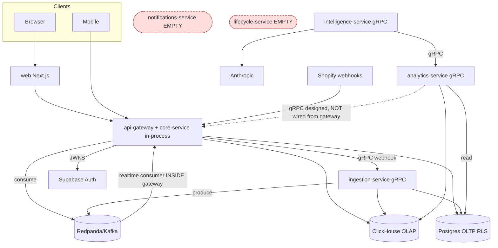

# Principal Engineer — Complete Codebase Audit (Brain)

**Date:** 2026-06-06
**Scope:** Full repository — 9 apps, 11 TS packages, 12 Python libs, IaC (CDK/k8s), gRPC protos, Kafka, CI. ~870 source files, 320 commits.
**Method:** 7 parallel domain audits (architecture, database, security, backend, frontend, devops/observability, hygiene/testing/docs), each evidence-based with `file:line` citations, synthesized into this report.
**Lens:** Enterprise readiness, production deployment, scale, security, acquisition due diligence.

> **One-line verdict:** A **design-led Advanced MVP / early-Growth codebase** with genuinely strong architectural intent (DDD, RLS, metric parity, cost-routing, idempotency, DLQ) that is **gated behind prototype-grade operational readiness** — no CD pipeline, largely aspirational observability, an unsecured live production DB, and two empty "services." The gap is not *design quality*; it is *the distance between what is designed/documented and what is actually wired and deployed.*

---

## PHASE 1–2 — Inventory & System Understanding

### Business purpose
AI-native commerce analytics OS for Indian DTC brands (positioned between Kleio and Statlas). Surfaces profit-quality analytics (CM waterfall, RTO/COD economics, cohorts/LTV, P&L), with a mobile **Morning Brief** as the primary product surface (≤3 ranked AI actions → approve/reject → Decision Log). Multi-tenant; integrates Shopify/Meta/Google Ads/Shiprocket/Klaviyo via OAuth. Anchor customer: Sugandh Lok (~83k orders live).

### Service inventory (as-built reality)

| Service | Lang | Entrypoint | Owns DB? | Dockerfile | Independently deployable? | Reality |
|---|---|---|---|---|---|---|
| web | TS/Next.js 16 | `next start` | No | Yes | Yes | Real, large (333 files), prototype delivery layer |
| mobile | TS/RN+Expo | Expo/EAS | No | n/a | Yes | **Real, live e2e** (Morning Brief) |
| api-gateway | TS/Fastify+tRPC | `server.ts` | shared PG+CH (direct) | Yes | Yes (bundles core-service) | **The de-facto monolith** |
| core-service | TS | none (library) | owns PG migrations | **No** | **No** — compiled into gateway | Library, not a service |
| ingestion-service | Py/FastAPI+gRPC | `main.py` | shares PG facts | Yes | Yes (`--profile data`) | Real |
| analytics-service | Py/gRPC | `main.py` | owns CH migrations; reads PG | Yes | Yes but **not wired** from gateway | Real, dead in prod read path |
| intelligence-service | Py/gRPC | `main.py` | stateless | Yes | Partially wired | Real, 1/15 agents built |
| notifications-service | TS (declared) | none | none | **No** | **No** | **Empty scaffold (.gitkeep only)** |
| lifecycle-service | TS (declared) | none | none | **No** | **No** | **Empty scaffold (.gitkeep only)** |

### System architecture (as-built)

**Key structural truth:** 100% of web/mobile traffic is served by a single Node process (api-gateway + core-service + an in-process Kafka consumer). The Python services are background daemons that are either profile-gated off by default (analytics, intelligence on the dashboard path) or partial (ingestion).

---

## PHASE 3–4 — Architecture & Microservices Audit

**Pattern adherence:** DDD bounded-context layout (`bootstrap/domain/application/infrastructure/interfaces`) is applied *consistently* across all real services — this is a genuine strength. Proto-first gRPC contracts exist. Event-driven backbone (Kafka) exists.

**But it is a distributed monolith at the core:**
- **core-service is a library, not a service** — no `start`, no Dockerfile; physically `COPY`'d into the gateway image (`apps/api-gateway/Dockerfile`, `tsconfig.json` path aliases). Cannot version/scale/deploy independently.
- **Kafka realtime-facts consumer runs *inside* the HTTP gateway** (`apps/api-gateway/src/infrastructure/realtime-facts-consumer.ts:391-573`) — a Kafka lag/PG stall raises HTTP p99. Triple-role process.
- **Shared-DB write coupling:** both api-gateway's consumer AND ingestion-service write `connector_order_facts`/`connector_line_item_facts` (`realtime-facts-consumer.ts:234-276` vs `ingestion graduate_raw_event.py:53`). Canonical distributed-monolith anti-pattern.
- **Cross-service schema read:** analytics-service reads `workspace_misc_expenses` (owned by core-service migrations) directly (`recompute_daily.py:540-582`).
- **analytics-service gRPC is dead code in the prod dashboard path** — gateway only instantiates `LocalDbDataPlane`; metric math is **duplicated in TS and Python** (`loopback-data-plane.ts` / `local-db-data-plane.ts` vs Python `query_gateway.py`). Drift risk is permanent until cutover.
- **Two services are empty** (lifecycle, notifications) yet appear in routers/diagrams.

**Scores:** Architecture **6/10** · Microservices **4/10**

**Verdict:** *Designed for microservices, currently operating as a modular monolith + 3 side daemons.* Not a true microservices architecture today.

---

## PHASE 5 — Repository Hygiene

- **Empty ghost services** with `echo 'test stub'` test scripts that pass CI green (lifecycle, notifications).
- **28 generated `_pb2.py/_pb2_grpc.py` committed** — violates ADR-003 (TS counterparts are gitignored). `.gitignore` gap on `apps/*/src/interfaces/grpc/_pb2/`. Duplicated byte-identical across analytics/intelligence services → schema-drift risk.
- **`apps/web/next-env.d.ts` tracked & permanently dirty** (Next.js says never commit).
- **Stub pylibs:** `brain_kafka`, `brain_agents`, `brain_mcp`, `brain_logger` are ~6-line `__init__.py` placeholders despite being referenced as real abstractions.
- **Misleading docs:** `docs/data-architecture-plan.md` (v1, all-Postgres) contradicts the implemented PG+CH split with no SUPERSEDED marker. Workflow `.js` files committed under `docs/parity-fix/`.
- **Broken doc pointers:** `docs/business-context.md` / `docs/technical-context.md` are referenced everywhere (incl. session tooling) but live at `requirements/` — the stated paths 404.
- Clean spots: no committed secrets in git, no `node_modules`/`.pyc` tracked, lockfiles committed, consistent naming.

**Scores:** Maintainability(hygiene) **6/10** · Documentation **6/10**

---

## PHASE 6 — Code Quality

Complexity hotspots (refactor candidates):
| File | LOC | Concern |
|---|---|---|
| `api-gateway/.../loopback-data-plane.ts` | 2,732 | God object: seed data + 30 stub methods |
| `web/.../marketing/platform-ads-view.tsx` | 2,125 | God component, no memoization, no split |
| `core-service/.../connectors/sync/fact-analytics.ts` | 2,042 | Monolith read layer, OFFSET |
| `api-gateway/.../proto-types.ts` | 1,610 | Hand-maintained, should be codegen |
| `api-gateway/.../local-db-data-plane.ts` | 1,596 | 2nd data-plane impl (duplication) |
| `core-service/.../settings/settings-use-cases.ts` | 1,271 | Multi-concern |

Strengths: registry-first metrics, Single-Primitive (money as BIGINT minor units), typed domain objects, `@paradigm` enforcement, mutation-tested invariants. Drags: TS↔Python metric math duplication, god objects, ~33% comment density (narrative-heavy), 20+ `# type: ignore`, one `console.log` in prod cron.

**Score:** Code Quality **6/10**

---

## PHASE 7 — Database Architecture

**Strengths:** Solid 3NF, money as BIGINT, encrypted PII, WORM/erasure ledgers, vendor-as-text extensible registry (no per-vendor tables), workspace_id-leading composite indexes, ClickHouse `ReplacingMergeTree` with workspace_id-first `ORDER BY` + monthly partitions + `FINAL` + zero-denominator-guarded `intDiv`. Local RLS is fail-closed (`NULLIF(current_setting(...),'')::uuid`), FORCE-applied, with a 7-scenario deny-matrix test.

**Critical defects:**
- **[P0] `security_invoker` dropped in migration 32** (`32-vendor-text-fk.sql:189,199`) — recreates the `connector_order_facts`/`connector_line_item_facts` views WITHOUT `security_invoker=true`. Owner is BYPASSRLS → **cross-tenant leak on the highest-traffic read path** after migration 32 runs. This is the *exact* regression migration 29 documented as previously fixed. **Must fix before any deploy.**
- **[P0] Live production Supabase has zero RLS** (confirmed: `rollout-runbook.sh` HELD; superuser connection bypasses RLS). 83k+ orders + PII across tenants with no row isolation.
- **[P0] `workspace_identity_salt.salt_enc`** stores raw salt material in the DB unless an app-level production flag is set (`36-identity-hashes.sql:42`) — misconfig in staging/UAT de-anonymizes all customer hashes.
- **[P1] AI/memory schemas have NO RLS** (`ai.decision_log`, `ai.graduation`, `memory.*`; workspace_id is TEXT) → cross-workspace AI/memory leak.
- **[P1] RMT `version` is second-resolution** (integer `1`) → non-deterministic dedup under webhook bursts → double-count/stale-row risk.
- **[P1] OFFSET pagination** survives in store-browser/product-cogs (`pagination.ts` MAX_OFFSET=10k guard mitigates but O(n) cliff remains; keyset mandated by `docs/req-keyset-pagination-admin-tables.md`).
- **[P2] No Postgres table partitioning** on fact tables (83M+ rows at Scale tier), **no ReplicatedMergeTree** in CH (no HA/sharding).

**Scores:** Database Design **7/10** · Scalability(data) **6/10**
**Verdict:** Schema design is production-grade *in intent*; two P0s (mig-32 view, live-DB RLS) block production today.

---

## PHASE 8 — API Audit

- **Validation:** Zod everywhere on tRPC; gRPC field validation inline — strong.
- **Idempotency:** keys threaded through routers; Redis-dedup for morning-brief submit; webhook dedup tested — strong on Node. *But* the prod store is `InMemoryIdempotencyStore` (see Phase 11).
- **Errors:** typed `TRPCError` + `requestId` in formatter; minor internal-message leak in `make-user-router.ts:84,108,128`.
- **Versioning:** gRPC protos versioned (`v1`); **tRPC has no version strategy** (`/trpc` only) → breaking changes need lockstep client deploys.
- **Pagination:** cursor for metrics; bounded-OFFSET deviation for browse tables (documented).

**Verdict:** Consistent and close to production-grade on the gateway; held back by tRPC versioning and the two empty services that callers reference.

---

## PHASE 9 — Security (CRITICAL section)

**Auth:** Solid. JWKS verify with RS256/ES256 only (HS256/`none` rejected), 600s cache (`supabase-jwt-verifier.ts:82-96`); web uses `getUser()` not `getSession()`; workspace_id derived from DB membership (not headers) → no obvious auth bypass; fail-closed missing-membership path.

**Top blockers (would NOT approve for enterprise):**
1. **[CRITICAL] Live DB zero RLS** — superuser role bypasses RLS even if policies existed; "350,352 other-tenant rows readable by app role" per `docs/parity-fix/`.
2. **[CRITICAL] Live credentials need rotation NOW** — `app_secret_provider.py:74-79` self-documents the Shopify `shpss_…` secret as "COMPROMISED BY EXPOSURE (visible in git history)." Anthropic key duplicated across `.env.docker` and `legacy project/backend/.env`; legacy Supabase **superuser DB password** + Gmail SMTP app-password sit in on-disk env files. (Env files themselves are gitignored & untracked — but `git log` should be checked for the historical Shopify-secret commit.)
3. **[CRITICAL/HIGH] SQL injection surface** — `ingestion/.../ingest.py:337-355` f-string-interpolates column **and table** names; allowlist skipped when `allowed is None`. Use `psycopg.sql.Identifier`.
4. **[HIGH] FORCE RLS HELD on raw PII tables** (`ingestion/migrations/manual/raw/step-b-force.sql`) → owner role bypasses RLS on buyer email/name; raw-table policy also uses non-NULLIF cast (different fail mode).
5. **[HIGH] Kafka envelope carries raw buyer PII** (`integrations.shopify.v1` — email/name) — DPDP minimization gap; tokenizer exists but unwired.

Other: **[HIGH]** unauthenticated `/metrics` on `0.0.0.0`; **[MEDIUM]** XSS surface via `dangerouslySetInnerHTML` interpolating chart `id`/color (`web/.../ui/chart.tsx:86-99`); default-open localhost CORS unless `BRAIN_ENV=production`; CH client no TLS assertion; single `CONNECTOR_CUSTODY_KEY` used for both OAuth tokens and identity salt.

**Compliance:** DPDP — strong *design* (PII catalog + CI gate, lawful_basis NOT NULL, address minimization, erasure orchestrator) but **non-compliant in production** (live RLS + Kafka PII). DLT/NCPR — N/A today (lifecycle is read-only analytics; no outbound calling). Residency — ap-south-1 enforced at CDK synth; not runtime-verified.

**Score:** Security **5/10** — sophisticated design, large designed-vs-deployed gap.

---

## PHASE 10 — Performance

**Backend:** CH `max_execution_time=30s` good; OFFSET cliffs; **prompt caching documented but NOT wired** (`pnl_system_prompt.py` vs `client.py:477`) → wasted tokens + missed 5× latency win.

**Frontend (prototype-grade delivery):**
- **88% over-clienting** — 89/101 interface components `'use client'`; **zero** `loading.tsx`/`Suspense`/`next/dynamic`/`React.lazy`. Entire analytics surface is one JS hydration island; initial LCP fully JS-gated.
- Recharts (~150KB) + 6 `@visx/*` bundled on every route regardless of charts.
- **No Lighthouse/bundle-size/web-vitals budget gate in CI.**
- Raw `` (no `next/image`), no CSP (`next.config.ts:28`).

**Score:** Performance **5/10** (backend 5, frontend 4).

---

## PHASE 11 — Reliability

**Built well:** per-(workspace,vendor) **circuit breaker** (ingestion), **DLQ** with `acks=all` + tests, idempotency store abstraction, CH query timeout, graceful empty-signal fallback.

**P0 reliability gaps on the AI path:**
- **`litellm.completion()` is sync inside an async gRPC handler** (`intelligence client.py:581`) → blocks the entire event loop ~1-3s per brief; concurrent requests stall.
- **No timeout on LiteLLM call** and **no deadline on inter-service gRPC** (`metrics_grpc_client.py:231`, `grpc.insecure_channel`) → a stalled dependency hangs the brief pipeline indefinitely.
- **`InMemoryIdempotencyStore` wired in production** (`server.ts:135`) — lost on restart, zero cross-pod dedup → duplicate morning-brief responses under HA. (`ioredis` is a dep but unused here.)
- No circuit breaker on LLM/gRPC paths (only the Kafka transform path).

**Score:** Reliability **5/10** — strong ingestion resilience, fragile AI path.

---

## PHASE 12 — Testing

~215 test files. Strong: C1–C14 conformance suite, per-service Python unit tests, RLS deny-matrix + GRANT isolation shell harnesses, PG↔CH parity gate, TS↔Python metric parity (`check-metrics-parity.sh`).

Gaps:
- **70% coverage threshold declared but never enforced** (CI runs vitest without `--coverage`).
- **Playwright E2E exists but not in CI**; **mobile tests excluded** from CI; core-service `*.integration.test.ts` are `INTEGRATION_TEST`-gated and skipped in the default job.
- 14 tRPC routers lack dedicated tests (notifications, morning-brief fetch, metrics, workspace, user…).
- `tests/load/`, `tests/contract/`, `tests/e2e/` are empty `.gitkeep` — **no load tests, no Pact contracts** between gateway and Python services.
- 3 PG↔CH parity cases permanently skipped (productPerf/lifecycle/orderTimings).

**Score:** Testing **5/10** — right structure, under-enforced in the day-to-day gate.

---

## PHASE 13 — DevOps

- **CI is solid** (10 blocking jobs: invariants, typecheck, unit, python, web, tenancy-isolation, migrator, lint, db-integration, parity).
- **No CD whatsoever** — zero `cdk deploy`/`helm`/`kubectl`/`argocd`/`docker push`. Build artifacts never published.
- **Rollback/canary/blue-green are aspirational** — `infra/k8s/{argocd,base,charts}` are `.gitkeep` only; README says "placeholder."
- **CDK is ~3 narrow stacks, AUTHORED-NOT-DEPLOYED** (CredentialCustody, CoreServiceTaskDef, BronzeStorage). **Absent from IaC:** VPC, EKS, MSK, ClickHouse, ElastiCache, RDS/Supabase, ECR, ALB/Route53, env parameterization. (IAM that *is* present is well-scoped least-privilege.)
- **All 5 Dockerfiles run as root**; Node services run **`tsx` at prod runtime** (TS compiler in prod attack surface); base images pinned to tags not digests; Python images single-stage.
- **No security scanning** (no Trivy/Snyk/audit) in CI. **CDK tests not run** in CI.
- Feature flags are raw `process.env` checks (no runtime toggle/audit).

**Score:** DevOps **3/10**

---

## PHASE 14 — Observability (mostly aspirational)

| Signal | Documented | Wired in code |
|---|---|---|
| Structured logging TS (pino+redact+correlation) | ✅ | ✅ partial (no ALS auto-bind; 3 console.* leaks) |
| Structured logging Python | ✅ | ❌ hand-rolled `basicConfig` JSON string (breaks on `"`/`\n`); `brain_logger` is a stub |
| Correlation 4-tuple propagation | ✅ | ✅ HTTP→gateway→core; partial on gRPC/Kafka (webhook only) |
| Metrics (Prometheus) | ✅ | ✅ api-gateway only; none for core/python |
| OTel traces & python metrics | ✅ | ❌ **no TracerProvider/MeterProvider init → all no-ops** |
| Sentry / PostHog / Fluent Bit→OpenSearch / CloudWatch / X-Ray | ✅ | ❌ none wired |
| K8s liveness/readiness/startup probes | ✅ | ❌ no manifests (Docker HEALTHCHECK only) |
| Alerting / dashboards | ✅ (deferred) | ❌ none |

**Scores:** Logging **6/10** · Observability **3/10**
**Verdict:** An on-call engineer can `grep` a `request_id` across Docker logs on the HTTP path — but there is no aggregation, no trace UI, no alerting, and all OTel spans are discarded. Production incidents are *not* quickly debuggable at scale.

---

## PHASE 15 — End-to-End Traceability

| Workflow | Traceable? | Gap |
|---|---|---|
| Login/Signup | Partial | onboarding slice C open; no trace into Supabase identity leg |
| API request | Mostly | request/trace IDs in tRPC context+logs, not into PG/CH statements |
| Webhook→Kafka→facts | Partial | **dual writer** (ingestion + gateway consumer); chain not CI-tested |
| Background recompute | **Broken** | `recompute_daily_metrics()` has **no scheduler/cron/CronJob** wired — Morning Brief depends on the MV it populates |
| Morning Brief | Partial | analytics gRPC only set in profile-data stack; web path bypasses intelligence-service |

---

## PHASE 16 — AI/LLM

- **Cost-routing is genuinely structural** — `@paradigm` ContextVar gate raises `ParadigmViolation` on SQL/ML tiers; 4-tier hierarchy (SQL→ML→Haiku-4.5→Sonnet-4.6) pinned; mutation-tested. **Excellent.**
- **Faithfulness controls strong** — Gate-2 validator (465 LOC), spotlighting/injection fencing, 1-retry cap, Decision-Log on synthesis.
- **But:** only **1 of 15 agents** built (PnlInsightAgent); `brain_agents`/`brain_mcp` are stubs (MCP server not wired); **prompt caching documented but unwired**; sync LLM/gRPC in async loop (Phase 11 P0s).

---

## PHASE 17–18 — Enterprise Standards & Production Readiness

Against Google/Stripe/Shopify bars: **architecture intent and domain modeling are credible**; **operational readiness is not** (no CD, no real observability, no autoscaling story, single-process gateway, live DB unsecured).

**What breaks first at scale:** (1) the single api-gateway process carrying HTTP + Kafka + DB writes; (2) `InMemoryIdempotencyStore` the moment you run >1 pod; (3) OFFSET browse tables on 83k+ row tenants; (4) the blocking LLM event-loop in intelligence-service under concurrent briefs; (5) unpartitioned PG fact tables / single-node CH.

---

## PHASE 19 — Technical Debt Register

| Pri | Area | Issue | Impact | Recommendation | Effort |
|---|---|---|---|---|---|
| P0 | DB/Security | mig-32 views lack `security_invoker` | Cross-tenant leak on top read path | Add `security_invoker=true`; conformance test | S |
| P0 | Security | Live prod DB zero RLS | Full cross-tenant exposure | ENABLE now, FORCE after writer remediation | M |
| P0 | Security | Live creds compromised/unrotated | Account takeover | Rotate Shopify/Meta/Google/Anthropic/DB/SMTP; scrub git history | S |
| P0 | Security | SQLi via identifier f-strings | Injection | `psycopg.sql.Identifier` + table allowlist | S |
| P0 | Reliability | Sync LLM + no timeouts in async loop | Event-loop stall/hang | `acompletion`/`to_thread` + timeout + gRPC deadline | S |
| P0 | Reliability | InMemory idempotency in prod | Dup actions under HA | Wire Redis store | S |
| P0 | Frontend | `materialMarginBp` bigint→Number | Wrong % for >₹90Cr brands | Use `ratioToBasisPoints` | XS |
| P0 | Frontend | No error boundaries | Whole dashboard crashes | Add `error.tsx` + boundaries | S |
| P0 | DevOps | No CD pipeline | No automated/rollback deploy | Build→ECR→ArgoCD/ECS, master-gated | L |
| P0 | DevOps | Dockerfiles run as root | Container breakout | `USER` non-root in all | XS |
| P0 | Observability | OTel no-ops | Blind in prod | Init Tracer/MeterProvider + OTLP | M |
| P1 | Arch | core-service is library / Kafka-in-gateway / dual writer | Distributed-monolith coupling | Move consumer to ingestion; single writer; doc core as lib | M |
| P1 | DB | AI/memory tables no RLS; RMT version sec-res; raw-table FORCE held | Leak + bad dedup | RLS + ms version + apply FORCE | M |
| P1 | DB/API | OFFSET pagination | O(n) cliff at scale | Keyset cursors | M |
| P1 | Security | Kafka raw PII; /metrics open; CSP missing | DPDP + exposure | Tokenize PII; auth/bind metrics; add CSP | M |
| P1 | Testing | Coverage gate unenforced; E2E/mobile dark; no load/contract | Regressions slip | `--coverage`; wire Playwright/mobile/k6/Pact | M |
| P1 | Hygiene | 28 committed pb2; empty ghost services; broken doc paths | Confusion/drift | gitignore pb2; remove/mark scaffolds; fix paths | S |
| P1 | Observability | Python logging fragile; ALS unwired; prompt cache off | Lost logs, cost | Implement `brain_logger` (structlog); cache_control | M |
| P2 | Scale | No PG partitioning; no ReplicatedMergeTree; sync-scheduler single-tenant | Scale ceiling | Partition; replicate; DB-enumerate workspaces | L |
| P2 | Code | God objects (loopback 2.7k, platform-ads 2.1k); TS↔Py math dup | Maintenance | Decompose; accelerate gRPC cutover | L |
| P2 | DevOps | No security scans; tsx in prod; CDK untested in CI | Supply-chain | Trivy/audit; compile to dist; CDK CI job | M |

---

## PHASE 20 — Engineering Scorecard

| Category | Score /10 |
|---|---|
| Architecture | 6 |
| Microservices | 4 |
| Code Quality | 6 |
| Database Design | 7 |
| Security | 5 |
| Scalability | 5 |
| Reliability | 5 |
| Performance | 5 |
| Testing | 5 |
| DevOps | 3 |
| Logging | 6 |
| Observability | 3 |
| Maintainability | 6 |
| Documentation | 6 |
| Production Readiness | 3 |

**Overall: ~51 / 100** (75/150 normalized). *Design subscore is materially higher (~6.5/10); operations subscore drags it (~3.5/10).*

---

## PHASE 21 — Final Verdict

1. True microservices? **No** — modular monolith + 3 side daemons.
2. Distributed monolith? **Yes**, at the core (shared DB writes, in-process consumer, library-as-service).
3. Each service run independently? **No** (core/notifications/lifecycle cannot).
4. Each deploy independently? **No** (no CD; core bundled).
5. Each owns its data? **No** (shared fact-table writers; cross-schema reads).
6. DB production-grade? **No today** (mig-32 view P0 + live RLS P0); strong otherwise.
7. Indexes production-ready? **Mostly**, partitioning needed at scale.
8. Logging production-grade? **Partially** (TS yes-ish, Python no).
9. Observability production-grade? **No** (aspirational).
10. Incidents debuggable fast? **No** at scale.
11. Repo clean/maintainable? **Mostly**, with fixable rot.
12. Folder structure scalable? **Yes** (DDD consistent).
13. Enterprise-ready? **No, not yet.**
14. Approve for production? **No** — fix the P0 block.
15. Approve for enterprise customers? **No.**
16. Approve for millions of users? **No.**

**Classification: Advanced MVP / early Growth-stage — strong architecture, prototype-grade operations.**

---

## Executive Summary

**What is good:** Domain modeling and DDD consistency; metric registry + TS↔Python parity + Single-Primitive money; structural cost-routing; faithfulness gates; local RLS rigor + deny-matrix tests; idempotency/DLQ/circuit-breaker on ingestion; the mobile Morning Brief (real, live); a genuinely strong CI gate.

**What is concerning:** A large, repeated gap between *documented/designed* and *wired/deployed* (observability, CD, analytics gRPC, agents, prompt cache). Distributed-monolith coupling. Two empty "services" presented as real.

**Must fix before production:** mig-32 `security_invoker`; live-DB RLS; credential rotation + git-history scrub; SQLi identifiers; LLM async/timeout/idempotency P0s; frontend bigint-precision + error boundaries; non-root containers; a real CD path with rollback.

**Must fix before scaling:** move Kafka consumer out of gateway + single fact writer; Redis idempotency; keyset pagination; PG partitioning + ClickHouse replication; OTel providers + log aggregation + alerting; coverage/E2E/load/contract gates.

**Can wait:** god-object decomposition; tRPC versioning; doc reorg; building the other 14 agents; ui package consolidation.

**Recommended sequence (refactoring/optimization track):** (1) **Security/correctness P0 sprint** — mig-32 view, live RLS enable, rotate secrets, SQLi, bigint fix [days]. (2) **Reliability P0 sprint** — Redis idempotency, LLM async+timeouts+deadlines, error boundaries [days]. (3) **Deploy/observe foundation** — CD to ECR+ArgoCD with rollback, non-root images, OTel providers, structlog `brain_logger`, security scans [1-2 wks]. (4) **Decouple the monolith** — Kafka consumer → ingestion, single fact writer, retire TS metric-math via analytics gRPC cutover [2-3 wks]. (5) **Scale prep** — keyset pagination, PG partitioning, CH replication, perf budget gate [ongoing].

> Brutally honest bottom line: the *thinking* in this codebase is well above its stage; the *operational substrate* is below it. You are one focused P0 sprint away from a defensible staging posture, and one quarter of disciplined decoupling + ops work away from genuine enterprise readiness.
